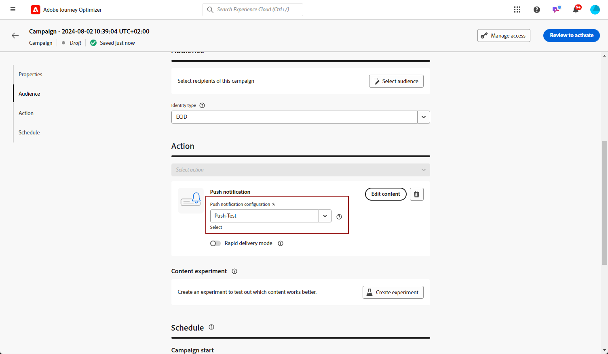
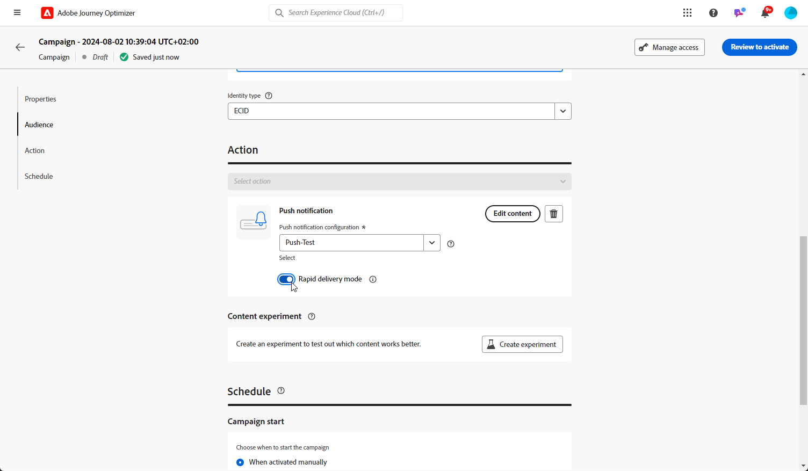

# Criar uma notificação por push {#create-push-notification}

>[!BEGINSHADEBOX]

**Nesta página:** saiba como criar uma notificação por push em uma jornada ou campanha para dispositivos móveis e Web, incluindo o uso do modo de entrega rápida para envio em alto volume.

>[!ENDSHADEBOX]

>[!CONTEXTUALHELP]
>id="ajo_journey_action_push"
>title="Ação de notificação por push"
>abstract="Uma ação de canal de notificação por push envia uma notificação por push aos perfis quando eles atingem essa etapa da jornada. O rótulo identifica a atividade na tela de jornada e a ação faz referência a uma configuração de push que define o conteúdo entregue. A seção **Otimização** pode incluir experimentos de conteúdo ou regras de direcionamento, a seção **Multilíngue** pode fornecer conteúdo em vários idiomas e a seção **Tempo limite ou erro** pode definir um caminho alternativo se a ação falhar."
>additional-url="https://experienceleague.adobe.com/pt-br/docs/journey-optimizer/using/orchestrate-journeys/about-journey-building/journey-action#add-action" text="Introdução às ações do canal"

>[!CONTEXTUALHELP]
>id="ajo_message_push"
>title="Criação de mensagens por push"
>abstract="Adicione sua mensagem por push e comece a personalizá-la com o editor de personalização."

Você pode criar notificações por push para dispositivos móveis (iOS e Android) e navegadores da Web. Esta página o orienta pelo processo de configuração de uma notificação por push em uma jornada ou campanha.

## Criar a notificação por push em uma jornada ou campanha {#create}

Para criar uma notificação por push, siga as etapas abaixo:

>[!BEGINTABS]

>[!TAB Adicionar um push a uma Jornada]

1. Abra a jornada e arraste e solte uma atividade **[!UICONTROL Ação]** da seção **[!UICONTROL Ações]** da paleta. Saiba mais sobre a [Atividade de ação](../building-journeys/journey-action.md).

   >[!IMPORTANT]
   >
   >As atividades de canal nativas herdadas (Email, Push, SMS, No aplicativo, Web, Experiência baseada em código e Cartão de conteúdo) serão descontinuadas a partir da versão de março de 2026. As jornadas existentes que usam essas atividades continuam a funcionar sem alterações — nenhuma migração é necessária.

1. Selecione **[!UICONTROL Push]** como o tipo de ação.

   

1. Insira um **[!UICONTROL Rótulo]** para identificar sua ação na tela de jornada.

1. Clique no botão **[!UICONTROL Configurar ação]**.

1. Você é direcionado para a guia **[!UICONTROL Ações]**. Nesse local, selecione ou crie a configuração de push a ser usada. [Saiba mais](push-configuration.md)

   

1. Além disso:

   * Você pode aplicar regras de limitação à sua ação de push selecionando um conjunto de regras na lista suspensa **[!UICONTROL Regras de negócio]**. [Saiba mais](../conflict-prioritization/channel-capping.md)

   * Você pode usar a opção **[!DNL Send time optimization]** para prever o melhor momento para enviar a mensagem para maximizar o engajamento com base no histórico das taxas de abertura e de clique. [Saiba como](../building-journeys/send-time-optimization.md)

1. Use o **[!UICONTROL Modo de entrega rápida]** para enviar a notificação por push em grandes volumes. [Saiba como](#rapid-delivery)

1. Selecione o botão **[!UICONTROL Editar conteúdo]** e crie o conteúdo conforme desejado. [Saiba mais](design-push.md)

1. Depois que o conteúdo da mensagem for definido, você poderá usar perfis de teste ou dados de entrada de amostra carregados de um arquivo CSV/JSON ou adicionados manualmente para visualizar seu conteúdo. [Saiba como](send-push.md)

1. Volte para a tela de jornada. Se necessário, conclua o fluxo de jornada arrastando e soltando ações ou eventos adicionais. [Saiba mais](../building-journeys/about-journey-activities.md)

   >[!NOTE]
   >
   >Para acompanhar o comportamento de seus destinatários por meio de aberturas e/ou interações por push, verifique se as opções dedicadas na seção de rastreamento estão habilitadas na [atividade de email](../building-journeys/journey-action.md).

Para obter mais informações sobre como criar, configurar e publicar uma jornada, consulte [esta página](../building-journeys/journey-gs.md).

>[!TAB Adicionar uma notificação por push a uma campanha]

1. Acesse o menu **[!UICONTROL Campanhas]** e clique em **[!UICONTROL Criar campanha]**.

1. Selecione o tipo de campanha que deseja executar

   * **Agendado - Marketing**: execute a campanha imediatamente ou em uma data especificada. As campanhas programadas são destinadas ao envio de mensagens de marketing. Eles são configurados e executados na interface do usuário do.

   * **Acionado por API - Marketing/Transacional**: execute a campanha usando uma chamada de API. As campanhas acionadas por API destinam-se ao envio de mensagens de marketing ou transacionais, ou seja, mensagens enviadas após uma ação executada por um indivíduo: redefinição de senha, compra de carrinho etc.

1. Na seção **[!UICONTROL Propriedades]**, edite o **[!UICONTROL Título]** e a **[!UICONTROL Descrição]** da sua campanha.

1. Clique no botão **[!UICONTROL Selecionar público-alvo]** para definir o público-alvo a ser direcionado na lista de públicos-alvo disponíveis do Adobe Experience Platform. [Saiba mais](../audience/about-audiences.md).

1. No campo **[!UICONTROL Namespace de identidade]**, escolha o namespace a ser usado para identificar os indivíduos do público selecionado. [Saiba mais](../event/about-creating.md#select-the-namespace).

1. Na seção **[!UICONTROL Actions]**, escolha a **[!UICONTROL Notificação por push]** e selecione ou crie uma nova configuração.

   Saiba mais sobre a configuração de push para dispositivos móveis em [esta página](push-configuration.md) e para Web em [esta página](push-configuration-web.md).

   

1. Clique em **[!UICONTROL Criar experimento]** para começar a configurar seu experimento de conteúdo e criar tratamentos para medir seu desempenho e identificar a melhor opção para seu público-alvo. [Saiba mais](../content-management/content-experiment.md)

1. As campanhas são projetadas para serem executadas em uma data específica ou em uma frequência recorrente. Saiba como configurar o **[!UICONTROL Cronograma]** da sua campanha no [nesta seção](../campaigns/create-campaign.md#schedule).

1. No menu **[!UICONTROL Acionadores de ação]**, escolha a **[!UICONTROL Frequência]** da sua notificação por push:

   * Uma vez
   * Diariamente
   * Semanal
   * Mensal

1. Na tela de configuração da campanha, clique no botão **[!UICONTROL Editar conteúdo]** para configurar o conteúdo de push. [Criar uma notificação por push](design-push.md)

1. Depois que o conteúdo da mensagem for definido, você poderá usar perfis de teste ou dados de entrada de amostra carregados de um arquivo CSV/JSON ou adicionados manualmente para visualizar seu conteúdo. [Saiba como](send-push.md)

1. Quando o push estiver pronto, conclua a configuração da sua [campanha](../campaigns/create-campaign.md) para enviá-lo.

   Para acompanhar o comportamento de seus destinatários por meio de aberturas e/ou interações por push, verifique se as opções dedicadas na seção de rastreamento estão habilitadas na [campanha](../campaigns/create-campaign.md).

Para obter mais informações sobre como criar, configurar e ativar uma campanha, consulte [esta página](../campaigns/get-started-with-campaigns.md).

>[!ENDTABS]

**Tópicos relacionados**

* [Configurar canal por push](push-gs.md)
* [Adicionar uma mensagem em uma jornada](../building-journeys/journey-action.md)

## Modo de entrega rápida {#rapid-delivery}

>[!CONTEXTUALHELP]
>id="ajo_campaigns_rapid_delivery"
>title="Modo de entrega rápida"
>abstract="O modo de entrega rápida permite que você execute o envio de mensagens de alta velocidade no canal de push para um tamanho de público-alvo inferior a 30 milhões."

O modo de entrega rápida é um complemento do [!DNL Journey Optimizer] que permite um envio muito rápido de mensagens por push em grandes volumes por meio das campanhas.

A entrega rápida é usada quando um atraso na entrega das mensagens seria crítico para os negócios, quando você deseja enviar um alerta por push urgente a telefones celulares, como, por exemplo, notícias de última hora para usuários que instalaram o seu aplicativo de canal de notícias.

Para mais informações sobre desempenho ao usar o modo de entrega rápida, consulte a [descrição do produto Adobe Journey Optimizer](https://helpx.adobe.com/br/legal/product-descriptions/adobe-journey-optimizer.html){target="_blank"}.

### Pré-requisitos {#prerequisites}

As mensagens de delivery rápido vêm com os seguintes requisitos:

* A entrega rápida está disponível somente para campanhas **[!UICONTROL Agendadas]** e não está disponível para campanhas acionadas por API,
* Nenhuma personalização é permitida na mensagem de push,
* O público-alvo deve conter menos de 30 milhões de perfis,
* Você pode executar até 5 campanhas simultaneamente usando o modo de entrega rápida.

### Ativar modo de entrega rápida

1. Crie uma campanha de notificação por push e alterne para a opção **[!UICONTROL Entrega rápida]**.

   

1. Configure o conteúdo da mensagem e selecione o público-alvo a ser direcionado. [Saiba como criar uma campanha](#create)

   >[!IMPORTANT]
   >
   >Verifique se o conteúdo da mensagem não inclui personalização e se o público-alvo contém menos de 30 milhões de perfis.

1. Revise e ative sua campanha como de costume. Observe que, no modo de teste, as mensagens não são enviadas pelo modo de delivery rápido.