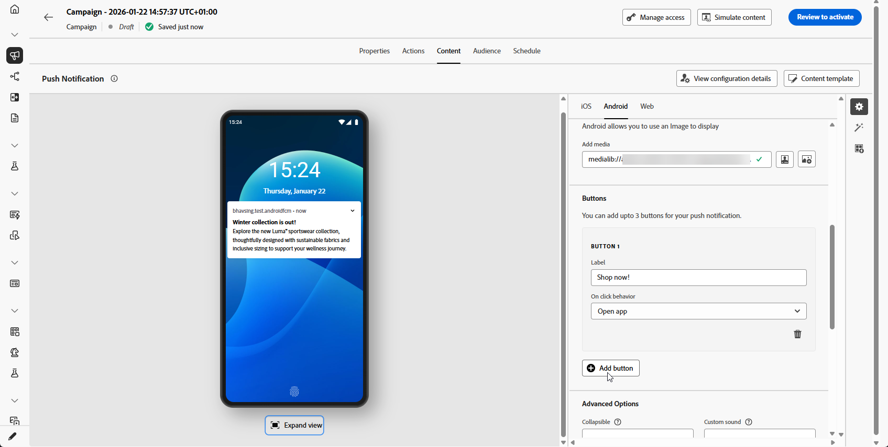

# Design a push notification {#design-push-notification}

Once you have created a push notification, you can design its content for iOS, Android, and Web platforms. This page guides you through composing your message, configuring on-click behavior, adding media and buttons, and setting advanced options to create engaging push notifications that resonate with your audience.

## Título e corpo {#push-title-body}

>[!CONTEXTUALHELP]
>id="ajo-message-push-compose"
>title="Personalizar a notificação por push."
>abstract="Para compor a mensagem, insira o conteúdo nos campos **Título** e **Corpo**. Para incluir tokens de personalização, abra a caixa de diálogo de personalização."

To compose your message, click the **[!UICONTROL Title]** and **[!UICONTROL Body]** fields. Use the personalization editor to define content, personalize data and add dynamic content. Learn more about [personalization](../personalization/personalize.md) and [dynamic content](../personalization/get-started-dynamic-content.md) in the personalization editor.

Use the device preview section to visualize how the push notification displays on iOS, Android, and Web.

Accelerate your content creation with AI Assistant and generate compelling push notification text with [AI Assistant for text generation](../content-management/generative-text.md) or create complete push notifications with [AI Assistant for full content generation](../content-management/generative-full-content.md).

## Comportamento ao clicar {#on-click-behavior}

>[!CONTEXTUALHELP]
>id="ajo-message-push-onclick"
>title="Sobre o comportamento ao clicar"
>abstract="Selecione o comportamento quando um recipient clicar no corpo da notificação por push."

Configure the action that occurs when recipients tap the body of your push notification. Escolha entre as seguintes opções:

* **[!UICONTROL Open app]**: Launches the application associated with the notification. The app is specified in your [channel configuration](../configuration/channel-surfaces.md) (i.e. message preset).
* **[!UICONTROL Deeplink]**: Directs users to specific content within your app, such as a particular view, page section, or tab. Enter the deeplink URL in the provided field.
* **[!UICONTROL Web URL]**: Directs users to an external webpage. Insira o URL de destino no campo fornecido.

  >[!NOTE]
  >
  >Se sua notificação por push contiver uma URL configurada como um link universal no iOS, o push abrirá o aplicativo associado, se instalado, independentemente da ação **[!UICONTROL URL da Web]** escolhida. Para forçar a abertura de um navegador, use um domínio não configurado para links universais ou remova o registro de link universal para o domínio.
  >Para obter mais informações sobre como o Adobe SDK lida com deep links e links universais, consulte a [documentação do Adobe Experience Platform Mobile SDK](https://developer.adobe.com/client-sdks/documentation/adobe-journey-optimizer/push-notifications){target="_blank"}.

## Adicionar mídia {#add-media-push}

>[!CONTEXTUALHELP]
>id="ajo-message-push-media"
>title="Adicionar mídias à notificação por push"
>abstract="É possível adicionar uma imagem, um vídeo ou um GIF que será exibido na notificação."

Aprimore sua notificação por push adicionando mídia visual. Os tipos de mídia disponíveis e os métodos de implementação variam de acordo com o sistema operacional, conforme detalhado nas guias abaixo.

>[!BEGINTABS]

>[!TAB Android]

Para o Android, você só pode adicionar um ícone de imagem e uma imagem para notificações expandidas.

Você pode adicionar mídia usando um dos seguintes métodos:

* Botão **[!UICONTROL Adicionar mídia]**: Selecione um ativo do [Adobe Experience Manager Assets](../integrations/assets.md) ou acesse o Assistente de IA para gerar [imagens envolventes](../content-management/generative-image.md) para notificações por push.

* Campo **[!UICONTROL Adicionar mídia]**: insira a URL da mídia diretamente. Você pode incluir tokens de personalização no URL.

Depois de adicionada, a mídia é exibida à direita do corpo de notificação.

>[!NOTE]
>
>Ao incluir anexos de mídia na carga de notificação por push (como imagens em campos de dados personalizados como `adb_media`), seu aplicativo móvel deve implementar um tratamento específico do lado do cliente para que as imagens sejam renderizadas em dispositivos. Seu aplicativo deve implementar o [fluxo de trabalho automático de exibição e rastreamento](https://developer.adobe.com/client-sdks/edge/adobe-journey-optimizer/push-notification/android/automatic-display-and-tracking){target="_blank"} para lidar com anexos de imagem da carga.

>[!TAB iOS]

Para o iOS, você pode adicionar uma imagem, vídeo ou GIF para exibir na notificação.

Você pode adicionar mídia usando um dos seguintes métodos:

* Botão **[!UICONTROL Adicionar mídia]**: Selecione um ativo de **[!DNL Adobe Experience Manager Assets]**. Saiba mais sobre como usar o **[!DNL Adobe Experience Manager Assets]** em [esta página](../integrations/assets.md).

* Campo **[!UICONTROL Adicionar mídia]**: insira a URL da mídia diretamente. Você pode incluir tokens de personalização no URL.

Depois de adicionada, a mídia é exibida à direita do corpo de notificação.

>[!NOTE]
>
>Ao incluir anexos de mídia na carga de notificação por push (como imagens em campos de dados personalizados como `adb_media`), seu aplicativo móvel deve implementar um tratamento específico do lado do cliente para que as imagens sejam renderizadas em dispositivos. Seu aplicativo deve implementar uma [Extensão de Serviço de Notificação](https://developer.apple.com/documentation/usernotifications/modifying_content_in_newly_delivered_notifications){target="_blank"} para baixar e processar conteúdo de mídia da carga. Além disso, a opção **[!UICONTROL Adicionar sinalizador de conteúdo mutável]** deve ser habilitada na seção [Opções avançadas](#advanced-options-push).

>[!TAB Web]

Insira a URL da mídia no campo **[!UICONTROL Adicionar mídia]**. Você também pode incluir tokens de personalização no URL para personalizar o conteúdo de cada usuário.

Clique em  para gerar mídia rapidamente usando o Assistente de IA do Journey Optimizer.

>[!ENDTABS]

## Adicionar botões {#add-buttons-push}

>[!CONTEXTUALHELP]
>id="ajo-message-push-buttons"
>title="Adicione botões para a interação com a notificação por push."
>abstract="Nesta seção, adicione botões de chamada para ação à mensagem. Para Apple iOS, especifique um identificador de categoria de notificação. Para Google Android, é possível incluir texto e destinos personalizados para cada botão."

Crie uma notificação acionável adicionando botões ao seu conteúdo de push. Navegue pelas guias a seguir com base em seu sistema operacional.

Se a tela do dispositivo estiver bloqueada, esses botões não serão exibidos: somente então o **Título** e a **Mensagem** da notificação estarão visíveis. Se o dispositivo estiver desbloqueado, os recipients verão os botões.

>[!BEGINTABS]

>[!TAB Android]

Para o Android, você pode adicionar até três botões.

1. Use o **[!UICONTROL Botão Adicionar]** para definir as configurações: o rótulo e a ação associada. As ações possíveis são as mesmas de [comportamento ao clicar](#on-click-behavior).

   

1. Use o ícone **[!UICONTROL Expandir exibição]** sob a imagem de visualização central para visualizar seus botões personalizados.

>[!TAB iOS]

Para o iOS, é especificado um identificador de categoria de notificação. As categorias de notificação precisam ser pré-configuradas no aplicativo iOS, que definirá os botões a serem exibidos e as ações executadas. Consulte a [documentação do Apple](https://developer.apple.com/documentation/usernotifications/declaring_your_actionable_notification_types) para obter mais detalhes.

>[!TAB Web]

Use a opção **[!UICONTROL Adicionar Botão]** para definir o rótulo de cada botão e a ação associada, conforme detalhado abaixo:

* **[!UICONTROL Deeplink]**: redirecione os usuários para um modo de exibição, seção ou guia específico no aplicativo. Insira o URL do deep link no campo associado.

* **[!UICONTROL URL da Web]**: redirecionar usuários para uma página da Web externa. Insira o URL no campo associado.

>[!ENDTABS]

## Enviar uma notificação silenciosa {#silent-notification}

>[!CONTEXTUALHELP]
>id="ajo_message_push_silent_notification"
>title="Sobre notificação silenciosa"
>abstract="Enviar notificações sem perturbar o usuário. As notificações não são mostradas no centro de notificações ou na barra de notificação."

>[!AVAILABILITY]
>
>As notificações por push da Web no Journey Optimizer não oferecem suporte ao recurso **Notificação silenciosa**.

Uma notificação por push silenciosa (ou notificação em segundo plano) é uma instrução oculta entregue ao aplicativo. Ele é usado, por exemplo, para notificar seu aplicativo sobre a disponibilidade de novo conteúdo ou iniciar um download em segundo plano.

Selecione a opção **[!UICONTROL Notificação silenciosa]** para notificar silenciosamente o aplicativo: nesse caso, a notificação é transferida diretamente para o aplicativo. Nenhum alerta é exibido na tela do dispositivo.

Use a seção **[!UICONTROL Dados personalizados]** para adicionar pares de valor chave.

## Dados personalizados {#custom-data}

>[!CONTEXTUALHELP]
>id="ajo-message-push-custom"
>title="Configurar dados personalizados para a notificação por push."
>abstract="Adicione variáveis personalizadas ao conteúdo, dependendo da configuração do aplicativo móvel."

Na seção **[!UICONTROL Dados personalizados]**, você pode adicionar variáveis personalizadas à carga, dependendo da configuração do seu aplicativo móvel. For more on how to set up push notifications in Adobe Experience Platform, refer to [this section](push-gs.md)

## Personalize with Decisioning {#decisioning-push}

You can personalize and optimize the content of your push notifications with **Decisioning**. This capability allows you to use Priority Scores, Formulas, or AI Models to dynamically select and display the best content to your customers.

For more information on how to create and use decision policies in push notifications, refer to [this section](../experience-decisioning/create-decision.md).

## Opções avançadas {#advanced-options-push}

>[!CONTEXTUALHELP]
>id="ajo-message-push-advanced"
>title="Configurar opções avançadas para a notificação por push."
>abstract="Esta seção permite aprimorar a personalização da notificação por push."

You can configure **[!UICONTROL Advanced options]** for your push notification. Available parameters are listed below:

| Parâmetro | Descrição |
|---------|---------|
| **[!UICONTROL Collapsible]** (iOS / Android) | A collapsible message is a message that may be replaced by a new message if it has become outdated. A common use cases of collapsible messages are messages used to tell a mobile app to sync data from the server. An example would be a sports app that updates users with the latest score. Only the most recent message is relevant. On the other hand, with non-collapsible message, every message is important to the client app and needs to be delivered. |
| **[!UICONTROL Custom sound]** (iOS / Android) | The sound to be played by the mobile terminal when the notification is received. The sound needs to be bundled in the app. |
| **[!UICONTROL Badges]** (iOS / Android) | Um selo é usado para exibir diretamente no ícone do aplicativo o número de novas informações não lidas.  The badge value will disappear as soon as the user opens or reads the new content from the application. Quando uma notificação é recebida em um dispositivo, ela pode atualizar ou adicionar um valor de selo para o aplicativo relacionado. For example, if you are storing the number of unread articles of your customers, you can leverage personalization to send the unique unread articles badge value for each customer. For more personalization, refer to [this section](../personalization/personalize.md). |
| **[!UICONTROL Notification group]**  (iOS only) | Associate a notification group to the push notification. Starting with iOS 12, notification groups allow you to consolidate message threads and notification topics into thread IDs. For example, a brand might send marketing notifications under one group ID, while keeping more operational type notifications under one or more different IDs. To illustrate this, you can have groupID: 123 &quot;check out the new spring collection of sweaters&quot; and groupID: 456 &quot;your package was delivered&quot; notification groups. In this example, all delivery notifications would be bundled under group ID: 456. |
| **[!UICONTROL Canal de notificação]** (somente Android) | Associe um canal de notificação à notificação por push. A partir do Android 8.0 (nível de API 26), todas as notificações devem ser atribuídas a um canal para serem exibidas. Para obter mais informações, consulte a [documentação para desenvolvedores do Android](https://developer.android.com/guide/topics/ui/notifiers/notifications#ManageChannels). |
| **[!UICONTROL Adicionar sinalizador de disponibilidade de conteúdo]** (somente iOS) | Envia o sinalizador de conteúdo disponível na carga de push para garantir que o aplicativo seja reativado assim que receber a notificação por push, o que significa que o aplicativo poderá acessar os dados da carga.  Isso funciona mesmo se o aplicativo estiver sendo executado em segundo plano e sem precisar de nenhuma interação do usuário (por exemplo, ao tocar na notificação por push). No entanto, isso não se aplica se o aplicativo não estiver em execução. Para obter mais informações, consulte a [documentação para desenvolvedores da Apple](https://developer.apple.com/library/content/documentation/NetworkingInternet/Conceptual/RemoteNotificationsPG/CreatingtheNotificationPayload.html). |
| **[!UICONTROL Adicionar sinalizador de conteúdo mutável]** (somente iOS) | Envia o sinalizador de conteúdo mutável no payload por push e permitirá que o conteúdo da notificação por push seja modificado por uma extensão de aplicativo de serviço de notificação fornecida no iOS SDK. Para saber mais, consulte a [documentação para desenvolvedores da Apple](https://developer.apple.com/library/content/documentation/NetworkingInternet/Conceptual/RemoteNotificationsPG/ModifyingNotifications.html). Você poderá aproveitar suas extensões de aplicativo móvel para modificar ainda mais o conteúdo ou a apresentação das notificações por push de entrada enviadas de [!DNL Journey Optimizer]. Por exemplo, os usuários podem aproveitar essa opção para descriptografar dados, alterar o texto do corpo ou do título de uma notificação, adicionar um identificador de thread a uma notificação etc. **Importante**: esse sinalizador deve ser habilitado ao incluir anexos de mídia (imagens, vídeos) por meio de campos de carga (como `adb_media`) para que eles sejam renderizados em dispositivos iOS. Seu aplicativo também deve implementar uma Extensão de Serviço de Notificação para baixar e processar o conteúdo de mídia da carga. |
| **[!UICONTROL Adicionar expiração de push]** (somente iOS) | Escolha a **Data e hora** da expiração de push. No iOS, a expiração da notificação é imposta como uma parada permanente, o que significa que qualquer mensagem que chegue ao Apple Push Notification Service (APNS) após a hora de expiração não é entregue, garantindo que os clientes nunca recebam notificações desatualizadas ou irrelevantes. Para obter mais informações, consulte a [documentação para desenvolvedores da Apple](https://developer.apple.com/documentation/usernotifications/sending-notification-requests-to-apns). |
| **[!UICONTROL Visibilidade de notificação]** (somente Android) | Define a visibilidade da notificação por push.  <b>Particular</b> mostrará a notificação em todas as telas de bloqueio, mas ocultará informações confidenciais ou privadas nas telas de bloqueio seguras.  <b>Public</b> mostrará a notificação em sua totalidade em todas as telas de bloqueio.  <b>Segredo</b> não revelará nenhuma parte da notificação em uma tela de bloqueio segura.  Para obter mais informações, consulte a [documentação para desenvolvedores do Android](https://developer.android.com/reference/android/app/Notification). |
| **[!UICONTROL Prioridade de notificação]** (somente Android) | Define a importância da notificação por push de Baixo para Máximo. Isso determina o quão &quot;intrusiva&quot; será a notificação por push quando for entregue. Para obter mais informações, consulte a [documentação para desenvolvedores do Android](https://developer.android.com/guide/topics/ui/notifiers/notifications#importance) |
| **[!UICONTROL Prioridade de entrega]** (somente Android) | Configura uma prioridade alta ou normal para suas notificações por push. Para obter mais informações sobre a prioridade da mensagem, consulte a [documentação para desenvolvedor do Google](https://firebase.google.com/docs/cloud-messaging/concept-options#setting-the-priority-of-a-message). |
| **[!UICONTROL Tempo de vida]** (somente Android) | Defina o número de segundos após os quais sua mensagem expirará. No Android, a expiração é tratada como uma janela de entrega: o Firebase Cloud Messaging (FCM) converte o tempo de expiração em um valor de TTL (time-to-live), começando quando a mensagem é recebida, o que significa que as campanhas não entregues podem ser enviadas depois do esperado ou até mesmo fora do período desejado. Para obter mais informações, consulte a [documentação para desenvolvedores do Android](https://firebase.google.com/docs/cloud-messaging/concept-options#ttl). |
