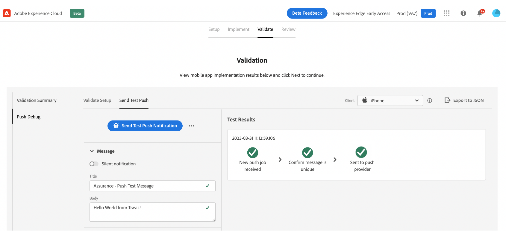

# Fluxo de trabalho de início rápido de integração móvel {#mobile-wf}

O novo **fluxo de trabalho de início rápido de integração móvel** O é um novo recurso do produto para configurar rapidamente o SDK do Adobe Experience Platform Mobile, começar a coletar e validar dados de eventos móveis e enviar notificações por push com [!DNL Journey Optimizer].

Esse recurso pode ser acessado por meio da variável **[!DNL Adobe Experience Platform Data Collection]** página inicial para todos os clientes como uma versão beta pública.

## Introdução{#gs-mobile-wf}

Esse novo workflow automatiza a configuração da Coleta de dados ao reduzir o total de cliques e acelerar a configuração móvel do Journey Optimizer. Esse fluxo de trabalho de início rápido leva você a quatro etapas fáceis para [configurar](##setup-mobile-wf), [implementar](#implement-mobile-wf), [validate](#valid-mobile-wf)e [revisão](#review-mobile-wf) sua configuração móvel.

Para acessar o novo fluxo de trabalho de início rápido da integração móvel, navegue até **[!DNL Data Collection]** no alternador de soluções. Em seguida, selecione o **[!DNL Start Collecting Mobile Data]** na página inicial.

Abaixo estão alguns recursos adicionais:

* Fluxo de trabalho fácil de quatro etapas e interface do usuário.
* Fornece uma configuração básica para começar a coletar dados de eventos de dispositivos móveis por meio do [Adobe Experience Platform Mobile SDK](https://developer.adobe.com/client-sdks/documentation/){target="_blank"} em minutos.
* Capacidade de testar e validar um evento básico de push móvel aproveitando [Adobe Experience Platform Assurance](https://experienceleague.adobe.com/docs/experience-platform/assurance/home.html){target="_blank"}.
* Cria e configura automaticamente toda a coleta de dados necessária, além dos ativos do Journey Optimizer.
* Em orientações e dicas de ferramentas do produto.
* Fornece uma transição natural para uma implementação mais avançada, se necessário.

## Configurar {#setup-mobile-wf}

A primeira etapa desse fluxo de trabalho cria e configura automaticamente toda a Coleta de dados necessária e os ativos do Journey Optimizer, como Propriedades móveis, Extensões móveis, Extensão do Journey Optimizer, Regras, Elementos de dados etc.

Depois de aceitar os Termos e condições Beta, insira o nome do seu aplicativo móvel e clique em **[!DNL Next]**.

Forneça informações para as plataformas iOS e Android, incluindo a ID do aplicativo e as chaves de autenticação ou o arquivo principal.

## Implementação{#implement-mobile-wf}

A próxima etapa fornece orientação passo a passo para instalar o código no aplicativo móvel.

## Validar {#valid-mobile-wf}

Revise e verifique a implementação para validá-la. Você pode enviar uma notificação por push de teste.

## Consulte a seção {#review-mobile-wf}

A configuração automatizada é concluída. Agora é possível visitar sua propriedade de tag móvel, configurar suas regras ou elemento de dados e começar a enviar notificações por push com o Adobe Journey Optimizer.

**Tópicos relacionados**

* [Introdução à notificação por push](get-started-push.md)
* [Fluxo de dados e componentes da notificação por push](push-gs.md)
* [Configurar o canal de push](push-configuration.md)
* [Relatório de notificação por push](../reports/journey-global-report.md#push-global)
* [Criar uma notificação por push](create-push.md)
