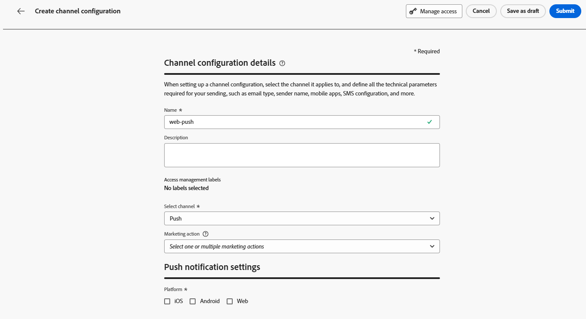

# Configurar canal de notificação por push na web {#push-notification-configuration}

O [!DNL Journey Optimizer] permite criar jornadas e enviar mensagens para o público-alvo direcionado. Antes de começar a enviar notificações por push da Web com [!DNL Journey Optimizer], verifique se as configurações e integrações estão em vigor no Adobe Experience Platform. Para entender o fluxo de dados de notificações por push no [!DNL Adobe Journey Optimizer], consulte [esta página](push-gs.md).

>[!AVAILABILITY]
>
>O novo **fluxo de trabalho de início rápido de integração para dispositivos móveis** está disponível. Use esse novo recurso do produto para configurar rapidamente o Mobile SDK para começar a coletar e validar dados de eventos móveis e enviar notificações por push em dispositivos móveis. Esse recurso é acessível por meio da página inicial da Coleção de dados como um beta público. [Saiba mais](mobile-onboarding-wf.md)
>

## Antes de começar {#start-push}

### Configurar permissões {#setup-permissions}

Antes de criar um aplicativo para dispositivos móveis, primeiro verifique se você tem ou atribui as permissões de usuário corretas para as tags na Adobe Experience Platform. Saiba mais em [Documentação de tags](https://experienceleague.adobe.com/docs/experience-platform/tags/admin/user-permissions.html){target="_blank"}.

>[!CAUTION]
>
>A configuração de push deve ser executada por um usuário especialista. Dependendo do modelo de implementação e das pessoas envolvidas, talvez seja necessário atribuir o conjunto completo de permissões a um único perfil de produto ou compartilhar permissões entre o desenvolvedor do aplicativo e o administrador do **Adobe Journey Optimizer**. Saiba mais sobre **Permissões de** marcas em [esta documentação](https://experienceleague.adobe.com/docs/experience-platform/tags/admin/user-permissions.html){target="_blank"}.

<!--ou need to your have access to perform following roles :

* Manage Datastreams
* Manage Client-side Properties
* Manage App Configurations
-->

Para atribuir direitos de **Propriedade** e **Empresa**, siga as etapas abaixo:

1. Acesse o **[!DNL Admin Console]**.

1. Na guia **[!UICONTROL Produtos]**, selecione o cartão **[!UICONTROL Coleção de dados da Adobe Experience Platform]**.

   

1. Selecione um **[!UICONTROL Perfil de Produto]** existente ou crie um novo com o botão **[!UICONTROL Novo perfil]**. Saiba como criar um novo **[!UICONTROL Novo perfil]** na [Documentação do Admin Console](https://experienceleague.adobe.com/docs/experience-platform/access-control/ui/create-profile.html#ui){target="_blank"}.

1. Na guia **[!UICONTROL Permissões]**, selecione **[!UICONTROL Direitos de propriedade]**.

   

1. Clique em **[!UICONTROL Adicionar tudo]**. Isso adicionará o seguinte direito ao perfil de produto:
   * **[!UICONTROL Aprovar]**
   * **[!UICONTROL Desenvolver]**
   * **[!UICONTROL Gerenciar ambientes]**
   * **[!UICONTROL Gerenciar extensões]**
   * **[!UICONTROL Publicar]**

   Essas permissões são necessárias para instalar e publicar a extensão do Adobe Journey Optimizer e publicar a propriedade do aplicativo no Adobe Experience Platform Mobile SDK.

1. Em seguida, selecione **[!UICONTROL Direitos da empresa]** no menu à esquerda.

   

1. Adicione os seguintes direitos:

   * **[!UICONTROL Gerenciar configurações do aplicativo]**
   * **[!UICONTROL Gerenciar propriedades]**

   Essas permissões são necessárias para que o desenvolvedor de aplicativos móveis configure credenciais de push na **Coleção de Dados da Adobe Experience Platform** e defina configurações de canal de Notificação por Push (ou seja, predefinições de mensagem) no **Adobe Journey Optimizer**.

   

1. Clique em **[!UICONTROL Salvar]**.

Para atribuir este **[!UICONTROL Perfil de produto]** a usuários, siga as etapas abaixo:

1. Acesse o **[!DNL Admin Console]**.

1. Na guia **[!UICONTROL Produtos]**, selecione o cartão **[!UICONTROL Coleção de dados da Adobe Experience Platform]**.

1. Selecione o **[!UICONTROL Perfil de produto]** configurado anteriormente.

1. Na guia **[!UICONTROL Usuários]**, clique em **[!UICONTROL Adicionar usuário]**.

   

1. Digite o nome de usuário ou endereço de email e selecione o usuário. Em seguida, clique em **[!UICONTROL Salvar]**.

   >[!NOTE]
   >
   >Se o usuário não tiver sido criado anteriormente no Admin Console, consulte a [documentação Adicionar usuários](https://helpx.adobe.com/enterprise/admin-guide.html/enterprise/using/manage-users-individually.ug.html#add-users).

   

### Verifique seus conjuntos de dados {#push-datasets}

Os seguintes esquemas e conjuntos de dados estão disponíveis com o canal de notificação por push:

| Conjunto de dados   do esquema | Grupo de campos | Operação |
| -------------------------------------------------------------------------------------- | --------------------------------------------------------------------------------------------------------------------------------------------------------------------------------------- | -------------------------------------------------------- |
| Esquema do perfil de push CJM  Conjunto de dados do perfil de push CJM | Detalhes da notificação por push ExperienceEvent do Adobe CJM - Detalhes do Perfil da Mensagem ExperienceEvent do Adobe CJM - Detalhes da Execução da Mensagem Detalhes do Aplicativo Detalhes do Ambiente | Registrar token de push |
| Esquema do evento de experiência de rastreamento de push CJM Conjunto de dados do evento de experiência de rastreamento de push CJM | Rastreamento de notificação por push | Rastrear interações e fornecer dados para a interface de relatórios |

>[!NOTE]
>
>Quando os eventos de rastreamento de push são assimilados no conjunto de dados de Evento de experiência de rastreamento de push do CJM, algumas falhas podem ocorrer, mesmo que os dados sejam parcialmente assimilados com sucesso. Isso pode ocorrer se alguns campos no mapeamento não existirem nos eventos de entrada: o sistema registra avisos, mas não impede a assimilação de partes válidas dos dados. Esses avisos aparecem no status do lote como &quot;falha&quot;, mas refletem o sucesso da assimilação parcial.
>
>Para exibir a lista completa de campos e atributos de cada esquema, consulte o [Dicionário de esquema do Journey Optimizer](https://experienceleague.adobe.com/tools/ajo-schemas/schema-dictionary.html?lang=pt-BR){target="_blank"}.

### Configurar a propriedade pushNotification {#push-property}

Para habilitar **notificações por push da Web**, primeiro verifique se a [propriedade pushNotifications](https://experienceleague.adobe.com/en/docs/experience-platform/collection/js/commands/configure/pushnotifications) está configurada corretamente no Web SDK. Esta propriedade controla como as notificações por push são tratadas pela sua aplicação Web.

Além disso, você precisa gerar chaves VAPID, necessárias para configurar [suas credenciais de push do aplicativo](#push-credentials-launch) no Journey Optimizer.

## Etapa 1: adicionar suas credenciais de push do aplicativo no Journey Optimizer {#push-credentials-launch}

Depois de conceder as permissões de usuário corretas, agora é necessário adicionar suas credenciais de push do aplicativo móvel no Journey Optimizer.

O registro da credencial de push do aplicativo móvel é necessário para autorizar o Adobe a enviar notificações por push em seu nome. Consulte as etapas detalhadas abaixo:

1. Acesse o menu **[!UICONTROL Canais]** > **[!UICONTROL Configurações de push]** > **[!UICONTROL Credenciais de push]**.

1. Clique em **[!UICONTROL Criar credencial de push]**.

1. No menu suspenso **[!UICONTROL Plataforma]**, selecione **[!UICONTROL Web]**.

   

1. Forneça a **[!UICONTROL ID do aplicativo]**.

1. Insira a **[!UICONTROL chave pública VAPID]** e a **[!UICONTROL chave privada]**.

1. Clique em **[!UICONTROL Enviar]** para criar a configuração do aplicativo.

## Etapa 2: criar uma configuração de canal para push{#message-preset}

Depois de criar suas credenciais de push, você precisa criar uma configuração para poder enviar notificações por push de **[!DNL Journey Optimizer]**.

1. Acesse o menu **[!UICONTROL Canais]** > **[!UICONTROL Configurações gerais]** > **[!UICONTROL Configurações de canal]** e clique em **[!UICONTROL Criar configuração de canal]**.

   

1. Insira um nome e uma descrição (opcional) para a configuração.

   >[!NOTE]
   >
   > Os nomes devem começar com uma letra (A-Z). Ele só pode conter caracteres alfanuméricos. Também é possível usar os caracteres de sublinhado `_`, ponto `.` e hífen `-`.

1. Para atribuir rótulos de uso de dados personalizados ou de núcleo à configuração, você pode selecionar **[!UICONTROL Gerenciar acesso]**. [Saiba mais sobre o OLAC (Controle de Acesso em Nível de Objeto)](../administration/object-based-access.md).

1. Selecione o canal **Push**.

   

1. Selecione **[!UICONTROL Ação de marketing]**(s) para associar políticas de consentimento às mensagens que usam essa configuração. Todas as políticas de consentimento associadas à ação de marketing são utilizadas para respeitar as preferências dos clientes. [Saiba mais](../action/consent.md#surface-marketing-actions)

1. Escolha sua **[!UICONTROL Plataforma]**: Android, iOS e/ou Web.

1. Selecione o mesmo **[!UICONTROL ID do aplicativo]** que sua [credencial de push](#push-credentials-launch) configurada acima.

1. Salve as alterações.

Agora você pode selecionar sua configuração ao criar suas notificações por push.

## Etapa 3: configurar a propriedade sendPushSubscription {#sendPushSubscription-property}

Depois que as credenciais de push e a configuração de canal forem definidas, será necessário implementar o [comando sendPushSubscription](https://experienceleague.adobe.com/en/docs/experience-platform/collection/js/commands/sendpushsubscription) no aplicativo Web. Esse comando registra assinaturas por push do usuário com o Adobe Experience Platform, permitindo que o sistema rastreie quais usuários optaram por receber notificações por push e manter o status da assinatura. Esse registro é essencial para o Journey Optimizer enviar notificações de push direcionadas aos seus usuários.

## Etapa 4: testar seu aplicativo móvel com um evento {#mobile-app-test}

Após concluir a configuração de push da Web no Adobe Experience Platform e no [!DNL Adobe Experience Platform Data Collection], você pode testar sua implementação antes de enviar notificações por push da Web aos seus perfis. O teste garante que as assinaturas sejam registradas corretamente e que as notificações sejam entregues corretamente aos navegadores dos usuários.

Para obter instruções detalhadas sobre como criar uma jornada de teste com eventos para validar a configuração de push da Web, consulte a [documentação de configuração de notificação por push do aplicativo móvel](push-configuration.md), que fornece um fluxo de trabalho de teste abrangente aplicável aos canais de push móveis e da Web.
