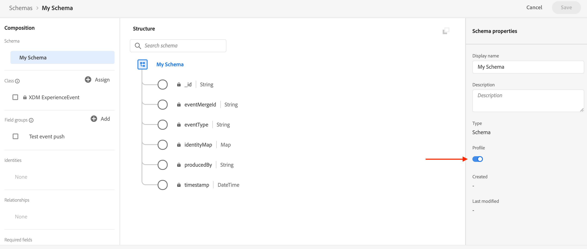

# Configurar canal de notificação por push {#push-notification-configuration}

O [!DNL Journey Optimizer] permite criar jornadas e enviar mensagens para o público-alvo direcionado. Antes de começar a enviar notificações por push com [!DNL Journey Optimizer], você precisa garantir que as configurações e integrações estejam em vigor no aplicativo móvel e para tags na Adobe Experience Platform. Para entender o fluxo de dados de notificações por push no [!DNL Adobe Journey Optimizer], consulte [esta página](push-gs.md).

>[!AVAILABILITY]
>
>O novo **fluxo de trabalho de início rápido de integração móvel** está disponível. Use esse novo recurso do produto para configurar rapidamente o SDK móvel para começar a coletar e validar dados de eventos móveis e enviar notificações por push em dispositivos móveis. Esse recurso é acessível por meio da página inicial da Coleção de dados como um beta público. [Saiba mais](mobile-onboarding-wf.md)
>


## Antes de começar {#before-starting}

<!--
### Check provisioning

Your Adobe Experience Platform account must be provisioned to contain following schemas and datasets for push notification data flow to function correctly:

| Schema <br>Dataset                                                                       | Group of fields                                                                                                                                                                         | Operation                                                |
| -------------------------------------------------------------------------------------- | --------------------------------------------------------------------------------------------------------------------------------------------------------------------------------------- | -------------------------------------------------------- |
| CJM Push Profile Schema <br>CJM Push Profile Dataset                                     | Push Notification Details<br>Adobe CJM ExperienceEvent - Message Profile Details<br>Adobe CJM ExperienceEvent - Message Execution Details<br>Application Details<br>Environment Details | Register Push Token                                      |
| CJM Push Tracking Experience Event Schema<br>CJM Push Tracking Experience Event Dataset | Push Notification Tracking                                                                                                                                                              | Track interactions and provide data for the reporting UI |
-->

### Configurar permissões {#setup-permissions}

Antes de criar um aplicativo para dispositivos móveis, primeiro verifique se você tem ou atribui as permissões de usuário corretas para as tags na Adobe Experience Platform. Saiba mais em [Documentação de tags](https://experienceleague.adobe.com/docs/experience-platform/tags/admin/user-permissions.html){target="_blank"}.

>[!CAUTION]
>
>A configuração de push deve ser executada por um usuário especialista. Dependendo do modelo de implementação e das pessoas envolvidas, talvez seja necessário atribuir o conjunto completo de permissões a um único perfil de produto ou compartilhar permissões entre o desenvolvedor do aplicativo e o administrador do **Adobe Journey Optimizer**. Saiba mais sobre **Permissões de marcas** em [esta documentação](https://experienceleague.adobe.com/docs/experience-platform/tags/admin/user-permissions.html){target="_blank"}.

<!--ou need to your have access to perform following roles :

* Manage Datastreams
* Manage Client-side Properties
* Manage App Configurations
-->

Para atribuir direitos de **Propriedade** e **Empresa**, siga as etapas abaixo:

1. Acesse o **[!DNL Admin Console]**.

1. Na guia **[!UICONTROL Produtos]**, selecione o cartão **[!UICONTROL Coleção de dados da Adobe Experience Platform]**.

   

1. Selecione um **[!UICONTROL Perfil de Produto]** existente ou crie um novo com o botão **[!UICONTROL Novo perfil]**. Saiba como criar um novo **[!UICONTROL Novo perfil]** na [documentação do Admin Console](https://experienceleague.adobe.com/docs/experience-platform/access-control/ui/create-profile.html#ui){target="_blank"}.

1. Na guia **[!UICONTROL Permissões]**, selecione **[!UICONTROL Direitos de propriedade]**.

   

1. Clique em **[!UICONTROL Adicionar tudo]**. Isso adicionará o seguinte direito ao perfil de produto:
   * **[!UICONTROL Aprovar]**
   * **[!UICONTROL Desenvolver]**
   * **[!UICONTROL Gerenciar ambientes]**
   * **[!UICONTROL Gerenciar extensões]**
   * **[!UICONTROL Publish]**

   Essas permissões são necessárias para instalar e publicar a extensão do Adobe Journey Optimizer e publicar a propriedade do aplicativo no SDK do Adobe Experience Platform Mobile.

1. Em seguida, selecione **[!UICONTROL Direitos da empresa]** no menu à esquerda.

   

1. Adicione os seguintes direitos:

   * **[!UICONTROL Gerenciar configurações do aplicativo]**
   * **[!UICONTROL Gerenciar propriedades]**

   Essas permissões são necessárias para que o desenvolvedor de aplicativos móveis configure credenciais de push na **Coleção de Dados da Adobe Experience Platform** e defina superfícies de canal de Notificação por Push (ou seja, predefinições de mensagem) no **Adobe Journey Optimizer**.

   

1. Clique em **[!UICONTROL Salvar]**.

Para atribuir este **[!UICONTROL Perfil de produto]** a usuários, siga as etapas abaixo:

1. Acesse o **[!DNL Admin Console]**.

1. Na guia **[!UICONTROL Produtos]**, selecione o cartão **[!UICONTROL Coleção de dados da Adobe Experience Platform]**.

1. Selecione o **[!UICONTROL Perfil de produto]** configurado anteriormente.

1. Na guia **[!UICONTROL Usuários]**, clique em **[!UICONTROL Adicionar usuário]**.

   

1. Digite o nome de usuário ou endereço de email e selecione o usuário. Em seguida, clique em **[!UICONTROL Salvar]**.

   >[!NOTE]
   >
   >Se o usuário não tiver sido criado anteriormente no Admin Console, consulte a [documentação Adicionar usuários](https://helpx.adobe.com/enterprise/admin-guide.html/enterprise/using/manage-users-individually.ug.html#add-users).

   

### Configurar seu aplicativo {#configure-app}

A configuração técnica envolve estreita colaboração entre o desenvolvedor do aplicativo e o administrador de negócios. Antes de começar a enviar notificações por push com [!DNL Journey Optimizer], você precisa definir configurações em [!DNL Adobe Experience Platform Data Collection] e integrar seu aplicativo móvel com os SDKs do Adobe Experience Platform Mobile.

Siga as etapas de implementação detalhadas nos links abaixo:

* Para **Apple iOS**: saiba como registrar seu aplicativo com APNs na [Documentação do Apple](https://developer.apple.com/documentation/usernotifications/registering_your_app_with_apns){target="_blank"}
* Para **Google Android**: saiba como configurar um aplicativo cliente do Firebase Cloud Messaging no Android em [Documentação do Google](https://firebase.google.com/docs/cloud-messaging/android/client){target="_blank"}

### Integrar seu aplicativo móvel ao SDK do Adobe Experience Platform {#integrate-mobile-app}

O SDK móvel da Adobe Experience Platform fornece APIs de integração do lado do cliente para dispositivos móveis por meio de SDKs compatíveis com Android e iOS. Siga a [documentação do SDK do Adobe Experience Platform Mobile](https://developer.adobe.com/client-sdks/documentation/getting-started/){target="_blank"} para obter a configuração com os SDKs do Adobe Experience Platform Mobile no seu aplicativo.

Ao final disso, você também deve ter criado e configurado uma propriedade móvel no [!DNL Adobe Experience Platform Data Collection]. Normalmente, você cria uma propriedade móvel para cada aplicativo móvel que deseja gerenciar. Saiba como criar e configurar uma propriedade móvel na [documentação do SDK do Adobe Experience Platform Mobile](https://developer.adobe.com/client-sdks/documentation/getting-started/create-a-mobile-property/){target="_blank"}.


## Etapa 1: adicionar suas credenciais de push do aplicativo na Coleção de dados da Adobe Experience Platform {#push-credentials-launch}

Após conceder as permissões de usuário corretas, agora é necessário adicionar suas credenciais de push do aplicativo móvel no [!DNL Adobe Experience Platform Data Collection].

O registro da credencial de push do aplicativo móvel é necessário para autorizar o Adobe a enviar notificações por push em seu nome. Consulte as etapas detalhadas abaixo:

1. Em [!DNL Adobe Experience Platform Data Collection], selecione a guia **[!UICONTROL Superfícies do Aplicativo]** no painel esquerdo.

1. Clique em **[!UICONTROL Criar superfície do aplicativo]** para criar uma nova configuração.

   

1. Insira um **[!UICONTROL Nome]** para a configuração.

1. Em **[!UICONTROL Configuração do Aplicativo Móvel]**, selecione o Sistema Operacional:

   * **Para iOS**

     

      1. Insira a **Id do Pacote** do aplicativo móvel no campo **[!UICONTROL ID do Pacote (iOS Bundle ID)]**. A ID do Pacote de aplicativos pode ser encontrada na guia **Geral** do destino principal em **XCode**.

      1. Botão **[!UICONTROL Push Credentials]** ativado para adicionar suas credenciais.

      1. Arraste e solte seu arquivo .p8 Apple Push Notification Authentication Key. Esta chave pode ser adquirida nas páginas **Certificados**, **Identificadores** e **Perfis**.

      1. Forneça a **Key ID**. Esta é uma sequência de 10 caracteres atribuída durante a criação da chave de autenticação p8. Ele pode ser encontrado na guia **Chaves** da página **Certificados**, **Identificadores** e **Perfis**.

      1. Forneça a **ID da Equipe**. Este é um valor de string que pode ser encontrado na guia Membros.

   * **Para Android**

     

      1. Forneça a **[!UICONTROL ID do aplicativo (nome do pacote Android)]**: geralmente, o nome do pacote é a ID do aplicativo no arquivo `build.gradle`.

      1. Botão **[!UICONTROL Push Credentials]** ativado para adicionar suas credenciais.

      1. Arraste e solte as credenciais de push do FCM. Para obter mais detalhes sobre como obter as credenciais de push, consulte a [Documentação do Google](https://firebase.google.com/docs/admin/setup#initialize-sdk){target="_blank"}.


1. Clique em **[!UICONTROL Salvar]** para criar a configuração do aplicativo.

<!--
## Step 2: Set up a mobile property in Adobe Experience Platform Launch {#launch-property}

Setting up a mobile property allows the mobile app developer or marketer to configure the mobile SDKs attributes such as Session Timeouts, the [!DNL Adobe Experience Platform] sandbox to be targeted and the **[!UICONTROL Adobe Experience Platform Datasets]** to be used for mobile SDK to send data to.

For further details and procedures on how to set up a **[!UICONTROL Platform Launch property]**, refer to the steps detailed in [Adobe Experience Platform Mobile SDK documentation](https://aep-sdks.gitbook.io/docs/getting-started/create-a-mobile-property#create-a-mobile-property).


To get the SDKs needed for push notification to work you will need the following SDK extensions, for both Android and iOS:

* **[!UICONTROL Mobile Core]** (installed automatically)
* **[!UICONTROL Profile]** (installed automatically)
* **[!UICONTROL Adobe Experience Platform Edge]**
* **[!UICONTROL Adobe Experience Platform Assurance]**, optional but recommended to debug the mobile implementation.

Learn more about [!DNL Adobe Experience Platform Launch] extensions in [Adobe Experience Platform Launch documentation](https://experienceleague.adobe.com/docs/launch-learn/implementing-in-mobile-android-apps-with-launch/configure-launch/launch-add-extensions.html).
-->

## Etapa 2: configurar a extensão Adobe Journey Optimizer na sua propriedade móvel {#configure-journey-optimizer-extension}

A **extensão do Adobe Journey Optimizer** para SDKs do Adobe Experience Platform Mobile possibilita notificações por push para seus aplicativos móveis e ajuda a coletar tokens de push do usuário e gerenciar a medição de interação com os serviços da Adobe Experience Platform.

Saiba como configurar a extensão do Journey Optimizer na [documentação do SDK do Adobe Experience Platform Mobile](https://developer.adobe.com/client-sdks/documentation/adobe-journey-optimizer/){target="_blank"}.


<!-- 
**[!UICONTROL Edge configuration]** is used by **[!UICONTROL Edge]** extension to send custom data from mobile device to [!DNL Adobe Experience Platform]. 
To configure [!DNL Adobe Experience Platform], you must provide the **[!UICONTROL Sandbox]** name and **[!UICONTROL Event Dataset]**.

1. From [!DNL Adobe Experience Platform Launch], select the **[!UICONTROL Edge Configurations]** tab and click **[!UICONTROL Edge Configurations]**.
    
1. Select **[!UICONTROL New Edge Configuration]** to add a new **[!UICONTROL Edge Configuration]**.
1. Enter a **[!UICONTROL Name]** and click **[!UICONTROL Save]**

1. Click the **[!UICONTROL Adobe Experience Platform]** toggle to enable it.

1. Fill in the **[!UICONTROL Sandbox]**, **[!UICONTROL Event dataset]** and **[!UICONTROL Profile Dataset]** fields. Then, click **[!UICONTROL Save]**.
    
    


1. From [!DNL Adobe Experience Platform Launch], ensure that **[!UICONTROL Client Side]** is selected in the drop-down menu.

1. select the **[!UICONTROL Properties]** tab and click **[!UICONTROL New Property]**.

    

1. Enter a **[!UICONTROL Name]** for your new property.

1. Select **[!UICONTROL Mobile]** as **[!UICONTROL Platform]**.

    

1. Click **[!UICONTROL Save]** to create your new property.

To configure **[!UICONTROL Adobe Experience Platform Edge Extension]** to send custom data from mobile devices to [!DNL Adobe Experience Platform].

1. Select your previously created property and select the **[!UICONTROL Extensions]** tab to view the extensions for this property.

    

1. Click **[!UICONTROL Configure]** under the **[!UICONTROL Adobe Experience Platform Edge]** Network' extension.

1. From the **[!UICONTROL Edge Configuration]** drop-down list, select the **[!UICONTROL Edge Configuration]** created in the previous steps. For more information on **[!UICONTROL Edge Configuration]**, refer to this [section](#edge-configuration).

1. Click **[!UICONTROL Save]**.

To configure **[!UICONTROL Adobe Experience Platform Messaging]** extension to send push profile and push interactions to the correct datasets, follow the same steps as above. Use **[!UICONTROL Sandbox]**, **[!UICONTROL Event dataset]** and **[!UICONTROL Profile Dataset]** created in the [Adobe Experience Platform setup](#edge-configuration).
-->

<!--
## Step 4: Publish the Property {#publish-property}

You now need to publish the property to integrate your configuration and to use it in the mobile app. 

To publish your property, refer to the steps detailed in [Adobe Experience Platform Mobile SDK documentation](https://aep-sdks.gitbook.io/docs/getting-started/create-a-mobile-property#publish-the-configuration)

## Step 5: Configure the ProfileDataSource {#configure-profiledatasource}

To configure the `ProfileDataSource`, use the `ProfileDCInletURL` from [!DNL Adobe Experience Platform] setup and add the following in the mobile app:

```
    MobileCore.updateConfiguration(
    mutableMapOf("messaging.dccs" to <ProfileDCSInletURL>)
```

-->

## Etapa 3: testar seu aplicativo móvel com um evento {#mobile-app-test}

Após configurar seu aplicativo móvel no Adobe Experience Platform e no [!DNL Adobe Experience Platform Data Collection], você pode testá-lo antes de enviar notificações por push aos seus perfis. Nesse caso de uso, criamos uma jornada para direcionar nosso aplicativo móvel e definimos um evento que aciona a notificação por push.

<!--
You can use a test mobile app for this use case. For more on this, refer to this [page](https://wiki.corp.adobe.com/pages/viewpage.action?spaceKey=CJM&title=Details+of+setting+the+mobile+test+app) (internal use only).
-->

Para que essa jornada funcione, é necessário criar um esquema XDM. Para obter mais informações, consulte a [documentação do XDM](https://experienceleague.adobe.com/docs/experience-platform/xdm/schema/composition.html#schemas-and-data-ingestion){target="_blank"}.

1. Na seção de menu DATA MANAGEMENT, clique em **[!UICONTROL Esquemas]**.
   
1. Clique em **[!UICONTROL Criar esquema]**, na parte superior direita, selecione **[!UICONTROL Evento de experiência]** e clique em **Avançar**.
   
1. Insira um nome e uma descrição para o esquema e clique em **Concluir**.
   
1. Na seção **Grupos de campos**, à esquerda, clique em **Adicionar** e selecione **[!UICONTROL Criar um novo grupo de campos]**.

1. Insira um **[!UICONTROL Nome para Exibição]** e uma **[!UICONTROL Descrição]**. Clique em **[!UICONTROL Adicionar grupos de campos]** quando terminar. Para obter mais informações sobre como criar grupos de campos, consulte a [documentação do Sistema XDM](https://experienceleague.adobe.com/docs/experience-platform/xdm/tutorials/create-schema-ui.html?lang=pt-BR){target="_blank"}.


   

1. No lado esquerdo, selecione o schema. No painel direito, habilite este esquema para **[!UICONTROL Perfil]**.

   


1. No lado esquerdo, selecione o grupo de campos e clique no ícone + para criar um novo campo. Nas **[!UICONTROL Propriedades dos grupos de campos]**, no lado direito, digite um **[!UICONTROL Nome do campo]**, **[!UICONTROL Nome de exibição]** e selecione **[!UICONTROL Cadeia de caracteres]** como **[!UICONTROL Tipo]**.

   

1. Marque **[!UICONTROL Obrigatório]** e clique em **[!UICONTROL Aplicar]**.

1. Clique em **[!UICONTROL Salvar]**. Seu schema foi criado e pode ser usado em um evento.

Em seguida, é necessário configurar um evento.

1. No menu esquerdo da home page, em ADMINISTRAÇÃO, selecione **[!UICONTROL Configurações]**. Clique em **[!UICONTROL Gerenciar]** na seção **[!UICONTROL Eventos]** para criar seu novo evento.

1. Clique em **[!UICONTROL Criar evento]**. O painel de configuração do evento será aberto no lado direito da tela.

   

1. Insira o nome do evento. Você também pode adicionar uma descrição.

1. No campo **[!UICONTROL Tipo de ID do evento]**, selecione **[!UICONTROL Baseado em Regras]**.

1. Em **[!UICONTROL Parâmetros]**, selecione o esquema criado anteriormente.

   

1. Na lista de campos, verifique se o campo criado no grupo de campos de esquema está selecionado.

   

1. Clique em **[!UICONTROL Editar]** no campo **[!UICONTROL Condição de ID de evento]**. Arraste e solte o campo adicionado anteriormente para definir a condição que será usada pelo sistema para identificar os eventos que acionam a jornada.

   

1. Digite a sintaxe que será necessária para acionar a notificação por push no aplicativo de teste, neste exemplo **confirmação do pedido**.

   

1. Selecione **[!UICONTROL ECID]** como seu **[!UICONTROL Namespace]**.

1. Clique em **[!UICONTROL Ok]** e depois em **[!UICONTROL Salvar]**.

Seu evento foi criado e agora pode ser usado em uma jornada.

1. No menu esquerdo, clique em **[!UICONTROL Jornadas]**.

1. Clique em **[!UICONTROL Criar Jornada]** para criar uma nova jornada.

1. Edite as propriedades da jornada no painel de configuração exibido no lado direito. Saiba mais nesta [seção](../building-journeys/journey-properties.md).

1. Comece arrastando e soltando o evento criado nas etapas anteriores do menu suspenso **[!UICONTROL Eventos]**.

   

1. No menu suspenso **[!UICONTROL Ações]**, arraste e solte uma atividade **[!UICONTROL Push]** para a sua jornada.

1. Configure a notificação por push. Para obter mais informações sobre como criar notificações por push, consulte esta [página](create-push.md).

1. Clique no botão de alternância **[!UICONTROL Testar]** para começar a testar suas notificações por push e clique em **[!UICONTROL Acionar um evento]**.

   

1. Insira sua ECID no campo **[!UICONTROL Chave]** e digite **confirmação do pedido** no segundo campo.

   

1. Clique em **[!UICONTROL Enviar]**.

Seu evento será acionado e você receberá uma notificação por push para seu aplicativo móvel.

## Etapa 4: criar uma superfície de canal para push{#message-preset}

Depois que o aplicativo móvel for configurado no [!DNL Adobe Experience Platform Data Collection], é necessário criar uma superfície para poder enviar notificações por push do **[!DNL Journey Optimizer]**.

Saiba como criar e configurar uma superfície de canal em [esta seção](../configuration/channel-surfaces.md).

Agora você está pronto para enviar notificações por push com o Journey Optimizer.

* Saiba como criar uma mensagem de push em [esta página](create-push.md).
* Saiba como adicionar uma mensagem a uma jornada em [esta seção](../building-journeys/journeys-message.md).
