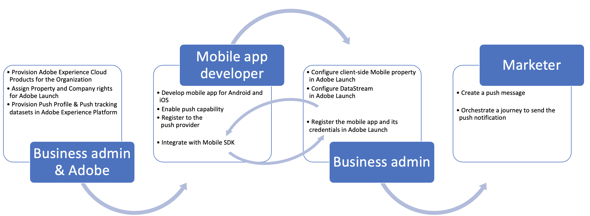

# Fluxo de dados e componentes da notificação por push {#get-started-push}

Esta página ajuda você a configurar e entender os principais serviços e fluxos de trabalho envolvidos nas notificações por push no [!DNL Journey Optimizer].

>[!AVAILABILITY]
>
>O novo **fluxo de trabalho de início rápido de integração móvel** está disponível. Use esse novo recurso do produto para configurar rapidamente o Mobile SDK para começar a coletar e validar dados de eventos móveis e enviar notificações por push em dispositivos móveis. Esse recurso é acessível por meio da página inicial da Coleção de dados como um beta público. [Saiba mais](mobile-onboarding-wf.md)
>

Saiba como criar notificações por push em [esta página](create-push.md).

As etapas para configurar o canal por push em [!DNL Adobe Journey Optimizer] estão detalhadas em [esta página](push-configuration.md).

A figura a seguir mostra os sistemas e serviços envolvidos com fluxos de dados associados, destacando como as notificações por push são entregues de um ponto de vista de serviço completo.

1. Registro do seu aplicativo para dispositivos móveis com marca (Android ou iOS) com APNs da Apple e serviços de mensagens de push do Google FCM
1. Os serviços de mensagens geram um token de push, que é um identificador que [!DNL Adobe Journey Optimizer] usará para direcionar o dispositivo específico com uma notificação por push.
1. O token de push gerado anteriormente é transmitido à Adobe Experience Platform e sincronizado com o Perfil do cliente em tempo real; isso é feito OOTB com uma SDK de cliente fácil de integrar
1. As mensagens de push são criadas em [!DNL Adobe Journey Optimizer], as mensagens de push são criadas em relação a uma configuração de canal (ou seja, predefinição de mensagem)
1. As mensagens por push podem ser incluídas na tela de orquestração no Jornada
1. Após a publicação do Jornada, os perfis de clientes com base nas condições do Jornada são qualificados para receber notificações por push. As cargas de mensagens por push são personalizadas nesta etapa
1. As cargas de push personalizadas são encaminhadas para um serviço interno de delivery de mensagens por push
1. Esse serviço interno valida as credenciais do aplicativo associado à mensagem e
1. Envia a mensagem para os serviços de mensagens do Apple e Google para entrega final
1. Os comentários dos serviços de mensagens são anotados, erros e sucessos são registrados para relatórios no Jornada Live e no relatório Customer Journey Analytics
1. As notificações por push são entregues aos dispositivos do usuário final
1. As interações de notificação por push do usuário final são enviadas como Eventos de experiência do cliente do usuário final por meio da integração do SDK

## Funções dos principais serviços nas notificações por push {#roles-of-key-services}

* **Os provedores de serviços de notificação por push** são os serviços Web de componentes principais que fornecem notificações de servidores remotos para aplicativos móveis.

  O [!DNL Adobe Journey Optimizer] é compatível com as plataformas Android e iOS e, consequentemente, integra-se com o seguinte:
   * [Firebase Cloud Messaging (FCM)](https://firebase.google.com/docs/cloud-messaging) - para enviar notificações ao aplicativo móvel do Android
   * [Serviço de Notificação por Push da Apple (APNs)](https://developer.apple.com/library/archive/documentation/NetworkingInternet/Conceptual/RemoteNotificationsPG/APNSOverview.html) - para enviar notificações ao aplicativo móvel iOS

* **Adobe Experience Platform Mobile SDK**, que fornece APIs de integração no lado do cliente para seus dispositivos móveis por meio de SDKs compatíveis com Android e iOS. O SDK fornece uma extensão [!DNL Adobe Journey Optimizer] expondo uma variedade de APIs específicas para mensagens por push e habilita o fluxo de dados, como registrar o token de push ou enviar eventos de rastreamento de push ou quaisquer outros eventos de experiência personalizados para o Adobe Experience Platform. O SDK também fornece uma variedade de outras extensões que permitem outros recursos do Adobe Experience Cloud, bem como de parceiros de terceiros.

  A integração do SDK também requer a configuração dos serviços [Coleção de dados](https://experienceleague.adobe.com/docs/experience-platform/tags/home.html?lang=pt-BR){target="_blank"} do Adobe Experience Platform, como:

   * Criar uma sequência de dados para configurar o perfil e os conjuntos de dados de evento de experiência nos quais os dados fluem para o Adobe Experience Platform
   * Criação da propriedade móvel do lado do cliente e adição de extensões. O SDK se integra estreitamente a essas extensões para fornecer uma experiência de coleta de dados contínua.
   * Registro do identificador do conjunto de aplicativos para dispositivos móveis e das credenciais do aplicativo

* O **Perfil do cliente em tempo real** da Adobe Experience Platform mantém uma visão holística de cada cliente individual ao combinar dados de vários canais, incluindo Web, dispositivos móveis, CRM e de terceiros. O Perfil permite consolidar os dados do cliente em uma visualização unificada, oferecendo uma conta acionável com carimbo de data e hora de cada interação com o cliente. O token de push para um determinado usuário do aplicativo é armazenado no perfil do usuário como dados de registro, enquanto as interações que o usuário faz com as notificações por push são rastreadas como dados de eventos de série temporal. [Saiba mais sobre o Perfil de Cliente em Tempo Real da Adobe Experience Platform](https://experienceleague.adobe.com/docs/experience-platform/profile/home.html?lang=pt-BR){target="_blank"}.

* **[!DNL Adobe Journey Optimizer]** : depois que as integrações do aplicativo móvel com os componentes mencionados acima estiverem em vigor e os perfis do cliente no Adobe Experience Platform, você poderá criar e orquestrar notificações por push em [!DNL Adobe Journey Optimizer] para interagir com os usuários.

## Configuração técnica de push e workflows de profissionais {#push-technical-setup}

A figura a seguir mostra as várias etapas, de ponta a ponta, envolvidas na configuração dos componentes que formam o esqueleto do fluxo de dados de push. Os itens de ação foram categorizados com base na função que executa a configuração e no componente que está sendo configurado.

**Tópicos relacionados**

* [Configurar canal por push](push-configuration.md)
* [Relatório de notificação por push](../reports/journey-global-report-cja-push.md)
* [Criar uma notificação por push](create-push.md)
* [Adicionar uma mensagem em uma jornada](../building-journeys/journeys-message.md)
* [Adicionar uma mensagem em uma campanha](../campaigns/create-campaign.md)