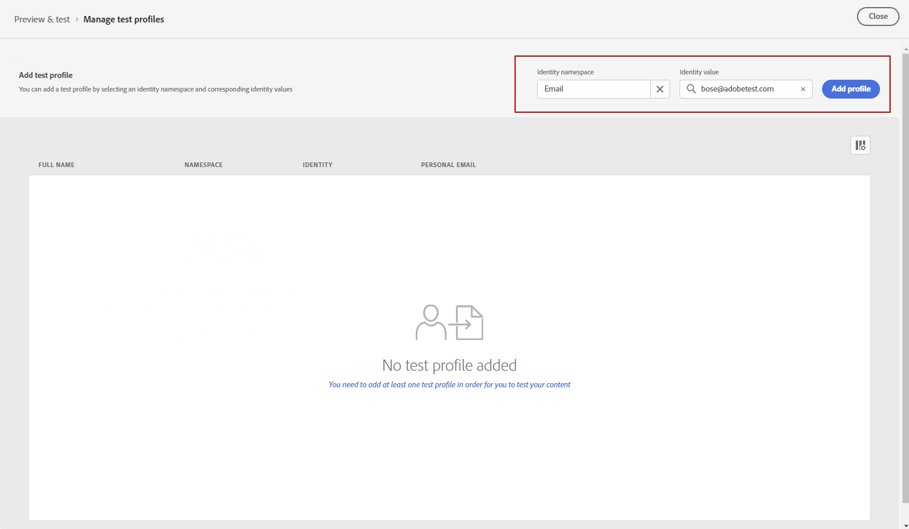

# Visualizar e testar sua notificação por push {#send-push}

## Visualizar sua notificação por push {#preview-push}

Após definir o conteúdo da mensagem, é possível usar perfis de teste para pré-visualizá-lo e testá-lo. Se você inseriu conteúdo personalizado, é possível verificar como esse conteúdo é exibido na mensagem, usando dados de perfil de teste.

1. Clique em **[!UICONTROL Simular conteúdo]**.

1. Clique em **[!UICONTROL Gerenciar perfis de teste]** para adicionar um perfil de teste.

1. Encontre seu perfil de teste com a **[!UICONTROL Namespace de identidade]** e **[!UICONTROL Valor de identidade]** campos. Em seguida, clique em **[!UICONTROL Adicionar perfil]**.

   

1. Depois de selecionar seu perfil de teste, você pode fechar o **[!UICONTROL Adicionar perfil de teste]** janela.

1. No **Visualizar e testar** , os dados do perfil de teste são adicionados ao conteúdo da mensagem.

   Selecione o tipo de dispositivo para visualizar o conteúdo: **[!UICONTROL iOS]** ou **[!UICONTROL Android]**.

   

## Validar sua notificação por push {#push-validate}

Você deve verificar os alertas na seção superior do editor. Alguns deles são avisos simples, mas outros podem impedir que você envie a mensagem. Dois tipos de alertas podem acontecer: avisos e erros.

* **Avisos** consulte recomendações e práticas recomendadas.

* **Erros** impedir que você teste ou ative a jornada, desde que elas não sejam resolvidas, como:

   * **[!UICONTROL A versão de push da mensagem está vazia]**: esse erro é exibido quando o corpo ou o título da notificação por push está ausente. Saiba como definir o conteúdo de notificação por push em [esta seção](create-push.md).

   * **[!UICONTROL Superfície não existe]**: não será possível usar a mensagem se a superfície selecionada for excluída após a criação da mensagem. Se este erro ocorrer, selecione outra superfície na mensagem **[!UICONTROL Propriedades]**. Saiba mais sobre as superfícies dos canais em [esta seção](../configuration/channel-surfaces.md).

   * **[!UICONTROL A carga de push do iOS/Android excedeu o limite de 4 KB]**: o tamanho da notificação por push não pode exceder 4 KB. Para respeitar esse limite, tente reduzir o uso de imagens ou emojis. Saiba como gerenciar o conteúdo de notificação por push no [esta seção](../push/create-push.md).

   

>[!NOTE]
>
> Para melhorar o deliverability, você sempre deve usar os números de telefone nos formatos compatíveis com o provedor. Por exemplo, Twilio e Sinch suportam apenas números de telefone no formato E.164.

## Enviar a notificação por push{#push-send}

Quando a mensagem de push estiver pronta, conclua a configuração do [jornada](../building-journeys/journey-gs.md) ou [campanha](../campaigns/create-campaign.md) para enviá-lo.

**Tópicos relacionados**

* [Configurar canal de push](push-configuration.md)
* [Relatório de notificação por push](../reports/journey-global-report.md#push-global)
* [Criar uma notificação por push](create-push.md)
* [Adicionar uma mensagem em uma jornada](../building-journeys/journeys-message.md)
* [Adicionar uma mensagem em uma campanha](../campaigns/create-campaign.md)

