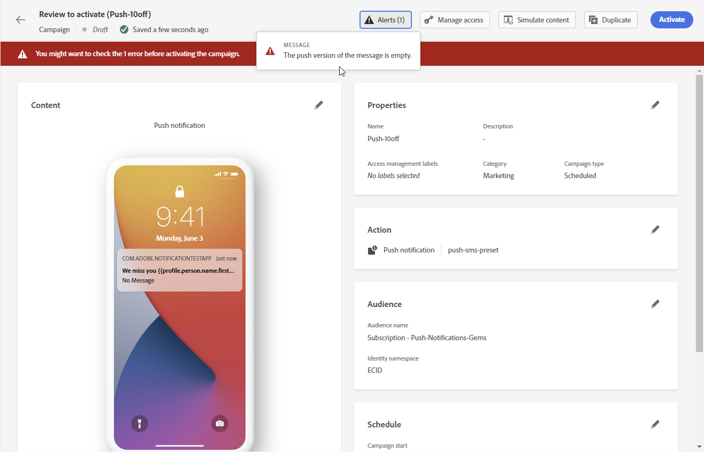

# Verificação e envio da notificação por push {#send-push}

## Pré-visualizar sua notificação por push {#preview-push}

Depois que o conteúdo da mensagem for definido, você poderá usar perfis de teste ou dados de entrada de amostra carregados de um arquivo CSV/JSON ou adicionados manualmente para visualizar seu conteúdo. Se você inseriu conteúdo personalizado, é possível verificar como esse conteúdo é exibido na mensagem. [Saiba como testar seu conteúdo usando dados de entrada de exemplo](../test-approve/simulate-sample-input.md)

Para fazer isso, clique em **[!UICONTROL Simular conteúdo]**. Você pode selecionar o tipo de dispositivo para visualizar o conteúdo: **[!UICONTROL iOS]** ou **[!UICONTROL Android]**.

Informações detalhadas sobre como visualizar e testar o conteúdo estão disponíveis na seção [Gerenciamento de conteúdo](../content-management/preview-test.md).

## Validar sua notificação por push {#push-validate}

Você deve verificar os alertas na seção superior do editor. Alguns deles são avisos simples, mas outros podem impedir que você envie a mensagem. Dois tipos de alertas podem ocorrer: avisos e erros.

* **Os avisos** referem-se às recomendações e práticas recomendadas.

* **Erros** impedem que você teste ou ative a jornada enquanto não forem resolvidos, como:

   * **[!UICONTROL A versão da mensagem por push está vazia]**: esse erro é exibido quando o corpo ou título da notificação por push está ausente. Saiba como definir o conteúdo de notificação por push em [esta seção](create-push.md).

   * **[!UICONTROL a configuração não existe]**: você não poderá usar sua mensagem se a configuração selecionada for excluída após a criação da mensagem. Se este erro ocorrer, selecione outra configuração na mensagem **[!UICONTROL Propriedades]**. Saiba mais sobre configurações de canal em [esta seção](../configuration/channel-surfaces.md).

   * **[!UICONTROL A carga do Push iOS/Android excedeu o limite de 4 KB]**: o tamanho da notificação por push não pode exceder 4 KB. Para respeitar esse limite, tente reduzir o uso de imagens ou emojis. Saiba como gerenciar o conteúdo de notificação por push nesta [seção](../push/create-push.md).

  

>[!NOTE]
>
> Para melhorar a capacidade de delivery, você sempre deve usar os números de telefone nos formatos compatíveis com o provedor. Por exemplo, o Twilio e o Sinch suportam apenas números de telefone no formato E.164.

## Enviar a notificação por push{#push-send}

>[!IMPORTANT]
>
> Se a campanha estiver sujeita a uma política de aprovação, será necessário solicitar aprovação para enviar a notificação por push. [Saiba mais](../test-approve/gs-approval.md)

Quando a mensagem de push estiver pronta, conclua a configuração da [jornada](../building-journeys/journey-gs.md) ou da [campanha](../campaigns/create-campaign.md) para enviá-la.

**Tópicos relacionados**

* [Configurar canal por push](push-configuration.md)
* [Relatório de notificação por push](../reports/journey-global-report-cja-push.md)
* [Criar uma notificação por push](create-push.md)
* [Adicionar uma mensagem em uma jornada](../building-journeys/journeys-message.md)
* [Adicionar uma mensagem em uma campanha](../campaigns/create-campaign.md)

