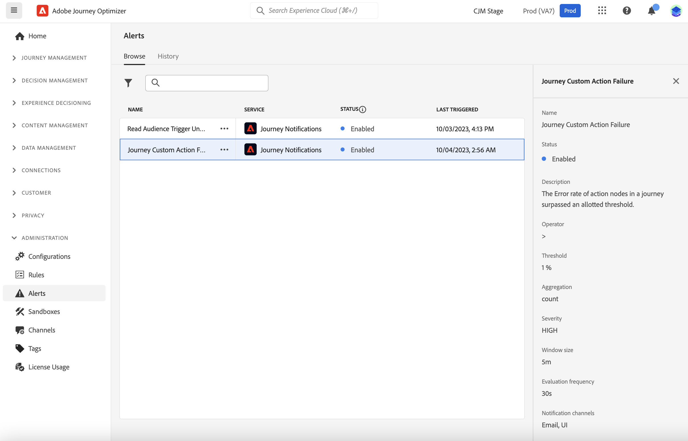
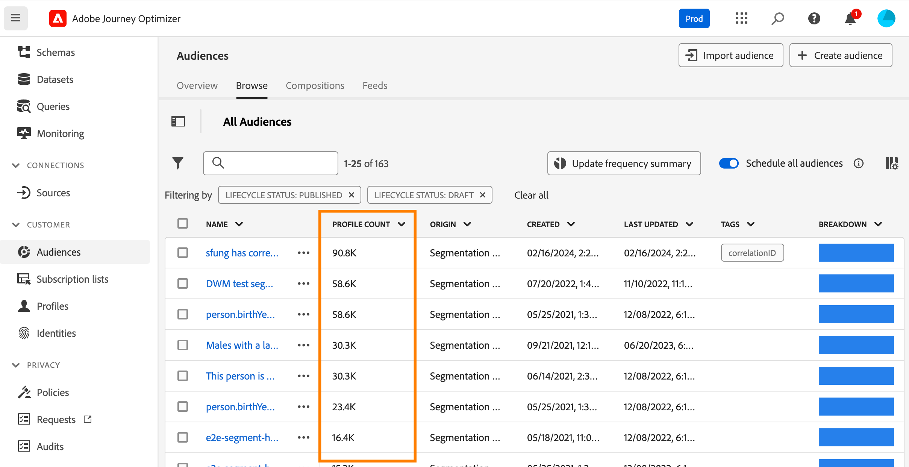
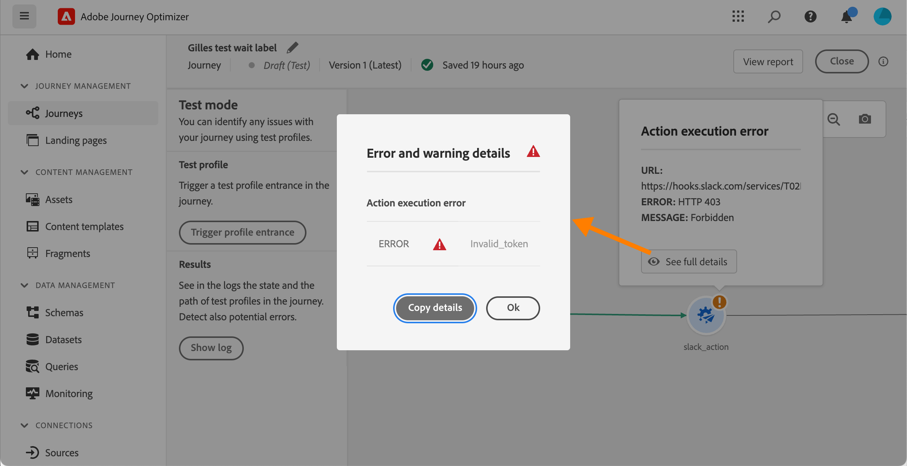

# Introdução a alertas {#alerts}

## Acessar e assinar alertas {#alerting-capabilities}

Quando ocorrer uma falha, você poderá obter alertas do sistema na central de notificações da Journey Optimizer (alertas no aplicativo) e/ou receber um email.

No **Alertas** , é possível exibir os alertas disponíveis e assiná-los. Quando um determinado conjunto de condições em suas operações é atingido (como um problema em potencial quando o sistema ultrapassa um limite), as mensagens de alerta são entregues a todos os usuários em sua organização que se inscreveram neles.

<!--These messages can repeat over a pre-defined time interval until the alert has been resolved.-->

Saiba mais sobre alertas no Adobe Experience Platform em [Documentação do Adobe Experience Platform](https://experienceleague.adobe.com/docs/experience-platform/observability/alerts/overview.html?lang=pt-BR){target="_blank"}.

No menu esquerdo, em **Administração**, clique em **Alertas**. Dois alertas pré-configurados para o Journey Optimizer estão disponíveis: o [Falha na ação personalizada de Jornada](#alert-custom-actions) alerta e o [Acionador de segmento de leitura malsucedido](#alert-read-audiences) alerta. Esses alertas estão detalhados abaixo.

É possível assinar cada alerta individualmente na interface do usuário do selecionando o **Assinar** opção no **Alertas** painel. Use o mesmo método para cancelar a inscrição.

Também é possível assinar alertas por meio do [Notificações de Eventos de E/S](https://experienceleague.adobe.com/docs/experience-platform/observability/alerts/subscribe.html){target="_blank"}. As regras de alerta são organizadas em diferentes pacotes de assinatura. As assinaturas de evento correspondentes aos alertas específicos do Journey Optimizer são detalhadas abaixo.

Se ocorrer um comportamento inesperado, uma notificação de alerta será enviada aos assinantes. Com base nas preferências do usuário, os alertas são enviados por email e/ou diretamente na central de notificações da Journey Optimizer, no canto superior direito da interface do usuário. Por padrão, somente o alerta no aplicativo está ativado. Para ativar o alerta por email, consulte [Documentação do Adobe Experience Platform](https://experienceleague.adobe.com/docs/experience-platform/observability/alerts/ui.html#enable-email-alerts){target="_blank"}.

Quando um alerta é resolvido, os assinantes recebem uma notificação &quot;Resolvido&quot;.

>[!CAUTION]
>
>Os alertas específicos do Adobe Journey Optimizer se aplicam somente ao **live** jornadas. Os alertas não são acionados para jornadas no modo de teste.

## Falha na ação personalizada de Jornada {#alert-custom-actions}

Esse alerta avisa se uma ação personalizada falhar. Consideramos que houve uma falha em que mais de 1% dos erros ocorreram em uma ação personalizada específica nos últimos 5 minutos. Isso é avaliado a cada 30 segundos.

Os alertas de ações personalizadas são resolvidos quando, nos últimos 5 minutos:

* não ocorreu nenhum erro nessa ação personalizada (ou erros abaixo do limite de 1%),

* ou, nenhum perfil atingiu essa ação personalizada.

O nome de inscrição do evento de E/S correspondente ao alerta de ação personalizada é **Falha na ação personalizada de Jornada**.

## Falha ao ler o acionador de público-alvo {#alert-read-audiences}

Esse alerta avisará se uma **Ler público-alvo** A atividade não processou nenhum perfil 10 minutos após o horário agendado de execução. Essa falha pode ser causada por problemas técnicos ou porque o público-alvo está vazio.

Alertas ativados **Ler público-alvo** as atividades se aplicam somente a jornadas recorrentes. **Ler público-alvo** atividades em jornadas ativas com agendamento para execução **Uma vez** ou **Assim que possível** são ignorados.

Alertas ativados **Ler público-alvo** são resolvidos quando um perfil entra na variável **Ler público-alvo** nó.

O nome de inscrição do evento de E/S correspondente ao **Acionador de segmento de leitura malsucedido** o alerta é **Atrasos, falhas e erros no segmento de leitura do Jornada**.

## Solução de problemas {#alert-troubleshooting}

Para solucionar problemas **Ler público-alvo** alertas, verifique a contagem de públicos-alvo na interface Experience Platform.

Para solucionar problemas **Ação personalizada** alertas:

* Verifique sua ação personalizada usando o modo de teste em outra jornada:

  

* Verifique o relatório de jornadas para ver os motivos do erro na ação.

  

* Verifique stepEvents da jornada para obter mais informações sobre &quot;failureReason&quot;.
* Verifique a configuração de ação personalizada e valide se a autenticação ainda está OK. Execute uma verificação manual com o Postman, por exemplo.
