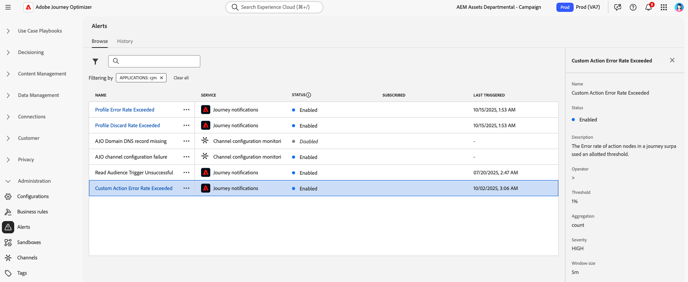
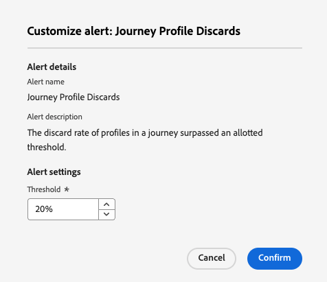

# Acessar e assinar alertas do sistema {#alerts}

## Visão geral

Os alertas são notificações automatizadas que ajudam a monitorar e solucionar problemas no Adobe Journey Optimizer. Eles fornecem percepção em tempo real de possíveis problemas em suas jornadas, campanhas e configurações de canal, permitindo que você tome medidas corretivas antes que as experiências do cliente sejam afetadas.

O Adobe Journey Optimizer fornece dois tipos de alertas:

* **Alertas de validação na tela**: ao criar jornadas e campanhas, use o botão **Alertas** na tela para identificar e resolver erros de configuração antes da publicação. Saiba como [solucionar problemas do jornada](../building-journeys/troubleshooting.md) e revisar suas campanhas: [Campanhas de ação](../campaigns/review-activate-campaign.md) | [Campanhas acionadas por API](../campaigns/review-activate-api-triggered-campaign.md) | [Campanhas orquestradas](../orchestrated/start-monitor-campaigns.md).

* **Alertas de monitoramento do sistema** (detalhados nesta página): receba notificações proativas quando os limites operacionais forem excedidos ou forem detectados problemas nas configurações de jornadas ativas e canais, e quando ocorrerem eventos importantes do ciclo de vida da campanha (ativação, entrega, parada e falhas relacionadas). Os alertas do sistema monitoram métricas como taxas de erro, descartes de perfis e problemas de capacidade de entrega de email, além desses eventos de campanha.

**Principais benefícios dos alertas do sistema:**

* Detecção proativa de problemas antes do impacto no cliente
* Monitoramento automatizado do desempenho e da integridade da jornada
* Aviso antecipado para problemas de capacidade de entrega de email
* Tempo reduzido para identificar e resolver problemas operacionais

Os alertas do sistema estão disponíveis no menu **[!UICONTROL Alertas]** em **[!UICONTROL Administração]**. O Adobe Experience Platform fornece várias regras de alerta predefinidas que você pode habilitar, incluindo alertas específicos do [!DNL Adobe Journey Optimizer] para jornada e configurações de canal.

## Pré-requisitos

Antes de trabalhar com alertas:

* **Permissões**: você precisa de permissões específicas para exibir e gerenciar alertas. Consulte [permissões necessárias no Adobe Experience Platform](https://experienceleague.adobe.com/docs/experience-platform/observability/alerts/overview.html#permissions){target="_blank"}.

* **Reconhecimento de sandbox**: as assinaturas de alerta são específicas da sandbox. Quando você assina alertas, eles se aplicam somente à sandbox atual. Quando uma sandbox é redefinida, todas as assinaturas de alerta também são redefinidas.

* **Preferências de notificação**: configure como você recebe alertas (email e/ou no aplicativo) nas [Preferências da Adobe Experience Cloud](../start/user-interface.md#in-product-uc).

## Alertas disponíveis {#available-alerts}

O Journey Optimizer fornece regras de alerta pré-configuradas que monitoram aspectos específicos de suas jornadas, campanhas e configurações de canal. Não é necessário criar esses alertas: eles estão disponíveis prontos para uso e podem ser ativados por meio de assinatura.

**Para acessar a lista de alertas:**

Navegue até **[!UICONTROL Administração]** > **[!UICONTROL Alertas]** no menu esquerdo. A guia **Procurar** exibe todos os alertas pré-configurados disponíveis para o Journey Optimizer.

{width=60%}

Navegue pelas guias abaixo para revisar os alertas de configuração do jornada, da campanha e do canal. Selecione um nome de alerta em uma guia para expandir sua descrição completa.

>[!BEGINTABS]

>[!TAB Jornada alertas]

Todas as notificações do jornada disponíveis na interface do usuário estão listadas nesta guia. Selecione um nome de alerta para expandir sua descrição e orientação completas.

>[!CAUTION]
>
>Os alertas específicos do Adobe Journey Optimizer se aplicam somente às jornadas **live**. Os alertas não são acionados para jornadas no modo de teste.

+++ Acionador Ler público-alvo sem sucesso

Este alerta avisa se uma atividade **Ler público-alvo** não processou nenhum perfil 10 minutos após o horário agendado de execução. Essa falha pode ser causada por problemas técnicos ou porque o público-alvo está vazio. Se essa falha for causada por problemas técnicos, esteja ciente de que ainda podem ocorrer tentativas, dependendo do tipo de problema (por exemplo: se a criação do trabalho de exportação falhar, tentaremos novamente a cada 10mn para um máximo de 1h).

Os alertas sobre atividades de **Ler público-alvo** se aplicam somente a jornadas recorrentes. As atividades de **Ler Público** em jornadas ativas com agendamento para execução de **Uma Vez** ou **Assim que possível** são ignoradas.

Os alertas em **Ler público-alvo** são resolvidos quando um perfil entra no nó **Ler público-alvo** ou após 1 hora.

O nome de inscrição do evento de E/S correspondente ao alerta **Falha no Acionador de Leitura de Público** é **Atrasos, Falhas e Erros de leitura de público-alvo de Jornada**.

Para solucionar problemas de alertas do **Read Audience**, verifique o contagem de público-alvo na interface do Experience Platform.

➡️ [Configurar Público-Alvo de Leitura](../building-journeys/read-audience.md)

➡️ [Definir e usar públicos-alvo](../audience/about-audiences.md)

+++

+++ Taxa de descarte de perfil excedida

Esse alerta avisará se a proporção de descartes de perfil em relação aos perfis inseridos nos últimos 5 minutos exceder o limite. O limite padrão está definido como 20%, mas você pode definir um limite personalizado.

Clique no nome do alerta para verificar os detalhes e a configuração do alerta.

Há vários motivos pelos quais um perfil pode ser descartado, o que informará o método de solução de problemas. Alguns motivos comuns estão listados abaixo:

* Perfil descartado na entrada porque já está vivo nessa jornada unitária. Para resolver isso, verifique se o perfil tem tempo suficiente para sair da jornada antes que o próximo evento chegue para esse perfil.
* A identidade não está definida para o perfil ou o namespace usado pela jornada de público-alvo de leitura não está sendo utilizado nesse perfil. Para resolver isso, verifique se o namespace na jornada corresponde ao namespace de identidade usado pelos perfis.
* Taxa de transferência de evento excedida. Para resolver isso, certifique-se de que os eventos que entram no sistema não excedam esses limites.

➡️ [Solução de problemas do jornada](../building-journeys/troubleshooting.md)

➡️ [Definir um limite de alerta personalizado](#custom-threshold)

+++

+++ Taxa de erros de ação personalizada excedida

Este alerta avisa se a proporção de erros de ação personalizada para chamadas HTTP bem-sucedidas nos últimos 5 minutos excedeu o limite. O limite padrão está definido como 20%, mas você pode definir um limite personalizado.

>[!NOTE]
>
>Este alerta substitui o alerta **Falha da ação personalizada de Jornada** anterior.

Clique no nome do alerta para verificar os detalhes e a configuração do alerta.

Podem ocorrer erros de ações personalizadas por vários motivos. Para solucionar esses erros, você pode:

* Verifique sua ação personalizada usando o modo de teste em outra jornada.
* Verifique o relatório de jornadas para ver os motivos do erro na ação.
* Verifique stepEvents da jornada para obter mais informações sobre &quot;failureReason&quot;.
* Verifique se a ação personalizada está configurada corretamente e valide se a autenticação ainda é válida. Execute uma verificação manual com o Postman, por exemplo.
* Verifique se o endpoint pode ser acessado e se a ação personalizada pode acessá-lo por meio do verificador de conectividade da ação personalizada.
* Verifique as credenciais de autenticação, verifique a conectividade com a Internet etc.

➡️ [Validar no modo de teste](../building-journeys/testing-the-journey.md)

➡️ [Inspecionar o relatório ao vivo da jornada](../reports/journey-live-report.md)

➡️ [Configurar ações personalizadas](../action/about-custom-action-configuration.md)

➡️ [Definir um limite de alerta personalizado](#custom-threshold)

+++

+++ Taxa de erros de perfil excedida

Esse alerta avisará se a proporção de perfis com erro em relação aos perfis inseridos nos últimos 5 minutos exceder o limite. O limite padrão está definido como 20%, mas você pode definir um limite personalizado.

Clique no nome do alerta para verificar os detalhes e a configuração do alerta.

Para solucionar problemas de erro de perfil, consulte os dados na etapa de eventos para entender onde e por que o perfil falhou na jornada.

➡️ [Trabalhar com eventos de etapa do jornada](../reports/journey-step-events-overview.md)

➡️ [Inspecionar o relatório ao vivo da jornada](../reports/journey-live-report.md)

➡️ [Definir um limite de alerta personalizado](#custom-threshold)

+++

+++ Jornada publicada

Esse alerta notifica quando uma jornada foi publicada por um profissional na tela de jornada.

Este é um alerta informativo que ajuda você a rastrear os eventos de ciclo de vida da jornada em sua organização. Não há critérios de resolução, pois esta é uma notificação única.

➡️ [Publicar uma jornada](../building-journeys/publish-journey.md)

➡️ [Validar no modo de teste](../building-journeys/testing-the-journey.md)

+++

+++ Jornada concluída

Este alerta notifica quando uma jornada é concluída. A definição de &quot;concluído&quot; varia dependendo do tipo de jornada.

Este é um alerta informativo que ajuda a monitorar a conclusão da jornada. Não há critérios de resolução, pois esta é uma notificação única.

➡️ [Entender quando uma jornada é concluída](../building-journeys/end-journey.md#journey-finished-definition)

+++

+++ Limite de ação personalizada acionado

Esse alerta avisa quando o limite é acionado em uma ação personalizada. O limite é usado para limitar o número de chamadas enviadas para um ponto de extremidade externo para evitar a sobrecarga do ponto de extremidade.

Clique no nome do alerta para verificar os detalhes e a configuração do alerta.

Quando o limite é acionado, significa que o número máximo de chamadas de API foi atingido dentro do período definido e outras chamadas estão sendo limitadas ou colocadas em fila.

Esse alerta é resolvido quando o limite não está mais ativo ou quando nenhum perfil atinge a ação personalizada durante o período de avaliação.

Para solucionar problemas de limite:

* Revise a configuração de limitação em sua ação personalizada para garantir que os limites sejam apropriados para seu caso de uso.
* Verifique se o volume de chamadas de API é maior do que o esperado e considere ajustar o design da jornada ou as configurações de limite.
* Monitore o endpoint externo para garantir que ele consiga lidar com a carga esperada.

➡️ [Configurar limite de ação personalizada](../action/about-custom-action-configuration.md#custom-action-enhancements-best-practices)

+++

>[!TAB Alertas de campanha]

Os alertas do sistema notificam você quando ocorrem eventos importantes de ciclo de vida ou entrega em **campanhas** e **campanhas acionadas por API**. Selecione um nome de alerta abaixo para expandir sua descrição.

+++ Campanha ativada

Notifica quando uma campanha foi **ativada** com êxito (publicação/ativação concluídas).

➡️ [Revise e ative uma campanha de Ação](../campaigns/review-activate-campaign.md)

➡️ [Revise e ative uma campanha acionada por API](../campaigns/review-activate-api-triggered-campaign.md)

+++

+++ Falha na ativação da campanha

Notifica você quando a **ativação** de uma campanha **falha**. Use esse alerta para detectar problemas técnicos ou de configuração antecipadamente e tentar corrigir a campanha novamente antes que os clientes sejam afetados.

➡️ [Revise e ative uma campanha de Ação](../campaigns/review-activate-campaign.md)

➡️ [Revise e ative uma campanha acionada por API](../campaigns/review-activate-api-triggered-campaign.md)

➡️ [Revisar pré-requisitos e configuração de campanha](../campaigns/get-started-with-campaigns.md)

+++

+++ Campanha interrompida

Notifica quando uma campanha é **interrompida** com êxito (por exemplo, após uma interrupção manual ou quando a execução é concluída de acordo com o fluxo de trabalho).

➡️ [Entender o status da campanha](../campaigns/manage-campaigns.md#statuses)

➡️ [Interromper uma campanha de Ação](../campaigns/manage-campaigns.md#stop)

+++

+++ Falha na interrupção da campanha

Notifica você quando uma **parada** operação **falha**. Investigue o estado da campanha e quaisquer erros mostrados na interface do usuário antes de tentar novamente.

➡️ [Entender o status da campanha](../campaigns/manage-campaigns.md#statuses)

➡️ [Interpretar indicadores de erro](../campaigns/manage-campaigns.md#error-indicators)

➡️ [Interromper uma campanha de Ação](../campaigns/manage-campaigns.md#stop)

+++

+++ Entrega da campanha iniciada

Notifica quando a **entrega de mensagens** de uma campanha foi **iniciada** (a execução foi movida para a fase de entrega).

➡️ [Revise o relatório do Campaign (CJA)](../reports/campaign-global-report-cja.md)

➡️ [Gerenciar campanhas](../campaigns/manage-campaigns.md)

+++

+++ Entrega da campanha concluída

Notifica quando a **entrega de mensagens** de uma campanha foi **concluída** com êxito.

➡️ [Revise o relatório do Campaign (CJA)](../reports/campaign-global-report-cja.md)

➡️ [Gerenciar campanhas](../campaigns/manage-campaigns.md)

+++

+++ Falha na entrega da campanha

Notifica você quando **falha na entrega de mensagens** de uma campanha **3}.** Revise relatórios de campanha, logs de execução e configuração de canal para solucionar problemas.

➡️ [Revise o relatório do Campaign (CJA)](../reports/campaign-global-report-cja.md)

➡️ [Interpretar indicadores de erro](../campaigns/manage-campaigns.md#error-indicators)

➡️ [Configurar entrega de canal](../configuration/channel-surfaces.md)

+++

>[!TAB Alertas de configuração de canal]

Os alertas de monitoramento de configuração de canal disponíveis na interface do usuário estão listados nesta guia. Selecione um nome de alerta para expandir as etapas e notas de correção.

+++ Registro DNS de domínio do AJO ausente

Esse alerta notifica quando registros DNS críticos (NS ou CNAME) necessários para a configuração apropriada da capacidade de entrega estão ausentes ou configurados incorretamente. Sem esses registros, a capacidade de entrega de e-mails pode estar comprometida.

>[!NOTE]
>
>* Os registros NS são essenciais para a delegação completa de subdomínio para o Adobe. [Saiba mais](../configuration/about-subdomain-delegation.md#full-subdomain-delegation)
>
>* Os registros CNAME são compatíveis com a configuração de subdomínio CNAME. [Saiba mais](../configuration/about-subdomain-delegation.md#cname-subdomain-setup)

O alerta de **Registro DNS de Domínio do AJO ausente** é disparado quando o sistema detecta que os registros NS ou CNAME necessários estão ausentes ou não correspondem aos padrões de configuração.

1. Clique no alerta a ser direcionado ao [subdomínio](../configuration/delegate-subdomain.md) afetado na interface [!DNL Journey Optimizer].

   <!--For guidance on editing delegated subdomains, see [this section](../configuration/delegate-subdomain.md).-->

1. Corrija a configuração de DNS definindo os registros corretamente e [envie a delegação de subdomínio](../configuration/delegate-subdomain.md#submit-subdomain) novamente.

   >[!NOTE]
   >
   >Antes de continuar, verifique se todos os registros foram criados corretamente na solução de hospedagem de domínio.

1. Se você não tiver certeza dos valores corretos, poderá criar um novo subdomínio em [!DNL Journey Optimizer] com o mesmo nome do subdomínio afetado. [Saiba como configurar um novo subdomínio](../configuration/delegate-subdomain.md#set-up-subdomain)

Se as alterações não resolverem o problema, o mesmo alerta será acionado novamente no dia seguinte.

<!--The I/O event subscription name corresponding to this alert is xx. > Do we need to mention this?-->

+++

+++ Falha na configuração do canal do AJO

>[!IMPORTANT]
>
>Este alerta se aplica somente às configurações de canal de **email** que usam o tipo de delegação [subdomínio personalizado](../configuration/delegate-custom-subdomain.md). <!--Other channel types (such as SMS, push, or in-app) are not covered by this alert.-->

Esse alerta é disparado caso a auditoria do sistema detecte problemas de configuração do canal de email. Esses problemas podem incluir configurações de canal mal definidas, configuração DNS inválida, problemas da lista de supressão, inconsistência de IP ou quaisquer outros erros que possam afetar a entrega de email.

Se você receber esse alerta, as etapas de resolução estão listadas abaixo.

1. Clique no alerta a ser direcionado para a [configuração do canal de email](../email/get-started-email-config.md) afetada na interface [!DNL Journey Optimizer].

   Para obter orientação sobre como editar configurações de canal, consulte [esta seção](../configuration/channel-surfaces.md#edit-channel-surface).

1. Revise os detalhes da configuração e as mensagens de erro fornecidas. Os motivos comuns de falha incluem:

   * Falha na validação do SPF
   * Falha na validação do DKIM
   * Falha na validação do registro MX
   * Registros DNS inválidos

   >[!NOTE]
   >
   >Os possíveis motivos de falha na configuração estão listados em [esta seção](../configuration/channel-surfaces.md).

1. Resolva o problema:

   * Atualize a configuração do canal conforme necessário.
   * Talvez seja necessário corrigir problemas específicos de DNS mencionados no alerta.

   >[!NOTE]
   >
   >Como um único domínio pode ser associado a várias configurações de canal, a resolução de problemas de DNS para uma configuração de canal pode corrigir automaticamente problemas relacionados em várias configurações.

Se a alteração não resolver o problema, o mesmo alerta será acionado novamente no dia seguinte.

Ao resolver problemas de configuração de email, lembre-se das práticas recomendadas listadas abaixo:

* Agir imediatamente - Solucionar falhas de configuração assim que forem detectadas, para evitar interrupções no delivery de email.
* Verificar todas as configurações - se o alerta indicar várias configurações de email afetadas, revise e corrija cada uma delas.

+++

+++ Renovação de certificados de domínio do AJO mal sucedida

>[!IMPORTANT]
>
>Este alerta se aplica somente às configurações de canal que usam o tipo de delegação [subdomínio personalizado](../configuration/delegate-custom-subdomain.md).

Este alerta notifica quando um certificado de domínio de Rastreamento ou Recurso em um subdomínio de delegação personalizado expira em 30 dias ou já expirou. Sem certificados válidos, a capacidade de delivery de email e o rastreamento de links podem ser interrompidos.

>[!NOTE]
>
>A verificação é executada **semanalmente**.

Se esse alerta for disparado, siga as etapas abaixo para investigar e resolver o problema.

1. Clique no alerta para abrir o [subdomínio](../configuration/delegate-subdomain.md) afetado em [!DNL Journey Optimizer].

1. Revise os detalhes para ver se a renovação do certificado é necessária.

   * Se a data de expiração estiver no futuro, planeje a correção; o alerta pode fornecer até 30 dias de aviso.
   * Se o certificado já tiver expirado, tome uma ação imediata.
   * Se o problema não for resolvido, o mesmo alerta será acionado novamente na semana seguinte.

1. Na solução de hospedagem de DNS, verifique se todos os registros necessários para a delegação de subdomínio ainda correspondem aos valores mostrados em [!DNL Journey Optimizer], incluindo registros usados para validação de SSL.

+++

>[!ENDTABS]

>[!NOTE]
>
>Para obter alertas de outros serviços da Adobe Experience Platform (assimilação de dados, resolução de identidade, segmentação e muito mais), consulte a [documentação de regras de alerta padrão](https://experienceleague.adobe.com/docs/experience-platform/observability/alerts/rules.html){target="_blank"}.

## Assinatura de alertas {#subscribe-alerts}

As assinaturas de alerta determinam quais usuários recebem notificações quando condições específicas são atendidas (como limites de taxa de erro excedidos ou problemas de configuração detectados). Somente os usuários inscritos recebem notificações de alerta para os alertas selecionados.

### Como funcionam as notificações de alerta

**Ciclo de vida do alerta:**

1. **Acionamento**: o alerta dispara quando sua condição específica é atendida (por exemplo, a taxa de erros excede 20%)
2. **Notificação**: todos os usuários inscritos recebem notificações por meio de seus canais configurados
3. **Monitoramento**: o alerta continua a monitorar a condição em intervalos regulares
4. **Solução**: quando a condição é resolvida, os assinantes recebem uma notificação &quot;Resolvido&quot;

**Entrega de notificação:**

* **Canais de entrega**: os alertas são enviados por email e/ou notificações no aplicativo na central de notificações da Journey Optimizer (ícone de sino no canto superior direito). Configure seus canais de entrega preferidos em suas [Preferências da Adobe Experience Cloud](../start/user-interface.md#in-product-uc).

* **Tipos de alerta**: o Journey Optimizer fornece alertas únicos (eventos informativos como &quot;jornada publicada&quot;) e alertas repetitivos (limites de monitoramento). Os alertas repetitivos continuam a ser avaliados e notificados até que a condição seja resolvida.

* **Resolução automática**: para evitar a fadiga da notificação de valores flutuantes, os alertas são resolvidos automaticamente após 1 hora, mesmo se a condição persistir. Isso impede notificações contínuas quando as métricas passam o mouse sobre valores limite.

**Método de assinatura alternativo:**

Para integrações avançadas, você pode assinar por meio de Eventos de I/O para enviar alertas a sistemas externos. Consulte a [documentação do Adobe Experience Platform](https://experienceleague.adobe.com/docs/experience-platform/observability/alerts/subscribe.html){target="_blank"}.

### Métodos de subscrição

Você pode assinar alertas de várias maneiras:

* **[Assinatura global (sandbox)](#subscribe-alerts)**: receber notificações para todas as jornadas ou campanhas correspondentes na **sandbox atual**. Use-a quando desejar ampla cobertura.
* **[Assinatura específica da Jornada](#subscribe-alerts)**: para obter alertas de jornada com suporte, limite as notificações a **uma jornada** por vez no inventário de jornadas.
* **Assinatura específica da campanha**: os alertas de ciclo de vida da campanha podem ser assinados no momento somente no nível da sandbox.

>[!BEGINTABS]

>[!TAB Assinatura global]

Assinaturas globais permitem que você receba alertas para todas as jornadas e campanhas na sandbox atual.

**Para assinar um alerta:**

1. Navegue até **[!UICONTROL Administração]** > **[!UICONTROL Alertas]** no menu esquerdo.

1. Na guia **[!UICONTROL Procurar]**, localize o alerta que você deseja monitorar.

1. Clique em **[!UICONTROL Assinar]** para obter o alerta desejado.

   {width=80%}

**Para cancelar a inscrição:**

Clique em **[!UICONTROL Cancelar inscrição]** ao lado do alerta.

>[!IMPORTANT]
>
>As assinaturas de alerta são específicas da sandbox. Você deve assinar alertas separadamente em cada sandbox em que deseja receber notificações.

**Método de assinatura alternativo:**

Você também pode assinar por meio de [Notificações de Eventos de E/S](https://experienceleague.adobe.com/docs/experience-platform/observability/alerts/subscribe.html){target="_blank"}, o que permite a integração com sistemas externos. Os nomes de assinatura de E/S do alerta de Jornada são anotados na [guia de alertas de Jornada](#available-alerts) em **Alertas disponíveis**, onde aplicável. Os alertas de ciclo de vida do Campaign seguem o mesmo modelo de assinatura do Platform; consulte essa documentação para obter integração programática.

>[!TAB assinatura específica da Jornada]

As assinaturas específicas de jornada permitem monitorar jornadas individuais de alta prioridade sem receber alertas para todas as jornadas da organização.

**Para assinar alertas para uma jornada específica:**

1. Vá para o inventário do jornada.

1. Clique no menu **** (mais ações) da jornada que você deseja monitorar.

1. Selecione **[!UICONTROL Assinar alertas]**.

   {width=75%}

1. Selecione o(s) alerta(s) que deseja ativar nas opções disponíveis:
   * [Taxa de descarte do perfil excedida](#available-alerts)
   * [Taxa de erros de ação personalizada excedida](#available-alerts)
   * [Taxa de erros do perfil excedida](#available-alerts)
   * [Jornada publicada](#available-alerts)
   * [Jornada concluída](#available-alerts)
   * [Limite de ação personalizada acionado](#available-alerts)

1. Clique em **[!UICONTROL Salvar]** para confirmar suas assinaturas.

**Para cancelar a inscrição:**

Abra a mesma caixa de diálogo, desmarque o(s) alerta(s) e clique em **[!UICONTROL Salvar]**.

>[!NOTE]
>
>O alerta [Acionador de Leitura de Público-alvo sem Êxito](#available-alerts) está disponível somente por assinatura global, não por assinatura de jornada.

>[!ENDTABS]

<!--
Campaign-specific subscriptions apply to the [campaign lifecycle alerts](#available-alerts). They let you monitor individual high-priority campaigns without receiving the same alert for every campaign in the sandbox.

**To subscribe to campaign lifecycle alerts for a specific campaign:**

1. Go to the **[!UICONTROL Campaigns]** inventory and open the tab for your campaign type (**[!UICONTROL Action]** or **[!UICONTROL API triggered]**).

1. Click the **⋯** (more actions) menu for the campaign you want to monitor.

1. Select **[!UICONTROL Subscribe to alerts]**.

1. Select the campaign lifecycle alert(s) you want from the available options (see [Campaign alerts](#available-alerts)).

1. Click **[!UICONTROL Save]** to confirm your subscriptions.

**To unsubscribe:**

Open the same dialog, deselect the alert(s), and click **[!UICONTROL Save]**.

You can combine **sandbox-level** subscription (from the Alerts **[!UICONTROL Browse]** tab) with **campaign-specific** subscriptions. Use sandbox-level coverage for everything in the sandbox, and add per-campaign subscriptions only for campaigns you want to track separately.
-->

<!--To enable email alerting, refer to [Adobe Experience Platform documentation](https://experienceleague.adobe.com/docs/experience-platform/observability/alerts/ui.html#enable-email-alerts){target="_blank"}.-->

## Gerenciar alertas {#manage-alerts}

### Editar um alerta

Você pode verificar os detalhes de um alerta clicando na linha correspondente. Os canais de nome, status e notificação são exibidos no painel esquerdo.
Para alertas de Jornada, use o botão **[!UICONTROL Mais ações]** para editá-los. Você pode então definir um [limite personalizado](#custom-threshold) para esses alertas.

{width=60%}

### Definir um limite personalizado {#custom-threshold}

Você pode definir limites para os [alertas de Jornada](#available-alerts). O limite de alertas acima do padrão é de 20%.

Para alterar o limite:

1. Navegar até a tela **Alertas**
1. Clique no botão **[!UICONTROL Mais ações]** do alerta para atualizar
1. Insira o novo limite e confirme. O novo limite se aplica a **todas** jornadas

{width=60%}

>[!CAUTION]
>
>Os níveis de limite são globais em todas as jornadas e não podem ser modificados individualmente por jornada.

### Desativar um alerta

Por padrão, todos os alertas são ativados. Para desabilitar um alerta, selecione a opção **[!UICONTROL Desabilitar alerta]**: todos os assinantes deste alerta não receberão mais as notificações relacionadas.

### Status de alerta

Os possíveis status de alerta estão listados abaixo:

* **[!UICONTROL Habilitado]** - O alerta está habilitado e está monitorando a condição do acionador no momento.
* **[!UICONTROL Desabilitado]** - O alerta está desabilitado e não está monitorando a condição do acionador no momento. Você não receberá notificações para este alerta.
* **[!UICONTROL Acionado]** - A condição de acionador do alerta está sendo atendida no momento.

### Exibir e atualizar assinantes {#manage-subscribers}

Selecione **[!UICONTROL Gerenciar assinantes de alertas]** para ver a lista de usuários que assinaram o alerta.

{width=80%}

Para adicionar mais assinantes, insira seus emails separados por vírgula e selecione **[!UICONTROL Atualizar]**.

Para remover os assinantes, exclua seus endereços de email dos assinantes atuais e selecione **[!UICONTROL Atualizar]**.

## Tópicos relacionados {#additional-resources-alerts}

**Gerenciamento de Jornadas e campanhas:**

* [Solução de problemas do jornada](../building-journeys/troubleshooting.md) - Identificar e resolver problemas e erros comuns de jornada
* [Testar e publicar jornadas](../building-journeys/publish-journey.md) - Valide a configuração do jornada antes de publicar
* [Revisar e ativar campanhas de ação](../campaigns/review-activate-campaign.md) - Validação pré-publicação para campanhas agendadas e únicas
* [Revisar e ativar campanhas acionadas por API](../campaigns/review-activate-api-triggered-campaign.md) - Validação para campanhas acionadas por API
* [Monitorar campanhas orquestradas](../orchestrated/start-monitor-campaigns.md) - Rastrear e gerenciar a execução de campanhas orquestradas

**Estrutura de alertas:**

* [Visão Geral dos Alertas do Adobe Experience Platform](https://experienceleague.adobe.com/docs/experience-platform/observability/alerts/overview.html?lang=pt-BR){target="_blank"} - Noções básicas sobre a estrutura de alertas
* [Gerenciar alertas na interface](https://experienceleague.adobe.com/docs/experience-platform/observability/alerts/ui.html){target="_blank"} - Exibir, assinar e gerenciar alertas
* [Assinar alertas por meio de Eventos de E/S](https://experienceleague.adobe.com/docs/experience-platform/observability/alerts/subscribe.html){target="_blank"} - Opções de integração avançadas
* [Regras padrão de alerta](https://experienceleague.adobe.com/docs/experience-platform/observability/alerts/rules.html){target="_blank"} - Lista completa de alertas da Plataforma disponíveis
