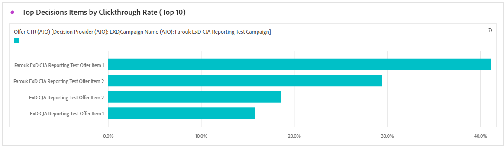

# Relatório de campanha baseada em código {#campaign-global-report-cja-code}

>[!BEGINSHADEBOX]

Você pode acessar seu relatório de campanha baseado em código clicando no botão **[!UICONTROL Relatórios]** da campanha e selecionando **[!UICONTROL Exibir relatório de todos os tempos]**. [Saiba mais](report-gs-cja.md)

>[!ENDSHADEBOX]

## Exibir e clicar {#impressions-code}

Os gráficos de **[!UICONTROL Exibição e clique]** apresentam uma análise detalhada do envolvimento dos seus perfis com as suas experiências baseadas em código, oferecendo insights valiosos sobre como os perfis interagem com o seu conteúdo.

+++ Saiba mais sobre métricas de Impressão e Clique

* **[!UICONTROL Cliques únicos]**: número de perfis que clicaram em um conteúdo em suas experiências.

* **[!UICONTROL Cliques]**: número de vezes que um conteúdo foi clicado em suas experiências.

* **[!UICONTROL Exibições]**: número de vezes que a experiência foi aberta.

* **[!UICONTROL Exibições exclusivas]**: número de vezes que a experiência foi aberta, várias interações de um perfil não são consideradas.

+++

## Dados de rastreamento {#track-data-code}

A tabela **[!UICONTROL Dados de rastreamento]** oferece um instantâneo detalhado da atividade do perfil vinculado às suas experiências baseadas em código, fornecendo insights essenciais sobre o envolvimento e a eficácia das experiências.

+++ Saiba mais sobre Rastreamento de métricas de dados

* **[!UICONTROL Pessoas]**: número de perfis de usuário qualificados como perfis de destino para suas experiências.

* **[!UICONTROL Taxa de cliques (CTR)]**: porcentagem de usuários que interagiram com suas experiências.

* **[!UICONTROL Cliques]**: número de vezes que um conteúdo foi clicado em suas experiências.

* **[!UICONTROL Cliques únicos]**: número de perfis que clicaram em um conteúdo em suas experiências.

* **[!UICONTROL Exibições]**: número de vezes que sua experiência foi aberta.

* **[!UICONTROL Exibições exclusivas]**: número de vezes que sua experiência foi aberta, várias interações de um perfil não são consideradas.

+++

## Rótulos de link rastreado {#track-link-code}

A tabela **[!UICONTROL Rótulos de links rastreados]** oferece uma visão geral abrangente dos rótulos de links em suas experiências baseadas em código, destacando aquelas que geram o maior tráfego de visitantes. Esse recurso permite identificar e priorizar os links mais populares.

+++ Saiba mais sobre Métricas de rótulos de link rastreado

* **[!UICONTROL Cliques únicos]**: número de perfis que clicaram em um conteúdo em suas experiências baseadas em código.

* **[!UICONTROL Cliques]**: número de vezes que um conteúdo foi clicado em suas experiências baseadas em código.

* **[!UICONTROL Exibições]**: número de vezes que a experiência foi aberta.

* **[!UICONTROL Exibições exclusivas]**: número de vezes que a experiência foi aberta, várias interações de um perfil não são consideradas.

+++

## Relatórios de decisão {#decisioning-reporting}

### KPIs de decisão {#decisioning-kpis}

Os **KPIs de decisão** fornecem informações importantes sobre o envolvimento dos visitantes com as experiências, incluindo métricas como:

* **[!UICONTROL Total de itens]**: número total de itens individuais que fizeram parte de uma experiência personalizada ou de um processo de decisão dentro de um período especificado.

* **[!UICONTROL Total de exibições]**:

* **[!UICONTROL Total de cliques]**: número total de vezes que os usuários clicaram em itens, links, produtos ou outros elementos interativos durante um período especificado.

* **[!UICONTROL Taxa de fallback]**: porcentagem de instâncias em que nenhuma estratégia de seleção foi qualificada, resultando na exibição de uma opção genérica ou menos específica.

### Funil de engajamento {#engagement-funnel}

A tabela **[!UICONTROL Funil de participação]** monitora o desempenho de experiências personalizadas avaliando com que eficiência cada estágio do funil direciona as interações do usuário.

* **[!UICONTROL Exibições]**: número total de vezes que experiências personalizadas foram exibidas ou apresentadas aos usuários em vários pontos de contato.

* **[!UICONTROL Cliques]**: número total de vezes que usuários clicaram em experiências personalizadas que foram exibidas a eles.

### Principais itens de decisão por taxa de cliques {#top-decision}

A tabela **[!UICONTROL Principais itens de decisão por CTR]** destaca o desempenho de itens individuais com base em sua Taxa de Click-through. Essa métrica ajuda a avaliar quais itens são mais eficazes para envolver usuários e impulsionar interações.

* **[!UICONTROL Taxa de Click-through (CTR)]**: porcentagem de usuários que clicam em um link, anúncio ou recomendação em comparação ao número de vezes que ele foi exibido.

### Funil de engajamento por estratégia de seleção {#engagement-funnel-selection}

A tabela **[!UICONTROL Funil de envolvimentos por estratégia de seleção]** ajuda a monitorar e analisar com que eficiência diferentes estratégias de seleção estão envolvendo usuários com experiências personalizadas.

* **[!UICONTROL Exibições]**: número total de vezes que experiências personalizadas foram exibidas ou apresentadas aos usuários em vários pontos de contato.

* **[!UICONTROL Cliques]**: número total de vezes que usuários clicaram em experiências personalizadas que foram exibidas a eles.

### Desempenho de itens de decisão {#decision-items-performance}

A tabela **[!UICONTROL Desempenho dos itens de decisão]** avalia o desempenho de cada item ao envolver os usuários e impulsionar as ações desejadas, como compras, cliques ou outras respostas.

* **[!UICONTROL Exibições]**: número total de vezes que experiências personalizadas foram exibidas ou apresentadas aos usuários em vários pontos de contato.

* **[!UICONTROL Cliques]**: número total de vezes que usuários clicaram em experiências personalizadas que foram exibidas a eles.

### Estratégia de classificação {#ranking-strategy}

>[!NOTE]
>
>A tabela **[!UICONTROL Estratégia de Classificação]** fica disponível somente quando um [modelo de IA](../experience-decisioning/ranking/ai-models.md) é incorporado à campanha. <!--[Learn more](../experience-decisioning/ranking/ranking-formulas.md)-->

A tabela **[!UICONTROL Estratégia de classificação]** fornece informações sobre o desempenho dos modelos de classificação orientados por IA em experiências personalizadas que comparam dois tipos de tráfego:

* **Controlado por modelo**: os usuários recebem conteúdo classificado pelo modelo de IA, otimizado para relevância e envolvimento.

* **Contenção**: os usuários recebem conteúdo distribuído aleatoriamente durante a fase de exploração do modelo.

As métricas principais exibidas incluem:

* **[!UICONTROL Exibições]**: número total de vezes que experiências personalizadas foram exibidas ou apresentadas aos usuários em vários pontos de contato.

* **[!UICONTROL Cliques]**: número total de vezes que usuários clicaram em experiências personalizadas que foram exibidas a eles.

* **[!UICONTROL Taxa de conversão]**: porcentagem de exibições que resultaram em ações do usuário (por exemplo, cliques), indicando o sucesso do modelo em envolver usuários.

### Taxa de conversão para tráfego de Retenção e Orientado a Modelo {#conversion-rate}

>[!NOTE]
>
>A **[!UICONTROL Taxa de conversão para tráfego de Retenção e Orientado a Modelo]** fica disponível somente quando um [modelo de IA](../experience-decisioning/ranking/ai-models.md) é incorporado à campanha. <!--[Learn more](../experience-decisioning/ranking/ranking-formulas.md)-->

O gráfico **[!UICONTROL Taxa de conversão para tráfego de Retenção e Orientado a Modelo]** mostra a taxa de conversão ao longo do tempo para dois tipos de tráfego:

* **Controlado por modelo**: os usuários recebem conteúdo classificado pelo modelo de IA, otimizado para relevância e envolvimento.

* **Contenção**: os usuários recebem conteúdo distribuído aleatoriamente durante a fase de exploração do modelo.

>[!CAUTION]
>
>Ao usar um modelo de IA incorporado em uma [fórmula de classificação](../experience-decisioning/ranking/ranking-formulas.md), os dados não são refletidos no relatório de Taxa de conversão.
