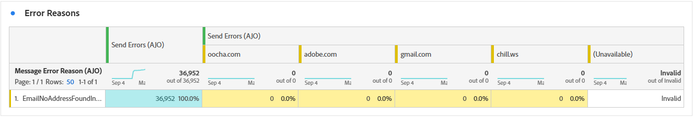

# Relatório de campanha por email {#campaign-global-report-cja-email}

>[!INFO]
>
>Como a Apple apresentou novos recursos de proteção de privacidade para seu aplicativo de email nativo, incluindo a Proteção de privacidade de email, os remetentes não podem mais usar pixels de rastreamento para coletar dados em perfis que ativaram a Proteção de privacidade de email da Apple. Consequentemente, a capacidade do Adobe Journey Optimizer de rastrear aberturas de email usando pixels de rastreamento pode ser afetada.
> [Saiba mais](https://experienceleaguecommunities.adobe.com/t5/adobe-campaign-classic-blogs/the-impact-of-apple-ios-privacy-changes-on-email-marketing-and/ba-p/699780?profile.language=pt) sobre o impacto das alterações de privacidade do Apple iOS no marketing por email.
> 
> Recomendamos o foco em cliques e métricas de conversão, em vez de taxas abertas, para obter insights mais precisos.

>[!BEGINSHADEBOX]

Você pode acessar o relatório Campanha por email clicando no botão **[!UICONTROL Relatórios]** da campanha e selecionando **[!UICONTROL Exibir relatório de todos os tempos]**. [Saiba mais](report-gs-cja.md)

>[!ENDSHADEBOX]

## KPIs de email

Os KPIs (Indicadores-chave de desempenho) do **[!UICONTROL Email]** fornecem um painel focado de métricas exclusivas e agregadas que refletem o desempenho e os níveis de engajamento de suas campanhas de email.

+++ Saiba mais sobre métricas de KPIs de email

* **[!UICONTROL Taxa de cliques únicos]**: porcentagem de perfis únicos que clicaram em pelo menos um link no email, relativo ao número de emails entregues exclusivos.

* **[!UICONTROL Taxa de abertura de cliques (CTOR)]**: porcentagem de perfis que interagiram com a mensagem.

* **[!UICONTROL Taxa de Abertura Exclusiva]**: porcentagem de perfis exclusivos que abriram o email pelo menos uma vez, em relação ao número de emails entregues exclusivos.

* **[!UICONTROL Taxa de rejeição exclusiva]**: porcentagem de perfis únicos cujo email foi rejeitado pelo menos uma vez, com base no número total de envios exclusivos.

* **[!UICONTROL Entregues]**: número de emails enviados com êxito em relação ao número total de mensagens enviadas.

* **[!UICONTROL Exclusivo entregue]**: número de perfis exclusivos que receberam com êxito pelo menos uma mensagem.

* **[!UICONTROL Aberturas Estimadas]**: Estimativa do total de aberturas de email que responde por aberturas diretas por perfis e aberturas automatizadas acionadas por servidores de email. Essa métrica se ajusta para aberturas acionadas por servidores de email para verificação de privacidade ou segurança, aplicando uma taxa de abertura calculada a partir dos destinatários que abriram manualmente o email àqueles cujos emails foram abertos apenas por servidores de email.

* **[!UICONTROL Aberturas Estimadas Exclusivas]**: Estimativa do número de destinatários de email exclusivos que provavelmente abriram o email. Essa métrica tem como objetivo fornecer uma contagem mais precisa do engajamento individual acionado por servidores de email para verificação de privacidade ou segurança, aplicando uma taxa de abertura exclusiva calculada a partir de perfis únicos que abriram manualmente o email para aqueles cujos emails foram abertos apenas por servidores de email.

* **[!UICONTROL Cliques]**: número total de vezes que qualquer link na mensagem foi clicado, incluindo vários cliques pelo mesmo perfil.

* **[!UICONTROL Cliques únicos]**: número de perfis únicos que clicaram em um conteúdo em sua mensagem.

+++

## Funil de clique único

O gráfico **[!UICONTROL Funil de cliques]** apresenta uma análise detalhada de como os perfis se envolveram com seu conteúdo de email, oferecendo insights valiosos em cada estágio da interação, desde a entrega até os cliques, ajudando você a entender com que eficiência suas mensagens impulsionam o engajamento do usuário.

+++ Saiba mais sobre as métricas de funil de clique

* **[!UICONTROL Direcionado Exclusivo]**: número de perfis exclusivos direcionados durante o processo de envio.

* **[!UICONTROL Envios únicos]**: número de perfis únicos para os quais pelo menos um email tentou ser enviado.

* **[!UICONTROL Exclusivo entregue]**: número de perfis exclusivos que receberam com êxito pelo menos uma mensagem.

* **[!UICONTROL Aberturas estimadas exclusivas]**: Estimativa do número de destinatários de email exclusivos que provavelmente abriram o email. Essa métrica tem como objetivo fornecer uma contagem mais precisa do engajamento individual acionado por servidores de email para verificação de privacidade ou segurança, aplicando uma taxa de abertura exclusiva calculada a partir de perfis únicos que abriram manualmente o email para aqueles cujos emails foram abertos apenas por servidores de email.

* **[!UICONTROL Cliques únicos]**: número de perfis únicos que clicaram em um conteúdo em sua mensagem.

+++

## Status de entrega único

O gráfico **[!UICONTROL Status da entrega]** fornece uma exibição abrangente dos dados relacionados aos emails enviados em sua campanha, oferecendo insights sobre as métricas principais, como entregas e rejeições. Isso permite uma análise detalhada do processo de envio de email, fornecendo informações valiosas sobre a eficiência e o desempenho de suas campanhas.

+++ Saiba mais sobre Métricas de status de entrega

* **[!UICONTROL Erros de envio exclusivos]**: número de perfis exclusivos que tiveram pelo menos um erro de envio durante o processo de saída.

* **[!UICONTROL Exclusivo entregue]**: número de perfis exclusivos que receberam com êxito pelo menos uma mensagem.

* **[!UICONTROL Exclusões de envio exclusivas]**: número de perfis exclusivos excluídos do recebimento de mensagens devido a regras predefinidas ou critérios de público-alvo.

* **[!UICONTROL Rejeições exclusivas]**: número de perfis exclusivos para os quais pelo menos uma mensagem foi rejeitada durante o processo de envio.

+++

## Tendência de Entregas vs. Cliques {#delivered-click}

O gráfico de tendência **[!UICONTROL Entregues versus Cliques]** apresenta uma análise detalhada do envolvimento dos seus perfis com seus emails, oferecendo insights valiosos sobre como os perfis interagem com seu conteúdo. O gráfico usa dois eixos para mostrar emails entregues e cliques lado a lado, facilitando a detecção de padrões incomuns ou alterações no engajamento em comparação à quantidade de emails enviados.

+++ Saiba mais sobre métricas de tendência Entregue versus Clique

* **[!UICONTROL Entregues]**: número de emails enviados com êxito em relação ao número total de emails enviados.

* **[!UICONTROL Cliques]**: número de vezes que um conteúdo foi clicado em seus emails.

+++

## Estatísticas de envio únicas {#unique-sending-statistics-email}

A tabela **[!UICONTROL Estatísticas de Envio Exclusivas]** apresenta uma visão geral detalhada de métricas exclusivas de desempenho de email em suas campanhas. Ele se concentra em perfis individuais, como aqueles exclusivamente direcionados, entregues, rejeitados ou excluídos, fornecendo insights mais profundos sobre como seus emails estão atingindo e envolvendo seu público-alvo.

+++ Saiba mais sobre métricas de Estatísticas de envio únicas

* **[!UICONTROL Direcionado Exclusivo]**: número de perfis exclusivos direcionados durante o processo de envio.

* **[!UICONTROL Envios únicos]**: número de perfis únicos para os quais pelo menos um email tentou ser enviado.

* **[!UICONTROL Entregas únicas]**: número de perfis exclusivos que receberam com êxito pelo menos um email.

* **[!UICONTROL Rejeições exclusivas]**: número de perfis exclusivos para os quais pelo menos um email resultou em uma rejeição.

* **[!UICONTROL Taxa de rejeição única]**: porcentagem de perfis únicos cujo email foi rejeitado pelo menos uma vez, com base no número total de envios únicos.

* **[!UICONTROL Erros de Envio Exclusivos]**: Número de perfis exclusivos que encontraram pelo menos um erro de envio durante o processo de saída.

* **[!UICONTROL Exclusões de envio exclusivas]**: número de perfis exclusivos excluídos do recebimento de mensagens devido a regras de qualificação, segmentação de público ou status de perfil.

+++

## Estatísticas de rastreamento exclusivas {#unique-tracking-statistics-email}

A tabela **[!UICONTROL Estatísticas de rastreamento exclusivas]** fornece uma exibição focalizada do engajamento no nível do perfil com os emails da sua campanha. Ele destaca métricas exclusivas que oferecem insights valiosos sobre como perfis individuais interagem com seu conteúdo de email em estágios fundamentais de engajamento.

+++ Saiba mais sobre as métricas de estatísticas de rastreamento

* **[!UICONTROL Taxa de cliques únicos (CTR)]**: porcentagem de perfis únicos que clicaram em pelo menos um link no email, relativa ao número de emails entregues exclusivos.

* **[!UICONTROL Taxa de abertura de cliques únicos (CTOR)]**: porcentagem de perfis únicos que clicaram em um link após abrir o email, com base em aberturas exclusivas.

* **[!UICONTROL Taxa de Abertura Exclusiva]**: Porcentagem de perfis exclusivos que abriram o email pelo menos uma vez, em relação ao número de emails entregues exclusivos.

* **[!UICONTROL Cliques únicos]**: número de perfis únicos que clicaram em pelo menos um conteúdo do email.

* **[!UICONTROL Aberturas de Email Estimadas Exclusivas]**: Estimativa do número de destinatários de email exclusivos que provavelmente abriram o email. Essa métrica tem como objetivo fornecer uma contagem mais precisa do engajamento individual acionado por servidores de email para verificação de privacidade ou segurança, aplicando uma taxa de abertura exclusiva calculada a partir de perfis únicos que abriram manualmente o email para aqueles cujos emails foram abertos apenas por servidores de email.

* **[!UICONTROL Cancelamentos de assinatura de email únicos]**: Número de perfis únicos que clicaram no link de cancelamento de assinatura em seus emails ou na página de aterrissagem associada.

+++

## Estatísticas de envio {#sending-statistics-email}

A tabela **[!UICONTROL Estatísticas de Envio]** fornece um resumo abrangente dos dados essenciais sobre emails em suas campanhas. Ele detalha as principais métricas, como as interações com seus emails e o número de emails entregues com êxito, oferecendo insights valiosos sobre a eficácia e o alcance de seus emails e campanhas.

+++ Saiba mais sobre como enviar métricas de estatísticas

* **[!UICONTROL Direcionado]**: número total de emails processados durante o processo de envio.

* **[!UICONTROL Envios]**: número total de envios para o seu email.

* **[!UICONTROL Entregues]**: número total de emails enviados com êxito em relação ao número total de mensagens enviadas.

* **[!UICONTROL Rejeições]**: total de erros acumulados durante o processo de envio e o processamento de retorno automático em relação ao número total de mensagens enviadas.

* **[!UICONTROL Taxa de rejeição]**: porcentagem de emails que resultaram em uma rejeição, em relação ao número total de emails enviados.

* **[!UICONTROL Erros de Envio]**: Número total de erros ocorridos durante o processo de envio que impediram o envio para perfis.

* **[!UICONTROL Enviar Exclusões]**: número total de perfis excluídos pelo Adobe Journey Optimizer.

+++

## Estatísticas de rastreamento {#tracking-statistics-email}

A tabela **[!UICONTROL Email - Estatísticas de rastreamento]** oferece uma conta detalhada da atividade do perfil relacionada aos emails incluídos na sua campanha. Isso inclui métricas sobre aberturas, cliques e outros indicadores de engajamento relevantes, oferecendo uma visualização abrangente de como os perfis interagem com seu conteúdo de email.

+++ Saiba mais sobre as métricas de estatísticas de rastreamento

* **[!UICONTROL Taxa de cliques (CTR)]**: porcentagem de usuários que interagiram com o email.

* **[!UICONTROL Taxa de abertura de cliques (CTOR)]**: Número de vezes que o email foi aberto.

* **[!UICONTROL Aberturas estimadas de email]**: Estimativa do total de aberturas de email que respondem por aberturas diretas por perfis e aberturas automatizadas acionadas por servidores de email. Essa métrica se ajusta para aberturas acionadas por servidores de email para verificação de privacidade ou segurança, aplicando uma taxa de abertura calculada a partir dos destinatários que abriram manualmente o email àqueles cujos emails foram abertos apenas por servidores de email.

* **[!UICONTROL Cliques]**: número de vezes que um conteúdo foi clicado em seus emails.

* **[!UICONTROL Reclamações de spam]**: número de vezes que uma mensagem foi declarada como spam ou lixo eletrônico.

* **[!UICONTROL Cancelamentos de assinatura]**: Número de cliques no link de cancelamento de assinatura ou na página de aterrissagem associada.

+++

## Domínios de email {#email-domains}

A tabela **[!UICONTROL Domínios de email]** oferece uma análise detalhada dos emails categorizados por domínio, fornecendo insights abrangentes sobre as métricas de desempenho de suas campanhas de email. Essa análise abrangente permite que você entenda o comportamento de domínios diferentes em resposta ao seu conteúdo de email.

+++ Saiba mais sobre métricas de domínios de email

* **[!UICONTROL Entregas únicas]**: número de perfis exclusivos que receberam com êxito pelo menos um email.

* **[!UICONTROL Aberturas estimadas de email]**: Estimativa do total de aberturas de email que respondem por aberturas diretas por perfis e aberturas automatizadas acionadas por servidores de email. Essa métrica se ajusta para aberturas acionadas por servidores de email para verificação de privacidade ou segurança, aplicando uma taxa de abertura calculada a partir dos destinatários que abriram manualmente o email àqueles cujos emails foram abertos apenas por servidores de email.

* **[!UICONTROL Cliques únicos]**: número de perfis únicos que clicaram em pelo menos um conteúdo do email.

* **[!UICONTROL Rejeições exclusivas]**: número de perfis exclusivos para os quais pelo menos um email resultou em uma rejeição.

* **[!UICONTROL Erros de Envio Exclusivos]**: Número de perfis exclusivos que encontraram pelo menos um erro de envio durante o processo de saída.

* **[!UICONTROL Exclusões de envio exclusivas]**: número de perfis exclusivos excluídos do recebimento de mensagens devido a regras de qualificação, segmentação de público ou status de perfil.

+++

## Rótulos de link rastreado {#track-link-label}

A tabela **[!UICONTROL Rótulos de links rastreados]** oferece uma visão geral abrangente dos rótulos de links em seus emails, destacando aqueles que geram o maior tráfego de visitantes. Esse recurso permite identificar e priorizar os links mais populares.

+++ Saiba mais sobre Métricas de rótulos de link rastreado

* **[!UICONTROL Cliques únicos]**: número de perfis que clicaram em um conteúdo em um email.

* **[!UICONTROL Cliques]**: número de vezes que um conteúdo foi clicado em seus emails.

+++

## URLs do link rastreado {#track-link-url}

A tabela **[!UICONTROL URLs de link rastreado]** fornece uma visão geral abrangente das URLs de seu email que atraem o maior tráfego de visitantes. Isso permite identificar e priorizar os links mais populares, melhorando sua compreensão do envolvimento do perfil com conteúdo específico em seus emails.

+++ Saiba mais sobre Métricas de URLs de link rastreado

* **[!UICONTROL Cliques únicos]**: número de perfis que clicaram em um conteúdo em um email.

* **[!UICONTROL Cliques]**: número de vezes que um conteúdo foi clicado em seus emails.

+++

## Assuntos de email {#email-subjects}

A tabela **[!UICONTROL Assuntos de email]** apresenta uma visão geral completa dos assuntos de email que atraíram o maior tráfego de visitantes. Esse recurso oferece informações valiosas sobre a dinâmica do envolvimento do público-alvo.

+++ Saiba mais sobre métricas de assuntos de email

* **[!UICONTROL Taxa de Abertura Exclusiva]**: Porcentagem de perfis exclusivos que abriram o email pelo menos uma vez, em relação ao número de emails entregues exclusivos.

* **[!UICONTROL Aberturas de Email Estimadas Exclusivas]**: Estimativa do número de destinatários de email exclusivos que provavelmente abriram o email. Essa métrica tem como objetivo fornecer uma contagem mais precisa do engajamento individual acionado por servidores de email para verificação de privacidade ou segurança, aplicando uma taxa de abertura exclusiva calculada a partir de perfis únicos que abriram manualmente o email para aqueles cujos emails foram abertos apenas por servidores de email.

* **[!UICONTROL Taxa de Abertura]**: porcentagem de aberturas de email em relação ao número total de emails entregues, incluindo várias aberturas pelo mesmo perfil.

* **[!UICONTROL Aberturas estimadas de email]**: Estimativa do total de aberturas de email que respondem por aberturas diretas por perfis e aberturas automatizadas acionadas por servidores de email. Essa métrica se ajusta para aberturas acionadas por servidores de email para verificação de privacidade ou segurança, aplicando uma taxa de abertura calculada a partir dos destinatários que abriram manualmente o email àqueles cujos emails foram abertos apenas por servidores de email.

+++

## Motivos para exclusão {#excluded-reasons}

A tabela **[!UICONTROL Motivos excluídos]** apresenta uma exibição abrangente dos diferentes fatores que resultaram na exclusão de perfis de usuário do público-alvo direcionado, resultando no não recebimento da mensagem.

Consulte [esta página](exclusion-list.md) para obter uma lista abrangente dos motivos de exclusão.

## Motivos de rejeição {#bounce-reasons-email}

A tabela **[!UICONTROL Motivos de rejeição]** compila os dados disponíveis relacionados às mensagens rejeitadas, fornecendo insights detalhados sobre os motivos específicos por trás das rejeições de email.

Para obter mais informações sobre rejeições, consulte a página [Lista de supressão](../reports/suppression-list.md).

## Motivos do erro {#error-reasons-email}

A tabela **[!UICONTROL Motivos de Erro]** oferece visibilidade sobre os erros específicos ocorridos durante o processo de envio, fornecendo informações valiosas sobre a natureza e a ocorrência de erros.
