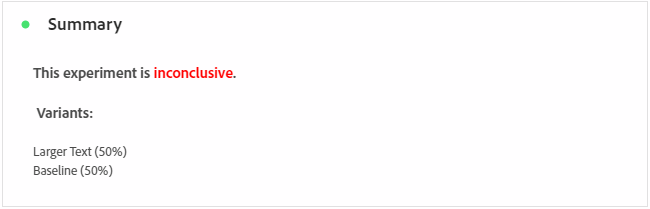
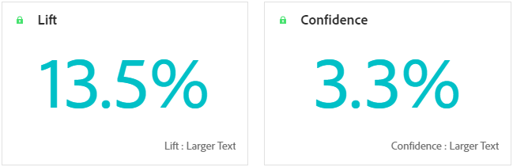
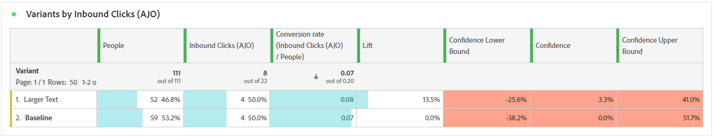

# Relatório de campanha de experimentação {#campaign-global-report-cja-experimentation}

>[!CONTEXTUALHELP]
>id="ajo_campaigns_content_experiment_click"
>title="Métricas de sucesso"
>abstract="O valor total da métrica sucesso, anteriormente selecionado ao criar seus experimentos, dividido pelo número de perfis."

## Experimentação {#experimentation}

A guia **[!UICONTROL Experimentação]** fornece informações importantes sobre o desempenho de cada variante e identifica a mais bem-sucedida.

Observe que a definição do melhor desempenho pode levar algum tempo. Se o experimento não for bem-sucedido, ele será definido como **Inconclusivo**.

### KPIs de experimentação {#experimentation-kpis}

Os KPIs (Indicadores-chave de desempenho) da **[!UICONTROL Experimentação]** funcionam como um painel abrangente, fornecendo uma análise das métricas essenciais associadas à sua experimentação.

+++ Saiba mais sobre métricas de KPIs de experimentação

* **[!UICONTROL Aumento]**: medida da melhora da porcentagem na taxa de conversão de um determinado tratamento em relação à linha de base.

* **[!UICONTROL Confiança]**: evidência de que um determinado tratamento é igual ao tratamento de linha de base. [Saiba mais](../content-management/experiment-calculations.md#adobes-statistical-methodology-any-time-valid-confidence-sequences)

+++

### Variante por métrica de sucesso {#variant-inbound}

A tabela **Variante por métricas de sucesso** mostra o desempenho de cada variante com base na métrica de sucesso selecionada ao configurar o experimento.
Para aprofundar esses resultados e como interpretá-los, consulte [esta página](../content-management/get-started-experiment.md#interpret-results).

+++ Saiba mais sobre a Variante por métrica de sucesso

* **[!UICONTROL Pessoas]**: número de perfis de usuário qualificados como perfis de destino para suas mensagens.

* **[!UICONTROL Cliques de entrada]**: valor total da métrica de Sucesso, selecionada anteriormente ao criar seus Experimentos.

* **[!UICONTROL Taxa de conversão]**: valor total da métrica de Sucesso, selecionada anteriormente ao criar seus Experimentos, dividido pelo número de perfis.

* **[!UICONTROL Aumento]**: medida da melhora da porcentagem na taxa de conversão de um determinado tratamento em relação à linha de base.

* **[!UICONTROL Limite inferior de confiança]**: valor estimado mais baixo da diferença da taxa de conversão entre o tratamento e a linha de base, dentro do intervalo de confiança escolhido.

* **[!UICONTROL Confiança]**: evidência de que um determinado tratamento é igual ao tratamento de linha de base. [Saiba mais](../content-management/experiment-calculations.md#adobes-statistical-methodology-any-time-valid-confidence-sequences)

* **[!UICONTROL Limite superior de confiança]**: valor estimado mais alto da diferença da taxa de conversão entre o tratamento e a linha de base, dentro do intervalo de confiança escolhido.

+++

### Taxa de conversão para a métrica de Sucesso {#conversion-rate}

O gráfico **[!UICONTROL Intervalo de confiança]** mostra o intervalo de melhorias possíveis, comparando a linha de base com o tratamento de melhor desempenho para a métrica de sucesso escolhida. [Saiba mais](../content-management/experiment-calculations.md#adobes-statistical-methodology-any-time-valid-confidence-sequences).