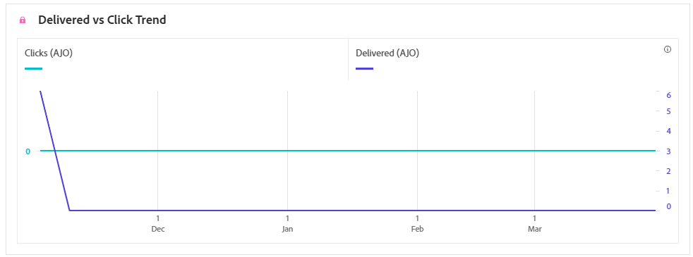
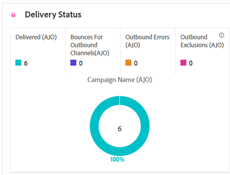

# Relatório de campanha por SMS {#campaign-global-report-cja-sms}

>[!BEGINSHADEBOX]

Você pode acessar o relatório de campanha de SMS clicando no botão **[!UICONTROL Relatórios]** da campanha e selecionando **[!UICONTROL Exibir relatório de todos os tempos]**. [Saiba mais](report-gs-cja.md)

>[!ENDSHADEBOX]

## Tendência de Entregas vs. Cliques {#delivered-click-sms}

O gráfico de tendência **[!UICONTROL Entregues versus Cliques]** apresenta uma análise detalhada do envolvimento dos seus perfis com seus emails, oferecendo insights valiosos sobre como os perfis interagem com seu conteúdo.

+++ Saiba mais sobre métricas de tendência Entregue versus Clique

* **[!UICONTROL Entregues]**: número de mensagens SMS enviadas com êxito em relação ao número total de mensagens SMS.

* **[!UICONTROL Cliques]**: número de vezes que um conteúdo foi clicado em suas mensagens SMS.

+++

## Status da entrega {#delivery-status-sms}

A tabela **[!UICONTROL Status da entrega]** oferece uma conta detalhada da atividade do perfil relacionada às suas campanhas de SMS. Isso inclui métricas sobre entregas, cliques e outros indicadores de envolvimento relevantes, oferecendo uma visualização abrangente de como os perfis interagem com seu conteúdo de SMS.

+++ Saiba mais sobre Métricas de status de entrega

* **[!UICONTROL Entregues]**: número de mensagens SMS enviadas com êxito em relação ao número total de mensagens SMS.

* **[!UICONTROL Rejeições para canais de saída]**: Total de erros acumulados durante o processo de envio e o processamento automático de retorno em relação ao número total de mensagens SMS enviadas.

* **[!UICONTROL Erros de saída]**: número total de erros que ocorreram, impedindo que fossem enviados a perfis.

* **[!UICONTROL Exclusões de saída]**: número de perfis excluídos pelo Adobe Journey Optimizer.

+++

## Rótulos de link rastreado {#track-link-label-sms}

A tabela **[!UICONTROL Rótulos de links rastreados]** oferece uma visão geral abrangente dos rótulos de links em suas mensagens SMS, destacando aqueles que geram o maior tráfego de visitantes. Esse recurso permite identificar e priorizar os links mais populares.

+++ Saiba mais sobre métricas de rótulos de link rastreado

* **[!UICONTROL Cliques únicos]**: número de perfis que clicaram em um conteúdo em sua mensagem SMS.

* **[!UICONTROL Cliques]**: número de vezes que um conteúdo foi clicado em suas mensagens SMS.

+++

## URLs do link rastreado {#track-link-url-sms}

A tabela **[!UICONTROL URLs de links rastreados]** fornece uma visão geral abrangente das URLs em suas mensagens SMS que atraem o maior tráfego de visitantes. Isso permite identificar e priorizar os links mais populares, melhorando sua compreensão da participação do perfil com conteúdo específico em suas mensagens SMS.

+++ Saiba mais sobre métricas de URLs de link rastreado

* **[!UICONTROL Cliques únicos]**: número de perfis que clicaram em um conteúdo em sua mensagem SMS.

* **[!UICONTROL Cliques]**: número de vezes que um conteúdo foi clicado em suas mensagens SMS.

* **[!UICONTROL Exibições]**: número de vezes que a mensagem foi aberta.

* **[!UICONTROL Exibições exclusivas]**: número de vezes que a mensagem foi aberta; várias interações de um perfil não são consideradas.

+++

## Mensagem por SMS de entrada {#sms-inbound}

A tabela **[!UICONTROL Mensagem de entrada de SMS]** apresenta uma visão geral de quais mensagens SMS atraíram o maior tráfego de visitantes. Esse recurso oferece informações valiosas sobre a dinâmica do envolvimento do público-alvo.

+++ Saiba mais sobre métricas de mensagem de entrada SMS

* **[!UICONTROL Pessoas]**: número de perfis de usuário qualificados como perfis de destino para suas mensagens SMS.

+++

## Tipo de mensagem SMS {#sms-message-type}

A tabela **[!UICONTROL Tipo de mensagem SMS]** apresenta uma visão geral completa de qual tipo de mensagem SMS atraiu o maior tráfego de visitantes. Esse recurso oferece informações valiosas sobre a dinâmica do envolvimento do público-alvo.

+++ Saiba mais sobre métricas do tipo de mensagem SMS

* **[!UICONTROL Pessoas]**: número de perfis de usuário qualificados como perfis de destino para suas mensagens SMS.

+++

## Provedores de SMS {#sms-providers}

A tabela **[!UICONTROL Provedores de SMS]** apresenta uma visão geral completa de quais provedores de SMS atraíram o maior tráfego de visitantes. Esse recurso oferece informações valiosas sobre a dinâmica do envolvimento do público-alvo.

+++ Saiba mais sobre métricas de provedores SMS

* **[!UICONTROL Pessoas]**: número de perfis de usuário qualificados como perfis de destino para suas mensagens SMS.

+++

## Motivos de rejeição {#bounce-reasons-sms}

A tabela **[!UICONTROL Motivos de rejeições]** fornece uma visão geral abrangente dos dados relacionados às mensagens SMS rejeitadas, fornecendo insights valiosos sobre os motivos específicos por trás das instâncias de rejeições de mensagens SMS.

## Motivos do erro {#error-reasons-sms}

A tabela **[!UICONTROL Motivos de Erro]** permite identificar os erros específicos que ocorreram durante o processo de envio de suas mensagens SMS, facilitando uma análise completa de todos os problemas encontrados.

## Motivos para exclusão {#excluded-reasons-sms}

A tabela **[!UICONTROL Motivos da exclusão]** representa visualmente os diversos fatores que levaram à exclusão de perfis de usuário do público-alvo direcionado, impedindo-o de receber suas mensagens SMS.

Consulte [esta página](exclusion-list.md) para obter uma lista abrangente dos motivos de exclusão.
