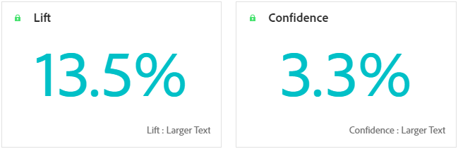
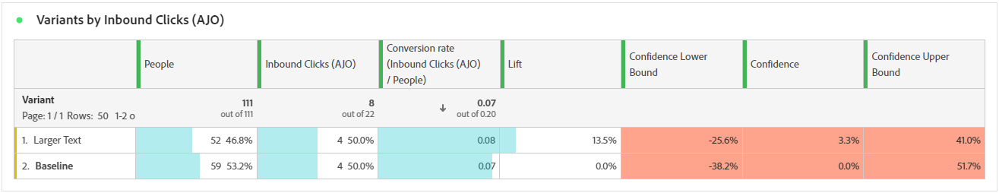
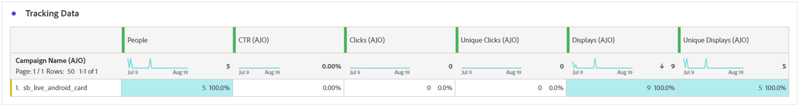

# Relatório de campanha {#campaign-global-report-cja}

O **relatório de Campanha** é um painel abrangente que fornece uma análise detalhada das métricas principais associadas à sua campanha. Ele inclui dados como contagens de cliques, mensagens enviadas, números de perfil e ações tomadas. Ao oferecer uma visão geral completa da eficácia e dos níveis de engajamento da sua campanha, o relatório garante uma compreensão completa do desempenho geral da campanha.

Os relatórios de campanha podem ser acessados diretamente do Campaign com o botão **[!UICONTROL Relatórios]**.

A página **Relatório de campanha** será exibida com as seguintes guias, dependendo do canal escolhido:

* [Campaign](#campaign-global)
* [Experimentação](#experimentation)
* [Email](#email-global)
* [SMS](#sms)
* [Notificações por push](#push-notification)
* [Correspondência direta](#direct-mail)
* [Web](#web)
* [Cartão de conteúdo](#content-card)

Para saber mais sobre o Customer Journey Analytics Workspace e como filtrar e analisar dados, consulte [esta página](https://experienceleague.adobe.com/en/docs/analytics-platform/using/cja-workspace/home).

## Campaign {#campaign-global}

### KPIs de campanha {#campaign-kpis}

Os KPIs (Indicadores-chave de desempenho) da **[!UICONTROL Campanha]** funcionam como um painel abrangente, fornecendo uma análise das métricas essenciais associadas à sua campanha. Isso abrange detalhes como a contagem de cliques e o número de mensagens entregues, oferecendo uma visão abrangente da eficiência e do nível de engajamento da campanha.

Os KPIs variam com base nos canais usados em sua campanha.

+++ Saiba mais sobre as métricas de KPIs do Campaign

* **[!UICONTROL Taxa de cliques]**: porcentagem de usuários que interagiram com a mensagem.

* **[!UICONTROL Cliques]**: número de vezes que um conteúdo foi clicado em sua mensagem.

* **[!UICONTROL Entregues]**: número de emails enviados com êxito em relação ao número total de mensagens enviadas.

* **[!UICONTROL Exibições]**: número de vezes que a mensagem foi aberta.

+++

### Visão geral da campanha {#delivery-global}

A tabela **[!UICONTROL Visão geral da campanha]** serve como um painel abrangente, que oferece um detalhamento das principais métricas relacionadas à sua campanha. Isso inclui informações essenciais, como o número de perfis e as ações entregues, fornecendo uma compreensão completa do desempenho e do envolvimento da campanha.

Observe que as métricas variam com base nos canais usados na campanha.

+++ Saiba mais sobre as métricas de visão geral do Campaign

* **[!UICONTROL Pessoas]**: número de perfis de usuário qualificados como perfis de destino para suas mensagens.

* **[!UICONTROL Taxa de cliques]**: porcentagem de usuários que interagiram com a mensagem.

* **[!UICONTROL Cliques]**: número de vezes que um conteúdo foi clicado em sua mensagem.

* **[!UICONTROL Cliques únicos]**: número de perfis que clicaram em um conteúdo em sua mensagem.

* **[!UICONTROL Entregues]**: número de emails enviados com êxito em relação ao número total de mensagens enviadas.

* **[!UICONTROL Rejeições para canais de saída]**: Número total de erros acumulados durante o processo de envio e o processamento automático de retorno em relação ao número total de mensagens enviadas.

* **[!UICONTROL Erros de Saída]**: Número total de erros ocorridos durante o processo de envio que impediram o envio para perfis.

* **[!UICONTROL Exclusões de saída]**: número de perfis excluídos pelo Adobe Journey Optimizer.

* **[!UICONTROL Exibições]**: número de vezes que a mensagem foi aberta.

* **[!UICONTROL Exibições exclusivas]**: número de vezes que a mensagem foi aberta; várias interações de um perfil não são consideradas.

+++

### Resultados do funil de campanha {#campaign-funnel}

O gráfico **[!UICONTROL Resultados do funil da campanha]** apresenta uma análise detalhada do envolvimento dos seus perfis com as suas mensagens, oferecendo informações valiosas sobre como vários perfis interagiram com o seu conteúdo.

+++ Saiba mais sobre as métricas de resultados do funil do Campaign

* **[!UICONTROL Entregues]**: número de emails enviados com êxito em relação ao número total de mensagens enviadas.

* **[!UICONTROL Cliques]**: número de vezes que um conteúdo foi clicado em sua mensagem.
+++

### Rótulo do link rastreado {#campaign-track}

A tabela **[!UICONTROL Rótulo do link rastreado]** oferece informações essenciais sobre o envolvimento dos visitantes com as URLs incluídas em suas mensagens, fornecendo informações valiosas sobre quais links atraem mais interação.

+++ Saiba mais sobre métricas de rótulo de link rastreado

* **[!UICONTROL Cliques únicos]**: número de perfis que clicaram em um conteúdo em sua mensagem.

* **[!UICONTROL Cliques]**: número de vezes que um conteúdo foi clicado em sua mensagem.

+++

## Experimentação {#experimentation}

A guia **[!UICONTROL Experimentação]** fornece informações importantes sobre o desempenho de cada variante e identifica a mais bem-sucedida.

Observe que a definição do melhor desempenho pode levar algum tempo. Se o experimento não for bem-sucedido, ele será definido como **Inconclusivo**.

### KPIs de experimentação {#experimentation-kpis}

Os KPIs (Indicadores-chave de desempenho) da **[!UICONTROL Experimentação]** funcionam como um painel abrangente, fornecendo uma análise das métricas essenciais associadas à sua experimentação.

+++ Saiba mais sobre métricas de KPIs de experimentação

* **[!UICONTROL Aumento]**: medida da melhora da porcentagem na taxa de conversão de um determinado tratamento em relação à linha de base.

* **[!UICONTROL Confiança]**: evidência de que um determinado tratamento é igual ao tratamento de linha de base. [Saiba mais](../content-management/experiment-calculations.md#understand-confidence)

+++

### Variante por cliques de entrada {#variant-inbound}

O widget **[!UICONTROL Variante por cliques de entrada]** detalha o desempenho de cada variante.
Para aprofundar esses resultados e como interpretá-los, consulte [esta página](../content-management/get-started-experiment.md#interpret-results).

+++ Saiba mais sobre as métricas Variante por cliques de entrada

* **[!UICONTROL Pessoas]**: número de perfis de usuário qualificados como perfis de destino para suas mensagens.

* **[!UICONTROL Cliques de entrada]**: contagem total de cliques nos canais de saída.

* **[!UICONTROL Taxa de conversão]**: valor total da métrica de Sucesso, selecionada anteriormente ao criar seus Experimentos, dividido pelo número de perfis.

* **[!UICONTROL Aumento]**: medida da melhora da porcentagem na taxa de conversão de um determinado tratamento em relação à linha de base.

* **[!UICONTROL Confiança]**: evidência de que um determinado tratamento é igual ao tratamento de linha de base. [Saiba mais](../content-management/experiment-calculations.md#understand-confidence)

<!--
* **[!UICONTROL Confidence Upper bound]**:

* **[!UICONTROL Confidence Lower bound]**:
-->
+++

### Taxa de conversão para cliques de entrada {#conversion-rate}

O gráfico **[!UICONTROL Intervalo de confiança]** mede a incerteza em torno da melhoria. Ela detalha a diferença percentual de desempenho entre a linha de base e o tratamento com melhor desempenho. [Saiba mais](../content-management/experiment-calculations.md#confidence-intervals).

## Email {#email-global}

### Tendência de Entregas vs. Cliques {#delivered-click}

O gráfico de tendência **[!UICONTROL Entregues versus Cliques]** apresenta uma análise detalhada do envolvimento dos seus perfis com seus emails, oferecendo insights valiosos sobre como os perfis interagem com seu conteúdo.

+++ Saiba mais sobre métricas de tendência Entregue versus Clique

* **[!UICONTROL Entregues]**: número de emails enviados com êxito em relação ao número total de emails enviados.

* **[!UICONTROL Cliques]**: número de vezes que um conteúdo foi clicado em seus emails.

+++

### Status da entrega {#delivery-status}

O gráfico **[!UICONTROL Status da entrega]** fornece uma exibição abrangente dos dados relacionados aos emails enviados em sua campanha, oferecendo insights sobre as métricas principais, como entregas e rejeições. Isso permite uma análise detalhada do processo de envio de email, fornecendo informações valiosas sobre a eficiência e o desempenho de suas campanhas.

+++ Saiba mais sobre Métricas de status de entrega

* **[!UICONTROL Entregues]**: número de emails enviados com êxito em relação ao número total de emails enviados.

* **[!UICONTROL Rejeições para canais de saída]**:Total de erros acumulados durante o processo de envio e o processamento automático de retorno em relação ao número total de mensagens enviadas.

* **[!UICONTROL Erros de saída]**: número total de erros ocorridos durante um processo de envio que impediram o envio para perfis.

* **[!UICONTROL Exclusões de saída]**: número de perfis excluídos pelo Adobe Journey Optimizer.

+++

### Estatísticas de envio {#sending-statistics-email}

A tabela **[!UICONTROL Estatísticas de Envio]** fornece um resumo abrangente dos dados essenciais sobre emails em suas campanhas. Ele detalha as principais métricas, como as interações com seus emails e o número de emails entregues com êxito, oferecendo insights valiosos sobre a eficácia e o alcance de seus emails e campanhas.

+++ Saiba mais sobre como enviar métricas de estatísticas

* **[!UICONTROL Pessoas]**: número de perfis de usuário qualificados como perfis de destino para suas mensagens.

* **[!UICONTROL Direcionado]**: número total de emails processados durante o processo de envio.

* **[!UICONTROL Envios]**: número total de envios para o seu email.

* **[!UICONTROL Entregues]**: número de emails enviados com êxito em relação ao número total de mensagens enviadas.

* **[!UICONTROL Rejeições para canais de saída]**: Total de erros acumulados durante o processo de envio e o processamento automático de retorno em relação ao número total de mensagens enviadas.

* **[!UICONTROL Erros de Saída]**: Número total de erros ocorridos durante o processo de envio que impediram o envio para perfis.

* **[!UICONTROL Exclusões de saída]**: número de perfis excluídos pelo Adobe Journey Optimizer.

+++

### Estatísticas de rastreamento {#tracking-statistics-email}

A tabela **[!UICONTROL Email - Estatísticas de rastreamento]** oferece uma conta detalhada da atividade do perfil relacionada aos emails incluídos na sua campanha. Isso inclui métricas sobre aberturas, cliques e outros indicadores de engajamento relevantes, oferecendo uma visualização abrangente de como os perfis interagem com seu conteúdo de email.

+++ Saiba mais sobre métricas de estatísticas de rastreamento

* **[!UICONTROL Taxa de cliques (CTR)]**: porcentagem de usuários que interagiram com o email.

* **[!UICONTROL Taxa de abertura de cliques (CTOR)]**: Número de vezes que o email foi aberto.

* **[!UICONTROL Cliques]**: número de vezes que um conteúdo foi clicado em seus emails.

* **[!UICONTROL Cliques únicos]**: número de perfis que clicaram em um conteúdo em um email.

* **[!UICONTROL Aberturas de email]**: Número de vezes que seus emails foram abertos em uma campanha.

* **[!UICONTROL Aberturas de email únicas]**: porcentagem de emails abertos.

* **[!UICONTROL Reclamações de spam]**: número de vezes que uma mensagem foi declarada como spam ou lixo eletrônico.

* **[!UICONTROL Cancelamentos de assinatura]**: Número de cliques no link de cancelamento de assinatura.

+++

### Domínios de email {#email-domains}

A tabela **[!UICONTROL Domínios de email]** oferece uma análise detalhada dos emails categorizados por domínio, fornecendo insights abrangentes sobre as métricas de desempenho de suas campanhas de email. Essa análise abrangente permite que você entenda o comportamento de domínios diferentes em resposta ao seu conteúdo de email.

+++ Saiba mais sobre métricas de domínios de email

* **[!UICONTROL Envios]**: número total de envios para o seu email.

* **[!UICONTROL Entregues]**: número de emails enviados com êxito em relação ao número total de emails enviados.

* **[!UICONTROL Aberturas de email]**: Número de vezes que seus emails foram abertos em uma campanha.

* **[!UICONTROL Cliques]**: número de vezes que um conteúdo foi clicado em seus emails.

* **[!UICONTROL Rejeições para canais de saída]**: Número total de erros acumulados durante o processo de envio e o processamento automático de retorno em relação ao número total de emails enviados.

* **[!UICONTROL Erros de Saída]**: Número total de erros ocorridos durante o processo de envio que impediram o envio para perfis.
+++

### Rótulos de link rastreado {#track-link-label}

A tabela **[!UICONTROL Rótulos de links rastreados]** oferece uma visão geral abrangente dos rótulos de links em seus emails, destacando aqueles que geram o maior tráfego de visitantes. Esse recurso permite identificar e priorizar os links mais populares.

+++ Saiba mais sobre métricas de rótulos de link rastreado

* **[!UICONTROL Cliques únicos]**: número de perfis que clicaram em um conteúdo em um email.

* **[!UICONTROL Cliques]**: número de vezes que um conteúdo foi clicado em seus emails.

+++

### URLs do link rastreado {#track-link-url}

A tabela **[!UICONTROL URLs de link rastreado]** fornece uma visão geral abrangente das URLs de seu email que atraem o maior tráfego de visitantes. Isso permite identificar e priorizar os links mais populares, melhorando sua compreensão do envolvimento do perfil com conteúdo específico em seus emails.

+++ Saiba mais sobre métricas de URLs de link rastreado

* **[!UICONTROL Cliques únicos]**: número de perfis que clicaram em um conteúdo em um email.

* **[!UICONTROL Cliques]**: número de vezes que um conteúdo foi clicado em seus emails.

* **[!UICONTROL Exibições]**: número de vezes que o email foi aberto.

* **[!UICONTROL Exibições exclusivas]**: número de vezes que o email foi aberto, várias interações de um perfil não são consideradas.

+++

### Assuntos de email {#email-subjects}

A tabela **[!UICONTROL Assuntos de email]** apresenta uma visão geral completa dos assuntos de email que atraíram o maior tráfego de visitantes. Esse recurso oferece informações valiosas sobre a dinâmica do envolvimento do público-alvo.

+++ Saiba mais sobre métricas de assuntos de email

* **[!UICONTROL Pessoas]**: número de perfis de usuário qualificados como perfis de destino para seus emails.

+++

### Motivos para exclusão {#excluded-reasons}

A tabela **[!UICONTROL Motivos excluídos]** apresenta uma exibição abrangente dos diferentes fatores que resultaram na exclusão de perfis de usuário do público-alvo direcionado, resultando no não recebimento da mensagem.

Consulte [esta página](exclusion-list.md) para obter uma lista abrangente dos motivos de exclusão.

### Motivos de rejeição {#bounce-reasons-email}

A tabela **[!UICONTROL Motivos de rejeição]** compila os dados disponíveis relacionados às mensagens rejeitadas, fornecendo insights detalhados sobre os motivos específicos por trás das rejeições de email.

Para obter mais informações sobre rejeições, consulte a página [Lista de supressão](../reports/suppression-list.md).

### Motivos do erro {#error-reasons-email}

A tabela **[!UICONTROL Motivos de Erro]** oferece visibilidade sobre os erros específicos ocorridos durante o processo de envio, fornecendo informações valiosas sobre a natureza e a ocorrência de erros.

## SMS {#sms}

### Tendência de Entregas vs. Cliques {#delivered-click-sms}

O gráfico de tendência **[!UICONTROL Entregues versus Cliques]** apresenta uma análise detalhada do envolvimento dos seus perfis com seus emails, oferecendo insights valiosos sobre como os perfis interagem com seu conteúdo.

+++ Saiba mais sobre métricas de tendência Entregue versus Clique

* **[!UICONTROL Entregues]**: número de mensagens SMS enviadas com êxito em relação ao número total de mensagens SMS.

* **[!UICONTROL Cliques]**: número de vezes que um conteúdo foi clicado em suas mensagens SMS.

+++

### Status da entrega {#delivery-status-sms}

A tabela **[!UICONTROL Status da entrega]** oferece uma conta detalhada da atividade do perfil relacionada às suas campanhas de SMS. Isso inclui métricas sobre entregas, cliques e outros indicadores de envolvimento relevantes, oferecendo uma visualização abrangente de como os perfis interagem com seu conteúdo de SMS.

+++ Saiba mais sobre Métricas de status de entrega

* **[!UICONTROL Entregues]**: número de mensagens SMS enviadas com êxito em relação ao número total de mensagens SMS.

* **[!UICONTROL Rejeições para canais de saída]**: Total de erros acumulados durante o processo de envio e o processamento automático de retorno em relação ao número total de mensagens SMS enviadas.

* **[!UICONTROL Erros de saída]**: número total de erros que ocorreram, impedindo que fossem enviados a perfis.

* **[!UICONTROL Exclusões de saída]**: número de perfis excluídos pelo Adobe Journey Optimizer.

+++

### Rótulos de link rastreado {#track-link-label-sms}

A tabela **[!UICONTROL Rótulos de links rastreados]** oferece uma visão geral abrangente dos rótulos de links em suas mensagens SMS, destacando aqueles que geram o maior tráfego de visitantes. Esse recurso permite identificar e priorizar os links mais populares.

+++ Saiba mais sobre métricas de rótulos de link rastreado

* **[!UICONTROL Cliques únicos]**: número de perfis que clicaram em um conteúdo em sua mensagem SMS.

* **[!UICONTROL Cliques]**: número de vezes que um conteúdo foi clicado em suas mensagens SMS.

+++

### URLs do link rastreado {#track-link-url-sms}

A tabela **[!UICONTROL URLs de links rastreados]** fornece uma visão geral abrangente das URLs em suas mensagens SMS que atraem o maior tráfego de visitantes. Isso permite identificar e priorizar os links mais populares, melhorando sua compreensão da participação do perfil com conteúdo específico em suas mensagens SMS.

+++ Saiba mais sobre métricas de URLs de link rastreado

* **[!UICONTROL Cliques únicos]**: número de perfis que clicaram em um conteúdo em sua mensagem SMS.

* **[!UICONTROL Cliques]**: número de vezes que um conteúdo foi clicado em suas mensagens SMS.

* **[!UICONTROL Exibições]**: número de vezes que a mensagem foi aberta.

* **[!UICONTROL Exibições exclusivas]**: número de vezes que a mensagem foi aberta; várias interações de um perfil não são consideradas.

+++

### Mensagem por SMS de entrada {#sms-inbound}

A tabela **[!UICONTROL Mensagem de entrada de SMS]** apresenta uma visão geral de quais mensagens SMS atraíram o maior tráfego de visitantes. Esse recurso oferece informações valiosas sobre a dinâmica do envolvimento do público-alvo.

+++ Saiba mais sobre métricas de mensagem de entrada SMS

* **[!UICONTROL Pessoas]**: número de perfis de usuário qualificados como perfis de destino para suas mensagens SMS.

+++

### Tipo de mensagem SMS {#sms-message-type}

A tabela **[!UICONTROL Tipo de mensagem SMS]** apresenta uma visão geral completa de qual tipo de mensagem SMS atraiu o maior tráfego de visitantes. Esse recurso oferece informações valiosas sobre a dinâmica do envolvimento do público-alvo.

+++ Saiba mais sobre métricas do tipo de mensagem SMS

* **[!UICONTROL Pessoas]**: número de perfis de usuário qualificados como perfis de destino para suas mensagens SMS.

+++

### Provedores de SMS {#sms-providers}

A tabela **[!UICONTROL Provedores de SMS]** apresenta uma visão geral completa de quais provedores de SMS atraíram o maior tráfego de visitantes. Esse recurso oferece informações valiosas sobre a dinâmica do envolvimento do público-alvo.

+++ Saiba mais sobre métricas de provedores SMS

* **[!UICONTROL Pessoas]**: número de perfis de usuário qualificados como perfis de destino para suas mensagens SMS.

+++

### Motivos de rejeição {#bounce-reasons-sms}

A tabela **[!UICONTROL Motivos de rejeições]** fornece uma visão geral abrangente dos dados relacionados às mensagens SMS rejeitadas, fornecendo insights valiosos sobre os motivos específicos por trás das instâncias de rejeições de mensagens SMS.

### Motivos do erro {#error-reasons-sms}

A tabela **[!UICONTROL Motivos de Erro]** permite identificar os erros específicos que ocorreram durante o processo de envio de suas mensagens SMS, facilitando uma análise completa de todos os problemas encontrados.

### Motivos para exclusão {#excluded-reasons-sms}

A tabela **[!UICONTROL Motivos da exclusão]** representa visualmente os diversos fatores que levaram à exclusão de perfis de usuário do público-alvo direcionado, impedindo-o de receber suas mensagens SMS.

Consulte [esta página](exclusion-list.md) para obter uma lista abrangente dos motivos de exclusão.

## Notificações por push {#push-notification}

### Estatísticas de envio {#sending-statistics-push}

A tabela **[!UICONTROL Estatísticas de envio]** fornece um resumo abrangente dos dados essenciais sobre suas campanhas de notificação por push. Ele detalha as principais métricas, como o tamanho do público-alvo e o número de notificações por push entregues com êxito, oferecendo insights valiosos sobre a eficácia e o alcance da notificação por push.

+++ Saiba mais sobre como enviar métricas de estatísticas

* **[!UICONTROL Pessoas]**: número de perfis de usuário qualificados como perfis de destino para suas notificações por push.

* **[!UICONTROL Direcionado]**: número total de notificações por push processadas durante a análise.

* **[!UICONTROL Envios]**: número total de envios para a notificação por push.

* **[!UICONTROL Entregue]**: número de notificações por push enviadas com êxito em relação ao número total de notificações por push enviadas.

* **[!UICONTROL Rejeições para canais de saída]**: total de erros acumulados durante o processo de envio e o processamento automático de retorno em relação ao número total de notificações por push.

* **[!UICONTROL Erros de saída]**: número total de erros que ocorreram, impedindo que fossem enviados a perfis.

* **[!UICONTROL Exclusões de saída]**: número de perfis excluídos pelo Adobe Journey Optimizer.

+++

### Estatísticas de rastreamento {#tracking-statistics-push}

A tabela **[!UICONTROL Estatísticas de rastreamento]** oferece um instantâneo detalhado da atividade do perfil vinculada às suas notificações por push, fornecendo insights essenciais sobre a eficácia do envolvimento e das notificações por push.

+++ Saiba mais sobre métricas de estatísticas de rastreamento

* **[!UICONTROL Taxa de cliques (CTR)]**: porcentagem de usuários que interagiram com as notificações por push.

* **[!UICONTROL Taxa de abertura de cliques (CTOR)]**: número de vezes que as notificações por push foram abertas.

* **[!UICONTROL Cliques]**: número de vezes que um conteúdo foi clicado em suas notificações por push.

* **[!UICONTROL Cliques únicos]**: número de perfis que clicaram em um conteúdo em suas notificações por push.

<!--
* **[!UICONTROL Push custom actions]**: 
-->
+++

### Rótulos de link rastreado {#track-link-label-push}

A tabela **[!UICONTROL Rótulos de links rastreados]** oferece uma visão geral abrangente dos rótulos de links em suas notificações por push, destacando aqueles que geram o maior tráfego de visitantes. Esse recurso permite identificar e priorizar os links mais populares.

+++ Saiba mais sobre métricas de rótulos de link rastreado

* **[!UICONTROL Cliques únicos]**: número de perfis que clicaram em um conteúdo em suas notificações por push.

* **[!UICONTROL Cliques]**: número de vezes que um conteúdo foi clicado em suas notificações por push.

+++

### URLs do link rastreado {#track-link-url-push}

A tabela **[!UICONTROL URLs de links rastreados]** fornece uma visão geral abrangente das URLs nas suas notificações por push que atraem o maior tráfego de visitantes. Isso permite identificar e priorizar os links mais populares, melhorando sua compreensão do envolvimento do perfil com conteúdo específico em suas notificações por push.

+++ Saiba mais sobre métricas de URLs de link rastreado

* **[!UICONTROL Cliques únicos]**: número de perfis que clicaram em um conteúdo em suas notificações por push.

* **[!UICONTROL Cliques]**: número de vezes que um conteúdo foi clicado em suas notificações por push.

+++

### Motivos de rejeição {#bounce-reasons-push}

A tabela **[!UICONTROL Motivos de rejeições]** fornece uma visão geral abrangente dos dados relacionados às notificações por push rejeitadas, fornecendo insights valiosos sobre os motivos específicos por trás das instâncias de rejeições de notificações por push.

### Motivos do erro {#error-reasons-push}

A tabela **[!UICONTROL Motivos de erro]** permite identificar os erros específicos que ocorreram durante o processo de envio de suas notificações por push, facilitando uma análise completa de todos os problemas encontrados.

### Motivos para exclusão {#exclude-reasons-push}

A tabela **[!UICONTROL Motivos da exclusão]** mostra visualmente os diversos fatores que levaram à exclusão de perfis de usuário do público-alvo, impedindo-o de receber suas notificações por push.

Consulte [esta página](exclusion-list.md) para obter uma lista abrangente dos motivos de exclusão.

## No aplicativo {#in-app}

### Tendência de impressão e clique {#impression-click-trend}

O gráfico **[!UICONTROL Tendência de impressão e clique]** apresenta uma análise detalhada do envolvimento dos seus perfis com as mensagens no aplicativo, oferecendo informações valiosas sobre como os perfis interagem com o seu conteúdo.

+++ Saiba mais sobre métricas de tendência de Impressão e Clique

* **[!UICONTROL Cliques]**: número de vezes que um conteúdo foi clicado em suas mensagens no aplicativo.

* **[!UICONTROL Exibições]**: número de vezes que a mensagem foi aberta.

+++

### Cliques {#clicks-inapp}

O gráfico **[!UICONTROL Cliques]** exibe métricas de cliques no aplicativo, ilustrando o número total de cliques no conteúdo e o número de perfis únicos que clicaram no conteúdo.

+++ Saiba mais sobre métricas de cliques

* **[!UICONTROL Cliques únicos]**: número de perfis que clicaram em um conteúdo em suas mensagens no aplicativo

* **[!UICONTROL Cliques]**: número de vezes que um conteúdo foi clicado em suas mensagens no aplicativo.

+++

### Exibir {#display-inapp}

O gráfico **[!UICONTROL Exibições]** ajuda você a entender o alcance geral da mensagem e o número de perfis únicos que estão se envolvendo com ela.

+++ Saiba mais sobre Métricas de exibição

* **[!UICONTROL Exibições]**: número de vezes que a mensagem foi aberta.

* **[!UICONTROL Exibições exclusivas]**: número de vezes que a mensagem foi aberta; várias interações de um perfil não são consideradas.

+++

### Dados de rastreamento {#tracking-data-inapp}

A tabela **[!UICONTROL Dados de rastreamento]** oferece um instantâneo detalhado da atividade do perfil vinculada às suas mensagens no aplicativo, fornecendo insights essenciais sobre a participação e a eficácia das mensagens no aplicativo.

+++ Saiba mais sobre Rastreamento de métricas de dados

* **[!UICONTROL Pessoas]**: número de perfis de usuário qualificados como perfis de destino para suas mensagens no aplicativo.

* **[!UICONTROL Taxa de cliques (CTR)]**: porcentagem de usuários que interagiram com as mensagens no aplicativo.

* **[!UICONTROL Taxa de abertura de cliques (CTOR)]**: Número de vezes que as mensagens no aplicativo foram abertas.

* **[!UICONTROL Cliques]**: número de vezes que um conteúdo foi clicado em suas mensagens no aplicativo.

* **[!UICONTROL Cliques únicos]**: número de perfis que clicaram em um conteúdo em suas mensagens no aplicativo.

* **[!UICONTROL Exibições]**: número de vezes que a mensagem foi aberta.

* **[!UICONTROL Exibições exclusivas]**: número de vezes que a mensagem foi aberta; várias interações de um perfil não são consideradas.

* **[!UICONTROL Envios]**: número total de envios para suas mensagens no aplicativo.

<!--
* **[!UICONTROL Inbound triggered]**: 

* **[!UICONTROL Inbound dismisses]**: 
-->
+++

### Rótulos de link rastreado {#track-link-label-inapp}

A tabela **[!UICONTROL Rótulos de links rastreados]** oferece uma visão geral abrangente dos rótulos de links em suas mensagens no aplicativo, destacando aquelas que geram o maior tráfego de visitantes. Esse recurso permite identificar e priorizar os links mais populares.

+++ Saiba mais sobre métricas de rótulos de link rastreado

* **[!UICONTROL Cliques únicos]**: número de perfis que clicaram em um conteúdo em suas mensagens no aplicativo.

* **[!UICONTROL Cliques]**: número de vezes que um conteúdo foi clicado em suas mensagens no aplicativo.

* **[!UICONTROL Exibições]**: número de vezes que a mensagem foi aberta.

* **[!UICONTROL Exibições exclusivas]**: número de vezes que a mensagem foi aberta; várias interações de um perfil não são consideradas.

+++

### URLs do link rastreado {#track-link-url-inapp}

A tabela **[!UICONTROL URLs de link rastreado]** fornece uma visão geral abrangente das URLs nas mensagens no aplicativo que atraem o maior tráfego de visitantes. Isso permite identificar e priorizar os links mais populares, melhorando sua compreensão da participação do perfil com conteúdo específico em suas mensagens no aplicativo.

+++ Saiba mais sobre métricas de URLs de link rastreado

* **[!UICONTROL Cliques únicos]**: número de perfis que clicaram em um conteúdo em suas mensagens no aplicativo.

* **[!UICONTROL Cliques]**: número de vezes que um conteúdo foi clicado em suas mensagens no aplicativo.

+++

## Correspondência direta {#direct-mail}

### Estatísticas de envio {#sending-statistics-directmail}

A tabela **[!UICONTROL Estatísticas de Envio]** fornece um resumo abrangente dos dados essenciais sobre as campanhas de correspondência direta. Ele detalha as principais métricas, como o tamanho do público-alvo e o número de correspondência direta entregue com sucesso, oferecendo informações valiosas sobre a eficácia e o alcance das mensagens de correspondência direta.

+++ Saiba mais sobre como enviar métricas de estatísticas

* **[!UICONTROL Pessoas]**: número de perfis de usuário qualificados como perfis de destino para suas mensagens.

* **[!UICONTROL Direcionado]**: número total de mensagens de correspondência direta processadas durante o processo de envio.

* **[!UICONTROL Envios]**: número total de envios para suas mensagens de correspondência direta.

* **[!UICONTROL Entregues]**: número de mensagens de correspondência direta enviadas com êxito em relação ao número total de mensagens enviadas.

* **[!UICONTROL Erros de Saída]**: Número total de erros ocorridos durante o processo de envio que impediram o envio para perfis.

* **[!UICONTROL Exclusões de saída]**: número de perfis excluídos pelo Adobe Journey Optimizer.

+++

### Status da entrega {#delivery-status-directmail}

O gráfico **[!UICONTROL Status da entrega]** fornece uma exibição abrangente dos dados relacionados às mensagens de correspondência direta enviadas em sua campanha, oferecendo insights sobre as métricas principais, como entregas e erros. Isso permite uma análise detalhada do processo de envio de mensagens de correspondência direta, fornecendo informações valiosas sobre a eficiência e o desempenho de suas campanhas.

+++ Saiba mais sobre Métricas de status de entrega

* **[!UICONTROL Entregues]**: número de mensagens de correspondência direta enviadas com êxito em relação ao número total de mensagens de correspondência direta enviadas.

* **[!UICONTROL Erros de saída]**: número total de erros que ocorreram durante um processo de envio, impedindo que suas mensagens de correspondência direta fossem enviadas para perfis.

* **[!UICONTROL Exclusões de saída]**: número de perfis excluídos pelo Adobe Journey Optimizer.

+++

### Motivos do erro {#error-reasons-directmail}

A tabela **[!UICONTROL Motivos de Erro]** permite identificar os erros específicos que ocorreram durante o processo de envio de suas mensagens de correspondência direta, facilitando uma análise completa de todos os problemas encontrados.

### Motivos para exclusão {#exclude-reasons-directmail}

A tabela **[!UICONTROL Motivos da exclusão]** mostra visualmente os diversos fatores que levaram à exclusão de perfis de usuário do público-alvo direcionado, impedindo-o de receber suas mensagens de correspondência direta.

Consulte [esta página](exclusion-list.md) para obter uma lista abrangente dos motivos de exclusão.

## Web {#web}

### Tendência de impressão e clique {#impressions-web}

O gráfico **[!UICONTROL Tendência de impressão e clique]** apresenta uma análise detalhada do envolvimento dos seus perfis com as suas páginas da Web, oferecendo insights valiosos sobre como os perfis interagem com o seu conteúdo.

+++ Saiba mais sobre métricas de tendência de Impressão e Clique

* **[!UICONTROL Cliques]**: número de vezes que um conteúdo foi clicado em suas páginas da Web.

* **[!UICONTROL Exibições]**: número de vezes que a mensagem foi aberta.

+++

### Cliques {#clicks-web}

O gráfico **[!UICONTROL Cliques]** exibe as métricas de clique da página da Web, ilustrando o número total de cliques no conteúdo e o número de perfis únicos que clicaram no conteúdo.

+++ Saiba mais sobre métricas de cliques

* **[!UICONTROL Cliques únicos]**: número de perfis que clicaram em um conteúdo em suas páginas da Web.

* **[!UICONTROL Cliques]**: número de vezes que um conteúdo foi clicado em suas páginas da Web.

+++

### Exibições {#displays-web}

O gráfico **[!UICONTROL Exibições]** ajuda você a entender o alcance geral da mensagem e o número de perfis únicos que estão se envolvendo com ela.

+++ Saiba mais sobre Métricas de exibição

* **[!UICONTROL Exibições]**: número de vezes que a mensagem foi aberta.

* **[!UICONTROL Exibições exclusivas]**: número de vezes que a mensagem foi aberta; várias interações de um perfil não são consideradas.

+++

### Dados de rastreamento {#track-data-web}

A tabela **[!UICONTROL Dados de rastreamento]** oferece um instantâneo detalhado da atividade do perfil vinculado às suas páginas da Web, fornecendo insights essenciais sobre participação e eficácia das páginas da Web.

+++ Saiba mais sobre Rastreamento de métricas de dados

* **[!UICONTROL Pessoas]**: número de perfis de usuário qualificados como perfis de destino para suas páginas da Web.

* **[!UICONTROL Taxa de cliques (CTR)]**: porcentagem de usuários que interagiram com as páginas da Web.

* **[!UICONTROL Cliques]**: número de vezes que um conteúdo foi clicado em suas páginas da Web.

* **[!UICONTROL Cliques únicos]**: número de perfis que clicaram em um conteúdo em suas páginas da Web.

* **[!UICONTROL Exibições]**: número de vezes que a página da Web foi aberta.

* **[!UICONTROL Exibições exclusivas]**: número de vezes que a página da Web foi aberta; várias interações de um perfil não são consideradas.

+++

### Rótulos de link rastreado {#track-link-web}

A tabela **[!UICONTROL Rótulos de links rastreados]** oferece uma visão geral abrangente dos rótulos de links em suas páginas da Web, destacando aqueles que geram o maior tráfego de visitantes. Esse recurso permite identificar e priorizar os links mais populares.

+++ Saiba mais sobre métricas de rótulos de link rastreado

* **[!UICONTROL Cliques únicos]**: número de perfis que clicaram em um conteúdo em suas páginas da Web.

* **[!UICONTROL Cliques]**: número de vezes que um conteúdo foi clicado em suas páginas da Web.

* **[!UICONTROL Exibições]**: número de vezes que a mensagem foi aberta.

* **[!UICONTROL Exibições exclusivas]**: número de vezes que a mensagem foi aberta; várias interações de um perfil não são consideradas.

+++

### URLs do link rastreado {#track-url-web}

A tabela **[!UICONTROL URLs de link rastreado]** fornece uma visão geral abrangente das URLs das páginas da Web que atraem o maior tráfego de visitantes. Isso permite identificar e priorizar os links mais populares, aprimorando sua compreensão do envolvimento do perfil com conteúdo específico em suas páginas da Web.

+++ Saiba mais sobre métricas de URLs de link rastreado

* **[!UICONTROL Cliques únicos]**: número de perfis que clicaram em um conteúdo em suas páginas da Web.

* **[!UICONTROL Cliques]**: número de vezes que um conteúdo foi clicado em suas páginas da Web.

* **[!UICONTROL Exibições]**: número de vezes que a mensagem foi aberta.

* **[!UICONTROL Exibições exclusivas]**: número de vezes que a mensagem foi aberta; várias interações de um perfil não são consideradas.

+++

## Cartão de conteúdo {#content-card}

### Exibir tendência de &amp; cliques {#display-click}

Os gráficos de **[!UICONTROL Tendência de exibição e clique]** ajudam você a entender o alcance geral da mensagem e o número de perfis únicos envolvidos.

+++ Saiba mais sobre Métricas de exibição e clique

* **[!UICONTROL Cliques]**: número de vezes que um conteúdo foi clicado no cartão de Conteúdo.

* **[!UICONTROL Exibições]**: número de vezes que a mensagem foi aberta.

* **[!UICONTROL Exibições exclusivas]**: número de vezes que a mensagem foi aberta; várias interações de um perfil não são consideradas.

+++

### Dados de rastreamento {#tracking-data}

A tabela **[!UICONTROL Dados de rastreamento]** oferece um instantâneo detalhado da atividade do perfil vinculada aos seus cartões de Conteúdo, fornecendo insights essenciais sobre engajamento e eficácia do cartão de Conteúdo.

+++ Saiba mais sobre Rastreamento de métricas de dados

* **[!UICONTROL Pessoas]**: número de perfis de usuário qualificados como perfis de destino para seus cartões de Conteúdo.

* **[!UICONTROL Taxa de cliques (CTR)]**: porcentagem de usuários que interagiram com o cartão de Conteúdo.

* **[!UICONTROL Cliques]**: número de vezes que um conteúdo foi clicado em seu cartão de Conteúdo.

* **[!UICONTROL Cliques únicos]**: número de perfis que clicaram em um conteúdo no seu cartão de Conteúdo.

* **[!UICONTROL Exibições]**: número de vezes que a mensagem foi aberta.

* **[!UICONTROL Exibições exclusivas]**: número de vezes que a mensagem foi aberta; várias interações de um perfil não são consideradas.

+++

### Etiquetas rastreadas {#tracked-labels}

A tabela **[!UICONTROL Rótulos rastreados]** oferece uma visão geral abrangente dos rótulos de links em seus cartões de Conteúdo, destacando aqueles que geram o maior tráfego de visitantes. Esse recurso permite identificar e priorizar os links mais populares.

+++ Saiba mais sobre Métricas de rótulos rastreados

* **[!UICONTROL Cliques únicos]**: número de perfis que clicaram em um conteúdo em seus cartões de Conteúdo.

* **[!UICONTROL Cliques]**: número de vezes que um conteúdo foi clicado em seus cartões de Conteúdo.

* **[!UICONTROL Exibições]**: número de vezes que a mensagem foi aberta.

* **[!UICONTROL Exibições exclusivas]**: número de vezes que a mensagem foi aberta; várias interações de um perfil não são consideradas.

+++

### URLs do link rastreado {#tracked-link-url}

A tabela **[!UICONTROL URLs de links rastreados]** fornece uma visão geral abrangente das URLs em seus cartões de Conteúdo que atraem o maior tráfego de visitantes. Isso permite identificar e priorizar os links mais populares, melhorando sua compreensão do envolvimento do perfil com conteúdo específico em seus cartões de Conteúdo.

+++ Saiba mais sobre métricas de URLs de link rastreado

* **[!UICONTROL Cliques únicos]**: número de perfis que clicaram em um conteúdo em seus cartões de Conteúdo.

* **[!UICONTROL Cliques]**: número de vezes que um conteúdo foi clicado em seus cartões de Conteúdo.

+++
