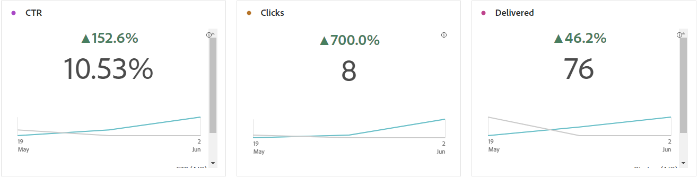

# Relatório de campanha {#campaign-global-report-cja}

>[!BEGINSHADEBOX]

Você pode acessar o relatório de Campanha clicando no botão **[!UICONTROL Relatórios]** da campanha e selecionando **[!UICONTROL Exibir relatório de todos os tempos]**. [Saiba mais](report-gs-cja.md)

>[!ENDSHADEBOX]

## KPIs de campanha {#campaign-kpis}

Os KPIs (Indicadores-chave de desempenho) da **[!UICONTROL Campanha]** funcionam como um painel abrangente, fornecendo uma análise das métricas essenciais associadas à sua campanha. Isso abrange detalhes como a contagem de cliques e o número de mensagens entregues, oferecendo uma insight abrangente na eficiência e no nível de engajamento da campanha.

Os KPIs variam com base nos canais usados em sua campanha.

+++ Saiba mais sobre as métricas de KPIs do Campaign

* **[!UICONTROL Taxa de cliques]**: porcentagem de usuários que interagiram com a mensagem.

* **[!UICONTROL Cliques]**: número de vezes que um conteúdo foi clicado em sua mensagem.

* **[!UICONTROL Entregues]**: número de emails enviados com êxito em relação ao número total de mensagens enviadas.

* **[!UICONTROL Exibições]**: número de vezes que a mensagem foi aberta.

+++

>[!AVAILABILITY]
>As campanhas orquestradas são compatíveis apenas com os canais SMS, Email e Push. Outros canais (no aplicativo, Web, correspondência direta etc.) não estão disponíveis em campanhas orquestradas e não aparecem nos relatórios.

### Visão geral da campanha {#delivery-global}

A tabela **[!UICONTROL Visão geral da campanha]** serve como um painel abrangente, que oferece um detalhamento das principais métricas relacionadas à sua campanha. Isso inclui informações essenciais, como o número de perfis e as ações entregues, fornecendo uma compreensão completa do desempenho e do envolvimento da campanha.

Observe que as métricas variam com base nos canais usados na campanha.

+++ Saiba mais sobre as métricas de visão geral do Campaign

* **[!UICONTROL Pessoas]**: número de perfis de usuário qualificados como perfis de destino para suas mensagens.

* **[!UICONTROL Taxa de cliques]**: porcentagem de usuários que interagiram com a mensagem.

* **[!UICONTROL Cliques]**: número de vezes que um conteúdo foi clicado em sua mensagem.

* **[!UICONTROL Cliques únicos]**: número de perfis que clicaram em um conteúdo em sua mensagem.

* **[!UICONTROL Entregues]**: número de emails enviados com êxito em relação ao número total de mensagens enviadas.

* **[!UICONTROL Rejeições para canais de saída]**: Número total de erros acumulados durante o processo de envio e o processamento automático de retorno em relação ao número total de mensagens enviadas.

* **[!UICONTROL Erros de Saída]**: Número total de erros ocorridos durante o processo de envio que impediram o envio para perfis.

* **[!UICONTROL Exclusões de saída]**: número de perfis excluídos pelo Adobe Journey Optimizer. [Saiba mais sobre como as exclusões são contadas](exclusion-list.md#exclusion-list).

* **[!UICONTROL Exibições]**: número de vezes que a mensagem foi aberta.

* **[!UICONTROL Exibições exclusivas]**: número de vezes que a mensagem foi aberta; várias interações de um perfil não são consideradas.

+++

### Resultados do funil de campanha {#campaign-funnel}

O gráfico de **[!UICONTROL resultados do Campaign funnel]** apresenta uma análise detalhada do engajamento dos seus perfis com as suas mensagens, oferecendo informações valiosas sobre como vários perfis interagiram com o seu conteúdo.

+++ Saiba mais sobre as métricas de resultados do Campaign funnel

* **[!UICONTROL Entregues]**: número de emails enviados com êxito em relação ao número total de mensagens enviadas.

* **[!UICONTROL Cliques]**: número de vezes que um conteúdo foi clicado em sua mensagem.
+++

### Rótulo do link rastreado {#campaign-track}

A tabela **[!UICONTROL Rótulo do link rastreado]** oferece informações essenciais sobre o envolvimento dos visitantes com as URLs incluídas em suas mensagens, fornecendo informações valiosas sobre quais links atraem mais interação.

+++ Saiba mais sobre Métricas de rótulo de link rastreado

* **[!UICONTROL Cliques únicos]**: número de perfis que clicaram em um conteúdo em sua mensagem.

* **[!UICONTROL Cliques]**: número de vezes que um conteúdo foi clicado em sua mensagem.

+++

## Visão geral de direcionamento {#targeting}

Se você configurar **[!UICONTROL Regras de direcionamento]** para o seu conteúdo, a tabela **[!UICONTROL Visão geral do direcionamento]** fornecerá uma exibição detalhada das principais métricas de engajamento, mostrando como os perfis direcionados para cada regra interagiram com seu conteúdo.

➡️ [Saiba mais sobre as regras de direcionamento](../campaigns/optimization-targeting.md)

+++ Saiba mais sobre as métricas da visão geral de direcionamento

* **[!UICONTROL Pessoas]**: número de perfis de usuário qualificados como perfis de destino para seus eventos.

* **[!UICONTROL Cliques únicos]**: número de perfis que clicaram em um conteúdo em um email.

* **[!UICONTROL Taxa de cliques únicos]**: porcentagem de perfis segmentados que clicaram pelo menos uma vez.

+++
