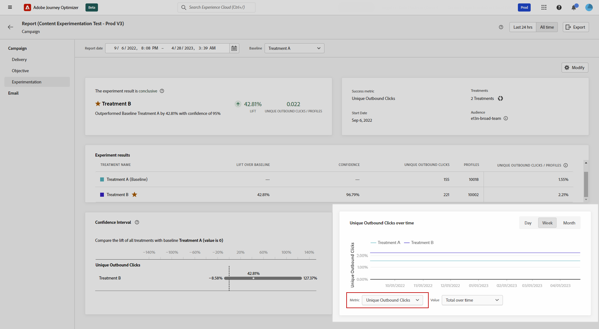
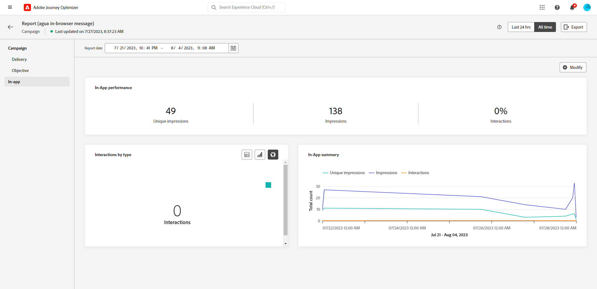

# Relatório global da campanha {#campaign-global-report}

>[!CONTEXTUALHELP]
>id="ajo_campaign_global_report"
>title="Relatório global da campanha"
>abstract="O Relatório global da campanha permite medir o impacto de suas campanhas durante um período selecionado. O relatório é dividido em diferentes widgets detalhando o sucesso e os erros da campanha. Cada painel de relatórios pode ser modificado redimensionando ou removendo widgets."

Relatórios globais, acessíveis pelo **O tempo todo** , exiba eventos que ocorreram há pelo menos duas horas e cubra eventos durante um período selecionado. Em comparação, os Relatórios em tempo real focalizam eventos que ocorreram nas últimas 24 horas, com um intervalo mínimo de dois minutos a partir da ocorrência do evento.

O relatório global da campanha pode ser acessado diretamente do seu Campaign com o **[!UICONTROL Exibir relatório]** botão.

A campanha **[!UICONTROL Relatório global]** será exibida com as seguintes guias:

* [Campaign](#campaign-global)
* [Email](#email-global)
* [No aplicativo](#inapp-global)
* [Push](#push-global)
* [SMS](#sms-global)
* [Web](#web-tab)
* [Correspondência direta](#direct-mail-global)

A campanha **[!UICONTROL Relatório global]** O é dividido em widgets diferentes detalhando o sucesso e os erros da campanha. Cada widget pode ser redimensionado e excluído, se necessário. Para obter mais informações, consulte esta [seção](../reports/global-report.md#modify-dashboard).

Para obter uma lista detalhada de cada métrica disponível no Adobe Journey Optimizer, consulte [esta página](global-report.md#list-of-components-global.md)

## Guia Campanha {#campaign-global}

### Entrega {#delivery-global}

>[!CONTEXTUALHELP]
>id="ajo_campaign_delivery_global"
>title="Estatísticas da campanha"
>abstract="O dispositivo Estatísticas da campanha detalha as principais informações relacionadas à campanha, como perfis inseridos e ações entregues."

A variável **[!UICONTROL Estatísticas da campanha]** o widget detalha as principais informações relacionadas à sua campanha:

* **[!UICONTROL Perfis inseridos]**: Número de perfis que iniciaram a jornada.

* **[!UICONTROL Ações entregues]**: Número total de vezes que uma ação na jornada foi entregue.

* **[!UICONTROL Ações com falha em %]**: Número total de vezes que uma ação falhou na jornada em comparação ao número total de vezes que uma ação foi entregue.

<!--
### Objectives report {#objectives-global}

The **[!UICONTROL Objectives]** tab allows you to better fine-tune your deliveries' reports by targeting one specific metric.

The **[!UICONTROL Objectives]** listed are linked to **[!UICONTROL Datasets]** that define a connection to a system in order to retrieve additional information. A list of built-in **[!UICONTROL Objectives]** is available but you can add your own by adding new **[!UICONTROL Dataset]**. For the detailed procedure, refer to this [section](../campaigns/reporting-configuration.md).

After selecting the Objectives you want to target on, the two **[!UICONTROL Performance overview]** and **[!UICONTROL Campaign objective]** widgets will provide a detailed summary of your delivery performance. 

With the **[!UICONTROL Campaign objective]** widget, you can also choose to compare your main objective with another metric.
-->

### Relatório de experimentação {#experimentation-global}

>[!CONTEXTUALHELP]
>id="ajo_campaigns_content_experiment_click"
>title="Métrica de sucesso"
>abstract="O valor total da métrica sucesso, anteriormente selecionado ao criar seus experimentos, dividido pelo número de perfis."

A variável **[!UICONTROL Experimentação]** A guia fornece informações importantes sobre o desempenho de cada variante e identifica a mais bem-sucedida.

Observe que a definição do melhor desempenho pode levar algum tempo. Ela será representada por esse ícone .

+++Saiba mais sobre as diferentes métricas e widgets disponíveis para o relatório Experimentação.

A variável **[!UICONTROL Resultado do experimento]** o widget detalha o desempenho de cada variante. Você pode alterar sua linha de base selecionando um dos tratamentos nas **[!UICONTROL Linha de base]** o menu suspenso. O melhor tratamento será representado com um ícone de estrela.

A tabela apresenta as seguintes métricas:

* **[!UICONTROL Aumento sobre a linha de base]**: Medida da melhora da porcentagem na taxa de conversão de um determinado tratamento em relação à linha de base.

* **[!UICONTROL Confiança]**: Evidência de que um determinado tratamento é igual ao tratamento inicial. [Saiba mais](../campaigns/experiment-calculations.md#understand-confidence)

* **[!UICONTROL Cliques de saída únicos]**: Contagem total de cliques nos canais de saída.

* **[!UICONTROL Perfis]**: Número de perfis direcionados para este tratamento.

* **[!UICONTROL Cliques/perfis de saída únicos]**: Valor total da métrica de Sucesso, selecionada anteriormente ao criar seus Experimentos, dividido pelo número de perfis.

A variável **[!UICONTROL Intervalo de confiança]** O gráfico mede a incerteza em torno da melhoria. Ela detalha a diferença percentual de desempenho entre a linha de base e o tratamento com melhor desempenho. [Saiba mais](../campaigns/experiment-calculations.md#confidence-intervals).

O último widget fornece dados relacionados ao **[!UICONTROL Métrica de sucesso]** você selecionou anteriormente para os tratamentos. Você tem a opção de selecionar uma métrica direcionada diferente da variável **[!UICONTROL Métrica]** menu suspenso para rastrear dados alternativos.

>[!CAUTION]
>
>Ao trabalhar com métricas filtradas de experimentação, observe que alterar a seleção de Métrica do menu suspenso na página de comparação para experimentação não manterá o valor do filtro. Por exemplo, alternar de &quot;Cliques&quot; para &quot;Cliques únicos&quot; levará à perda do filtro aplicado, tornando a comparação imprecisa ou inválida.

+++

Para aprofundar esses resultados e como interpretá-los, consulte [esta página](../campaigns/get-started-experiment.md#interpret-results).

## Guia Email {#email-global}

>[!CONTEXTUALHELP]
>id="ajo_campaign_global_email_sending_statistics"
>title="Email: estatísticas de envio"
>abstract="A tabela “Email: estatísticas de envio” resume dados essenciais sobre o email, como se ele foi direcionado ou entregue."

>[!CONTEXTUALHELP]
>id="ajo_campaign_global_email_tracking_statistics"
>title="Email: estatísticas de rastreamento"
>abstract="A tabela “Email: estatísticas de rastreamento” fornece dados sobre atividades de perfil do email."

>[!CONTEXTUALHELP]
>id="ajo_campaign_global_email_sending_performance"
>title="Email: desempenho de envio"
>abstract="O gráfico “Email: desempenho de envio” apresenta dados abrangentes sobre emails enviados, oferecendo insights acerca de métricas principais, como entregas e rejeições, o que permite uma análise detalhada do processo de entrega de email."

>[!CONTEXTUALHELP]
>id="ajo_campaign_global_email_bounce_categories"
>title="Email: categorias de rejeição"
>abstract="A tabela “Email: categorias de rejeição” e seus gráficos fornecem dados sobre erros temporários e permanentes."

>[!CONTEXTUALHELP]
>id="ajo_campaign_global_email_bounce_reasons"
>title="Email: motivos de rejeições"
>abstract="A tabela “Email: motivos de rejeições” e seus gráficos contêm dados relacionados às mensagens rejeitadas."

>[!CONTEXTUALHELP]
>id="ajo_campaign_global_email_error_reasons"
>title="Email: motivos de erro"
>abstract="A tabela “Email: motivos de erro” e seus gráficos permitem identificar os erros específicos que ocorreram durante o processo de envio."

>[!CONTEXTUALHELP]
>id="ajo_campaign_global_email_excluded_reasons"
>title="Email: motivos de exclusão"
>abstract="A tabela “Motivos de exclusão” e seus gráficos ilustram os vários fatores que levaram perfis de usuário excluídos do público-alvo a não receberem a mensagem."

>[!CONTEXTUALHELP]
>id="ajo_campaign_global_email_top_url"
>title="Email: URL principal"
>abstract="A tabela “Email: URL principal” e seu gráfico oferecem uma visão geral abrangente dos URLs do email que recebem o maior tráfego de visitantes, permitindo identificar os links mais populares."

>[!CONTEXTUALHELP]
>id="ajo_campaign_global_email_best_recipient"
>title="Email: melhor domínio do destinatário"
>abstract="A tabela “Email: melhor domínio do destinatário” e seu gráfico fornecem um detalhamento dos domínios que os destinatários usam com mais frequência para abrir o email, oferecendo insights valiosos sobre o comportamento do destinatário."

Da sua campanha **[!UICONTROL Relatório global]**, o **[!UICONTROL E-mail]** A guia detalha as principais informações relativas aos deliveries de email enviados no Campaign.

+++Saiba mais sobre as diferentes métricas e widgets disponíveis para o Relatório de email.

A variável **[!UICONTROL Estatísticas de envio de email]** o gráfico detalha o sucesso do seu email:

* **[!UICONTROL Direcionado]**: Número total de mensagens processadas durante o processo de envio.

* **[!UICONTROL Enviado]**: Número total de envios para o seu email.

* **[!UICONTROL Entregue]**: Número de mensagens enviadas com êxito em relação ao número total de mensagens enviadas.

* **[!UICONTROL Taxa de entrega]**: Porcentagem de mensagens enviadas com êxito.

* **[!UICONTROL Rejeições]**: Total de erros acumulados durante o processo de envio e o processamento de retorno automático em relação ao número total de mensagens enviadas.

* **[!UICONTROL Taxa de rejeição]**: porcentagem de emails que foram rejeitados em comparação aos emails enviados.

* **[!UICONTROL Erros]**: Número total de erros que ocorreram durante o processo de envio, impedindo que ele fosse enviado para perfis.

* **[!UICONTROL Taxa de erro]**: Porcentagem de erros que ocorreram durante o processo de envio, impedindo que ele fosse enviado, em comparação aos emails enviados.

* **[!UICONTROL Tentativas]**: Número de emails na fila para tentativas.

* **[!UICONTROL Excluído]**: Número de perfis excluídos pelo Adobe Journey Optimizer.

A variável **[!UICONTROL Email - Estatísticas de rastreamento]** O widget contém os dados disponíveis para a atividade de perfil do seu email:

* **[!UICONTROL Aberturas]**: Número de vezes que o email foi aberto.

* **[!UICONTROL Aberturas únicas]**: porcentagem de emails abertos.

* **[!UICONTROL Taxa de abertura]**: número total de emails abertos em comparação ao número de emails entregues.

* **[!UICONTROL Cliques]**: Número de vezes que um conteúdo foi clicado em um email.

* **[!UICONTROL Cliques únicos]**: Número de perfis que clicaram em um conteúdo em um email.

* **[!UICONTROL Taxa de cliques únicos]**: Porcentagem de usuários que interagiram com seu email.

* **[!UICONTROL Cancelamentos de assinatura]**: Número de cliques no link unsubscription.

* **[!UICONTROL Reclamações de spam]**: Número de vezes que uma mensagem foi declarada como spam ou lixo eletrônico.

A variável **[!UICONTROL Desempenho de envio]** O gráfico contém os dados disponíveis para emails enviados, como:

* **[!UICONTROL Entregue]**: Número de mensagens enviadas com êxito em relação ao número total de mensagens enviadas.

* **[!UICONTROL Rejeições]**: Total de erros acumulados durante o processo de envio e o processamento de retorno automático em relação ao número total de mensagens enviadas.

* **[!UICONTROL Tentativas]**: Número de emails na fila para tentativas.

* **[!UICONTROL Erros]**: Número total de erros que ocorreram durante o processo de envio, impedindo que ele fosse enviado para perfis.

A variável **[!UICONTROL Motivos de rejeição]** e **[!UICONTROL Categorias de rejeição]** os widgets contêm os dados disponíveis relacionados às mensagens rejeitadas, como:

* **[!UICONTROL Rejeição permanente]**: o número total de erros permanentes, como um endereço de email incorreto. Isso envolve uma mensagem de erro que declara explicitamente que o endereço é inválido, como Usuário desconhecido.

* **[!UICONTROL Rejeição leve]**: o número total de erros temporários, como uma caixa de entrada cheia.

* **[!UICONTROL Ignorado]**: o número total de temporários, como Ausência temporária, ou um erro técnico, por exemplo, se o tipo de remetente for postmaster.

Para obter mais informações sobre rejeições, consulte o [Lista de supressão](../reports/suppression-list.md) página.

A variável **[!UICONTROL Motivos de erro]** o gráfico e a tabela permitem que você veja qual erro ocorreu durante o processo de envio.

A variável **[!UICONTROL Motivos excluídos]** o gráfico e a tabela exibem os diferentes motivos que impediram os perfis de usuário, excluídos dos perfis direcionados, de receber a mensagem.

A variável **[!UICONTROL Email - URL superior]** gráfico e tabela detalha quais URLs do seu email são os mais visitados.

A variável **[!UICONTROL Email - Principal domínio de destinatário]** O gráfico e a tabela detalham quais domínios são os mais usados pelos perfis para abrir o email.

>[!CAUTION]
>
> A variável **[!UICONTROL Email - Principal domínio de destinatário]** O widget tem uma taxa de precisão de 99,95%.

A variável **[!UICONTROL Otimizado vs. não otimizado]** o gráfico detalha as principais informações relativas à mensagem, sejam elas otimizadas ou não:

* **[!UICONTROL Enviado]**: número total de envios.

* **[!UICONTROL Aberturas]**: Número de vezes que a mensagem foi aberta.

* **[!UICONTROL Cliques]**: Número de vezes que um conteúdo foi clicado em um email.

A variável **[!UICONTROL Otimização da hora de envio]** detalha o sucesso do seu email dependendo do método de envio: otimizado ou normal.

* **[!UICONTROL Entregue]**: Número de mensagens enviadas com êxito em relação ao número total de mensagens enviadas.

* **[!UICONTROL Rejeições]**: Total de erros acumulados durante o processo de envio e o processamento de retorno automático em relação ao número total de mensagens enviadas.

>[!NOTE]
>
>A variável **[!UICONTROL Otimizado vs. não otimizado]** e **[!UICONTROL Otimização da hora de envio]**  Os widgets do só estarão disponíveis se a opção Otimização de tempo de envio estiver ativada para o seu email. Para obter mais informações sobre a Otimização de tempo de envio, consulte [esta página](../building-journeys/journeys-message.md#send-time-optimization).

+++

## Guia No aplicativo {#inapp-global}

>[!CONTEXTUALHELP]
>id="ajo_campaign_global_inapp_performance"
>title="Desempenho no aplicativo"
>abstract="Os KPIs de desempenho no aplicativo fornecem insights essenciais sobre o engajamento de visitantes com as mensagens no aplicativo."

>[!CONTEXTUALHELP]
>id="ajo_campaign_global_inapp_interactions"
>title="Interações por tipo"
>abstract="A tabela “Interações por tipo” e seus gráficos detalham como usuários interagiram com a mensagem no aplicativo por meio do rastreamento de cliques, mensagens ignoradas ou interações."

>[!CONTEXTUALHELP]
>id="ajo_campaign_global_inapp_summary"
>title="Resumo no aplicativo"
>abstract="O gráfico “Resumo no aplicativo” ilustra a progressão das impressões e interações no aplicativo durante o período especificado."

Da sua campanha **[!UICONTROL Relatório global]**, o **[!UICONTROL No aplicativo]** A guia detalha as principais informações relativas aos deliveries no aplicativo enviados em sua campanha.

+++Saiba mais sobre as diferentes métricas e widgets disponíveis para o relatório No aplicativo.

A variável **[!UICONTROL Desempenho no aplicativo]** Os KPIs detalham as principais informações relativas ao envolvimento dos visitantes com as mensagens no aplicativo, como:

* **[!UICONTROL Impressões exclusivas]**: número de usuários únicos para os quais a mensagem no aplicativo foi entregue.

* **[!UICONTROL Impressões]**: número total de mensagens no aplicativo entregues a todos os usuários.

* **[!UICONTROL Taxa de interações]**: porcentagem de envolvimentos com a mensagem no aplicativo. Isso inclui qualquer ação realizada pelos usuários, como cliques, rejeições ou quaisquer outras interações.

A variável **[!UICONTROL Interações por tipo]** os gráficos e tabelas detalham como os usuários interagiram com a mensagem no aplicativo rastreando qualquer clique, descarte ou interação.

A variável **[!UICONTROL Resumo no aplicativo]** O gráfico mostra a evolução de suas impressões e interações no aplicativo para o período relacionado.
+++

## Guia Notificação por push {#push-global}

>[!CONTEXTUALHELP]
>id="ajo_campaign_global_push_sending_statistics"
>title="Notificações por push: estatísticas de envio"
>abstract="A tabela “Notificações por push: estatísticas de envio” resume dados essenciais sobre notificações por push, como mensagens direcionadas ou entregues."

>[!CONTEXTUALHELP]
>id="ajo_campaign_global_push_tracking_statistics"
>title="Notificações por push: estatísticas de rastreamento"
>abstract="As “Estatísticas de rastreamento de push” fornecem dados sobre as atividades de perfil das notificações por push."

>[!CONTEXTUALHELP]
>id="ajo_campaign_global_push_sending_summary"
>title="Notificações por push: resumo de envio"
>abstract="O gráfico “Notificações por push: resumo de envio” exibe os dados disponíveis para notificações por push enviadas."

>[!CONTEXTUALHELP]
>id="ajo_campaign_global_push_excluded_reasons"
>title="Notificações por push: motivos de exclusão"
>abstract="A tabela “Motivos de exclusão” e seus gráficos ilustram os vários fatores que levaram perfis de usuário excluídos do público-alvo a não receberem a mensagem."

>[!CONTEXTUALHELP]
>id="ajo_campaign_global_push_error_reasons"
>title="Notificações por push: motivos de erro"
>abstract="A tabela “Motivos de erro” e seus gráficos permitem identificar os erros específicos que ocorreram durante o processo de envio."

>[!CONTEXTUALHELP]
>id="ajo_campaign_global_push_breakdown_platform"
>title="Notificações por push: detalhamento por plataforma"
>abstract="A tabela “Detalhamento por plataforma” e seus gráficos fornecem uma análise do sucesso das notificações por push baseada no sistema operacional do perfil."

Da sua campanha **[!UICONTROL Relatório global]**, o **[!UICONTROL Notificação por push]** A guia detalha as principais informações relativas aos deliveries por push enviados em sua campanha.

Os KPIs de desempenho no aplicativo detalham as principais informações relativas ao envolvimento dos visitantes com as mensagens no aplicativo.

+++Saiba mais sobre as diferentes métricas e widgets disponíveis para o relatório Push.

A variável **[!UICONTROL Notificação por push - Estatísticas de envio]** a tabela detalha as principais informações relativas às notificações por push

* **[!UICONTROL Direcionado]**: Número total de mensagens processadas durante a análise.

* **[!UICONTROL Enviado]**: número total de envios para a notificação por push.

* **[!UICONTROL Entregue]**: Número de mensagens enviadas com êxito em relação ao número total de mensagens enviadas.

* **[!UICONTROL Taxa de entrega]**: Porcentagem de mensagens enviadas com êxito.

* **[!UICONTROL Rejeições]**: Total de erros acumulados durante o processo de envio e o processamento de retorno automático em relação ao número total de mensagens enviadas.

* **[!UICONTROL Taxa de rejeição]**: Porcentagem de notificações por push que foram rejeitadas em comparação às notificações por push enviadas.

* **[!UICONTROL Erros]**: Número total de erros que ocorreram que impediram o envio para perfis.

* **[!UICONTROL Taxa de erro]**: Porcentagem de erros que ocorreram durante a prevenção do envio em comparação às notificações por push enviadas.

* **[!UICONTROL Excluído]**: Número de perfis excluídos pelo Adobe Journey Optimizer.

A variável **[!UICONTROL Push - Estatísticas de rastreamento]** contém os dados disponíveis para a atividade de perfil para sua notificação por push:

* **[!UICONTROL Aberturas]**: Número de vezes que sua notificação por push foi aberta.

* **[!UICONTROL Taxa de abertura]**: porcentagem de notificações por push abertas.

* **[!UICONTROL Ações]**: Número total de ações na notificação por push entregue, por exemplo, clique ou descarte de botões.

* **[!UICONTROL Envolvimentos]**: Número total de aberturas e ações para esta notificação por push, ou seja, se o perfil abriu o push ou se um botão foi clicado.

* **[!UICONTROL Taxa de participação]**: Porcentagem de aberturas e ações para essa notificação por push, ou seja, se o perfil abriu o push ou se um botão foi clicado.

A variável **[!UICONTROL Resumo da notificação por push]** O gráfico contém os dados disponíveis para notificações por push enviadas, como:

* **[!UICONTROL Aberturas]**: Número de vezes que sua notificação por push foi aberta.

* **[!UICONTROL Ações]**: Número total de ações na notificação por push entregue, por exemplo, clique ou descarte de botões.

* **[!UICONTROL Rejeições]**: Total de erros acumulados e processamento de retorno automático em relação ao número total de mensagens enviadas.

* **[!UICONTROL Entregue]**: Número de mensagens enviadas com êxito em relação ao número total de mensagens enviadas.

* **[!UICONTROL Erros]**: Número total de erros que ocorreram que impediram o envio para perfis.

>[!NOTE]
>
>A variável **[!UICONTROL Otimizado vs. não otimizado]** e **[!UICONTROL Otimização da hora de envio]**  Os widgets do só estarão disponíveis se a opção Otimização de tempo de envio estiver ativada para a notificação por push. Para obter mais informações sobre a Otimização de tempo de envio, consulte [esta página](../building-journeys/journeys-message.md#send-time-optimization).

A variável **[!UICONTROL Otimizado vs. não otimizado]** o gráfico detalha as principais informações relativas à mensagem, sejam elas otimizadas ou não:

* **[!UICONTROL Entregue]**: Número de mensagens enviadas com êxito em relação ao número total de mensagens enviadas.

* **[!UICONTROL Aberturas]**: Número de vezes que sua notificação por push foi aberta.

* **[!UICONTROL Ações]**: Número total de ações na notificação por push entregue, por exemplo, clique ou descarte de botões.

A variável **[!UICONTROL Otimização da hora de envio]** detalha o sucesso da sua notificação por push, dependendo do método de envio: otimizado ou normal.

* **[!UICONTROL Entregue]**: Número de mensagens enviadas com êxito em relação ao número total de mensagens enviadas.

* **[!UICONTROL Rejeições]**: Total de erros acumulados durante o processo de envio e o processamento de retorno automático em relação ao número total de mensagens enviadas.

A variável **[!UICONTROL Motivos de erro]** os gráficos e a tabela permitem que você veja qual erro ocorreu.

A variável **[!UICONTROL Motivos excluídos]** os gráficos e a tabela exibem os diferentes motivos que impediram os perfis de usuário, excluídos dos perfis direcionados, de receber a mensagem.

A variável **[!UICONTROL Detalhamento por plataforma]** O gráfico e a tabela detalham o sucesso da sua notificação por push, dependendo do sistema operacional do seu perfil.
+++

## Guia SMS {#sms-global}

>[!CONTEXTUALHELP]
>id="ajo_campaign_global_sms_sending_statistics"
>title="SMS: estatísticas de envio"
>abstract="A tabela “SMS: estatísticas de envio” resume dados essenciais sobre as mensagens SMS, como mensagens direcionadas ou entregues."

>[!CONTEXTUALHELP]
>id="ajo_campaign_global_sms_error_reasons"
>title="SMS: motivos de erro"
>abstract="A tabela “SMS: motivos de erro” e seus gráficos permitem identificar os erros específicos que ocorreram durante o processo de envio."

>[!CONTEXTUALHELP]
>id="ajo_campaign_global_sms_performance"
>title="SMS: desempenho por data"
>abstract="O dispositivo “SMS: desempenho por data” fornece informações importantes sobre as mensagens por meio de uma representação gráfica."

>[!CONTEXTUALHELP]
>id="ajo_campaign_global_sms_excluded_reasons"
>title="SMS: motivos de exclusão"
>abstract="A tabela “Motivos de exclusão” e seus gráficos ilustram os vários fatores que levaram perfis de usuário excluídos do público-alvo a não receberem a mensagem."

>[!CONTEXTUALHELP]
>id="ajo_campaign_global_sms_bounces_reasons"
>title="SMS: motivos de rejeições"
>abstract="A tabela “Motivos de rejeições” e seus gráficos contêm dados relacionados às mensagens rejeitadas."

>[!CONTEXTUALHELP]
>id="ajo_campaign_global_sms_clicks_links"
>title="SMS: cliques por link"
>abstract="O dispositivo “SMS: cliques por link” fornece insights essenciais sobre o engajamento de visitantes com os URLs nas mensagens"

Da sua campanha **[!UICONTROL Relatório global]**, o **[!UICONTROL SMS]** A guia detalha as principais informações relativas aos deliveries de SMS enviados em sua campanha.

+++Saiba mais sobre as diferentes métricas e widgets disponíveis para o relatório de SMS.

A variável **[!UICONTROL SMS - Estatísticas de envio]** A tabela detalha o sucesso da mensagem SMS:

* **[!UICONTROL Direcionado]**: Número de perfis de usuário qualificados como perfis de público-alvo.

* **[!UICONTROL Excluído]**: Número de perfis de usuário, excluídos dos perfis direcionados, que não receberam a mensagem.

* **[!UICONTROL Enviado]**: Número total de envios para sua mensagem SMS.

* **[!UICONTROL Rejeições]**: Total de erros acumulados durante o processo de envio e o processamento de retorno automático em relação ao número total de mensagens enviadas.

* **[!UICONTROL Erros]**: Número total de erros que ocorreram que impediram o envio para perfis.

A variável **[!UICONTROL Desempenho do SMS por data]** o widget detalha as principais informações relacionadas à sua mensagem com um gráfico:

* **[!UICONTROL Enviado]**: Número total de envios para suas mensagens SMS.

* **[!UICONTROL Rejeições]**: Total de erros acumulados durante o processo de envio e o processamento de retorno automático em relação ao número total de mensagens enviadas.

* **[!UICONTROL Erros]**: Número total de erros que ocorreram que impediram o envio para perfis.

A variável **[!UICONTROL Excluir motivos]** e **[!UICONTROL Motivos de rejeições]** e **[!UICONTROL Motivos de erro]** gráficos e tabelas permitem ver quais erros e exclusões ocorreram durante o processo de envio.

A variável **[!UICONTROL SMS - Cliques por links]** Os widgets detalham as principais informações relacionadas ao engajamento dos visitantes com seus URLs.

+++

## Guia Web {#web-tab}

>[!CONTEXTUALHELP]
>id="ajo_campaign_global_web_performance"
>title="Desempenho na Web"
>abstract="Os KPIs de desempenho na Web fornecem informações abrangentes sobre o engajamento de visitantes com as experiências da Web."

>[!CONTEXTUALHELP]
>id="ajo_campaign_global_web_summary"
>title="Resumo da Web"
>abstract="O gráfico “Resumo da Web” ilustra a progressão das experiências da Web, incluindo impressões, impressões únicas e interações, durante o período especificado."

>[!CONTEXTUALHELP]
>id="ajo_campaign_global_web_interactions"
>title="Interações por elemento"
>abstract="A tabela “Interações por elemento” fornece informações importantes sobre o engajamento de visitantes com diferentes elementos em suas páginas da Web."

Da sua campanha **[!UICONTROL Relatório global]**, o **[!UICONTROL Web]** A guia detalha as informações principais relativas às páginas da Web.

+++Saiba mais sobre as diferentes métricas e widgets disponíveis para o relatório da Web.

A variável **[!UICONTROL Desempenho da Web]** Os KPIs detalham as principais informações relativas ao envolvimento dos visitantes com as experiências da Web, como:

* **[!UICONTROL Impressões exclusivas]**: número de usuários únicos a quem a experiência da web foi entregue.

* **[!UICONTROL Impressões]**: número total de experiências da web entregues a todos os usuários.

* **[!UICONTROL Taxa de interação]**: porcentagem de envolvimentos com a página da Web. Isso inclui qualquer ação realizada pelos usuários, como cliques ou quaisquer outras interações.

A variável **[!UICONTROL Resumo da Web]** o gráfico mostra a evolução de suas experiências da web (impressões, impressões exclusivas e interações) para o período relacionado.

A variável **[!UICONTROL Interações por elemento]** A tabela detalha as principais informações relativas ao envolvimento dos visitantes com os vários elementos em suas páginas da web.
+++

## Guia Correspondência direta {#direct-mail-global}

>[!CONTEXTUALHELP]
>id="ajo_campaign_global_direct_sending_statistics"
>title="Correspondência direta: estatísticas de envio"
>abstract="A tabela “Correspondência direta: estatísticas de envio” resume dados essenciais sobre mensagens de correspondência direta, como mensagens direcionadas ou entregues."

>[!CONTEXTUALHELP]
>id="ajo_campaign_global_direct_error_reasons"
>title="Correspondência direta: motivos de erro"
>abstract="A tabela “Correspondência direta: motivos de erro” e seus gráficos permitem identificar os erros específicos que ocorreram durante o processo de envio."

>[!CONTEXTUALHELP]
>id="ajo_campaign_global_direct_excluded_reasons"
>title="Correspondência direta: motivos de exclusão"
>abstract="A tabela “Correspondência direta: motivos de exclusão” e seus gráficos ilustram os vários fatores que levaram perfis de usuário excluídos do público-alvo a não receberem a mensagem."

Da sua campanha **[!UICONTROL Relatório global]**, o **[!UICONTROL Correspondência direta]** A guia detalha as principais informações relacionadas aos deliveries de correspondência direta.

+++Saiba mais sobre as diferentes métricas e widgets disponíveis para o Relatório de correspondência direta.

A variável **[!UICONTROL Correspondência direta - Estatísticas de envio]** a tabela detalha o sucesso da sua correspondência direta:

* **[!UICONTROL Direcionado]**: Número de perfis de usuário qualificados como perfis de público alvo para esta correspondência direta.

* **[!UICONTROL Enviado]**: Número total de envios para esta correspondência direta.

* **[!UICONTROL Erros]**: Número total de erros que ocorreram durante o processo de envio, impedindo que ele fosse enviado para perfis.

* **[!UICONTROL Excluído]**: Número de perfis de usuário, excluídos dos perfis direcionados, que não receberam sua correspondência direta.

A variável **[!UICONTROL Correspondência direta - Motivos excluídos]** e **[!UICONTROL Correspondência direta - Motivos de erro]** gráficos e tabelas permitem ver quais erros e exclusões ocorreram durante o processo de envio.
+++

## Recursos adicionais

* [Introdução às campanhas](../campaigns/get-started-with-campaigns.md)
* [Criar uma campanha](../campaigns/create-campaign.md)
* [Criar campanhas acionadas por API](../campaigns/api-triggered-campaigns.md)
* [Modificar ou interromper uma campanha](../campaigns/modify-stop-campaign.md)
* [Relatório em tempo real da campanha](campaign-live-report.md)
