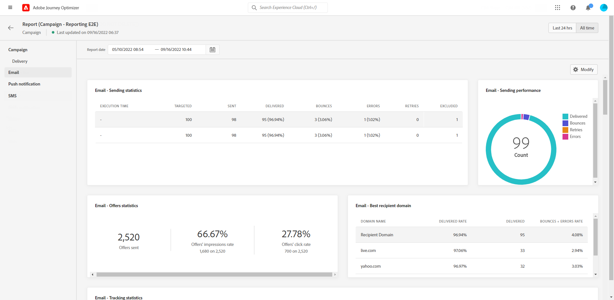

# Relatório global da campanha {#campaign-global-report}

O relatório Campaign Global pode ser acessado diretamente de sua Campanha com a **[!UICONTROL Todo o tempo]** botão.

A campanha **[!UICONTROL Relatório global]** será exibida com as seguintes guias:

* [Campaign](#campaign-global)
* [Email](#email-global)
* [Push](#push-global)
* [SMS](#sms-global)

A campanha **[!UICONTROL Relatório global]** O é dividido em diferentes widgets detalhando o sucesso e os erros da campanha. Cada widget pode ser redimensionado e excluído, se necessário. Para obter mais informações sobre isso, consulte esta seção [seção](../reports/global-report.md#modify-dashboard).

Para obter uma lista detalhada de todas as métricas disponíveis no Adobe Journey Optimizer, consulte [esta página](global-report.md#list-of-components-global.md)

## Guia Campaign {#campaign-global}

### Entrega {#delivery-global}

O **[!UICONTROL Estatísticas da campanha]** o widget detalha as informações principais relativas à sua campanha:

* **[!UICONTROL Perfis inseridos]**: Número de perfis que iniciaram a jornada.

* **[!UICONTROL Ações entregues]**: Número total de vezes únicas que uma ação na jornada foi entregue.

* **[!UICONTROL As ações falharam em %]**: Número total de vezes exclusivas que uma ação falhou na jornada em comparação ao número total de vezes exclusivas que uma ação foi entregue.

## Guia Email {#email-global}

Da sua campanha **[!UICONTROL Relatório global]**, o **[!UICONTROL Email]** detalha as informações principais relativas aos deliveries de email enviados no Campaign.

+++Saiba mais sobre as diferentes métricas e widgets disponíveis para o relatório de email.

O **[!UICONTROL Email Sending Statistics]** gráfico detalha o sucesso do seu delivery:

* **[!UICONTROL Direcionado]**: Número total de mensagens processadas durante a análise de delivery.

* **[!UICONTROL Enviado]**: Número total de envios para o delivery.

* **[!UICONTROL Entregue]**: Número de mensagens enviadas com êxito em relação ao número total de mensagens enviadas.

* **[!UICONTROL Taxa de entrega]**: Porcentagem de mensagens enviadas com êxito.

* **[!UICONTROL Rejeições]**: Total de erros acumulados durante o delivery e o processamento automático de retorno em relação ao número total de mensagens enviadas.

* **[!UICONTROL Taxa de rejeição]**: Porcentagem de emails que retornaram em comparação aos emails enviados.

* **[!UICONTROL Erros]**: Número total de erros que ocorreram durante um delivery, impedindo que ele fosse enviado a perfis.

* **[!UICONTROL Taxa de erro]**: Porcentagem de erros que ocorreram durante um delivery e impediram seu envio em comparação aos emails enviados.

* **[!UICONTROL Tentativas]**: Número de emails na fila para novas tentativas.

* **[!UICONTROL Excluído]**: Número de perfis que foram excluídos pelo Adobe Journey Optimizer.

O **[!UICONTROL Email - Estatísticas de rastreamento]** O widget contém os dados disponíveis para a atividade do recipient para o seu delivery:

* **[!UICONTROL Abre]**: Número de vezes que o delivery foi aberto em um delivery.

* **[!UICONTROL Aberturas únicas]**: Porcentagem de deliveries abertos.

* **[!UICONTROL Taxa de abertura]**: Número total de emails abertos em comparação ao número de emails entregues.

* **[!UICONTROL Cliques]**: Número de vezes que um conteúdo foi clicado em um email.

* **[!UICONTROL Cliques únicos]**: Número de recipients que clicaram em um conteúdo em um email.

* **[!UICONTROL Taxa de cliques exclusiva]**: Porcentagem de usuários que interagiram com o delivery.

* **[!UICONTROL Cancelamentos de assinatura]**: Número de cliques no link unsubscription.

* **[!UICONTROL Reclamações de spam]**: Número de vezes que uma mensagem foi declarada como spam ou lixo eletrônico.

O **[!UICONTROL Envio de estatísticas]** O gráfico contém os dados disponíveis para emails enviados, como:

* **[!UICONTROL Entregue]**: Número de mensagens enviadas com êxito em relação ao número total de mensagens enviadas.

* **[!UICONTROL Rejeições]**: Total de erros acumulados durante o delivery e o processamento automático de retorno em relação ao número total de mensagens enviadas.

* **[!UICONTROL Tentativas]**: Número de emails na fila para novas tentativas.

* **[!UICONTROL Erros]**: Número total de erros que ocorreram durante um delivery, impedindo que ele fosse enviado a perfis.

O **[!UICONTROL Motivos da rejeição]** e **[!UICONTROL Categorias de rejeição]** os widgets contêm os dados disponíveis relacionados às mensagens devolvidas, como:

* **[!UICONTROL Rejeição permanente]**: O número total de erros permanentes, como um endereço de email incorreto. Isso envolve uma mensagem de erro que declara explicitamente que o endereço é inválido, como Unknown user.

* **[!UICONTROL Rejeição suave]**: O número total de erros temporários, como uma caixa de entrada cheia.

* **[!UICONTROL Ignorado]**: O número total de temporários, como Ausência temporária, ou um erro técnico, por exemplo, se o tipo de remetente for postmaster.

Para obter mais informações sobre devoluções, consulte [Lista de supressão](../reports/suppression-list.md) página.

O **[!UICONTROL Motivos do erro]** gráfico e tabela permitem ver qual erro ocorreu durante o delivery.

O **[!UICONTROL Motivos excluídos]** gráfico e tabela exibem os diferentes motivos que impediam os perfis de usuário, excluídos dos perfis segmentados, de receber a mensagem.

O **[!UICONTROL Email - Url Superior]** gráfico e tabela detalham quais URLs do seu delivery são os mais visitados.

O **[!UICONTROL Email - Domínio do recipient principal]** gráfico e tabela detalham quais domínios são os mais usados pelos recipients para abrir o email.

>[!NOTE]
>
>O **[!UICONTROL Otimizado vs não otimizado]** e **[!UICONTROL Enviar otimização de tempo]**  os widgets só estarão disponíveis se a opção Send-Time Otimization estiver ativada para o seu delivery. Para obter mais informações sobre Otimização de tempo de envio, consulte [esta página](../messages/send-time-optimization.md).

O **[!UICONTROL Otimizado vs não otimizado]** O gráfico detalha as informações principais relativas à sua mensagem, sejam elas otimizadas ou não:

* **[!UICONTROL Enviado]**: Número total de envios para o delivery.
* **[!UICONTROL Abre]**: Número de vezes que o delivery foi aberto em um delivery.
* **[!UICONTROL Cliques]**: Número de vezes que um conteúdo foi clicado em um email.

O **[!UICONTROL Enviar otimização de tempo]** detalha o sucesso do delivery, dependendo do método de envio: otimizado ou normal.

* **[!UICONTROL Entregue]**: Número de mensagens enviadas com êxito em relação ao número total de mensagens enviadas.
* **[!UICONTROL Rejeições]**: Total de erros acumulados durante o delivery e o processamento automático de retorno em relação ao número total de mensagens enviadas.
+++

## Guia Notificação por push {#push-global}

Da sua campanha **[!UICONTROL Relatório global]**, o **[!UICONTROL Notificação por push]** detalha as informações principais relativas aos deliveries por push enviados na campanha.

+++Saiba mais sobre as diferentes métricas e widgets disponíveis para o relatório de push.

O **[!UICONTROL Notificação por push - Envio de estatísticas]** A tabela detalha as principais informações relativas às suas notificações por push com gráficos e KPIs:

* **[!UICONTROL Direcionado]**: Número total de mensagens processadas durante a análise de delivery.

* **[!UICONTROL Enviado]**: Número total de envios para o delivery.

* **[!UICONTROL Entregue]**: Número de mensagens enviadas com êxito em relação ao número total de mensagens enviadas.

* **[!UICONTROL Taxa de entrega]**: Porcentagem de mensagens enviadas com êxito.

* **[!UICONTROL Rejeições]**: Total de erros acumulados durante o delivery e o processamento automático de retorno em relação ao número total de mensagens enviadas.

* **[!UICONTROL Taxa de rejeição]**: Porcentagem de notificações por push que rejeição em comparação às notificações por push enviadas.

* **[!UICONTROL Erros]**: Número total de erros que ocorreram durante um delivery, impedindo que ele fosse enviado a perfis.

* **[!UICONTROL Taxa de erro]**: Porcentagem de erros que ocorreram durante um delivery e impediram seu envio em comparação ao envio de notificações por push.

* **[!UICONTROL Excluído]**: Número de perfis que foram excluídos pelo Adobe Journey Optimizer.

O **[!UICONTROL Push - Estatísticas de rastreamento]** contém os dados disponíveis para a atividade do recipient para o delivery:

* **[!UICONTROL Abre]**: Número de vezes que uma mensagem foi aberta em um delivery.

* **[!UICONTROL Taxa de abertura]**: Porcentagem de notificações por push abertas.

* **[!UICONTROL Ações]**: Número total de ações na notificação por push entregue, por exemplo, clique no botão ou descarta.

* **[!UICONTROL Envolvimentos]**: Número total de aberturas e ações para essa notificação por push, ou seja, se o perfil abriu o push ou se um botão foi clicado.

* **[!UICONTROL Taxa de participação]**: Porcentagem de aberturas e ações para essa notificação por push, ou seja, se o perfil abriu o push ou se um botão foi clicado.

O **[!UICONTROL Resumo da notificação por push]** O gráfico contém os dados disponíveis para notificações por push enviadas, como:

* **[!UICONTROL Abre]**: Número de vezes que uma mensagem foi aberta em um delivery.

* **[!UICONTROL Ações]**: Número total de ações na notificação por push entregue, por exemplo, clique no botão ou descarta.

* **[!UICONTROL Rejeições]**: Total de erros acumulados durante o delivery e o processamento automático de retorno em relação ao número total de mensagens enviadas.

* **[!UICONTROL Entregue]**: Número de mensagens enviadas com êxito em relação ao número total de mensagens enviadas.

* **[!UICONTROL Erros]**: Número total de erros que ocorreram durante um delivery, impedindo que ele fosse enviado a perfis.

>[!NOTE]
>
>O **[!UICONTROL Otimizado vs não otimizado]** e **[!UICONTROL Enviar otimização de tempo]**  os widgets só estarão disponíveis se a opção Send-Time Otimization estiver ativada para o seu delivery. Para obter mais informações sobre Otimização de tempo de envio, consulte [esta página](../messages/send-time-optimization.md).

O **[!UICONTROL Otimizado vs não otimizado]** O gráfico detalha as informações principais relativas à sua mensagem, sejam elas otimizadas ou não:

* **[!UICONTROL Entregue]**: Número de mensagens enviadas com êxito em relação ao número total de mensagens enviadas.
* **[!UICONTROL Abre]**: Número de vezes que o delivery foi aberto em um delivery.
* **[!UICONTROL Ações]**: Número total de ações na notificação por push entregue, por exemplo, clique no botão ou descarta.

O **[!UICONTROL Enviar otimização de tempo]** detalha o sucesso do delivery, dependendo do método de envio: otimizado ou normal.

* **[!UICONTROL Entregue]**: Número de mensagens enviadas com êxito em relação ao número total de mensagens enviadas.
* **[!UICONTROL Rejeições]**: Total de erros acumulados durante o delivery e o processamento automático de retorno em relação ao número total de mensagens enviadas.

O **[!UICONTROL Motivos do erro]** gráfico e tabela permitem ver qual erro ocorreu durante o delivery.

O **[!UICONTROL Motivos excluídos]** gráfico e tabela exibem os diferentes motivos que impediam os perfis de usuário, excluídos dos perfis segmentados, de receber a mensagem.

O **[!UICONTROL Rastreamento por plataforma]**, **[!UICONTROL Envio por plataforma]** e **[!UICONTROL Detalhamento por plataforma]** os gráficos e tabelas detalham o sucesso da notificação por push, dependendo do sistema operacional do recipient.
+++

## Guia SMS {#sms-global}

Da sua campanha **[!UICONTROL Relatório global]**, o **[!UICONTROL SMS]** detalha as informações principais relativas aos deliveries de SMS enviados na campanha.

+++Saiba mais sobre as diferentes métricas e widgets disponíveis para o relatório de SMS.

O **[!UICONTROL SMS - Envio de estatísticas]** tabela detalha o sucesso do delivery:

* **[!UICONTROL Direcionado]**: Número de perfis de usuário que se qualificaram como perfis de público-alvo para este delivery.

* **[!UICONTROL Excluído]**: Número de perfis de usuário, excluídos dos perfis segmentados, que não receberam a mensagem.

* **[!UICONTROL Enviado]**: Número total de envios para o delivery.

* **[!UICONTROL Entregue]**: Número de mensagens enviadas com êxito em relação ao número total de mensagens enviadas.

* **[!UICONTROL Rejeições]**: Total de erros acumulados durante o delivery e o processamento automático de retorno em relação ao número total de mensagens enviadas.

* **[!UICONTROL Erros]**: Número total de erros que ocorreram durante um delivery, impedindo que ele fosse enviado a perfis.

O **[!UICONTROL Desempenho do SMS por data]** o widget detalha as informações principais relativas à sua mensagem com um gráfico:

* **[!UICONTROL Enviado]**: Número total de envios para o delivery.

* **[!UICONTROL Entregue]**: Número de mensagens enviadas com êxito em relação ao número total de mensagens enviadas.

* **[!UICONTROL Rejeições]**: Total de erros acumulados durante o delivery e o processamento automático de retorno em relação ao número total de mensagens enviadas.

* **[!UICONTROL Erros]**: Número total de erros que ocorreram durante um delivery, impedindo que ele fosse enviado a perfis.

O **[!UICONTROL Excluir motivos]**, **[!UICONTROL Motivos das rejeições]** e **[!UICONTROL Motivos do erro]** gráficos e tabelas permitem ver quais erros e exclusões ocorreram durante o delivery.
+++

## Recursos adicionais

* [Introdução às campanhas](../campaigns/get-started-with-campaigns.md)
* [Criar uma campanha](../campaigns/create-campaign.md)
* [Criar campanhas acionadas por API](../campaigns/api-triggered-campaigns.md)
* [Modificar ou interromper uma campanha](../campaigns/modify-stop-campaign.md)
* [Relatório em tempo real da campanha](campaign-live-report.md)
