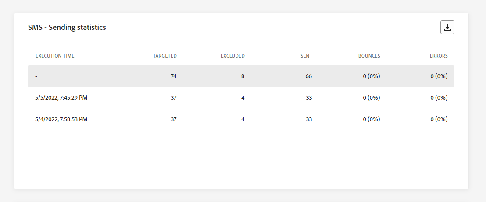
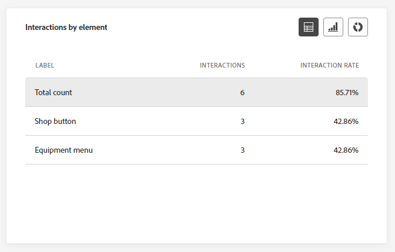
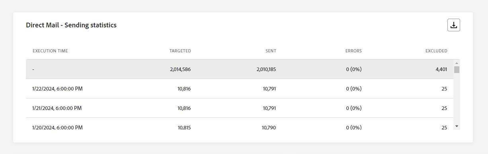

# Relatório global da campanha {#campaign-global-report}

>[!CONTEXTUALHELP]
>id="ajo_campaign_global_report"
>title="Relatório global da campanha"
>abstract="O Relatório global da campanha permite medir o impacto de suas campanhas durante um período selecionado. O relatório é dividido em diferentes widgets detalhando o sucesso e os erros da campanha. Cada painel de relatórios pode ser modificado redimensionando ou removendo widgets."

>[!AVAILABILITY]
>
>A experiência atual de relatórios será removida a partir de janeiro de 2025. Após essa data, a nova experiência de relatórios se tornará o padrão. Recomendamos que você se familiarize com os novos recursos e funcionalidades para garantir uma transição tranquila. [Introdução à nova interface de Relatórios do Journey Optimizer.](report-gs-cja.md)

Relatórios globais, acessíveis a partir da guia **Todos os tempos**, exibem eventos que ocorreram há pelo menos duas horas e abordam eventos durante um período selecionado. Em comparação, os Relatórios em tempo real focalizam eventos que ocorreram nas últimas 24 horas, com um intervalo mínimo de dois minutos a partir da ocorrência do evento.

O relatório global da campanha pode ser acessado diretamente do Campaign com o botão **[!UICONTROL Exibir relatório]**.

A página **[!UICONTROL Relatório global]** da campanha será exibida com as seguintes guias:

* [Campaign](#campaign-global)
* [Email](#email-global)
* [No aplicativo](#inapp-global)
* [Push](#push-global)
* [SMS](#sms-global)
* [Web](#web-tab)
* [Correspondência direta](#direct-mail-global)

O **[!UICONTROL Relatório global]** da campanha está dividido em widgets diferentes detalhando o sucesso e os erros da campanha. Cada widget pode ser redimensionado e excluído, se necessário. Para obter mais informações, consulte esta [seção](../reports/global-report.md#modify-dashboard).

Para obter uma lista detalhada de cada métrica disponível no Adobe Journey Optimizer, consulte [esta página](global-report.md#list-of-components-global.md)

## Guia Campanha {#campaign-global}

>[!NOTE]
>
>O relatório de experimentação pode ser acessado exclusivamente nos relatórios de Customer Journey Analytics. [Saiba mais](campaign-global-report-cja-experimentation.md)

### Entrega {#delivery-global}

>[!CONTEXTUALHELP]
>id="ajo_campaign_delivery_global"
>title="Estatísticas da campanha"
>abstract="O dispositivo Estatísticas da campanha detalha as principais informações relacionadas à campanha, como perfis inseridos e ações entregues."

Os KPIs de **[!UICONTROL Estatísticas]** da campanha servem como um painel abrangente, oferecendo um detalhamento das principais métricas relacionadas à sua campanha. Isso inclui informações essenciais, como o número de perfis e as ações entregues, fornecendo uma compreensão completa do desempenho e do envolvimento da campanha.

+++ Saiba mais sobre as métricas de estatísticas do Campaign

* **[!UICONTROL Público-alvo]**: número de perfis direcionados.

* **[!UICONTROL Ações entregues]**: número total de vezes que uma ação foi entregue.

* **[!UICONTROL Ações com falha em %]**: Porcentagem de vezes exclusivas que uma ação falhou em comparação ao número total de vezes exclusivas que uma ação foi entregue.

+++

<!--
### Objectives report {#objectives-global}

The **[!UICONTROL Objectives]** tab allows you to better fine-tune your deliveries' reports by targeting one specific metric.

The **[!UICONTROL Objectives]** listed are linked to **[!UICONTROL Datasets]** that define a connection to a system in order to retrieve additional information. A list of built-in **[!UICONTROL Objectives]** is available but you can add your own by adding new **[!UICONTROL Dataset]**. For the detailed procedure, refer to this [section](../content-management/reporting-configuration.md).

After selecting the Objectives you want to target on, the two **[!UICONTROL Performance overview]** and **[!UICONTROL Campaign objective]** widgets will provide a detailed summary of your delivery performance. 

With the **[!UICONTROL Campaign objective]** widget, you can also choose to compare your main objective with another metric.

### Experimentation report {#experimentation-global}

>[!CONTEXTUALHELP]
>id="ajo_campaigns_content_experiment_click"
>title="Success metric"
>abstract="The total value of the Success metric, previously selected when creating your Experiments, divided by the number of profiles."

The **[!UICONTROL Experimentation]** tab provides key insights into the performance of each variant, and identifies the most successful one.

Note that defining the best performer might take some time, it will be represented by this icon .

+++Learn more on the different metrics and widgets available for the Experimentation report.

The **[!UICONTROL Experiment result]** widget details the performance of each variant. You can change your baseline by selecting one of the treatment from the **[!UICONTROL Baseline]** the drop-down. The best treatment will be represented with a star icon.

For a deep-dive in these results and how to interpret them, refer to [this page](../content-management/get-started-experiment.md#interpret-results).

The table presents the following metrics:

* **[!UICONTROL Lift over baseline]**: Measure of the percentage improvement in conversion rate of a given treatment over the baseline.

* **[!UICONTROL Confidence]**: Evidence that a given treatment is the same as the baseline treatment. [Learn more](../content-management/experiment-calculations.md#understand-confidence)

* **[!UICONTROL Unique outbound clicks]**: Total count of clicks across outbound channels.

* **[!UICONTROL Profiles]**: Number of profiles targeted for this treatment.

* **[!UICONTROL Unique outbound clicks/profiles]**: Total value of the Success metric, previously selected when creating your Experiments, divided by the number of profiles.

The **[!UICONTROL Confidence interval]** graph measures uncertainty around improvement. It details the percentage difference in performance between the baseline and the best performing treatment. [Learn more](../content-management/experiment-calculations.md#confidence-intervals). 

The last widget provides data related to the **[!UICONTROL Success metric]** you previously selected for your Treatments. You have the option to select a different targeted metric from the **[!UICONTROL Metric]** drop-down menu to track alternative data.
    
>[!CAUTION]
>
>When working with experimentation filtered metrics, please note that changing the Metric selection from the drop-down on the comparison page for experimentation will not retain the filter value. For example, switching from "Clicks" to "Unique clicks" will lead to the loss of the applied filter, rendering the comparison inaccurate or invalid.

+++
-->

## Guia Email {#email-global}

### Email: estatísticas de envio {#sending-statistics-email}

>[!CONTEXTUALHELP]
>id="ajo_campaign_global_email_sending_statistics"
>title="Email: estatísticas de envio"
>abstract="A tabela “Email: estatísticas de envio” resume dados essenciais sobre o email, como se ele foi direcionado ou entregue."

A tabela **[!UICONTROL Estatísticas de envio de email]** fornece um resumo abrangente dos dados essenciais sobre suas campanhas de email. Ele detalha as principais métricas, como o tamanho do público-alvo e o número de emails entregues com êxito, oferecendo insights valiosos sobre a eficácia e o alcance de seus emails.

+++ Saiba mais sobre métricas de Estatísticas de envio de email

* **[!UICONTROL Direcionado]**: número total de emails processados durante o processo de envio.

* **[!UICONTROL Enviado]**: número total de envios para o seu email.

* **[!UICONTROL Entregues]**: número de emails enviados com êxito em relação ao número total de mensagens enviadas.

* **[!UICONTROL Taxa de entrega]**: porcentagem de emails enviados com êxito.

* **[!UICONTROL Rejeições]**: total de erros acumulados durante o processo de envio e o processamento de retorno automático em relação ao número total de mensagens enviadas.

* **[!UICONTROL Taxa de rejeição]**: porcentagem de emails rejeitados em comparação aos emails enviados.

* **[!UICONTROL Erros]**: Número total de erros que ocorreram durante o processo de envio, impedindo que ele fosse enviado a perfis.

* **[!UICONTROL Taxa de Erro]**: Porcentagem de erros ocorridos durante o processo de envio que impediram o envio, em comparação aos emails enviados.

* **[!UICONTROL Tentativas]**: número de emails na fila para tentativas.

* **[!UICONTROL Excluídos]**: número de perfis excluídos pelo Adobe Journey Optimizer.

+++

### Email: estatísticas de rastreamento {#tracking-statistics-email}

>[!CONTEXTUALHELP]
>id="ajo_campaign_global_email_tracking_statistics"
>title="Email: estatísticas de rastreamento"
>abstract="A tabela “Email: estatísticas de rastreamento” fornece dados sobre atividades de perfil do email."

A tabela **[!UICONTROL Email - Estatísticas de rastreamento]** oferece uma conta detalhada da atividade do perfil relacionada às suas campanhas de email. Isso inclui métricas sobre aberturas, cliques e outros indicadores de engajamento relevantes, oferecendo uma visualização abrangente de como os perfis interagem com seu conteúdo de email.

+++ Saiba mais sobre Email - Métricas de estatísticas de rastreamento

* **[!UICONTROL Aberturas]**: número de vezes que o email foi aberto.

* **[!UICONTROL Aberturas Exclusivas]**: Porcentagem de emails abertos.

* **[!UICONTROL Taxa de Abertura]**: número total de emails abertos em comparação ao número de emails entregues.

* **[!UICONTROL Cliques]**: número de vezes que um conteúdo foi clicado em seus emails.

* **[!UICONTROL Cliques únicos]**: número de perfis que clicaram em um conteúdo em um email.

* **[!UICONTROL Taxa de cliques únicos]**: porcentagem de usuários que interagiram com seus emails.

* **[!UICONTROL Cancelar assinaturas]**: Número de cliques no link de cancelamento de assinatura.

* **[!UICONTROL Reclamações de spam]**: número de vezes que uma mensagem foi declarada como spam ou lixo eletrônico.

+++

### Email: desempenho de envio {#sending-performance-email}

>[!CONTEXTUALHELP]
>id="ajo_campaign_global_email_sending_performance"
>title="Email: desempenho de envio"
>abstract="O gráfico “Email: desempenho de envio” apresenta dados abrangentes sobre emails enviados, oferecendo insights acerca de métricas principais, como entregas e rejeições, o que permite uma análise detalhada do processo de entrega de email."

O gráfico **[!UICONTROL Desempenho de Email - Envio]** fornece uma exibição abrangente dos dados relacionados aos emails enviados, oferecendo insights sobre as métricas principais, como entregas e rejeições. Isso permite uma análise detalhada do processo de envio de email, fornecendo informações valiosas sobre a eficiência e o desempenho de suas campanhas de email.

+++ Saiba mais sobre Email - Envio de métricas de desempenho

* **[!UICONTROL Entregues]**: número de emails enviados com êxito em relação ao número total de emails enviados.

* **[!UICONTROL Rejeições]**: total de erros acumulados durante o processo de envio e o processamento automático de retorno em relação ao número total de emails enviados.

* **[!UICONTROL Tentativas]**: número de emails na fila para tentativas.

* **[!UICONTROL Erros]**: Número total de erros que ocorreram durante o processo de envio, impedindo que ele fosse enviado a perfis.

+++

### Email: categorias e motivos de rejeição {#bounces-email}

>[!CONTEXTUALHELP]
>id="ajo_campaign_global_email_bounce_categories"
>title="Email: categorias de rejeição"
>abstract="A tabela “Email: categorias de rejeição” e seus gráficos fornecem dados sobre erros temporários e permanentes."

>[!CONTEXTUALHELP]
>id="ajo_campaign_global_email_bounce_reasons"
>title="Email: motivos de rejeições"
>abstract="A tabela “Email: motivos de rejeições” e seus gráficos contêm dados relacionados às mensagens rejeitadas."

Os widgets **[!UICONTROL Email - Motivos da rejeição]** e **[!UICONTROL Email - Categorias de rejeição]** compilam os dados disponíveis relacionados às mensagens rejeitadas, fornecendo insights detalhados sobre os motivos e categorias específicos por trás das rejeições de email.

Para obter mais informações sobre rejeições, consulte a página [Lista de supressão](../reports/suppression-list.md).

+++ Saiba mais sobre Email - Métricas de categorias de rejeição

* **[!UICONTROL Rejeição permanente]**: o número total de erros permanentes, como um endereço de email incorreto. Isso envolve uma mensagem de erro que declara explicitamente que o endereço é inválido, como Usuário desconhecido.

* **[!UICONTROL Rejeição temporária]**: o número total de erros temporários, como uma caixa de entrada cheia.

* **[!UICONTROL Ignorado]**: o número total de erros temporários, como Ausência Temporária, ou um erro técnico, por exemplo, se o tipo de remetente for postmaster.

+++

### Email: motivos de erro {#errors-email}

>[!CONTEXTUALHELP]
>id="ajo_campaign_global_email_error_reasons"
>title="Email: motivos de erro"
>abstract="A tabela “Email: motivos de erro” e seus gráficos permitem identificar os erros específicos que ocorreram durante o processo de envio."

Os gráficos e a tabela **[!UICONTROL Motivos do Erro]** oferecem visibilidade sobre os erros específicos ocorridos durante o processo de envio, fornecendo informações valiosas sobre a natureza e a ocorrência de erros.

Você pode optar por alternar entre uma tabela, um gráfico de barras ou uma rosca.

### Email: motivos de exclusão {#excluded-email}

>[!CONTEXTUALHELP]
>id="ajo_campaign_global_email_excluded_reasons"
>title="Email: motivos de exclusão"
>abstract="A tabela “Motivos de exclusão” e seus gráficos ilustram os vários fatores que levaram perfis de usuário excluídos do público-alvo a não receberem a mensagem."

Os gráficos e a tabela **[!UICONTROL Motivos excluídos]** apresentam uma visão abrangente dos diferentes fatores que resultaram na exclusão de perfis de usuário do público-alvo direcionado, resultando no não recebimento da mensagem.

Consulte [esta página](exclusion-list.md) para obter uma lista abrangente dos motivos de exclusão.

### Enviados e entregues por domínios {#sent-domains}

>[!CONTEXTUALHELP]
>id="ajo_campaign_global_email_sent_domains"
>title="Enviados e entregues por domínios"
>abstract="A tabela e o gráfico “Enviados e entregues por domínios” fornecem um detalhamento dos emails categorizados por domínios, apresentando insights detalhados sobre o desempenho geral das suas comunicações por email."

A tabela e o gráfico **[!UICONTROL Enviados e entregues por domínios]** fornecem um detalhamento dos emails em nível de domínio, oferecendo insights abrangentes sobre o desempenho dos seus emails.

+++ Saiba mais sobre métricas Enviado e entregue por domínios

* **[!UICONTROL Enviado]**: número total de envios para o seu email.

* **[!UICONTROL Entregues]**: número de emails enviados com êxito em relação ao número total de emails enviados.

+++

### Rejeições e erros por domínios {#bounces-domains}

>[!CONTEXTUALHELP]
>id="ajo_campaign_global_email_bounces_domains"
>title="Rejeições e erros por domínios"
>abstract="O gráfico e a tabela “Rejeições e erros por domínios” fornecem um detalhamento granular no nível de domínio, oferecendo insights sobre erros específicos encontrados durante o processo de envio de email."

O gráfico e a tabela **[!UICONTROL Rejeições e erros por domínios]** oferecem um detalhamento em nível de domínio de erros específicos encontrados durante o processo de envio, fornecendo uma análise detalhada dos problemas ocorridos.

+++ Saiba mais sobre métricas de Rejeições e erros por domínios

* **[!UICONTROL Rejeições]**: total de erros acumulados durante o processo de envio e o processamento automático de retorno em relação ao número total de emails enviados.

* **[!UICONTROL Erros]**: Número total de erros que ocorreram durante o processo de envio, impedindo que seu email fosse enviado a perfis.

+++

### Aberturas e cliques por domínios {#opens-domains}

>[!CONTEXTUALHELP]
>id="ajo_campaign_global_email_open_domains"
>title="Aberturas e cliques por domínios"
>abstract="O gráfico e a tabela “Abertura e cliques por domínios” oferecem um detalhamento no nível do domínio, apresentando uma visão abrangente de como seu público-alvo interage com seus emails."

O gráfico e a tabela **[!UICONTROL Abrir e clicar por domínios]** mostram um detalhamento em nível de domínio do envolvimento dos seus perfis com o seu email, fornecendo informações valiosas sobre como domínios diferentes interagem com o seu conteúdo.

+++ Saiba mais sobre métricas de Abertura e cliques por domínios

* **[!UICONTROL Aberturas]**: número de vezes que o email foi aberto.

* **[!UICONTROL Cliques]**: número de vezes que um conteúdo foi clicado em um email.

+++

### Motivos de rejeição por domínio {#bounce-reasons-domains}

>[!CONTEXTUALHELP]
>id="ajo_campaign_global_email_bounces_reasons_domains"
>title="Motivos de rejeição por domínio"
>abstract="O gráfico e a tabela “Motivos de rejeição por domínio” fornecem um detalhamento no nível do domínio, oferecendo insights abrangentes sobre erros temporários e permanentes. Essa análise detalhada fornece informações valiosas sobre os motivos específicos por trás das mensagens rejeitadas."

O gráfico e a tabela **[!UICONTROL Motivos da rejeição por domínio]** oferecem um detalhamento de dados em nível de domínio sobre erros temporários e permanentes, fornecendo insights detalhados sobre os motivos por trás das mensagens rejeitadas.

+++ Saiba mais sobre Motivos de rejeição por métricas de domínio

* **[!UICONTROL Aberturas]**: número de vezes que o email foi aberto.

* **[!UICONTROL Cliques]**: número de vezes que um conteúdo foi clicado em um email.

+++

### Email: URL principal {#top-url-email}

>[!CONTEXTUALHELP]
>id="ajo_campaign_global_email_top_url"
>title="Email: URL principal"
>abstract="A tabela “Email: URL principal” e seu gráfico oferecem uma visão geral abrangente dos URLs do email que recebem o maior tráfego de visitantes, permitindo identificar os links mais populares."

O gráfico e tabela **[!UICONTROL Email - URL superior]** fornece uma visão geral abrangente das URLs de seu email que atraem o maior tráfego de visitantes. Isso permite identificar e priorizar os links mais populares, melhorando sua compreensão do envolvimento do perfil com conteúdo específico em seus emails.

### Email: melhor domínio do destinatário {#top-recipient-email}

>[!CONTEXTUALHELP]
>id="ajo_campaign_global_email_best_recipient"
>title="Email: melhor domínio do destinatário"
>abstract="A tabela “Email: melhor domínio do destinatário” e seu gráfico fornecem um detalhamento dos domínios que os destinatários usam com mais frequência para abrir o email, oferecendo insights valiosos sobre o comportamento do destinatário."

>[!CAUTION]
>
> O widget **[!UICONTROL Email - Melhor domínio de recipient]** tem uma taxa de precisão de 99,95%.

O gráfico e a tabela **[!UICONTROL Email - Melhor domínio de destinatário]** oferecem um detalhamento dos domínios que os perfis usam com mais frequência para abrir seus emails. Isso fornece insights valiosos sobre o comportamento do perfil, ajudando você a entender as plataformas preferenciais.

+++ Saiba mais sobre Email - Melhores métricas de domínio de recipient

* **[!UICONTROL Entregues]**: número de emails enviados com êxito em relação ao número total de emails enviados.

* **[!UICONTROL Taxa de entrega]**: porcentagem de emails enviados com êxito.

* **[!UICONTROL Rejeições + Taxa de Erros]**: porcentagem de emails que foram rejeitados em comparação aos emails enviados.

+++

### Email: otimização {#optimized-email}

>[!NOTE]
>
>Os widgets **[!UICONTROL Otimizado vs. não otimizado]** e **[!UICONTROL Otimização de tempo de envio]** só estarão disponíveis se a opção Otimização de tempo de envio estiver ativada para o seu email. Para obter mais informações sobre Otimização de Tempo de Envio, consulte [esta página](../building-journeys/journeys-message.md#send-time-optimization).

Os widgets **[!UICONTROL Otimizado vs. não otimizado]** e **[!UICONTROL Otimização de tempo de envio]** detalham as principais informações relativas à sua mensagem, estejam elas otimizadas ou não.

+++ Saiba mais sobre as métricas de otimização de tempo de envio

* **[!UICONTROL Enviado]**: número total de envios.

* **[!UICONTROL Aberturas]**: Número de vezes que a mensagem foi aberta.

* **[!UICONTROL Cliques]**: número de vezes que um conteúdo foi clicado em um email.

* **[!UICONTROL Entregues]**: número de mensagens enviadas com êxito em relação ao número total de mensagens enviadas.

* **[!UICONTROL Rejeições]**: total de erros acumulados durante o processo de envio e o processamento de retorno automático em relação ao número total de mensagens enviadas.

+++

### Email: ofertas {#email-offers}

Os widgets **[!UICONTROL Estatísticas de ofertas]**, **[!UICONTROL Estatísticas de ofertas ao longo do tempo]** e **[!UICONTROL Estatísticas detalhadas de ofertas]** medem o sucesso e o impacto da sua oferta no público-alvo direcionado.

+++ Saiba mais sobre Email - Métricas de ofertas

* **[!UICONTROL Oferta enviada]**: número total de envios para a oferta.

* **[!UICONTROL Impressão da oferta]**: número de vezes que a oferta foi aberta em seus emails.

* **[!UICONTROL Cliques de oferta]**: número de vezes que uma oferta foi clicada em seus emails.

* **[!UICONTROL Nome do posicionamento]**: o nome do seu posicionamento usado para exibir sua oferta. Para obter mais informações sobre posicionamento, consulte esta [página](../offers/offer-library/creating-placements.md).

* **[!UICONTROL Nome da oferta]**: nome da oferta adicionada na entrega. Para obter mais informações sobre posicionamento, consulte esta [página](../offers/offer-library/creating-personalized-offers.md).

* **[!UICONTROL Oferta enviada]**: número total de envios para a oferta.

* **[!UICONTROL Taxa de impressão da oferta]**: porcentagem de ofertas abertas em comparação ao número de ofertas enviadas.

+++

## Guia No aplicativo {#inapp-global}

No seu **[!UICONTROL Relatório global]** do Campaign, a guia **[!UICONTROL No aplicativo]** detalha as principais informações relativas às mensagens no aplicativo enviadas na sua campanha.

### Desempenho in-app {#in-app-performance}

>[!CONTEXTUALHELP]
>id="ajo_campaign_global_inapp_performance"
>title="Desempenho in-app"
>abstract="Os KPIs de desempenho no aplicativo fornecem insights essenciais sobre o engajamento de visitantes com as mensagens no aplicativo."

Os KPIs do **[!UICONTROL Desempenho no aplicativo]** fornecem informações essenciais sobre o envolvimento dos visitantes com as mensagens no aplicativo, fornecendo métricas essenciais para avaliar a eficácia e o impacto de suas campanhas no aplicativo.

+++ Saiba mais sobre Métricas de desempenho no aplicativo

* **[!UICONTROL Impressões exclusivas]**: número de usuários exclusivos a quem a mensagem no aplicativo foi entregue.

* **[!UICONTROL Impressões]**: número total de mensagens no aplicativo entregues a todos os usuários.

* **[!UICONTROL Interações]**: número total de interações com sua mensagem no aplicativo. Isso inclui qualquer ação realizada pelos usuários, como cliques, rejeições ou quaisquer outras interações.

+++

### Interações por tipo {#interactions-type}

>[!CONTEXTUALHELP]
>id="ajo_campaign_global_inapp_interactions"
>title="Interações por tipo"
>abstract="A tabela “Interações por tipo” e seus gráficos detalham como usuários interagiram com a mensagem no aplicativo por meio do rastreamento de cliques, mensagens ignoradas ou interações."

Os gráficos e a tabela **[!UICONTROL Interações por tipo]** fornecem uma conta detalhada de como os perfis interagiram com a mensagem no aplicativo, rastreando ações como cliques, rejeições ou qualquer outra forma de envolvimento.

### Resumo in-app {#in-app-summary}

>[!CONTEXTUALHELP]
>id="ajo_campaign_global_inapp_summary"
>title="Resumo in-app"
>abstract="O gráfico “Resumo no aplicativo” ilustra a progressão das impressões e interações no aplicativo durante o período especificado."

O gráfico **[!UICONTROL Resumo no aplicativo]** ilustra a progressão das impressões e interações no aplicativo durante o período especificado, fornecendo uma visão geral abrangente do desempenho das mensagens no aplicativo.

+++ Saiba mais sobre Métricas de resumo no aplicativo

* **[!UICONTROL Impressões exclusivas]**: número de usuários exclusivos a quem a mensagem no aplicativo foi entregue.

* **[!UICONTROL Impressões]**: número total de mensagens no aplicativo entregues a todos os usuários.

* **[!UICONTROL Interações]**: número total de interações com sua mensagem no aplicativo. Isso inclui qualquer ação realizada pelos usuários, como cliques, rejeições ou quaisquer outras interações.

+++

## Guia Notificação por push {#push-global}

No seu **[!UICONTROL Relatório global]** do Campaign, a guia **[!UICONTROL Notificação por push]** detalha as principais informações relativas às notificações por push enviadas na sua campanha.

### Notificação por push: estatísticas de envio {#push-sending-statistics}

>[!CONTEXTUALHELP]
>id="ajo_campaign_global_push_sending_statistics"
>title="Notificação por push: estatísticas de envio"
>abstract="A tabela “Notificações por push: estatísticas de envio” resume dados essenciais sobre notificações por push, como mensagens direcionadas ou entregues."

A tabela **[!UICONTROL Notificação por push - Estatísticas de envio]** fornece um resumo conciso dos dados essenciais relacionados às suas notificações por push, incluindo as métricas principais, como o número de mensagens direcionadas e o número de mensagens entregues com êxito.

+++ Saiba mais sobre Notificação por push - Envio de métricas de estatísticas

* **[!UICONTROL Tempo de execução]**: a hora inicial de cada execução de sua notificação por push recorrente. Para direcionar apenas uma ou várias notificações por push recorrentes, selecione-a no menu suspenso **[!UICONTROL Tempo de execução]**.

* **[!UICONTROL Direcionado]**: número total de notificações por push processadas durante a análise.

* **[!UICONTROL Enviado]**: número total de envios para a notificação por push.

* **[!UICONTROL Entregue]**: número de notificações por push enviadas com êxito em relação ao número total de notificações por push enviadas.

* **[!UICONTROL Taxa de entrega]**: porcentagem de notificações por push enviadas com êxito.

* **[!UICONTROL Rejeições]**: total de erros acumulados durante o processo de envio e o processamento automático de retorno em relação ao número total de notificações por push.

* **[!UICONTROL Taxa de rejeição]**: porcentagem de notificações por push que foram rejeitadas em comparação às notificações por push enviadas.

* **[!UICONTROL Erros]**: Número total de erros que ocorreram, impedindo que fossem enviados a perfis.

* **[!UICONTROL Taxa de Erro]**: porcentagem de erros ocorridos durante a prevenção de envio em comparação com as notificações por push enviadas.

* **[!UICONTROL Excluídos]**: número de perfis excluídos pelo Adobe Journey Optimizer.

+++

### Notificações por push: estatísticas de rastreamento {#push-tracking-statistics}

>[!CONTEXTUALHELP]
>id="ajo_campaign_global_push_tracking_statistics"
>title="Notificações por push: estatísticas de rastreamento"
>abstract="As “Estatísticas de rastreamento de push” fornecem dados sobre as atividades de perfil das notificações por push."

O widget **[!UICONTROL Estatísticas de rastreamento de notificação por push]** oferece um instantâneo detalhado da atividade do perfil vinculada às suas notificações por push, fornecendo insights essenciais sobre a eficácia das notificações por push e de engajamento.

+++ Saiba mais sobre Notificação por push - Rastreamento de métricas de estatísticas

* **[!UICONTROL Tempo de execução]**: a hora inicial de cada execução de sua notificação por push recorrente. Para direcionar apenas uma ou várias notificações por push recorrentes, selecione-a no menu suspenso **[!UICONTROL Tempo de execução]**.

* **[!UICONTROL Aberturas]**: número de vezes que sua notificação por push foi aberta.

* **[!UICONTROL Ações]**: número total de ações na notificação por push entregue, por exemplo, clique em botões ou descarte.

+++

### Notificação por push: resumo de envio {#push-summary}

>[!CONTEXTUALHELP]
>id="ajo_campaign_global_push_sending_summary"
>title="Notificação por push: resumo de envio"
>abstract="O gráfico “Notificações por push: resumo de envio” exibe os dados disponíveis para notificações por push enviadas."

O gráfico **[!UICONTROL Notificação por push - Envio de resumo]** oferece uma representação dinâmica, exibindo uma análise da sua atividade de notificações por push. Esta representação gráfica fornece um detalhamento abrangente das notificações por push enviadas.

+++ Saiba mais sobre Notificação por push - Envio de métricas de resumo

* **[!UICONTROL Aberturas]**: número de vezes que sua notificação por push foi aberta.

* **[!UICONTROL Ações]**: número total de ações na notificação por push entregue, por exemplo, clique em botões ou descarte.

* **[!UICONTROL Rejeições]**: total de erros acumulados e processamento automático de retorno em relação ao número total de notificações por push enviadas.

* **[!UICONTROL Entregue]**: número de notificações por push enviadas com êxito em relação ao número total de notificações por push enviadas.

* **[!UICONTROL Erros]**: Número total de erros que ocorreram, impedindo que fossem enviados a perfis.

+++

### Notificação por push - Otimização {#push-optimized}

>[!NOTE]
>
>Os widgets **[!UICONTROL Otimizado vs. não otimizado]** e **[!UICONTROL Otimização de hora de envio]** só estarão disponíveis se a opção Otimização de hora de envio estiver ativada para sua notificação por push. Para obter mais informações sobre Otimização de Tempo de Envio, consulte [esta página](../building-journeys/journeys-message.md#send-time-optimization).

Os widgets **[!UICONTROL Otimizado vs. não otimizado]** e **[!UICONTROL Otimização de tempo de envio]** detalham as principais informações relativas à sua mensagem, estejam elas otimizadas ou não.

+++ Saiba mais sobre Notificação por push - Enviar métricas de otimização de tempo

* **[!UICONTROL Entregue]**: número de notificações por push enviadas com êxito em relação ao número total de notificações por push enviadas.

* **[!UICONTROL Aberturas]**: número de vezes que sua notificação por push foi aberta.

* **[!UICONTROL Ações]**: número total de ações na notificação por push entregue, por exemplo, clique em botões ou descarte.

* **[!UICONTROL Rejeições]**: total de erros acumulados durante o processo de envio e o processamento automático de retorno em relação ao número total de notificações por push enviadas.

+++

### Notificação por push: motivos de erro {#error-reasons-push}

>[!CONTEXTUALHELP]
>id="ajo_campaign_global_push_error_reasons"
>title="Notificação por push: motivos de erro"
>abstract="A tabela “Motivos de erro” e seus gráficos permitem identificar os erros específicos que ocorreram durante o processo de envio."

A tabela e os gráficos **[!UICONTROL Motivos do erro]** fornecem a capacidade de identificar os erros específicos que ocorreram durante o processo de envio de suas notificações por push, oferecendo insights detalhados sobre quaisquer problemas encontrados ao longo do caminho.

### Notificação por push: motivos de exclusão {#excluded-push}

>[!CONTEXTUALHELP]
>id="ajo_campaign_global_push_excluded_reasons"
>title="Notificação por push: motivos de exclusão"
>abstract="A tabela “Motivos de exclusão” e seus gráficos ilustram os vários fatores que levaram perfis de usuário excluídos do público-alvo a não receberem a mensagem."

Os gráficos e a tabela **[!UICONTROL Motivos excluídos]** exibem os diferentes motivos que impediram os perfis de usuário, excluídos dos perfis direcionados, de receber suas notificações por push.

Consulte [esta página](exclusion-list.md) para obter uma lista abrangente dos motivos de exclusão.

### Notificação por push: detalhamento por plataforma {#breakdown-platform-push}

>[!CONTEXTUALHELP]
>id="ajo_campaign_global_push_breakdown_platform"
>title="Notificação por push: detalhamento por plataforma"
>abstract="Os gráficos e a tabela “Notificação por push: detalhamento por plataforma” fornecem um detalhamento do sucesso de suas notificações por push com base no sistema operacional do perfil."

O gráfico e a tabela **[!UICONTROL Notificação por push - Detalhamento por plataforma]** fornecem uma análise detalhada do sucesso de suas notificações por push, oferecendo insights com base no sistema operacional do seu perfil. Esse detalhamento melhora a sua compreensão do desempenho das notificações por push em diferentes plataformas.

+++ Saiba mais sobre Notificação por push - Detalhamento por métricas de plataforma

* **[!UICONTROL Direcionado]**: número total de notificações por push processadas durante a análise.

* **[!UICONTROL Entregue]**: número de notificações por push enviadas com êxito em relação ao número total de notificações por push enviadas.

* **[!UICONTROL Aberturas]**: número de vezes que sua notificação por push foi aberta.

* **[!UICONTROL Ações]**: número total de ações na notificação por push entregue, por exemplo, clique em botões ou descarte.

* **[!UICONTROL Rejeições]**: total de erros acumulados e processamento automático de retorno em relação ao número total de notificações por push enviadas.

* **[!UICONTROL Erros]**: Número total de erros que ocorreram, impedindo que fossem enviados a perfis.

* **[!UICONTROL Excluídos]**: número de perfis excluídos pelo Adobe Journey Optimizer.

+++

## Guia SMS {#sms-global}

No seu **[!UICONTROL Relatório global]** do Campaign, a guia **[!UICONTROL SMS]** detalha as principais informações relativas às mensagens SMS enviadas na sua campanha.

### SMS: estatísticas de envio {#sms-sending-statistics}

>[!CONTEXTUALHELP]
>id="ajo_campaign_global_sms_sending_statistics"
>title="SMS: estatísticas de envio"
>abstract="A tabela “SMS: estatísticas de envio” resume dados essenciais sobre suas mensagens de SMS, como mensagens direcionadas ou entregues."

A tabela **[!UICONTROL SMS - Estatísticas de envio]** fornece um resumo conciso dos dados essenciais relacionados às suas mensagens SMS, englobando as métricas principais, como o número de mensagens direcionadas e a contagem de mensagens entregues com êxito.

+++ Saiba mais sobre SMS - Envio de métricas de estatísticas

* **[!UICONTROL Tempo de execução]**: a hora inicial de cada execução de sua mensagem SMS recorrente. Para direcionar apenas uma ou várias mensagens SMS recorrentes, selecione-as no menu suspenso **[!UICONTROL Tempo de execução]**.

* **[!UICONTROL Direcionado]**: número de perfis de usuário qualificados como perfis de destino.

* **[!UICONTROL Excluídos]**: número de perfis de usuário, excluídos dos perfis direcionados, que não receberam a mensagem.

* **[!UICONTROL Enviado]**: número total de envios para suas mensagens SMS.

* **[!UICONTROL Rejeições]**: total de erros acumulados durante o processo de envio e o processamento automático de retorno em relação ao número total de mensagens SMS enviadas.

* **[!UICONTROL Erros]**: Número total de erros que ocorreram, impedindo que fossem enviados a perfis.

+++

### SMS: estatísticas de rastreamento {#sms-tracking-statistics}

>[!CONTEXTUALHELP]
>id="ajo_campaign_sms_tracking_statistics"
>title="SMS: estatísticas de rastreamento"
>abstract="O dispositivo “SMS: estatísticas de rastreamento” fornece uma visão geral abrangente de informações essenciais relacionadas à interação de visitantes com o seu URL."

O widget **[!UICONTROL SMS - Estatísticas de rastreamento]** fornece uma visão geral detalhada das principais informações relacionadas ao engajamento dos visitantes com suas URLs, oferecendo insights sobre a eficácia das mensagens SMS.

+++ Saiba mais sobre SMS - Rastreamento de métricas de estatísticas

* **[!UICONTROL Tempo de execução]**: a hora de início de cada execução do SMS recorrente. Para direcionar apenas um ou vários SMS recorrentes, selecione-o no menu suspenso **[!UICONTROL Tempo de execução]**.

* **[!UICONTROL Cliques]**: número de vezes que um conteúdo foi clicado em uma mensagem SMS.

+++

### SMS: desempenho por data {#sms-perfomance-date}

>[!CONTEXTUALHELP]
>id="ajo_campaign_global_sms_performance"
>title="SMS: desempenho por data"
>abstract="O dispositivo “Desempenho de SMS por data” fornece informações importantes sobre suas mensagens por meio de uma representação gráfica."

O widget **[!UICONTROL Desempenho por data do SMS]** oferece uma visão geral detalhada das principais informações relacionadas às suas mensagens, apresentadas por meio de um gráfico, fornecendo insights sobre as tendências de desempenho em períodos específicos.

+++ Saiba mais sobre SMS - Desempenho por métricas de data

* **[!UICONTROL Enviado]**: número total de envios para suas mensagens SMS.

* **[!UICONTROL Rejeições]**: total de erros acumulados durante o processo de envio e o processamento automático de retorno em relação ao número total de mensagens SMS enviadas.

* **[!UICONTROL Erros]**: Número total de erros que ocorreram, impedindo que fossem enviados a perfis.

+++

### SMS: motivos de erro {#sms-error}

>[!CONTEXTUALHELP]
>id="ajo_campaign_global_sms_error_reasons"
>title="SMS: motivos de erro"
>abstract="A tabela “SMS: motivos de erro” e seus gráficos permitem identificar os erros específicos que ocorreram durante o processo de envio."

Os gráficos e a tabela **[!UICONTROL Motivos do erro]** permitem identificar os erros específicos que ocorreram durante o processo de envio de suas mensagens SMS, facilitando uma análise completa de todos os problemas encontrados.

### SMS: motivos de exclusão {#sms-excluded-reasons}

>[!CONTEXTUALHELP]
>id="ajo_campaign_global_sms_excluded_reasons"
>title="SMS: motivos de exclusão"
>abstract="A tabela “Motivos de exclusão” e seus gráficos ilustram os vários fatores que levaram perfis de usuário excluídos do público-alvo a não receberem a mensagem."

Os gráficos e a tabela **[!UICONTROL Motivos da exclusão]** representam visualmente os diversos fatores que levaram à exclusão de perfis de usuário do público-alvo direcionado, impedindo-o de receber suas mensagens SMS.

Consulte [esta página](exclusion-list.md) para obter uma lista abrangente dos motivos de exclusão.

### SMS: motivos de rejeições {#sms-bounces-reasons}

>[!CONTEXTUALHELP]
>id="ajo_campaign_global_sms_bounces_reasons"
>title="SMS: motivos de rejeições"
>abstract="A tabela “Motivos de rejeições” e seus gráficos contêm dados relacionados às mensagens rejeitadas."

Os gráficos e a tabela **[!UICONTROL Motivos de rejeições]** fornecem uma visão geral abrangente dos dados relacionados às mensagens SMS rejeitadas, fornecendo insights valiosos sobre os motivos específicos por trás das instâncias de rejeições de mensagens SMS.

### SMS: cliques por link {#sms-clicks-links}

>[!CONTEXTUALHELP]
>id="ajo_campaign_global_sms_clicks_links"
>title="SMS: cliques por link"
>abstract="O dispositivo “SMS: cliques por links” fornece insights essenciais sobre o engajamento dos visitantes com os URLs em suas mensagens."

O widget **[!UICONTROL SMS - Cliques por links]** oferece informações essenciais sobre o engajamento de seus visitantes com as URLs incluídas em suas mensagens, fornecendo informações valiosas sobre quais links atraem mais interação.

## Guia Web {#web-tab}

Do seu **[!UICONTROL Relatório global]** do Campaign, a guia **[!UICONTROL Web]** detalha as principais informações relativas às suas páginas da Web.

### Desempenho na Web {#web-performance}

>[!CONTEXTUALHELP]
>id="ajo_campaign_global_web_performance"
>title="Desempenho na Web"
>abstract="Os KPIs de desempenho na Web fornecem informações abrangentes sobre o engajamento de visitantes com as experiências da Web."

Os KPIs do **[!UICONTROL desempenho da Web]** oferecem insights abrangentes sobre o engajamento de seus visitantes com suas páginas da Web, abrangendo métricas principais como Impressões e Interações.

+++ Saiba mais sobre métricas de desempenho da Web

* **[!UICONTROL Impressões exclusivas]**: número de usuários exclusivos a quem a experiência da Web foi entregue.

* **[!UICONTROL Impressões]**: número total de experiências da Web entregues a todos os usuários.

* **[!UICONTROL Taxa de interação]**: porcentagem de envolvimentos com sua página da Web. Isso inclui qualquer ação realizada pelos usuários, como cliques ou quaisquer outras interações.

+++

### Resumo da Web {#web-summary}

>[!CONTEXTUALHELP]
>id="ajo_campaign_global_web_summary"
>title="Resumo da Web"
>abstract="O gráfico “Resumo da Web” ilustra a progressão das experiências da Web, incluindo impressões, impressões únicas e interações, durante o período especificado."

O gráfico **[!UICONTROL Resumo da Web]** mostra a evolução das suas experiências da Web (impressões, impressões exclusivas e interações) para o período em questão.

+++ Saiba mais sobre métricas de resumo na Web

* **[!UICONTROL Impressões exclusivas]**: número de usuários exclusivos a quem a experiência da Web foi entregue.

* **[!UICONTROL Impressões]**: número total de experiências da Web entregues a todos os usuários.

* **[!UICONTROL Interação]**: número total de interações com sua página da Web. Isso inclui qualquer ação realizada pelos usuários, como cliques ou quaisquer outras interações.

+++

### Interações por elemento {#web-interactions}

>[!CONTEXTUALHELP]
>id="ajo_campaign_global_web_interactions"
>title="Interações por elemento"
>abstract="A tabela “Interações por elemento” fornece informações importantes sobre o engajamento de visitantes com diferentes elementos em suas páginas da Web."

A tabela **[!UICONTROL Interações por elemento]** apresenta informações abrangentes sobre o engajamento dos visitantes com os vários elementos das suas páginas da Web, oferecendo insights valiosos sobre as interações e preferências do usuário.

+++ Saiba mais sobre Interações por métricas de elementos

* **[!UICONTROL Interação]**: número total de interações com sua página da Web. Isso inclui qualquer ação realizada pelos usuários, como cliques ou quaisquer outras interações.

* **[!UICONTROL Taxa de interação]**: porcentagem de envolvimentos com sua página da Web. Isso inclui qualquer ação realizada pelos usuários, como cliques ou quaisquer outras interações.

+++

## Guia Correspondência direta {#direct-mail-global}

Do seu **[!UICONTROL Relatório global]** do Campaign, a guia **[!UICONTROL Correspondência direta]** detalha as principais informações relativas às suas mensagens de Correspondência direta.

### Correspondência direta: estatísticas de envio {#direct-mail-sending-statistics}

>[!CONTEXTUALHELP]
>id="ajo_campaign_global_direct_sending_statistics"
>title="Correspondência direta: estatísticas de envio"
>abstract="A tabela “Correspondência direta: estatísticas de envio” resume dados essenciais sobre mensagens de correspondência direta, como mensagens direcionadas ou entregues."

A tabela **[!UICONTROL Correspondência Direta - Estatísticas de envio]** fornece um resumo conciso dos dados essenciais relacionados às suas mensagens de Correspondência Direta, englobando métricas principais como o número de mensagens direcionadas e a contagem de mensagens entregues com êxito.

+++ Saiba mais sobre Correspondência direta - Envio de métricas de estatísticas

* **[!UICONTROL Tempo de execução]**: hora de início de cada execução da correspondência direta recorrente. Para direcionar apenas uma ou várias Correspondências diretas recorrentes, selecione-a no menu suspenso **[!UICONTROL Tempo de execução]**.

* **[!UICONTROL Direcionado]**: número de perfis de usuário qualificados como perfis de destino para suas mensagens de correspondência direta.

* **[!UICONTROL Enviado]**: número total de envios para suas mensagens de correspondência direta.

* **[!UICONTROL Erros]**: Número total de erros que ocorreram durante o processo de envio, impedindo que ele fosse enviado a perfis.

* **[!UICONTROL Excluídos]**: número de perfis de usuário, excluídos dos perfis direcionados, que não receberam suas mensagens de correspondência direta.

+++

### Correspondência direta: motivos de erro {#direct-mail-error}

>[!CONTEXTUALHELP]
>id="ajo_campaign_global_direct_error_reasons"
>title="Correspondência direta: motivos de erro"
>abstract="A tabela “Correspondência direta: motivos de erro” e seus gráficos permitem identificar os erros específicos que ocorreram durante o processo de envio."

Os gráficos e a tabela **[!UICONTROL Correspondência direta - Motivos de erro]** fornecem os meios de identificar erros específicos que ocorreram durante o processo de envio de suas mensagens de correspondência direta, permitindo uma análise detalhada de todos os problemas encontrados.

### Correspondência direta: motivos de exclusão {#direct-mail-excluded}

>[!CONTEXTUALHELP]
>id="ajo_campaign_global_direct_excluded_reasons"
>title="Correspondência direta: motivos de exclusão"
>abstract="A tabela “Correspondência direta: motivos de exclusão” e seus gráficos ilustram os vários fatores que levaram perfis de usuário excluídos do público-alvo a não receberem a mensagem."

Os gráficos e a tabela **[!UICONTROL Correspondência direta - Motivos excluídos]** ilustram visualmente os vários fatores que resultaram na exclusão de perfis de usuário do público-alvo direcionado, impedindo-o de receber suas mensagens de correspondência direta.

Consulte [esta página](exclusion-list.md) para obter uma lista abrangente dos motivos de exclusão.

## Recursos adicionais

* [Introdução às campanhas](../campaigns/get-started-with-campaigns.md)
* [Criar uma campanha](../campaigns/create-campaign.md)
* [Criar campanhas acionadas por API](../campaigns/api-triggered-campaigns.md)
* [Modificar ou interromper uma campanha](../campaigns/modify-stop-campaign.md)
* [Relatório em tempo real da campanha](campaign-live-report.md)
