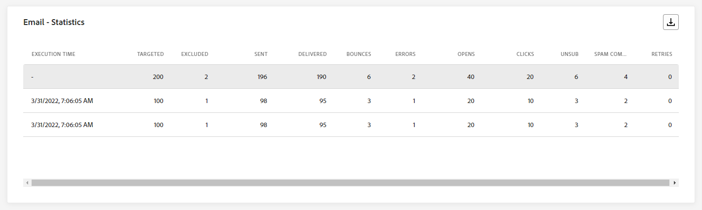
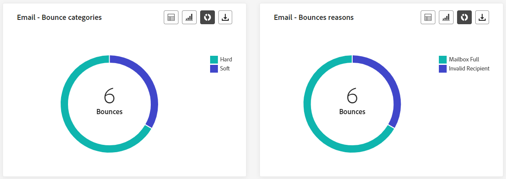
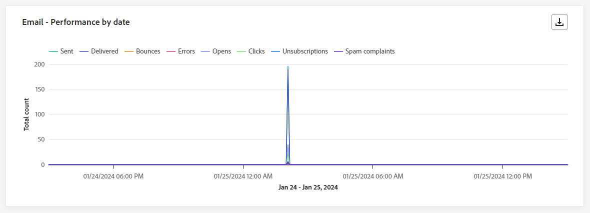
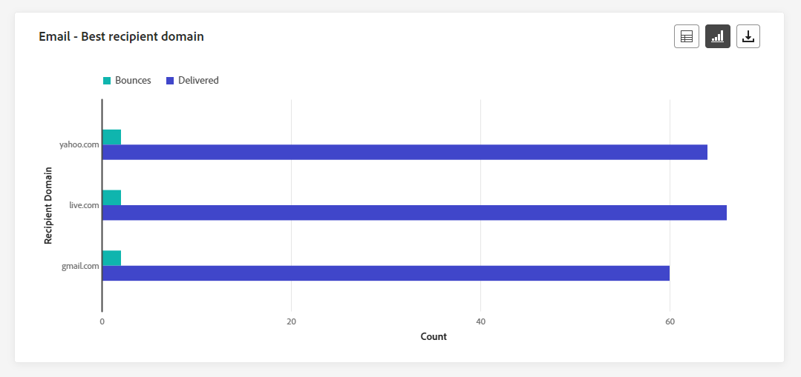
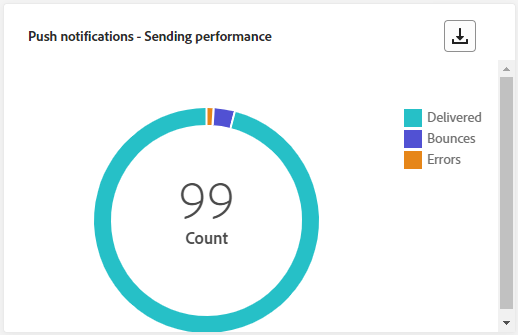
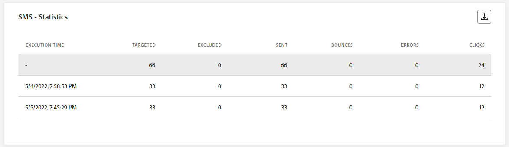
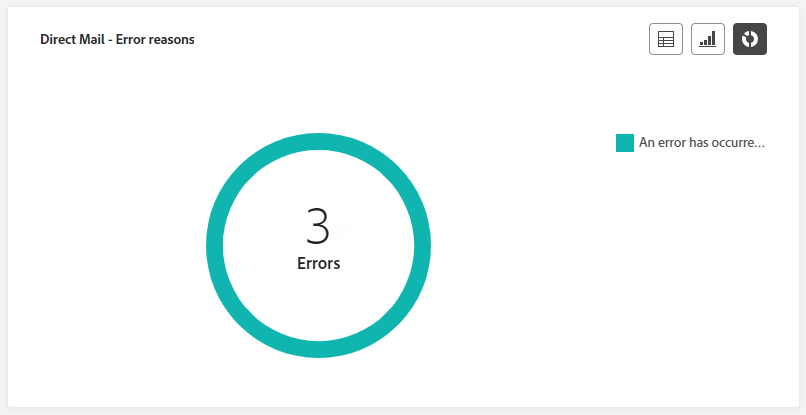

# Relatório em tempo real da campanha {#campaign-live-report}

>[!CONTEXTUALHELP]
>id="ajo_campaign_live_report"
>title="Relatório em tempo real da campanha"
>abstract="O Relatório em tempo real da campanha permite medir e visualizar em tempo real o impacto e o desempenho de suas campanhas nas últimas 24 horas. O relatório é dividido em diferentes widgets detalhando o sucesso e os erros da campanha. Cada painel de relatórios pode ser modificado redimensionando ou removendo widgets."

Os relatórios em tempo real, acessíveis a partir da guia Últimas 24 horas, exibem eventos que ocorreram nas últimas 24 horas, com um intervalo mínimo de dois minutos a partir da ocorrência do evento. Em comparação, os Relatórios globais se concentram em eventos que ocorreram há pelo menos duas horas e abrangem eventos durante um período selecionado.

O relatório de campanha ao vivo pode ser acessado diretamente da sua campanha com o **[!UICONTROL Visualização em tempo real]** botão.

A campanha **[!UICONTROL Relatório ao vivo]** será exibida com as seguintes guias:

* [Campaign](#campaign-live)
* [Email](#email-live)
* [No aplicativo](#inapp-live)
* [Push](#push-live)
* [SMS](#sms-live)
* [Web](#web-tab)
* [Correspondência direta](#direct-mail-tab)

A campanha **[!UICONTROL Relatório ao vivo]** O é dividido em widgets diferentes detalhando o sucesso e os erros da campanha. Cada widget pode ser redimensionado e excluído, se necessário. Para obter mais informações, consulte esta [seção](../reports/live-report.md#modify-dashboard).

Para obter uma lista detalhada de cada métrica disponível no Adobe Journey Optimizer, consulte [esta página](live-report.md#list-of-components-live).

## Guia Campanha {#campaign-live}

### Entrega {#delivery-live}

A variável **[!UICONTROL Estatísticas da campanha]** Os KPIs servem como um painel abrangente, oferecendo um detalhamento das principais métricas das últimas 24 horas relacionadas à sua campanha. Isso inclui informações essenciais, como o número de perfis e as ações entregues, fornecendo uma compreensão completa do desempenho e do envolvimento da campanha.

+++ Saiba mais sobre as métricas de estatísticas do Campaign

* **[!UICONTROL Público]**: Número de perfis segmentados.

* **[!UICONTROL Ações entregues]**: Número total de vezes que uma ação foi entregue.

* **[!UICONTROL Erros]**: Número total de erros que ocorreram durante o processo de envio, impedindo que ele fosse enviado para perfis.

+++

<!--
### Experimentation tab (#experimentation-live)

From your Campaign **[!UICONTROL Live report]**, the **[!UICONTROL Experimentation]** tab details the main information relative to how each variant is performing and if there is was winner during the test.
-->

## Guia Email {#email-live}

Da sua campanha **[!UICONTROL Relatório ao vivo]**, o **[!UICONTROL E-mail]** A guia detalha as principais informações relacionadas ao email enviado em sua campanha.

### Email: desempenho de envio {#email-sending-performance}

>[!CONTEXTUALHELP]
>id="ajo_campaign_live_email_sending_statistics"
>title="Email: estatísticas de envio"
>abstract="O gráfico “Email: estatísticas de envio” resume dados essenciais sobre o email, como se ele foi direcionado ou entregue nas últimas 24 horas."

A variável **[!UICONTROL Email - Desempenho de envio]** O oferece uma visão geral completa dos dados relacionados a emails enviados nas últimas 24 horas. Ele fornece insights sobre métricas essenciais, como entregas e rejeições, permitindo um exame detalhado do processo de envio de email.

+++ Saiba mais sobre as métricas de desempenho de Envio de email

* **[!UICONTROL Entregue]**: número de emails enviados com êxito.

* **[!UICONTROL Rejeições]**: Total de erros acumulados durante o processo de envio e o processamento automático de retorno.

* **[!UICONTROL Tentativas]**: Número de emails na fila para tentativas.

* **[!UICONTROL Erros]**: Número total de erros que ocorreram durante o processo de envio, impedindo que ele fosse enviado para perfis.
+++

### Email: estatísticas

>[!CONTEXTUALHELP]
>id="ajo_campaign_live_email_statistics"
>title="Email: estatísticas"
>abstract="A tabela “Email: estatísticas” fornece dados sobre a atividade de perfil do email nas últimas 24 horas."

A variável **[!UICONTROL Métricas de envio por email]** A tabela oferece um resumo abrangente dos dados das últimas 24 horas. Ele descreve as métricas essenciais, incluindo o tamanho do público-alvo e a contagem de emails entregues com êxito. Isso fornece informações valiosas sobre a eficácia e o alcance de suas campanhas de email.

+++ Saiba mais sobre Email - Métricas de estatística

* **[!UICONTROL Tempo de execução]**: hora de início de cada execução do email recorrente. Para direcionar apenas um ou vários emails recorrentes, selecione-o no **[!UICONTROL Tempo de execução]** menu suspenso.

* **[!UICONTROL Direcionado]**: Número total de mensagens processadas durante o processo de envio.

* **[!UICONTROL Excluído]**: Número de perfis de usuário, excluídos dos perfis direcionados, que não receberam a mensagem.

* **[!UICONTROL Enviado]**: número total de envios.

* **[!UICONTROL Entregue]**: Número de mensagens enviadas com êxito.

* **[!UICONTROL Rejeições]**: Total de erros acumulados durante o processo de envio e o processamento automático de retorno.

* **[!UICONTROL Erros]**: Número total de erros que ocorreram durante o processo de envio, impedindo que ele fosse enviado para perfis.

* **[!UICONTROL Aberturas]**: Número de vezes que uma mensagem foi aberta.

* **[!UICONTROL Cliques]**: Número de vezes que um conteúdo foi clicado.

* **[!UICONTROL Cancelar inscrição]**: Número de cliques no link unsubscription.

* **[!UICONTROL Reclamações de spam]**: Número de vezes que uma mensagem foi declarada como spam ou lixo eletrônico.

* **[!UICONTROL Tentativas]**: Número de emails na fila para tentativas.
+++

### Email: categorias e motivos de rejeição {#bounce-categories}

>[!CONTEXTUALHELP]
>id="ajo_campaign_live_email_bounce_categories"
>title="Email: categorias de rejeição"
>abstract="A tabela “Email: categorias de rejeição” e seus gráficos fornecem dados sobre erros temporários e permanentes nas últimas 24 horas."

>[!CONTEXTUALHELP]
>id="ajo_campaign_live_email_bounce_reasons"
>title="Email: motivos de rejeições"
>abstract="A tabela “Email: motivos de rejeições” e seus gráficos contêm dados relacionados às mensagens rejeitadas nas últimas 24 horas."

A variável **[!UICONTROL Motivos de rejeição]** e **[!UICONTROL Categorias de rejeição]** os widgets compilam os dados disponíveis nas últimas 24 horas relacionadas às mensagens rejeitadas, fornecendo insights detalhados sobre os motivos e categorias específicos por trás das rejeições de email.

Para obter mais informações sobre rejeições, consulte o [Lista de supressão](../reports/suppression-list.md) página.

+++ Saiba mais sobre Email - Categorias de rejeição e métricas de motivos

* **[!UICONTROL Rejeição permanente]**: o número total de erros permanentes, como um endereço de email incorreto. Isso envolve uma mensagem de erro que declara explicitamente que o endereço é inválido, como Usuário desconhecido.

* **[!UICONTROL Rejeição leve]**: o número total de erros temporários, como uma caixa de entrada cheia.

* **[!UICONTROL Ignorado]**: o número total de temporários, como Ausência temporária, ou um erro técnico, por exemplo, se o tipo de remetente for postmaster.

+++

### Email: desempenho por data {#email-performance-date}

>[!CONTEXTUALHELP]
>id="ajo_campaign_live_email_performance_bydate"
>title="Email: desempenho por data"
>abstract="O gráfico “E-mail: desempenho por data” apresenta dados abrangentes das últimas 24 horas sobre emails enviados, oferecendo insights sobre métricas principais, como entregas e devoluções, permitindo uma análise detalhada do processo de envio de email."

A variável **[!UICONTROL Email - Desempenho por data]** O widget oferece uma visão geral detalhada das principais informações relacionadas às suas mensagens, apresentadas por meio de um gráfico, fornecendo insights sobre as tendências de desempenho nas últimas 24 horas.

+++ Saiba mais sobre Email - Desempenho por métricas de data e motivo

* **[!UICONTROL Enviado]**: número total de envios.

* **[!UICONTROL Entregue]**: Número de mensagens enviadas com êxito.

* **[!UICONTROL Rejeições]**: Total de erros acumulados durante o processo de envio e o processamento automático de retorno.

* **[!UICONTROL Erros]**: Número total de erros que ocorreram durante o processo de envio, impedindo que ele fosse enviado para perfis.

* **[!UICONTROL Aberturas]**: Número de vezes que uma mensagem foi aberta.

* **[!UICONTROL Cliques]**: Número de vezes que um conteúdo foi clicado.

* **[!UICONTROL Cancelamentos de assinatura]**: Número de cliques no link unsubscription.

* **[!UICONTROL Reclamações de spam]**: Número de vezes que uma mensagem foi declarada como spam ou lixo eletrônico.

+++

### Motivos de erro {#email-error-reasons}

>[!CONTEXTUALHELP]
>id="ajo_campaign_live_email_error_reasons"
>title="Email: motivos de erro"
>abstract="A tabela “Email: motivos de erro” e seus gráficos permitem identificar os erros específicos que ocorreram durante o processo de envio nas últimas 24 horas."

A variável **[!UICONTROL Motivos de erro]** os gráficos e tabelas fornecem informações sobre os erros específicos que ocorreram durante o processo de envio nas últimas 24 horas. Essas informações são valiosas para entender a natureza e a frequência dos erros.

### Motivos para exclusão {#email-exclude-reasons}

>[!CONTEXTUALHELP]
>id="ajo_campaign_live_email_excluded_reasons"
>title="Email: motivos de exclusão"
>abstract="A tabela “Motivos de exclusão” e seus gráficos ilustram os vários fatores que levaram perfis de usuário excluídos do público-alvo a não receberem a mensagem nas últimas 24 horas."

A variável **[!UICONTROL Motivos excluídos]** os gráficos e a tabela oferecem uma perspectiva abrangente sobre os vários fatores que levaram à exclusão de perfis de usuário do público-alvo direcionado nas últimas 24 horas.

Consulte [esta página](exclusion-list.md) para obter a lista abrangente dos motivos de exclusão.

### Email: melhor domínio do destinatário {#email-best-recipient}

>[!CONTEXTUALHELP]
>id="ajo_campaign_live_email_best_recipient"
>title="Email: melhor domínio do destinatário"
>abstract="A tabela “Email: Melhor domínio do destinatário” e seu gráfico fornecem um detalhamento dos domínios que os destinatários usam com mais frequência para abrir o email, oferecendo insights valiosos sobre o comportamento do destinatário nas últimas 24 horas."

A variável **[!UICONTROL Email - Melhor domínio de destinatário]** O gráfico e a tabela fornecem um detalhamento completo dos domínios usados com mais frequência pelos perfis para abrir seus emails nas últimas 24 horas. Isso fornece insights valiosos sobre o comportamento do perfil, ajudando você a entender as plataformas preferenciais.

### Email: ofertas {#email-offers}

>[!NOTE]
>
>Os widgets e as métricas de Ofertas só estarão disponíveis se uma decisão tiver sido inserida em um email. Para obter mais informações sobre o Gerenciamento de decisões, consulte esta [página](../offers/get-started/starting-offer-decisioning.md).

A variável **[!UICONTROL Estatísticas de ofertas]** e **[!UICONTROL Estatísticas de ofertas ao longo do tempo]** os widgets medem o sucesso e o impacto da sua oferta no público-alvo direcionado. Ele detalha as principais informações relacionadas à sua mensagem com KPIs.

+++ Saiba mais sobre Email - Métricas de ofertas

* **[!UICONTROL Oferta enviada]**: número total de envios para a oferta.

* **[!UICONTROL Impressão da oferta]**: Número de vezes que a oferta foi aberta em seus emails.

* **[!UICONTROL Cliques de oferta]**: Número de vezes que uma oferta foi clicada em seus emails.

+++

## Guia No aplicativo {#inapp-live}

Da sua campanha **[!UICONTROL Relatório ao vivo]**, o **[!UICONTROL No aplicativo]** A guia detalha as principais informações relativas às mensagens no aplicativo enviadas em sua campanha.

### Desempenho in-app {#inapp-performance}

>[!CONTEXTUALHELP]
>id="ajo_campaign_live_inapp_performance"
>title="Desempenho in-app"
>abstract="Os KPIs de desempenho no aplicativo fornecem insights essenciais sobre o engajamento de visitantes com mensagens no aplicativo nas últimas 24 horas."

A variável **[!UICONTROL Desempenho no aplicativo]** Os KPIs fornecem informações essenciais sobre o envolvimento de seus perfis com mensagens no aplicativo nas últimas 24 horas, fornecendo métricas essenciais para avaliar a eficácia e o impacto de suas campanhas no aplicativo.

+++ Saiba mais sobre Métricas de desempenho no aplicativo

* **[!UICONTROL Impressões]**: número total de mensagens no aplicativo enviadas para todos os usuários.

* **[!UICONTROL Interações]**: número total de envolvimentos com a mensagem no aplicativo. Isso inclui qualquer ação realizada pelos usuários, como cliques, rejeições ou quaisquer outras interações.

+++

### Resumo in-app {#inapp-summary}

>[!CONTEXTUALHELP]
>id="ajo_campaign_live_inapp_summary"
>title="Resumo in-app"
>abstract="O gráfico “Resumo no aplicativo” ilustra o progresso das impressões e interações no aplicativo nas últimas 24 horas."

A variável **[!UICONTROL Resumo no aplicativo]** O gráfico ilustra a progressão de suas impressões e interações no aplicativo nas últimas 24 horas, fornecendo uma visão geral abrangente do desempenho das mensagens no aplicativo.

+++ Saiba mais sobre Métricas de resumo no aplicativo

* **[!UICONTROL Impressões]**: número total de mensagens no aplicativo entregues a todos os usuários.

* **[!UICONTROL Interações]**: número total de envolvimentos com a mensagem no aplicativo. Isso inclui qualquer ação realizada pelos usuários, como cliques, rejeições ou quaisquer outras interações.

+++

### Interações por tipo {#inapp-interactions}

>[!CONTEXTUALHELP]
>id="ajo_campaign_live_inapp_interactions"
>title="Interações por tipo"
>abstract="A tabela “Interações por tipo” e seus gráficos detalham como usuários interagiram com a mensagem no aplicativo por meio do rastreamento de cliques, mensagens ignoradas ou interações nas últimas 24 horas."

A variável **[!UICONTROL Interações por tipo]** Os gráficos e a tabela fornecem uma conta detalhada de como os perfis interagiram com a mensagem no aplicativo nas últimas 24 horas, rastreando ações como cliques, rejeições ou qualquer outra forma de envolvimento.

## Guia Notificação por push {#push-live}

Da sua campanha **[!UICONTROL Relatório ao vivo]**, o **[!UICONTROL Notificação por push]** A guia detalha as principais informações relativas à notificação por push enviada em sua campanha.

### Notificação por push: desempenho de envio {#push-sending-performance}

>[!CONTEXTUALHELP]
>id="ajo_campaign_live_push_sending_performance"
>title="Notificação por push: desempenho de envio"
>abstract="O gráfico “Notificações por push: desempenho do envio” resume dados essenciais sobre notificações por push, como erros ou mensagens entregues nas últimas 24 horas."

A variável **[!UICONTROL Desempenho de envio de notificação por push]** o gráfico oferece uma visão geral completa dos dados relacionados às notificações por push enviadas nas últimas 24 horas. Ele fornece insights sobre métricas essenciais, como entregas e devoluções, permitindo um exame detalhado do processo de envio de notificações por push.

+++ Saiba mais sobre Notificação por push - Envio de métricas de desempenho

* **[!UICONTROL Entregue]**: Número de mensagens enviadas com êxito.

* **[!UICONTROL Rejeições]**: Total de erros acumulados durante o processo de envio e o processamento automático de retorno.

* **[!UICONTROL Erros]**: Número total de erros que ocorreram durante o processo de envio, impedindo que ele fosse enviado para perfis.

+++

### Notificação por push: estatísticas {#push-statistics}

>[!CONTEXTUALHELP]
>id="ajo_campaign_live_push_statistics"
>title="Notificação por push: estatísticas"
>abstract="A tabela “Estatísticas de push” fornece dados sobre a atividade de destinatários relacionada a notificações por push nas últimas 24 horas."

A variável **[!UICONTROL Notificação por push - Estatísticas]** A tabela fornece um resumo conciso de dados essenciais relacionados às suas notificações por push nas últimas 24 horas, incluindo métricas principais como o número de mensagens direcionadas e o número de mensagens entregues com êxito.

+++ Saiba mais sobre Notificação por push - Métricas de estatística

* **[!UICONTROL Tempo de execução]**: hora de início de cada execução da notificação por push recorrente. Para direcionar apenas uma ou várias notificações por push recorrentes, selecione-a no **[!UICONTROL Tempo de execução]** menu suspenso.

* **[!UICONTROL Direcionado]**: Número total de mensagens processadas durante o processo de envio.

* **[!UICONTROL Excluído]**: Número de perfis de usuário, excluídos dos perfis direcionados, que não receberam a mensagem.

* **[!UICONTROL Enviado]**: número total de envios.

* **[!UICONTROL Entregue]**: Número de mensagens enviadas com êxito.

* **[!UICONTROL Rejeições]**: Total de erros acumulados durante o processo de envio e o processamento automático de retorno.

* **[!UICONTROL Erros]**: Número total de erros que ocorreram durante o processo de envio, impedindo que ele fosse enviado para perfis.

* **[!UICONTROL Aberturas]**: Número de vezes que uma mensagem foi aberta.

+++

### Notificação por push: resumo de envio {#push-sending-summary}

>[!CONTEXTUALHELP]
>id="ajo_campaign_live_push_sending_summary"
>title="Notificação por push: resumo de envio"
>abstract="O gráfico “Notificações por push: resumo do envio” exibe os dados disponíveis para notificações por push enviadas nas últimas 24 horas."

A variável **[!UICONTROL Notificação por push - Estatísticas]** O gráfico oferece uma representação dinâmica, exibindo uma análise da atividade de notificações por push nas últimas 24 horas. Esta representação gráfica fornece um detalhamento abrangente das notificações por push enviadas.

+++ Saiba mais sobre Notificação por push - Envio de métricas de resumo

* **[!UICONTROL Aberturas]**: Número de vezes que sua notificação por push foi aberta.

* **[!UICONTROL Ações]**: Número total de ações na notificação por push entregue, por exemplo, clique ou descarte de botões.

* **[!UICONTROL Rejeições]**: Total de erros acumulados e processamento de retorno automático em relação ao número total de mensagens enviadas.

* **[!UICONTROL Entregue]**: Número de mensagens enviadas com êxito em relação ao número total de mensagens enviadas.

* **[!UICONTROL Erros]**: Número total de erros que ocorreram que impediram o envio para perfis.

+++

### Notificação por push: motivos de exclusão {#push-excluded}

>[!CONTEXTUALHELP]
>id="ajo_campaign_live_push_excluded_reasons"
>title="Notificação por push: motivos de exclusão"
>abstract="A tabela “Motivos de exclusão” e seus gráficos ilustram os vários fatores que levaram perfis de usuário excluídos do público-alvo a não receberem a mensagem nas últimas 24 horas."

A variável **[!UICONTROL Motivos excluídos]** os gráficos e a tabela exibem os diferentes motivos que impediram os perfis de usuário, excluídos dos perfis direcionados, de receber suas notificações por push nas últimas 24 horas.

Consulte [esta página](exclusion-list.md) para obter a lista abrangente dos motivos de exclusão.

### Notificação por push: motivos de erro {#push-error}

>[!CONTEXTUALHELP]
>id="ajo_campaign_live_push_error_reasons"
>title="Notificação por push: motivos de erro"
>abstract="A tabela “Motivos de erro” e seus gráficos permitem identificar os erros específicos que ocorreram nas últimas 24 horas durante o processo de envio."

A variável **[!UICONTROL Motivos de erro]** A tabela e os gráficos fornecem a capacidade de identificar os erros específicos que ocorreram durante o processo de envio de suas notificações por push nas últimas 24 horas, oferecendo insights detalhados sobre quaisquer problemas encontrados ao longo do caminho.

### Notificação por push: detalhamento por plataforma {#push-breakdown-platform}

>[!CONTEXTUALHELP]
>id="ajo_campaign_live_push_breakdown_platform"
>title="Notificação por push: detalhamento por plataforma"
>abstract="A tabela “Detalhamento por plataforma” e seus gráficos fornecem uma análise do sucesso das notificações por push nas últimas 24 horas baseada no sistema operacional do destinatário."

A variável **[!UICONTROL Notificação por push - Detalhamento por plataforma]** O gráfico e a tabela fornecem uma análise detalhada do sucesso de suas notificações por push nas últimas 24 horas, oferecendo insights com base no sistema operacional do seu perfil. Esse detalhamento melhora a sua compreensão do desempenho das notificações por push em diferentes plataformas.

+++ Saiba mais sobre Notificação por push - Detalhamento por métricas de plataforma

* **[!UICONTROL Direcionado]**: Número total de mensagens processadas durante a análise.

* **[!UICONTROL Entregue]**: Número de mensagens enviadas com êxito em relação ao número total de mensagens enviadas.

* **[!UICONTROL Aberturas]**: Número de vezes que sua notificação por push foi aberta.

* **[!UICONTROL Ações]**: Número total de ações na notificação por push entregue, por exemplo, clique ou descarte de botões.

* **[!UICONTROL Rejeições]**: Total de erros acumulados e processamento de retorno automático em relação ao número total de mensagens enviadas.

* **[!UICONTROL Erros]**: Número total de erros que ocorreram que impediram o envio para perfis.

* **[!UICONTROL Excluído]**: Número de perfis excluídos pelo Adobe Journey Optimizer.

+++

## Guia SMS {#sms-live}

Da sua campanha **[!UICONTROL Relatório ao vivo]**, o **[!UICONTROL SMS]** A guia detalha as principais informações relacionadas à mensagem SMS enviada em sua campanha.

### SMS: estatísticas {#sms-statistics}

>[!CONTEXTUALHELP]
>id="ajo_campaign_live_sms_statistics"
>title="SMS: estatísticas"
>abstract="A tabela “Estatísticas de envio de SMS” resume dados essenciais sobre as mensagens SMS, como mensagens direcionadas ou entregues nas últimas 24 horas."

A variável **[!UICONTROL SMS - Estatísticas]** A tabela fornece um resumo conciso dos dados essenciais relacionados às suas mensagens SMS nas últimas 24 horas, englobando métricas principais como o número de mensagens direcionadas e a contagem de mensagens entregues com êxito.

+++ Saiba mais sobre SMS - Métricas de estatística

* **[!UICONTROL Tempo de execução]**: hora de início de cada execução da mensagem SMS recorrente. Para direcionar apenas uma ou várias mensagens SMS recorrentes, selecione-as no **[!UICONTROL Tempo de execução]** menu suspenso.

* **[!UICONTROL Direcionado]**: Número de perfis de usuário qualificados como perfis de público-alvo.

* **[!UICONTROL Excluído]**: Número de perfis de usuário, excluídos dos perfis direcionados, que não receberam a mensagem.

* **[!UICONTROL Enviado]**: número total de envios.

* **[!UICONTROL Rejeições]**: Total de erros acumulados durante o processo de envio e o processamento automático de retorno.

* **[!UICONTROL Erros]**: Número total de erros que ocorreram durante o processo de envio, impedindo que ele fosse enviado para perfis.

* **[!UICONTROL Cliques]**: Número total de visitas a URL.

+++

### SMS: desempenho por data {#sms-perfomance-date}

>[!CONTEXTUALHELP]
>id="ajo_campaign_live_sms_performance"
>title="SMS: desempenho por data"
>abstract="O dispositivo “SMS: desempenho por data” fornece informações importantes sobre mensagens nas últimas 24 horas por meio de uma representação gráfica."

A variável **[!UICONTROL Desempenho do SMS por data]** O widget oferece uma visão geral detalhada das principais informações relacionadas às suas mensagens, apresentadas por meio de um gráfico, fornecendo insights sobre as tendências de desempenho nas últimas 24 horas.

+++ Saiba mais sobre SMS - Desempenho por métricas de data

* **[!UICONTROL Enviado]**: número total de envios.

* **[!UICONTROL Rejeições]**: Total de erros acumulados durante o processo de envio e o processamento automático de retorno.

* **[!UICONTROL Erros]**: Número total de erros que ocorreram durante o processo de envio, impedindo que ele fosse enviado para perfis.

+++

### SMS: motivos de erro {#sms-error-reasons}

>[!CONTEXTUALHELP]
>id="ajo_campaign_live_sms_error_reasons"
>title="SMS: motivos de erro"
>abstract="A tabela “SMS: motivos de erro” e seus gráficos permitem identificar os erros específicos que ocorreram nas últimas 24 horas durante o processo de envio."

A variável **[!UICONTROL Motivos excluídos]** Os gráficos e as tabelas permitem identificar os erros específicos que ocorreram durante o processo de envio de suas mensagens SMS nas últimas 24 horas, facilitando uma análise completa de todos os problemas encontrados.

### SMS: motivos de exclusão {#sms-excluded-reasons}

>[!CONTEXTUALHELP]
>id="ajo_campaign_live_sms_excluded_reasons"
>title="SMS: motivos de exclusão"
>abstract="A tabela “Motivos de exclusão” e seus gráficos ilustram os vários fatores que levaram perfis de usuário excluídos do público-alvo a não receberem a mensagem nas últimas 24 horas."

A variável **[!UICONTROL Motivos excluídos]** Os gráficos e as tabelas representam visualmente os diversos fatores que levaram à exclusão de perfis de usuários do público-alvo direcionado, impedindo-os de receber suas mensagens SMS nas últimas 24 horas.

Consulte [esta página](exclusion-list.md) para obter a lista abrangente dos motivos de exclusão.

### SMS: motivos de rejeições {#sms-bounces-reasons}

>[!CONTEXTUALHELP]
>id="ajo_campaign_live_sms_bounces_reasons"
>title="SMS: motivos de rejeições"
>abstract="A tabela “Motivos de rejeições” e seus gráficos contêm dados relacionados a mensagens rejeitadas nas últimas 24 horas."

A variável **[!UICONTROL Motivos de rejeições]** Os gráficos e a tabela fornecem uma visão geral abrangente dos dados relacionados às mensagens SMS devolvidas, fornecendo insights valiosos sobre os motivos específicos por trás das instâncias de devoluções de mensagens SMS nas últimas 24 horas.

## Guia Web {#web-tab}

Da sua campanha **[!UICONTROL Relatório ao vivo]**, o **[!UICONTROL Web]** A guia detalha as informações principais relativas às páginas da Web.

### Desempenho na Web {#web-performance}

>[!CONTEXTUALHELP]
>id="ajo_campaign_live_web_performance"
>title="Desempenho na Web"
>abstract="Os KPIs de desempenho da Web fornecem informações abrangentes sobre o engajamento de visitantes com as experiências da Web nas últimas 24 horas."

A variável **[!UICONTROL Desempenho da Web]** Os KPIs oferecem insights abrangentes sobre o engajamento de seus visitantes com suas páginas da Web nas últimas 24 horas, abrangendo métricas principais como Impressões e Interações.

+++ Saiba mais sobre métricas de desempenho da Web

* **[!UICONTROL Impressões]**: número total de experiências da web entregues a todos os usuários.

* **[!UICONTROL Interações]**: número total de envolvimentos com sua página da Web. Isso inclui qualquer ação realizada pelos usuários, como cliques ou quaisquer outras interações.

+++

### Resumo da Web {#web-summary}

>[!CONTEXTUALHELP]
>id="ajo_campaign_live_web_summary"
>title="Resumo da Web"
>abstract="O gráfico “Resumo da Web” ilustra a progressão das experiências na Web nas últimas 24 horas, incluindo impressões, impressões únicas e interações."

A variável **[!UICONTROL Resumo da Web]** o gráfico mostra a evolução de suas experiências da web (impressões, impressões exclusivas e interações) nas últimas 24 horas.

+++ Saiba mais sobre métricas de resumo na Web

* **[!UICONTROL Impressões]**: número total de experiências da web entregues a todos os usuários.

* **[!UICONTROL Interações]**: número total de envolvimentos com sua página da Web. Isso inclui qualquer ação realizada pelos usuários, como cliques ou quaisquer outras interações.

+++

### Interações por elemento {#web-interactions}

>[!CONTEXTUALHELP]
>id="ajo_campaign_live_web_interactions"
>title="Interações por elemento"
>abstract="A tabela “Interações por elemento” fornece informações importantes sobre o engajamento de visitantes com diferentes elementos das páginas da Web nas últimas 24 horas."

A variável **[!UICONTROL Interações por elemento]** A tabela apresenta informações abrangentes sobre o envolvimento dos visitantes com os vários elementos em suas páginas da web nas últimas 24 horas, oferecendo insights valiosos sobre as interações e preferências do usuário.

## Guia Correspondência direta {#direct-mail-tab}

Da sua campanha **[!UICONTROL Relatório ao vivo]**, o **[!UICONTROL Correspondência direta]** A guia detalha as principais informações relacionadas à correspondência direta.

### Correspondência direta: estatísticas de envio {#direct-mail-sending}

>[!CONTEXTUALHELP]
>id="ajo_campaign_live_direct_sending_statistics"
>title="Correspondência direta: estatísticas de envio"
>abstract="A tabela “Correspondência direta: estatísticas de envio” resume dados essenciais das últimas 24 horas sobre mensagens de correspondência direta, como mensagens direcionadas ou entregues."

A variável **[!UICONTROL Correspondência direta - Estatísticas de envio]** A tabela fornece um resumo conciso dos dados essenciais relacionados às suas mensagens de correspondência direta, englobando as principais métricas, como o número de mensagens direcionadas e a contagem de mensagens entregues com êxito nas últimas 24 horas.

+++ Saiba mais sobre Correspondência direta - Envio de métricas de estatísticas

* **[!UICONTROL Direcionado]**: Número de perfis de usuário qualificados como perfis de público-alvo.

* **[!UICONTROL Enviado]**: número total de envios.

* **[!UICONTROL Erros]**: Número total de erros que ocorreram durante o processo de envio, impedindo que ele fosse enviado para perfis.

* **[!UICONTROL Excluído]**: Número de perfis de usuário, excluídos dos perfis direcionados, que não receberam sua correspondência direta.

+++

### Correspondência direta: motivos de erro {#direct-mail-error-reasons}

>[!CONTEXTUALHELP]
>id="ajo_campaign_live_direct_error_reasons"
>title="Correspondência direta: motivos de erro"
>abstract="A tabela “Correspondência direta: motivos de erro” e seus gráficos permitem identificar os erros específicos ocorridos nas últimas 24 horas."

A variável **[!UICONTROL Correspondência direta - Motivos de erro]** os gráficos e a tabela fornecem os meios para identificar erros específicos que ocorreram durante o processo de envio de suas mensagens de correspondência direta, permitindo uma análise detalhada de quaisquer problemas encontrados nas últimas 24 horas.

### Correspondência direta: motivos de exclusão {#direct-mail-excluded-reasons}

>[!CONTEXTUALHELP]
>id="ajo_campaign_live_direct_excluded_reasons"
>title="Correspondência direta: motivos de exclusão"
>abstract="A tabela “Correspondência direta: motivos de exclusão” e seus gráficos ilustram os vários fatores que levaram perfis de usuário excluídos do público-alvo a não receberem a mensagem nas últimas 24 horas."

A variável **[!UICONTROL Correspondência direta - Motivos excluídos]** os gráficos e a tabela ilustram visualmente os vários fatores que resultaram na exclusão de perfis de usuário do público-alvo direcionado, impedindo-o de receber suas mensagens de correspondência direta nas últimas 24 horas.

Consulte [esta página](exclusion-list.md) para obter a lista abrangente dos motivos de exclusão.

## Recursos adicionais

* [Introdução às campanhas](../campaigns/get-started-with-campaigns.md)
* [Criar uma campanha](../campaigns/create-campaign.md)
* [Criar campanhas acionadas por API](../campaigns/api-triggered-campaigns.md)
* [Modificar ou interromper uma campanha](../campaigns/modify-stop-campaign.md)
* [Relatório global da campanha](campaign-global-report.md)
