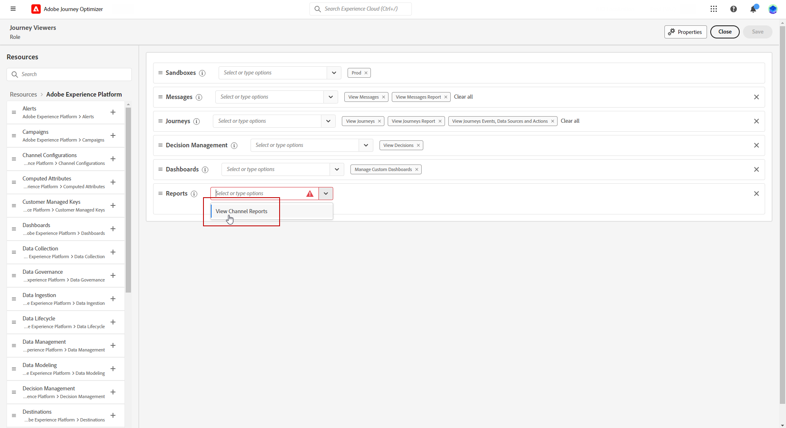
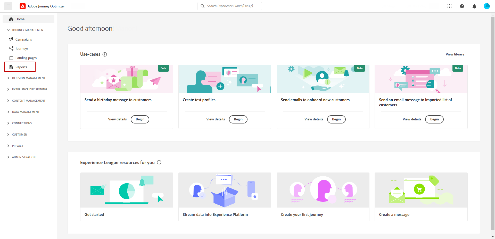

# Introdução aos relatórios de canal {#channel-report-gs}

Os Relatórios de canal são uma ferramenta poderosa que fornece uma visão geral abrangente das métricas de tráfego e engajamento em um relatório unificado para cada canal, englobando todas as ações de todas as campanhas e Jornadas. Ele é dividido em widgets diferentes, cada um deles fornecendo uma visualização específica do desempenho da sua campanha ou jornada.

Os Relatórios de canal são totalmente personalizáveis, então você pode redimensionar ou remover widgets para criar um painel que atenda às suas necessidades específicas. Você também pode exportar os dados do relatório para um PDF ou arquivo CSV para análise adicional.

Saiba mais sobre as diferentes métricas e widgets disponíveis para os Relatórios de canal neste [página](channel-report.md).

## Antes de começar {#manage-reports-prereq}

Antes de iniciar, verifique se você tem acesso à **[!UICONTROL Relatórios]** menu.

Se você não conseguir ver a variável **[!UICONTROL Relatórios]** seus direitos de acesso devem ser estendidos para incluir a **[!UICONTROL Exibir Relatórios de Canal]** permissão. É possível estender suas próprias permissões, se você tiver acesso ao Adobe Experience Platform [Permissões](https://experienceleague.adobe.com/docs/experience-platform/access-control/home.html?lang=pt-BR){target="_blank"} para sua organização. Caso contrário, entre em contato com o administrador do Adobe Journey Optimizer.

+++Saiba como atribuir permissão de relatório

Observe que essa permissão está incluída nas seguintes permissões internas **[!UICONTROL Funções]**: gerente da campanha, aprovador da campanha, visualizador da campanha e administrador da campanha.

Para atribuir a permissão correspondente ao seu **[!UICONTROL Função]**:

1. No [!DNL Permissions] produto, navegue até o **[!UICONTROL Funções]** e selecione a função que deseja atualizar com o novo **[!UICONTROL Exibir Relatórios de Canal]** permissão.

1. Do seu **[!UICONTROL Função]** painel, clique em **[!UICONTROL Editar]**.

   

1. Arraste e solte a **[!UICONTROL Relatórios]** recurso para atribuir permissão.

   No **[!UICONTROL Relatório]** selecione o menu suspenso **[!UICONTROL Exibir Relatórios de Canal]** permissão.

   

1. Clique em **[!UICONTROL Salvar]**.

Usuários atribuídos a este **[!UICONTROL Função]** agora podem acessar o **[!UICONTROL Relatórios]** menu.

+++

## Gerencie seu painel de relatório {#manage-reports}

Para acessar e gerenciar os relatórios de canal, siga estas etapas:

1. Navegue até a **[!UICONTROL Relatórios]** no menu **[!UICONTROL Gerenciamento de jornadas]** seção.

   

1. No painel, escolha uma **Início** e **[!UICONTROL Hora final]** para direcionar dados específicos.

1. No **[!UICONTROL Ação de]** selecione se deseja direcionar Campanhas, Jornadas ou ambos.

   

1. Clique em **[!UICONTROL Modificar]** para redimensionar ou remover widgets para criar um painel que atenda às suas necessidades específicas.

   

1. Quando estiver satisfeito com a ordem de exibição e o tamanho dos widgets, clique em **[!UICONTROL Salvar]**.

1. Dependendo do widget, você pode optar por alternar entre uma tabela, um gráfico de barras ou uma rosca.

1. Clique no ícone de porcentagem para exibir seus dados como taxas.

   

## Exportar seus relatórios {#export-reports}

É possível exportar facilmente seus diferentes relatórios para formatos PDF ou CSV, o que permite compartilhá-los, manipulá-los ou imprimi-los. As etapas detalhadas para exportar seus relatórios de canal estão disponíveis nas seguintes guias:

>[!BEGINTABS]

>[!TAB Exportar seu relatório como um arquivo PDF]

1. No seu relatório, clique em **[!UICONTROL Exportar]** e selecione **[!UICONTROL arquivo PDF]**.

1. Na janela Imprimir, configure o documento conforme necessário. Observe que as opções podem variar dependendo do navegador.

1. Escolha imprimir ou salvar seu relatório como PDF.

1. Localize a pasta onde deseja salvar o arquivo, renomeie-a se necessário e clique em Salvar.

Seu relatório agora está disponível para visualização ou compartilhamento em um arquivo pdf.

>[!TAB Exportar seu relatório como um arquivo CSV]

1. No seu relatório, clique em **[!UICONTROL Exportar]** e selecione **[!UICONTROL Arquivo CSV]** para gerar um arquivo CSV no nível geral do relatório.

1. Você também pode optar por exportar dados de um widget específico. Clique em **[!UICONTROL Exportar dados do widget para CSV]** ao lado do widget selecionado.

1. O arquivo é baixado automaticamente e pode ser localizado em seus arquivos locais.

   Se você gerou o arquivo no nível do relatório, ele contém informações detalhadas para cada widget, incluindo seu título e dados.

   Se você gerou o arquivo no nível do widget, ele fornece especificamente os dados para o widget selecionado.

>[!ENDTABS]
