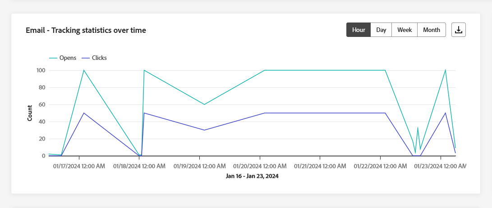
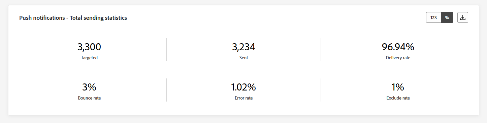
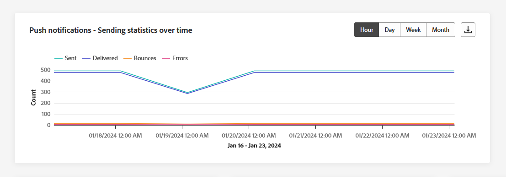
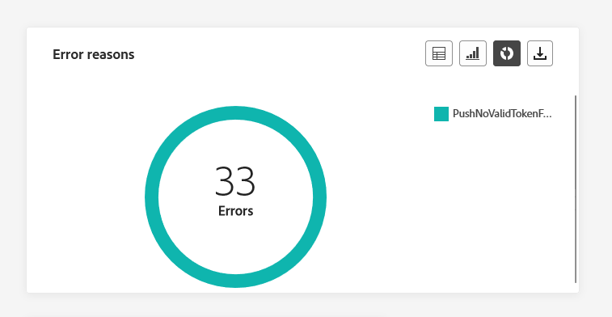
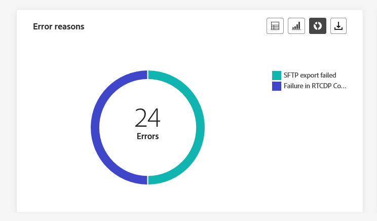

# Relatórios de canal {#channel-report}

>[!CONTEXTUALHELP]
>id="ajo_channel_level_report"
>title="Relatório de nível de canal"
>abstract="Os relatórios de canal oferecem uma visão geral abrangente das métricas de engajamento e tráfego em todos os canais. Seus relatórios são divididos em diferentes dispositivos, os quais detalham o sucesso e os erros da campanha e das jornadas. Cada painel de relatórios pode ser modificado redimensionando ou removendo dispositivos."

>[!IMPORTANT]
>
> Para acessar o **Relatório** , você deve ter o **[!UICONTROL Exibir Relatórios de Canal]** permissão. [Saiba mais](channel-report-gs.md#before-starting-manage-reports-prereq)

Os Relatórios de canal fornecem aos usuários uma visão geral abrangente do tráfego e das métricas de engajamento no nível do canal. As métricas são agregadas para apresentar valores consolidados para ações originárias do canal escolhido, abrangendo várias campanhas e jornadas.

É possível acessar os Relatórios de canal navegando até o **Relatórios** no menu **Gerenciamento de jornadas** seção. É totalmente personalizável, você pode filtrar seus dados dependendo da data do relatório ou da ação. [Saiba mais](channel-report-gs.md)

A página do relatório é exibida com as seguintes guias:

* [Email](#email)
* [Notificações por push](#push)
* [SMS](#sms)
* [No aplicativo](#inapp)
* [Web](#web)
* [Correspondência direta](#direct-mail)

➡️ [Descubra este recurso no vídeo](#channel-report-video)

## Email {#email}

Nos relatórios de Canal, o menu Email detalha as principais informações relativas aos emails enviados em suas Campanhas e Jornadas. As métricas estão detalhadas abaixo.

### Email: estatísticas totais de envio {#email-total-sending}

>[!CONTEXTUALHELP]
>id="ajo_channel_email_sending_statistics"
>title="Email: estatísticas totais de envio"
>abstract="Os KPIs Email - Total sending statistics resumem dados essenciais sobre seus emails, como mensagens direcionadas ou entregues."

A variável **[!UICONTROL Estatísticas de envio total de email]** O widget oferece uma visão geral abrangente do desempenho do seu email, exibindo os indicadores-chave de desempenho (KPIs) que resumem os dados essenciais sobre seus emails.

+++ Saiba mais sobre as métricas de Total de estatísticas de envio de email

* **[!UICONTROL Direcionado]**: número total de emails processados.

* **[!UICONTROL Enviado]**: número total de envios.

* **[!UICONTROL Entregue]**: Número de emails enviados com êxito, em relação ao número total de mensagens enviadas.

* **[!UICONTROL Taxa de entrega]**: porcentagem de emails enviados com êxito.

* **[!UICONTROL Rejeições]**: Total de erros acumulados e processamento de retorno automático em relação ao número total de mensagens enviadas.

* **[!UICONTROL Taxa de rejeição]**: porcentagem de emails que foram rejeitados em comparação aos emails enviados.

* **[!UICONTROL Erros]**: Número total de erros que ocorreram que impediram o envio para perfis.

* **[!UICONTROL Taxa de erro]**: Porcentagem de erros que ocorreram e impediram o envio em comparação aos emails enviados.

* **[!UICONTROL Excluído]**: Número de perfis excluídos pelo Adobe Journey Optimizer.

* **[!UICONTROL Taxa de exclusão]**: porcentagem de perfis que foram excluídos pelo Adobe Journey Optimizer.

+++

### Email: estatísticas totais de rastreamento {#email-total-tracking}

>[!CONTEXTUALHELP]
>id="ajo_channel_email_tracking_statistics"
>title="Email: estatísticas totais de rastreamento"
>abstract="Os KPIs “Email: estatísticas totais de rastreamento” fornecem dados sobre a atividade de perfil de emails."

A variável **[!UICONTROL Estatísticas de rastreamento total de email]** O widget oferece um instantâneo detalhado da atividade do perfil vinculada aos seus emails, fornecendo insights essenciais sobre engajamento e eficácia do email.

+++ Saiba mais sobre as métricas de Estatísticas totais de rastreamento de email

* **[!UICONTROL Aberturas]**: Número de vezes que a mensagem foi aberta.

* **[!UICONTROL Taxa de abertura]**: número total de emails abertos em comparação ao número de emails entregues.

* **[!UICONTROL Cliques]**: Número de vezes que um conteúdo foi clicado em uma mensagem.

* **[!UICONTROL Taxa de cliques]**: porcentagem de usuários que interagiram com o email.

* **[!UICONTROL Reclamações de spam]**: Número de vezes que uma mensagem foi declarada como spam ou lixo eletrônico.

* **[!UICONTROL Taxa de reclamações de spam]**: Porcentagem de mensagens declaradas como spam ou lixo eletrônico em comparação ao número de emails enviados.

* **[!UICONTROL Cancelamentos de assinatura]**: Número de cliques no link de subscrição.

* **[!UICONTROL Taxa de cancelamento de inscrição]**: Porcentagem de cancelamento de subscrição em comparação ao número de emails enviados.

+++

### Email: estatísticas de envio ao longo do tempo {#email-sending-statistics-overtime}

>[!CONTEXTUALHELP]
>id="ajo_channel_email_sending_statistics_overtime"
>title="Email: estatísticas de envio ao longo do tempo"
>abstract="O gráfico “Email: estatísticas de envio ao longo do tempo” apresenta dados sobre emails enviados, detalhados por hora, dia, semana ou mês."

A variável **[!UICONTROL Email - Estatísticas de envio ao longo do tempo]** O gráfico oferece uma representação dinâmica, exibindo uma análise da atividade de email. Essa representação gráfica fornece um detalhamento abrangente dos emails enviados, permitindo observar tendências e padrões em uma escala por hora, dia, semana ou mês.

+++ Saiba mais sobre Email - Estatísticas de envio ao longo das métricas de tempo

* **[!UICONTROL Enviado]**: número total de envios.

* **[!UICONTROL Entregue]**: Número de emails enviados com êxito, em relação ao número total de emails enviados.

* **[!UICONTROL Rejeições]**: Total de erros acumulados e processamento de retorno automático em relação ao número total de emails enviados.

* **[!UICONTROL Erros]**: Número total de erros que ocorreram que impediram o envio para perfis.

+++

### Email: estatísticas de rastreamento ao longo do tempo {#email-tracking-statistics-overtime}

>[!CONTEXTUALHELP]
>id="ajo_channel_email_tracking_statistics_overtime"
>title="Email: estatísticas de rastreamento ao longo do tempo"
>abstract="O gráfico “Email: estatísticas de rastreamento ao longo do tempo” fornece dados sobre a atividade de perfil de emails, detalhados por hora, dia, semana ou mês."

A variável **[!UICONTROL Email - Estatísticas de rastreamento ao longo do tempo]** O gráfico fornece uma visão geral detalhada da atividade do perfil relacionada aos seus emails. Essa representação gráfica detalha os dados de hora em hora, dia, semana ou mês, oferecendo insights valiosos sobre como o engajamento do recipient evolui em diferentes intervalos de tempo.

+++ Saiba mais sobre Email - Estatísticas de rastreamento ao longo das métricas de tempo

* **[!UICONTROL Aberturas]**: Número de vezes que a mensagem foi aberta.

* **[!UICONTROL Cliques]**: Número de vezes que um conteúdo foi clicado em uma mensagem.

+++

### Email - Categorias e motivos de rejeição {#bounce-categories}

>[!CONTEXTUALHELP]
>id="ajo_channel_email_bounce_categories"
>title="Categorias de rejeição"
>abstract="A tabela “Categorias de rejeição” e seus gráficos fornecem dados sobre erros temporários e permanentes."

>[!CONTEXTUALHELP]
>id="ajo_channel_email_bounce_reasons"
>title="Motivos de rejeição"
>abstract="A tabela “Motivos de rejeições” e seus gráficos contêm dados relacionados às mensagens rejeitadas."

A variável **[!UICONTROL Categorias de rejeição]** e **[!UICONTROL Motivos de rejeição]** os widgets encapsulam os dados associados às mensagens devolvidas, fornecendo uma visão geral abrangente das várias categorias e motivos específicos por trás das devoluções de mensagem

Para obter mais informações sobre rejeições, consulte o [Lista de supressão](../reports/suppression-list.md) página.

+++ Saiba mais sobre Métricas de categorias de rejeição

* **[!UICONTROL Rejeição permanente]**: o número total de erros permanentes, como um endereço de email incorreto. Isso envolve uma mensagem de erro que declara explicitamente que o endereço é inválido, como Usuário desconhecido.

* **[!UICONTROL Rejeição leve]**: o número total de erros temporários, como uma caixa de entrada cheia.

* **[!UICONTROL Ignorado]**: o número total de temporários, como Ausência temporária, ou um erro técnico, por exemplo, se o tipo de remetente for postmaster.

+++

### Motivos do erro {#error-reasons}

>[!CONTEXTUALHELP]
>id="ajo_channel_email_error_reasons"
>title="Motivos do erro"
>abstract="A tabela “Motivos de erro” e seus gráficos permitem identificar os erros específicos que ocorreram durante o processo de envio."

A variável **[!UICONTROL Motivos de erro]** os gráficos e as tabelas permitem apontar os erros precisos que ocorreram durante o processo de envio, facilitando a compreensão clara de quaisquer problemas encontrados.

### Motivos de exclusão {#excluded-reasons}

>[!CONTEXTUALHELP]
>id="ajo_channel_email_excluded_reasons"
>title="Motivos de exclusão"
>abstract="A tabela “Motivos de exclusão” e seus gráficos ilustram os vários fatores que levaram perfis de usuário excluídos do público-alvo a não receberem a mensagem."

A variável **[!UICONTROL Motivos excluídos]** os gráficos e a tabela apresentam uma visão abrangente dos diferentes fatores que resultaram na exclusão de perfis de usuário do público-alvo direcionado, resultando no não recebimento da mensagem.

Consulte [esta página](exclusion-list.md) para obter a lista abrangente dos motivos de exclusão.

### Enviados e entregues por domínio {#sent-delivered-domains}

>[!CONTEXTUALHELP]
>id="ajo_channel_email_sending_delivered_domains"
>title="Enviados e entregues por domínio"
>abstract="A tabela “Enviados e entregues por domínio” representam um detalhamento em nível de domínio de todos os dados importantes de envio de email."

A variável  **[!UICONTROL Enviado e entregue por domínios]** A tabela e o gráfico fornecem um detalhamento detalhado dos deliveries de email no nível de domínio, oferecendo insights abrangentes sobre o desempenho dos emails.

+++ Saiba mais sobre métricas Enviado e entregue por domínios

* **[!UICONTROL Enviado]**: Número total de envios para o seu email.

* **[!UICONTROL Entregue]**: Número de mensagens enviadas com êxito em relação ao número total de mensagens enviadas.

+++

### Rejeições e erros por domínio {#bounces-errors-domains}

>[!CONTEXTUALHELP]
>id="ajo_channel_email_bounces_errors_domains"
>title="Rejeições e erros por domínio"
>abstract="A tabela “Rejeições e erros por domínio” e seu gráfico representam um detalhamento em nível de domínio de erros específicos que ocorreram durante o processo de envio."

A variável  **[!UICONTROL Rejeições e erros por domínios]** O gráfico e a tabela oferecem um detalhamento em nível de domínio de erros específicos encontrados durante o processo de envio, fornecendo uma análise detalhada dos problemas que ocorreram.

+++ Saiba mais sobre métricas de Rejeições e erros por domínios

* **[!UICONTROL Rejeições]**: Total de erros acumulados durante o processo de envio e o processamento de retorno automático em relação ao número total de mensagens enviadas.

* **[!UICONTROL Erros]**: Número total de erros que ocorreram durante o processo de envio, impedindo que ele fosse enviado para perfis.

+++

### Aberturas e cliques por domínio {#open-clicks-domains}

>[!CONTEXTUALHELP]
>id="ajo_channel_email_open_clicks_domains"
>title="Aberturas e cliques por domínio"
>abstract="A tabela “Aberturas e cliques por domínio” e seu gráfico representam um detalhamento em nível de domínio do engajamento de visitantes com o email."

A variável  **[!UICONTROL Abrir e clicar por domínios]** O gráfico e a tabela mostram um detalhamento em nível de domínio do engajamento dos visitantes com o email, fornecendo insights valiosos sobre como domínios diferentes interagem com o conteúdo.

+++ Saiba mais sobre métricas de Abertura e cliques por domínios

* **[!UICONTROL Aberturas]**: Número de vezes que o email foi aberto.

* **[!UICONTROL Cliques]**: Número de vezes que um conteúdo foi clicado em um email.

+++

### Motivos de rejeição por domínio {#bounce-reasons-domains}

>[!CONTEXTUALHELP]
>id="ajo_channel_email_bounce_reasons_domains"
>title="Motivos de rejeição por domínio"
>abstract="A tabela “Motivos de rejeição por domínio” e seu gráfico representam um detalhamento em nível de domínio de dados sobre erros temporários e permanentes."

A variável  **[!UICONTROL Motivos de rejeição por domínio]** O gráfico e a tabela oferecem um detalhamento de dados em nível de domínio sobre erros temporários e permanentes, fornecendo insights detalhados sobre os motivos por trás das mensagens rejeitadas.

Para obter mais informações sobre rejeições, consulte o [Lista de supressão](../reports/suppression-list.md) página.

## Notificações por push {#push}

Nos seus Relatórios de canal, a variável **Notificação por push** O menu detalha as informações principais relativas às notificações por push enviadas em suas Campanhas e Jornadas. As métricas estão detalhadas abaixo.

### Notificações por push: estatísticas totais de envio {#push-total-sending}

>[!CONTEXTUALHELP]
>id="ajo_channel_push_sending_statistics"
>title="Notificações por push: estatísticas totais de envio"
>abstract="Os KPIs “Notificações por push: estatísticas totais de envio” resumem dados essenciais sobre notificações por push, como se foram direcionadas ou entregues."

A variável **[!UICONTROL Notificações por push - Estatísticas totais de envio]** Os KPIs servem como um resumo abrangente, encapsulando dados essenciais relacionados às suas notificações por push. Essas métricas incluem insights detalhados sobre o público-alvo e o status real do delivery, fornecendo uma visualização bem arredondada da eficácia e do alcance das notificações por push.

+++ Saiba mais sobre Notificações por push - Total de métricas de estatísticas de envio

* **[!UICONTROL Direcionado]**: Número total de notificações por push processadas.

* **[!UICONTROL Enviado]**: Número total de notificações por push enviadas.

* **[!UICONTROL Entregue]**: número de notificações por push enviadas com êxito em relação ao número total de notificações por push enviadas.

* **[!UICONTROL Taxa de entrega]**: porcentagem de notificações por push enviadas com êxito.

* **[!UICONTROL Rejeições]**: Total de erros acumulados e processamento de retorno automático em relação ao número total de mensagens enviadas.

* **[!UICONTROL Taxa de rejeição]**: Porcentagem de notificações por push que foram rejeitadas em comparação às notificações por push enviadas.

* **[!UICONTROL Erros]**: Número total de erros que ocorreram que impediram o envio para perfis.

* **[!UICONTROL Taxa de erro]**: Porcentagem de erros que ocorreram e impediram o envio, em comparação ao envio de notificações por push.

* **[!UICONTROL Excluído]**: Número de perfis excluídos pelo Adobe Journey Optimizer.

* **[!UICONTROL Taxa de exclusão]**: porcentagem de perfis que foram excluídos pelo Adobe Journey Optimizer.

+++

### Notificações por push: estatísticas totais de rastreamento {#push-total-tracking}

>[!CONTEXTUALHELP]
>id="ajo_channel_push_tracking_statistics"
>title="Notificações por push: estatísticas totais de rastreamento"
>abstract="As Estatísticas totais de rastreamento de notificações por push fornecem dados sobre a atividade de perfil de notificações por push."

A variável **[!UICONTROL Notificação por push - Estatísticas totais de rastreamento]** o widget oferece um instantâneo detalhado da atividade do perfil vinculada às suas notificações por push, fornecendo insights essenciais sobre a eficácia do engajamento e das notificações por push.

+++ Saiba mais sobre Notificações por push - Métricas totais de estatísticas de rastreamento

* **[!UICONTROL Aberturas]**: Número de vezes que uma notificação por push foi aberta.

* **[!UICONTROL Taxa de abertura]**: porcentagem de notificações por push abertas.

* **[!UICONTROL Ações]**: Número total de ações na notificação por push entregue, por exemplo, clique ou descarte de botões.

* **[!UICONTROL Taxa de ação]**: Porcentagem de ações na notificação por push entregue em comparação às notificações por push enviadas.

+++

### Notificações por push: estatísticas de envio ao longo do tempo {#push-sending-overtime}

>[!CONTEXTUALHELP]
>id="ajo_channel_push_sending_statistics_overtime"
>title="Notificações por push: estatísticas de envio ao longo do tempo"
>abstract="O gráfico “Notificações por push: estatísticas de envio ao longo do tempo” apresenta dados sobre notificações por push enviadas, detalhados por hora, dia, semana ou mês."

A variável **[!UICONTROL Notificações por push - Estatísticas de envio ao longo do tempo]** O gráfico oferece uma representação dinâmica, exibindo uma análise da atividade de notificações por push. Esta representação gráfica fornece um detalhamento abrangente das notificações por push enviadas, permitindo observar tendências e padrões em uma escala por hora, dia, semana ou mês.

+++ Saiba mais sobre Notificações por push - Estatísticas de envio ao longo das métricas de tempo

* **[!UICONTROL Enviado]**: Número total de notificações por push enviadas.

* **[!UICONTROL Entregue]**: número de notificações por push enviadas com êxito em relação ao número total de notificações por push enviadas.

* **[!UICONTROL Rejeições]**: Total de erros acumulados e processamento de retorno automático em relação ao número total de mensagens enviadas.

* **[!UICONTROL Erros]**: Número total de erros que ocorreram que impediram o envio para perfis.

+++

### Notificações por push: estatísticas de rastreamento ao longo do tempo {#push-tracking-overtime}

>[!CONTEXTUALHELP]
>id="ajo_channel_push_tracking_statistics_overtime"
>title="Notificações por push: estatísticas de rastreamento ao longo do tempo"
>abstract="O gráfico “Notificações por push: estatísticas de rastreamento ao longo do tempo” fornece dados sobre a atividade de perfil das notificações por push, detalhados por hora, dia, semana ou mês."

A variável **[!UICONTROL Notificações por push - Estatísticas de rastreamento ao longo do tempo]** O gráfico fornece uma visão geral detalhada da atividade do perfil relacionada às suas notificações por push. Essa representação gráfica detalha os dados de hora em hora, dia, semana ou mês, oferecendo insights valiosos sobre como o engajamento do recipient evolui em diferentes intervalos de tempo.

+++ Saiba mais sobre Notificação por push - Estatísticas de rastreamento ao longo das métricas de tempo

* **[!UICONTROL Aberturas]**: Número de vezes que sua notificação por push foi aberta.

* **[!UICONTROL Ações]**: Número total de ações na notificação por push entregue, por exemplo, clique ou descarte de botões.

+++

### Notificações por push - Motivos excluídos {#push-excluded-reasons}

>[!CONTEXTUALHELP]
>id="ajo_channel_push_excluded_reasons"
>title="Motivos de exclusão"
>abstract="A tabela “Motivos de exclusão” e seus gráficos ilustram os vários fatores que levaram perfis de usuário excluídos do público-alvo a não receberem a mensagem."

A variável **[!UICONTROL Motivos excluídos]** o gráfico e a tabela exibem os diferentes motivos que impediram os perfis de usuário, excluídos dos perfis direcionados, de receber suas notificações por push.

Consulte [esta página](exclusion-list.md) para obter a lista abrangente dos motivos de exclusão.

### Notificações por push - Motivos de erro {#push-error-reasons}

>[!CONTEXTUALHELP]
>id="ajo_channel_push_error_reasons"
>title="Motivos do erro"
>abstract="A tabela “Motivos de erro” e seus gráficos permitem identificar os erros específicos que ocorreram durante o processo de envio."

A variável **[!UICONTROL Motivos de erro]** os gráficos e as tabelas fornecem a capacidade de identificar os erros específicos que ocorreram durante o processo de envio de suas notificações por push, oferecendo insights detalhados sobre quaisquer problemas encontrados ao longo do caminho.

### Notificações por push - Rastreamento por plataforma {#push-tracking-platform}

>[!CONTEXTUALHELP]
>id="ajo_channel_push_tracking_statistics_platform"
>title="Estatísticas de rastreamento por plataforma"
>abstract="A tabela “Estatísticas de rastreamento por plataforma” e seu gráfico fornecem dados sobre a atividade de perfil das notificações por push, dependendo do sistema operacional do perfil."

A variável **[!UICONTROL Notificações por push - Rastreamento por plataforma]** gráficos e tabelas detalham a atividade dos recipients para a notificação por push, dependendo do sistema operacional do seu perfil.

### Notificações por push - Envio por plataforma {#push-sending-platform}

>[!CONTEXTUALHELP]
>id="ajo_channel_push_sending_statistics_platform"
>title="Estatísticas de envio por plataforma"
>abstract="A tabela “Estatísticas de envio por platforma” e seu gráfico apresentam dados sobre as notificações por push enviadas."

A variável **[!UICONTROL Notificações por push - Envio por plataforma]** O gráfico e as tabelas fornecem um detalhamento abrangente, detalhando o sucesso das notificações por push relacionadas aos sistemas operacionais dos seus perfis. Essa análise completa oferece insights valiosos sobre a eficácia das notificações por push em diferentes plataformas.

## SMS {#sms}

Do seu **Canal** Relatórios, o menu SMS detalha as principais informações relacionadas ao SMS enviado em suas Campanhas e Jornadas. As métricas estão detalhadas abaixo.

### SMS: estatísticas totais de envio {#sms-sending-statistics}

>[!CONTEXTUALHELP]
>id="ajo_channel_sms_sending_statistics"
>title="SMS: estatísticas totais de envio"
>abstract="Os KPIs “SMS: estatísticas totais de envio” resumem dados essenciais sobre mensagens SMS, como se foram direcionadas ou entregues."

A variável **[!UICONTROL SMS - Estatísticas totais de envio]** Os KPIs servem como um resumo abrangente, encapsulando dados essenciais relacionados ao SMS. Essas métricas incluem insights detalhados sobre o público-alvo e o status real do delivery, fornecendo uma visualização bem arredondada da eficácia e do alcance de suas mensagens SMS.

+++ Saiba mais sobre Notificações por push - Total de métricas de estatísticas de envio

* **[!UICONTROL Direcionado]**: Número de perfis de usuário que se qualificam como perfis de público-alvo para o canal SMS.

* **[!UICONTROL Enviado]**: Número total de mensagens SMS enviadas.

* **[!UICONTROL Entregue]**: Número de mensagens SMS enviadas com êxito em relação ao número total de mensagens SMS enviadas.

* **[!UICONTROL Taxa de entrega]**: Porcentagem de mensagens SMS enviadas com êxito.

* **[!UICONTROL Rejeições]**: Total de erros acumulados e processamento de retorno automático em relação ao número total de mensagens SMS enviadas.

* **[!UICONTROL Taxa de rejeição]**: Porcentagem de mensagens SMS que foram rejeitadas em comparação às mensagens SMS enviadas.

* **[!UICONTROL Erros]**: Número total de erros que ocorreram que impediram o envio para perfis.

* **[!UICONTROL Taxa de erro]**: Porcentagem de erros que ocorreram e impediram o envio em comparação às mensagens SMS enviadas.

* **[!UICONTROL Excluído]**: Número de perfis de usuário, excluídos dos perfis direcionados, que não receberam a mensagem.

* **[!UICONTROL Taxa de exclusão]**: porcentagem de perfis que foram excluídos pelo Adobe Journey Optimizer.

+++

### SMS: estatísticas totais de rastreamento {#sms-tracking-statistics}

>[!CONTEXTUALHELP]
>id="ajo_channel_sms_tracking_statistics"
>title="SMS: estatísticas totais de rastreamento"
>abstract="As “Estatísticas totais de rastreamento de SMS” fornecem dados sobre a atividade de perfil de mensagens SMS."

A variável **[!UICONTROL SMS - Estatísticas de rastreamento total]** O widget fornece uma visão geral detalhada das principais informações relacionadas ao envolvimento dos visitantes com os URLs, oferecendo insights sobre a eficácia das mensagens SMS:

* **[!UICONTROL Cliques]**: Número de vezes que um conteúdo foi clicado na mensagem SMS.

### SMS: estatísticas de envio ao longo do tempo {#sms-sending-statistics-overtime}

>[!CONTEXTUALHELP]
>id="ajo_channel_sms_sending_statistics_overtime"
>title="SMS: estatísticas de envio ao longo do tempo"
>abstract="O gráfico “SMS: estatísticas de envio ao longo do tempo” apresenta dados sobre mensagens SMS enviadas, detalhados por hora, dia, semana ou mês."

A variável **[!UICONTROL SMS - Estatísticas de envio ao longo do tempo]** O gráfico oferece uma visualização abrangente das mensagens SMS enviadas, fornecendo dados detalhados por hora, dia, semana ou mês. Esta representação gráfica permite rastrear e analisar tendências na atividade de mensagens SMS em diferentes intervalos de tempo.

+++ Saiba mais sobre SMS - Estatísticas de envio ao longo das métricas de tempo

* **[!UICONTROL Enviado]**: Número total de mensagens SMS enviadas.

* **[!UICONTROL Rejeições]**: Total de erros acumulados e processamento de retorno automático em relação ao número total de mensagens SMS enviadas.

* **[!UICONTROL Erros]**: Número total de erros que ocorreram que impediram o envio para perfis.

+++

### SMS: estatísticas de rastreamento ao longo do tempo {#sms-tracking-statistics-overtime}

>[!CONTEXTUALHELP]
>id="ajo_channel_sms_tracking_statistics_overtime"
>title="SMS: estatísticas de rastreamento ao longo do tempo"
>abstract="O gráfico “SMS: estatísticas de rastreamento ao longo do tempo” fornece dados sobre a atividade de perfil de mensagens SMS, detalhados por hora, dia, semana ou mês."

A variável **[!UICONTROL SMS - Estatísticas de rastreamento ao longo do tempo]** O gráfico fornece dados sobre a atividade do perfil relacionada às suas mensagens SMS, oferecendo um detalhamento por hora, dia, semana ou mês. Essa representação gráfica permite analisar e entender os padrões de engajamento do usuário em diferentes intervalos de tempo.

* **[!UICONTROL Cliques]**: Número de vezes que um conteúdo foi clicado na mensagem SMS.

### Motivos de exclusão {#sms-excluded-reasons}

>[!CONTEXTUALHELP]
>id="ajo_channel_sms_excluded_reasons"
>title="Motivos de exclusão"
>abstract="A tabela “Motivos de exclusão” e seus gráficos ilustram os vários fatores que levaram perfis de usuário excluídos do público-alvo a não receberem a mensagem."

A variável **[!UICONTROL Motivos de exclusão]** Os gráficos e as tabelas representam visualmente os diversos fatores que levaram à exclusão de perfis de usuário do público-alvo direcionado, impedindo-o de receber suas mensagens SMS.

Consulte [esta página](exclusion-list.md) para obter a lista abrangente dos motivos de exclusão.

### Motivos de rejeição {#sms-bounce-reasons}

>[!CONTEXTUALHELP]
>id="ajo_channel_sms_bounce_reasons"
>title="Motivos de rejeição"
>abstract="A tabela “Motivos de rejeições” e seus gráficos contêm dados relacionados às mensagens rejeitadas."

A variável **[!UICONTROL Motivos de rejeições]** Os gráficos e as tabelas fornecem uma visão geral abrangente dos dados relacionados às mensagens SMS rejeitadas, fornecendo insights valiosos sobre os motivos específicos por trás das instâncias de rejeições de mensagens SMS.

### Motivos do erro {#sms-error-reasons}

>[!CONTEXTUALHELP]
>id="ajo_channel_sms_error_reasons"
>title="Motivos do erro"
>abstract="A tabela “Motivos de erro” e seus gráficos permitem identificar os erros específicos que ocorreram durante o processo de envio."

A variável **[!UICONTROL Motivos de erro]** Os gráficos e as tabelas permitem identificar os erros específicos que ocorreram durante o processo de envio de suas mensagens SMS, facilitando uma análise completa de todos os problemas encontrados.

## Correspondência direta {#direct-mail}

Do seu **Canal** relatórios, a **Correspondência direta** O menu detalha as informações principais relativas às mensagens de correspondência direta enviadas em seu **Campanhas** e **Jornadas**. As métricas estão detalhadas abaixo.

### Correspondência direta: estatísticas totais de envio {#direct-mail-total-sending}

>[!CONTEXTUALHELP]
>id="ajo_channel_direct_sending_statistics"
>title="Correspondência direta: estatísticas totais de envio"
>abstract="Os KPIs “Correspondência direta: estatísticas totais de envio” resumem dados essenciais sobre mensagens de correspondência direta, como se foram direcionadas ou entregues."

A variável **[!UICONTROL Correspondência direta - Total de estatísticas de envio]** O widget oferece uma visão geral abrangente do desempenho das mensagens de correspondência direta, exibindo os KPIs (indicadores-chave de desempenho) que resumem os dados essenciais sobre as mensagens de correspondência direta.

+++ Saiba mais sobre Correspondência direta - Total de métricas de estatísticas de envio

* **[!UICONTROL Direcionado]**: Número de perfis de usuário qualificados como perfis de público alvo para suas mensagens de correspondência direta.

* **[!UICONTROL Enviado]**: número total de envios.

* **[!UICONTROL Erros]**: Número total de erros que ocorreram que impediram o envio para perfis.

* **[!UICONTROL Taxa de erro]**: Porcentagem de erros que ocorreram e impediram o envio, em comparação ao envio de notificações por push.

* **[!UICONTROL Excluído]**: Número de perfis de usuário, excluídos dos perfis direcionados, que não receberam a mensagem.

* **[!UICONTROL Taxa de exclusão]**: porcentagem de perfis que foram excluídos pelo Adobe Journey Optimizer.

+++

### Motivos de exclusão {#direct-mail-excluded-reasons}

>[!CONTEXTUALHELP]
>id="ajo_channel_direct_excluded_reasons"
>title="Motivos de exclusão"
>abstract="A tabela “Motivos de exclusão” e seus gráficos ilustram os vários fatores que levaram perfis de usuário excluídos do público-alvo a não receberem a mensagem."

A variável **[!UICONTROL Correspondência direta - Motivos excluídos]** os gráficos e a tabela ilustram visualmente os vários fatores que resultaram na exclusão de perfis de usuário do público-alvo direcionado, impedindo-o de receber suas mensagens de correspondência direta.

Consulte [esta página](exclusion-list.md) para obter a lista abrangente dos motivos de exclusão.

### Motivos do erro {#direct-mail-error-reasons}

>[!CONTEXTUALHELP]
>id="ajo_channel_direct_error_reasons"
>title="Motivos do erro"
>abstract="A tabela “Motivos de erro” e seus gráficos permitem identificar os erros específicos que ocorreram durante o processo de envio."

A variável **[!UICONTROL Correspondência direta - Motivos de erro]** fornecer os meios para identificar erros específicos que ocorreram durante o processo de envio de suas mensagens de correspondência direta, permitindo uma análise detalhada de quaisquer problemas encontrados.

## No aplicativo {#in-app}

Nos relatórios de Canal, o menu No aplicativo detalha as principais informações relacionadas às mensagens no aplicativo enviadas em suas Campanhas e Jornadas. As métricas estão detalhadas abaixo.

### Engajamento total no aplicativo {#inapp-total-engagement}

>[!CONTEXTUALHELP]
>id="ajo_channel_inapp_engagement"
>title="Total de engajamento no aplicativo"
>abstract="Os KPIs “Total de engajamento no aplicativo” fornecem informações abrangentes sobre o engajamento de visitantes com mensagens no aplicativo, incluindo métricas como impressões e interações."

A variável **[!UICONTROL Engajamento total no aplicativo]** Os KPIs fornecem insights abrangentes sobre o envolvimento dos visitantes com as mensagens no aplicativo, abrangendo métricas principais como **Impressões** e **Interações**.

+++ Saiba mais sobre Métricas de envolvimento total no aplicativo

* **[!UICONTROL Impressões]**: número total de mensagens no aplicativo entregues a todos os usuários.

* **[!UICONTROL Interações]**: Número total de envolvimentos com a mensagem no aplicativo. Isso inclui qualquer ação realizada pelos usuários, como cliques, rejeições ou quaisquer outras interações.

+++

### Hora extra de engajamento no aplicativo {#inapp-engagement-overtime}

>[!CONTEXTUALHELP]
>id="ajo_channel_inapp_engagement_overtime"
>title="Engajamento no aplicativo ao longo do tempo"
>abstract="O gráfico “Engajamento no aplicativo ao longo do tempo” rastreia impressões e interações no aplicativo, fornecendo detalhamentos por hora, dia, semana e mês."

A variável **[!UICONTROL Hora extra de engajamento no aplicativo]** O gráfico mostra a evolução de suas impressões e interações no aplicativo para o período em questão, rastreando qualquer impressão, descarte ou interação.

+++ Saiba mais sobre Métricas de hora extra do envolvimento no aplicativo

* **[!UICONTROL Impressões]**: número total de mensagens no aplicativo entregues a todos os usuários.

* **[!UICONTROL Interações]**: Número total de envolvimentos com a mensagem no aplicativo. Isso inclui qualquer ação realizada pelos usuários, como cliques, rejeições ou quaisquer outras interações.

+++

## Web {#web}

Do seu **Canal** relatórios, o menu da Web detalha as principais informações relacionadas às páginas da Web incluídas em seu **Campanhas** e **Jornadas**. As métricas estão detalhadas abaixo.

### Total de engajamento na Web {#web-engagement-total}

>[!CONTEXTUALHELP]
>id="ajo_channel_web_engagement"
>title="Total de engajamento na Web"
>abstract="Os KPIs “Total de engajamento na Web” fornecem informações abrangentes sobre o engajamento de visitantes com as páginas da Web, incluindo métricas como impressões e interações."

A variável **[!UICONTROL Engajamento total na Web]** Os KPIs oferecem insights abrangentes sobre o engajamento de seus visitantes com suas páginas da Web, abrangendo métricas principais, como Impressões e Interações.

+++ Saiba mais sobre métricas de engajamento total na Web

* **[!UICONTROL Impressões]**: número total de experiências da Web entregues a todos os usuários.

* **[!UICONTROL Interações]**: número total de envolvimentos com sua página da Web. Isso inclui qualquer ação realizada pelos usuários, como cliques ou quaisquer outras interações.

+++

### Total de engajamento na web ao longo do tempo {#web-engagement-total-overtime}

>[!CONTEXTUALHELP]
>id="ajo_channel_web_engagement_overtime"
>title="Total de engajamento na web ao longo do tempo"
>abstract="O gráfico “Total de engajamento na web ao longo do tempo” rastreia as impressões e interações de páginas da Web, fornecendo detalhamentos por hora, dia, semana e mês."

A variável **[!UICONTROL Hora extra do engajamento na Web]** O gráfico monitora a **Impressões** e **Interações** de suas páginas da Web, oferecendo detalhamentos detalhados por hora, dia, semana e mês.

+++ Saiba mais sobre métricas de hora extra do envolvimento com a Web

* **[!UICONTROL Impressões]**: número total de experiências da Web entregues a todos os usuários.

* **[!UICONTROL Interações]**: número total de envolvimentos com sua página da Web. Isso inclui qualquer ação realizada pelos usuários, como cliques ou quaisquer outras interações.

+++

## Relatório de canal (vídeo) {#channel-report-video}

Saiba como acessar, navegar e exportar relatórios no nível do canal neste vídeo

>[!VIDEO](https://video.tv.adobe.com/v/3424537?quality=12)
