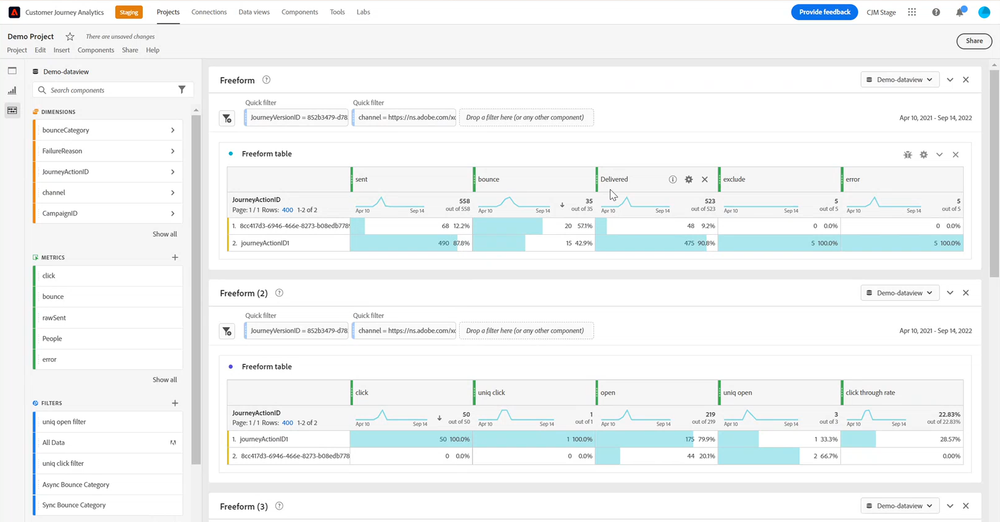

# Configurar manualmente o [!DNL Customer Journey Analytics] {#cja-ajo}

A integração do [!DNL Journey Optimizer] com o [!DNL Customer Journey Analytics] fornece uma visão holística de todas as suas jornadas com distribuição automatizada de relatórios e visualizações personalizadas dos dados.

A seção a seguir descreve como utilizar manualmente os dados gerados pela Journey Optimizer para uma análise detalhada no Customer Journey Analytics. Observe que essa integração pode ser configurada automaticamente. [Saiba mais](report-gs-cja.md)

Depois de criar sua jornada no [!DNL Journey Optimizer], você pode importar os dados do cliente para o [!DNL Customer Journey Analytics] para iniciar os relatórios e entender o impacto de cada interação que um cliente tem com suas jornadas.

➡️ [Descobrir Customer Journey Analytics](https://experienceleague.adobe.com/pt-br/docs/analytics-platform/using/integrations/ajo#manually-configure-a-data-view-to-be-used-with-journey-optimizer){target="_blank"}

>[!NOTE]
>
>Além dessa integração, você também pode exportar o conteúdo dos conjuntos de dados do Adobe Journey Optimizer para locais de armazenamento na nuvem e usar essas informações para fins de relatório ou análise. [Saiba como exportar conjuntos de dados para locais de armazenamento na nuvem](../data/export-datasets.md)
>

Antes de usar o [!DNL Customer Journey Analytics] para suas jornadas, você deve primeiro configurar esta integração:

1. [Crie uma conexão](https://experienceleague.adobe.com/docs/analytics-platform/using/cja-connections/create-connection.html?lang=pt-BR){target="_blank"} em [!DNL Customer Journey Analytics] com o **[!UICONTROL Conjunto de Dados]** que você deseja enviar para a Adobe Experience Platform.

   O seguinte [!DNL Journey Optimizer] pode ser configurado:
   * [Evento de Etapa de Jornada](../data/datasets-query-examples.md#journey-step-event): permite ver quem entra nas jornadas e até que ponto elas chegam.
   * [Conjuntos de dados de Rastreamento/Feedback de Mensagens](../data/datasets-query-examples.md#message-feedback-event-dataset): permite exibir informações de entrega sobre suas mensagens enviadas por meio de [!DNL Journey Optimizer].
   * [Conjuntos de dados de entidade e Jornada](../data/datasets-query-examples.md#entity-dataset): permite pesquisar nomes amigáveis e usá-los em seus relatórios.

1. [Crie uma visualização de dados](https://experienceleague.adobe.com/docs/analytics-platform/using/cja-dataviews/create-dataview.html?lang=pt-BR){target="_blank"} para configurar as dimensões e métricas que deseja usar no relatório.

   Você pode criar métricas específicas do Journey Optimizer para refletir melhor os dados da sua jornada. [Saiba mais](https://experienceleague.adobe.com/docs/analytics-platform/using/integrations/ajo.html?lang=pt-BR#configure-the-data-view-to-accommodate-journey-optimizer-dimensions-and-metrics){target="_blank"}

>[!NOTE]
>
>Se houver várias conexões para sua sandbox, confirme se a [visualização de dados](https://experienceleague.adobe.com/docs/analytics-platform/using/cja-dataviews/create-dataview.html?lang=pt-BR){target="_blank"} faz referência à [conexão](https://experienceleague.adobe.com/pt-br/docs/analytics-platform/using/cja-connections/manage-connections){target="_blank"} sinalizada como **[!UICONTROL Uso no CJA]**. Caso contrário, o [**botão Analisar no CJA**](report-cja-manage.md#analyze) poderá ser desabilitado no [!DNL Journey Optimizer].

O uso de [!DNL Journey Optimizer] com [!DNL Customer Journey Analytics] pode levar a alguma discrepância nos dados do relatório causada por:

* **Os dados de sincronização [!DNL Journey Optimizer] e [!DNL Customer Journey Analytics] do Azure Data Lake Storage (ADLS) para relatórios.**

  O tempo de processamento dos dados recebidos pode ser um pouco diferente entre os produtos. Por isso, os dados podem não corresponder ao exibir relatórios de uma determinada data para o dia atual. Para reduzir a discrepância, use intervalos de datas, exceto o dia atual.

* **Em [!DNL Journey Optimizer] relatórios, a métrica Enviado também inclui a métrica Repetir.**

  **[!UICONTROL Tentativas]** não serão incluídas na métrica **[!UICONTROL Enviadas]** em [!DNL Customer Journey Analytics]. Isso fará com que as métricas [!DNL Customer Journey Analytics] **[!UICONTROL Enviadas]** mostrem valores menores que [!DNL Journey Optimizer]. No entanto, os dados de nova tentativa são convertidos para a métrica **[!UICONTROL Mensagens enviadas com êxito]** ou **[!UICONTROL Rejeições]**.
Para reduzir a discrepância, use intervalos de datas de uma semana atrás ou até mesmo mais tarde.

* **Os relatórios estão sendo fornecidos por uma fonte de dados diferente.**

  Isso pode levar a discrepâncias de dados entre 1 e 2% entre produtos.
