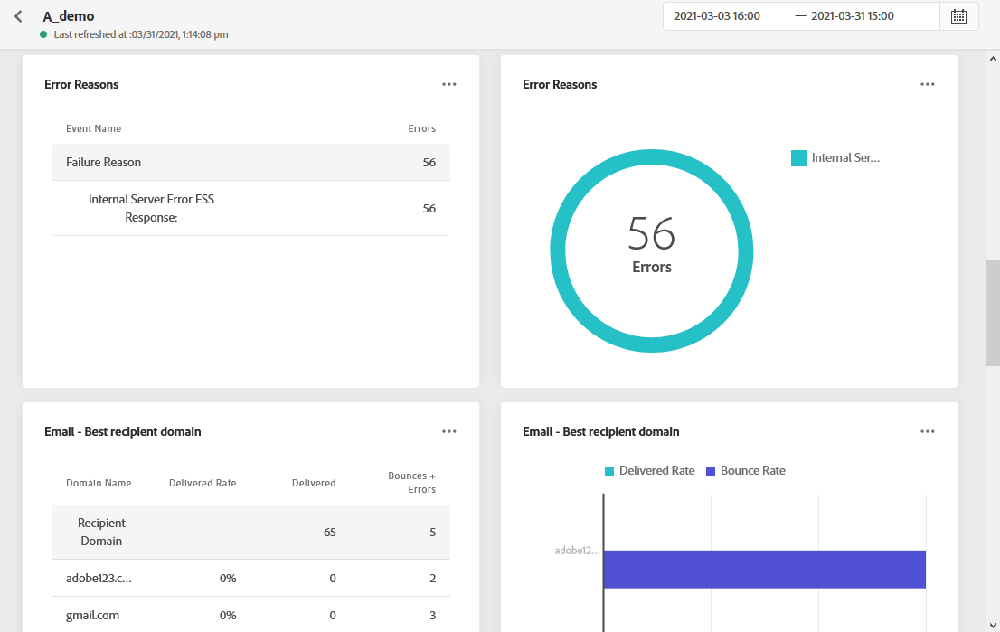

# Relatório global de email {#email-global-report}

O email **[!UICONTROL Global report]** é direcionado apenas a um delivery de email específico.

Na guia **[!UICONTROL Executions]** do menu **[!UICONTROL Messages]**, selecione **[!UICONTROL Global view]** e, no menu avançado do delivery selecionado, selecione **[!UICONTROL Global report]**.

O email **[!UICONTROL Global report]** é dividido em diferentes widgets detalhando o sucesso e os erros do delivery. Cada widget pode ser redimensionado e excluído, se necessário. Para obter mais informações sobre isso, consulte esta [seção](global-report.md#modify-dashboard).

**[!UICONTROL Email performance]** detalha as informações principais relativas à sua mensagem com KPIs:

* **[!UICONTROL Sent]**: Número total de envios para o delivery.

* **[!UICONTROL Delivery Rate]**: Porcentagem de mensagens enviadas com êxito.

* **[!UICONTROL Bounce Rate]**: Porcentagem de emails que retornaram em comparação aos emails enviados.

* **[!UICONTROL Error Rate]**: Porcentagem de erros que ocorreram durante um delivery e impediram seu envio em comparação aos emails enviados.

* **[!UICONTROL Open Rate]**: Porcentagem de mensagens abertas.

* **[!UICONTROL Click Rate]**: Porcentagem de cliques em um delivery.

* **[!UICONTROL Spam Complaint Rate]**: Porcentagem de emails que foram marcados como spam por recipients em comparação às mensagens entregues. Para obter mais informações sobre reclamações, consulte esta [página](https://experienceleague.adobe.com/docs/deliverability-learn/deliverability-best-practice-guide/metrics-for-deliverability/complaints.html#metrics-for-deliverability).

* **[!UICONTROL Unsubscribe Rate]**: Número de unsubscription exclusivas em comparação às mensagens entregues.

O gráfico **[!UICONTROL Sending Statistics]** detalha o sucesso do delivery:

* **[!UICONTROL Delivered]**: Número de mensagens enviadas com êxito em relação ao número total de mensagens enviadas.

* **[!UICONTROL Bounces]**: Total de erros acumulados durante o delivery e o processamento automático de retorno em relação ao número total de mensagens enviadas.

* **[!UICONTROL Errors]**: Número total de erros que ocorreram durante um delivery, impedindo que ele fosse enviado a perfis.

Os widgets **[!UICONTROL Bounce Reasons]** e **[!UICONTROL Bounce categories]** contêm os dados disponíveis relacionados às mensagens devolvidas, como:

* **[!UICONTROL Hard bounce]**: O número total de erros permanentes, como um endereço de email incorreto. Isso envolve uma mensagem de erro que declara explicitamente que o endereço é inválido, como Unknown user.

* **[!UICONTROL Soft bounce]**: O número total de erros temporários, como uma caixa de entrada cheia.

* **[!UICONTROL Ignored]**: O número total de temporários, como ausentes do escritório ou um erro técnico, por exemplo, se o tipo de remetente for postmaster.

Para obter mais informações sobre devoluções, consulte a página [Supressão list](../suppression-list.md).

O gráfico e a tabela **[!UICONTROL Error Reasons]** permitem ver qual erro ocorreu durante o delivery.

O gráfico e a tabela **[!UICONTROL Email - Best recipient domain]** detalham quais domínios são os mais usados pelos recipients para abrir o email.

A tabela **[!UICONTROL Email - Tracking statistics]** contém os dados disponíveis para a atividade do recipient para o seu delivery:

* **[!UICONTROL Opens]**: Número de vezes que o delivery foi aberto em um delivery.

* **[!UICONTROL Unique Opens]**: Número de recipients que abriram o delivery.

* **[!UICONTROL Open Rate]**: Porcentagem de mensagens abertas.

* **[!UICONTROL Clicks]**: Número de vezes que um conteúdo foi clicado em um email.

* **[!UICONTROL Unique Clicks]**: Número de recipients que clicaram em um conteúdo em um email.

* **[!UICONTROL Click through rate]**: Porcentagem de cliques em um delivery.

O **[!UICONTROL Open vs Click]** identifica a interação dos recipients com o delivery:

* **[!UICONTROL Unique Clicks]**: Número de recipients que clicaram em um conteúdo em um email.

* **[!UICONTROL Unique Opens]**: Número de recipients que abriram o delivery.

O gráfico e a tabela **[!UICONTROL Email - Top Url]** detalham quais URLs do delivery são os mais visitados.
