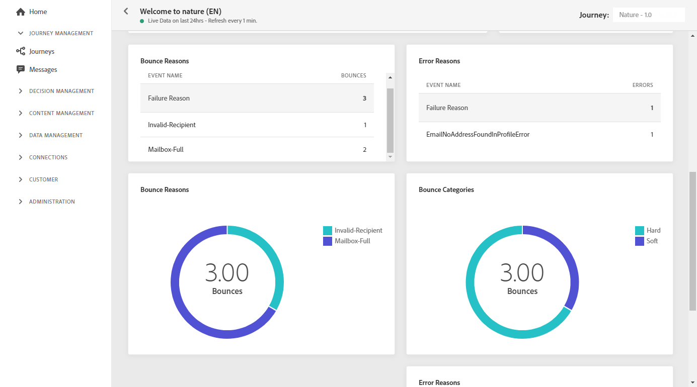

# Relatório ao vivo por email {#email-live-report}

O email **[!UICONTROL Live report]** direciona somente um delivery de email específico.

No **[!UICONTROL Executions]** da guia **[!UICONTROL Messages]** selecione **[!UICONTROL Live view]** em seguida, no menu avançado do delivery selecionado, selecione **[!UICONTROL Live report]**.

O email **[!UICONTROL Live report]** O é dividido em diferentes widgets detalhando o sucesso e os erros do delivery. Cada widget pode ser redimensionado e excluído, se necessário. Para obter mais informações, consulte [seção](live-report.md#modify-dashboard).

**[!UICONTROL Email performance]** e **[!UICONTROL Email summary]** os widgets detalham as informações principais relativas à sua mensagem com um gráfico e KPIs:

* **[!UICONTROL Targeted]**: Número de perfis de usuário que se qualificaram como perfis de público-alvo para este delivery.

* **[!UICONTROL Sent]**: Número total de envios para o delivery.

* **[!UICONTROL Delivered]**: Número de mensagens enviadas com êxito em relação ao número total de mensagens enviadas.

* **[!UICONTROL Opens]**: Número de vezes que uma mensagem foi aberta em um delivery.

* **[!UICONTROL Clicks]**: Número de vezes que um conteúdo foi clicado em um delivery.

* **[!UICONTROL Bounces]**: Total de erros acumulados durante o delivery e o processamento automático de retorno em relação ao número total de mensagens enviadas.

* **[!UICONTROL Errors]**: Número total de erros que ocorreram durante um delivery, impedindo que ele fosse enviado a perfis.

* **[!UICONTROL Spam complaints]**: Número de mensagens classificadas como spam.

* **[!UICONTROL Unsubscriptions]**: Número de cliques no link unsubscription.

* **[!UICONTROL Excluded]**: Número de perfis de usuário, excluídos dos perfis segmentados, que não receberam a mensagem.

O **[!UICONTROL Sending Statistics]** O widget detalha o sucesso do seu delivery:

* **[!UICONTROL Delivered]**: Número de mensagens enviadas com êxito em relação ao número total de mensagens enviadas.

* **[!UICONTROL Bounces]**: Total de erros acumulados durante o delivery e o processamento automático de retorno em relação ao número total de mensagens enviadas.

* **[!UICONTROL Errors]**: Número total de erros que ocorreram durante um delivery, impedindo que ele fosse enviado a perfis.

O **[!UICONTROL Error Reasons]** gráfico e tabela permitem ver qual erro ocorreu durante o delivery.

O **[!UICONTROL Bounce Reasons]** e **[!UICONTROL Bounce categories]** os widgets contêm os dados disponíveis relacionados às mensagens devolvidas, como:

* **[!UICONTROL Hard bounce]**: O número total de erros permanentes, como um endereço de email incorreto. Isso envolve uma mensagem de erro que declara explicitamente que o endereço é inválido, como Unknown user.

* **[!UICONTROL Soft bounce]**: O número total de erros temporários, como uma caixa de entrada cheia.

* **[!UICONTROL Ignored]**: O número total de temporários, como Ausência temporária, ou um erro técnico, por exemplo, se o tipo de remetente for postmaster.

<!--

>[!NOTE]
>
>The Offers widgets and metrics are only available if a decision was inserted in an email. For more information on Decision Management, refer to this [page](../offers/get-started/starting-offer-decisioning.md).

The **[!UICONTROL Offers statistic]** and **[!UICONTROL Offers statistics]** over time widgets measure your offer's success and impact on your targeted audience. It detail the main information relative to your message with KPIs:

* **[!UICONTROL Offer sent]**: Total number of sends for the offer.

* **[!UICONTROL Offer impression]**: Number of times the offer was opened in a delivery.

* **[!UICONTROL Offer clicks]**: Number of times an offer was clicked on in a delivery.
-->
>[!NOTE]
>
>Os perfis com **[!UICONTROL Suppressed]** ou **[!UICONTROL Not allowed]** são excluídos durante o processo de envio da mensagem. Portanto, enquanto a variável **Relatórios de Jornada** mostrará esses perfis como tendo sido movidos pela jornada ([Ler segmento](../building-journeys/read-segment.md) e [Mensagem](../building-journeys/journeys-message.md) atividades), **Relatórios de email** não os incluirá no **[!UICONTROL Sent]** métricas como são filtradas antes do envio do email.
>
>Saiba mais sobre o [Lista de supressão](../messages/suppression-list.md) e [Lista de permissões](../messages/allow-list.md). Para descobrir o motivo de todos os casos de exclusão, é possível usar a variável [Serviço de query Adobe Experience Platform](https://experienceleague.adobe.com/docs/experience-platform/query/api/getting-started.html){target=&quot;_blank&quot;}.
