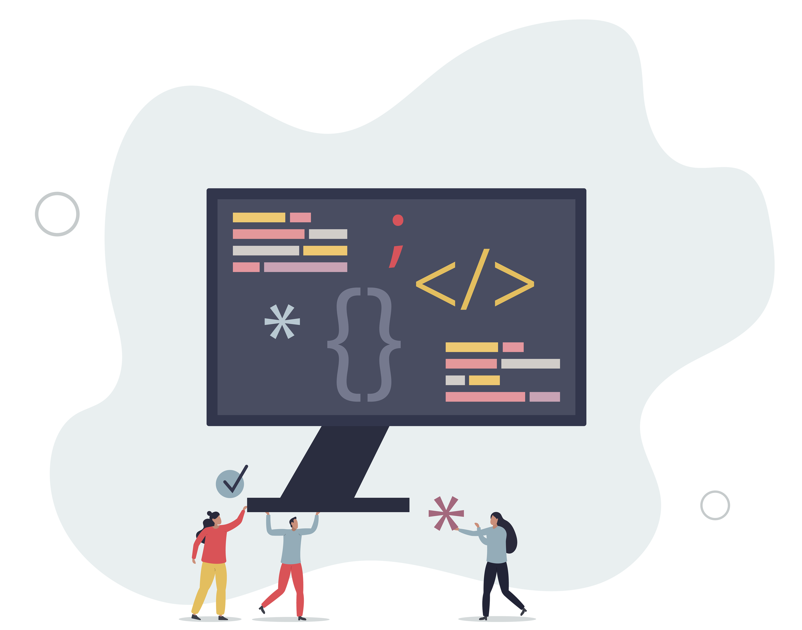

# Introdução aos recursos de relatórios e monitoramento {#get-started-report}

O Adobe Journey Optimizer oferece insights acionáveis por meio de seus recursos de relatório robustos. Os relatórios estão disponíveis para campanhas, jornadas, landing pages, listas de assinaturas e muito mais. Os relatórios disponíveis estão listados abaixo.

Além disso, para otimizar a capacidade de entrega de suas experiências do [!DNL Journey Optimizer], recomendamos usar as práticas recomendadas listadas [nesta seção](deliverability.md).

## Tipos de relatórios {#reporting-types}

* **Relatórios ao vivo das últimas 24 horas** - Use o **[!UICONTROL Relatório ao vivo]** para medir e visualizar em tempo real o impacto e o desempenho das suas jornadas e mensagens em um painel integrado. Os dados estão disponíveis no **[!UICONTROL Relatório em tempo real]** assim que a entrega é enviada ou a jornada é executada a partir da guia **[!UICONTROL Últimas 24 horas]**. Saiba mais sobre os relatórios ao vivo [nesta seção](live-report.md).

  

* **Relatórios contínuos com o Customer Journey Analytics** - Os relatórios do Journey Optimizer são totalmente integrados aos recursos do Customer Journey Analytics, padronizando os relatórios em ambas as plataformas e melhorando a consistência e a confiabilidade dos dados. Essa integração perfeita entre o Journey Optimizer e o Customer Journey Analytics fornece uma visão mais clara das métricas de desempenho, permitindo que os usuários tomem decisões mais conscientes. Saiba mais sobre os relatórios de todos os tempos [nesta seção](report-gs-cja.md).

  

  Se você tiver uma licença do Adobe Customer Journey Analytics, poderá analisar seus relatórios do Journey Optimizer no Customer Journey Analytics. Essa poderosa opção redireciona você para o ambiente do Customer Journey Analytics com facilidade, permitindo que você personalize seus relatórios extensivamente. Você pode enriquecer seus widgets com métricas especializadas do Customer Journey Analytics, elevando seus insights a um novo nível. [Saiba mais](report-cja-manage.md)

## Vamos nos aprofundar um pouco mais

Agora que você entende os tipos de relatórios no **[!DNL Journey Optimizer]**, é hora de se aprofundar nessas seções de documentação para saber como acessar e entender os recursos de relatórios.

<table style="table-layout:fixed"><tr style="border: 0;">
<td>

<strong>JORNADA RELATÓRIOS</strong>

<a href="journey-live-report.md"><strong>Relatório ao vivo</strong></a>

<a href="journey-global-report-cja.md"><strong>Relatório All-time</strong></a>

<a href="sharing-overview.md"><strong>Criar relatórios de jornada</strong></a>

</td>
<td>

<strong>RELATÓRIOS DE CAMPANHA</strong>

<a href="campaign-live-report.md"><strong>Relatório ao vivo</strong></a>

<a href="campaign-global-report-cja.md"><strong>Relatório All-time</strong></a>

</td>
<td>

<strong>RELATÓRIOS DE PÁGINA DE ATERRISSAGEM</strong>

<a href="lp-report-live.md"><strong>Relatório ao vivo</strong></a>

<a href="lp-report-global-cja.md"><strong>Relatório All-time</strong></a>

</td>
<td>

<strong>RELATÓRIOS DA LISTA DE ASSINATURAS</strong>

<a href="subscription-report-live.md"><strong>Relatório ao vivo</strong></a>

<a href="subscription-report-global-cja.md"><strong>Relatório All-time</strong></a>

</td>
</tr></table>

## Todos os relatórios de tempo por canal

Selecione um canal de saída para descobrir relatórios globais associados.

<table style="table-layout:fixed"><tr style="border: 0;">
<td>

<a href="campaign-global-report-cja-email.md"><strong>Email</strong></a>
</td>
<td>

<a href="campaign-global-report-cja-sms.md"><strong>SMS</strong></a>
</td>
<td>

<a href="campaign-global-report-cja-push.md"><strong>Notificação por push</strong></a>
</td>
<td>

<a href="campaign-global-report-cja-direct.md"><strong>Correspondência direta</strong></a>
</td>
</tr></table>

Selecione uma experiência de entrada para descobrir relatórios globais associados.

<table style="table-layout:fixed"><tr style="border: 0;">
<td>

<strong>Canal no aplicativo</strong>

<a href="campaign-global-report-cja-inapp.md"><strong>Relatório de campanha</strong></a>

<a href="journey-global-report-cja-inapp.md"><strong>Relatório de jornada</strong></a>

</td>
<td>

<strong>Canal da web</strong>

<a href="campaign-global-report-cja-web.md"><strong>Relatório de campanha</strong></a>

<a href="journey-global-report-cja-web.md"><strong>Relatório de jornada</strong></a>

</td>
<td>

<strong>Experiências baseadas em código</strong>

<a href="campaign-global-report-cja-code.md"><strong>Relatório de campanha</strong></a>

<a href="campaign-global-report-cja-code.md"><strong>Relatório de jornada</strong></a>

</td>
<td>

<strong>Cartões de conteúdo</strong>

<a href="campaign-global-report-cja-content.md"><strong>Relatório de campanha</strong></a>

<a href="journey-global-report-cja-content.md"><strong>Relatório de jornada</strong></a>

</td>
</tr></table>
