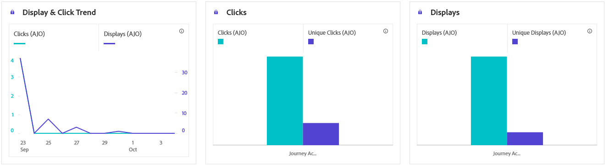

# Relatório de jornada baseado em código {#journey-global-report}

## Exibir e clicar {#impressions-code}

Os gráficos de **[!UICONTROL Exibição e clique]** apresentam uma análise detalhada do envolvimento dos seus perfis com as suas experiências baseadas em código, oferecendo insights valiosos sobre como os perfis interagem com o seu conteúdo.

+++ Saiba mais sobre métricas de Impressão e Clique

* **[!UICONTROL Cliques únicos]**: número de perfis que clicaram em um conteúdo em suas experiências.

* **[!UICONTROL Cliques]**: número de vezes que um conteúdo foi clicado em suas experiências.

* **[!UICONTROL Exibições]**: número de vezes que a experiência foi aberta.

* **[!UICONTROL Exibições exclusivas]**: número de vezes que a experiência foi aberta, várias interações de um perfil não são consideradas.

+++

## Dados de rastreamento {#track-data-code}

A tabela **[!UICONTROL Dados de rastreamento]** oferece um instantâneo detalhado da atividade do perfil vinculado às suas experiências baseadas em código, fornecendo insights essenciais sobre o envolvimento e a eficácia das experiências.

+++ Saiba mais sobre Rastreamento de métricas de dados

* **[!UICONTROL Pessoas]**: número de perfis de usuário qualificados como perfis de destino para suas experiências.

* **[!UICONTROL Taxa de cliques (CTR)]**: porcentagem de usuários que interagiram com suas experiências.

* **[!UICONTROL Cliques]**: número de vezes que um conteúdo foi clicado em suas experiências.

* **[!UICONTROL Cliques únicos]**: número de perfis que clicaram em um conteúdo em suas experiências.

* **[!UICONTROL Exibições]**: número de vezes que sua experiência foi aberta.

* **[!UICONTROL Exibições exclusivas]**: número de vezes que sua experiência foi aberta, várias interações de um perfil não são consideradas.

+++

## Rótulos de link rastreado {#track-link-code}

A tabela **[!UICONTROL Rótulos de links rastreados]** oferece uma visão geral abrangente dos rótulos de links em suas experiências baseadas em código, destacando aquelas que geram o maior tráfego de visitantes. Esse recurso permite identificar e priorizar os links mais populares.

+++ Saiba mais sobre métricas de rótulos de link rastreado

* **[!UICONTROL Cliques únicos]**: número de perfis que clicaram em um conteúdo em suas experiências baseadas em código.

* **[!UICONTROL Cliques]**: número de vezes que um conteúdo foi clicado em suas experiências baseadas em código.

* **[!UICONTROL Exibições]**: número de vezes que a experiência foi aberta.

* **[!UICONTROL Exibições exclusivas]**: número de vezes que a experiência foi aberta, várias interações de um perfil não são consideradas.

+++
