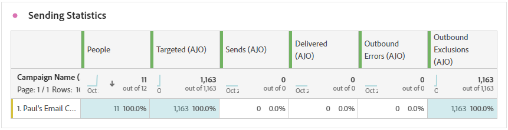

# Relatório de jornada de correspondência direta {#journey-global-report}

>[!BEGINSHADEBOX]

**Nesta página:** Saiba como ler as métricas de correspondência direta no relatório de jornada, incluindo estatísticas de envio, status da entrega, motivos de erro e motivos de exclusão de suas mensagens de correspondência direta.

>[!ENDSHADEBOX]

>[!BEGINSHADEBOX]

Você pode acessar seu relatório de jornada por correspondência direta clicando no botão **[!UICONTROL Exibir relatório]** em sua jornada. [Saiba mais](report-gs-cja.md)

>[!ENDSHADEBOX]

## Estatísticas de envio {#sending-statistics-directmail}

A tabela **[!UICONTROL Estatísticas de Envio]** fornece uma insight do desempenho das jornadas de correspondência direta. Veja as métricas principais, como o número de recipients alvos e as peças entregues com êxito, ajudando você a medir o alcance e a eficácia de suas correspondências.

+++ Saiba mais sobre como enviar métricas de estatísticas

* **[!UICONTROL Pessoas]**: número de perfis de usuário qualificados como perfis de destino para suas mensagens.

* **[!UICONTROL Direcionado]**: número de perfis qualificados para o público-alvo antes da aplicação de exclusões, supressões ou remoções de consentimento. Em jornadas com reentrada ativada, um perfil pode ser direcionado várias vezes.

* **[!UICONTROL Envios]**: número total de envios para suas mensagens de correspondência direta.

* **[!UICONTROL Entregues]**: número de mensagens de correspondência direta enviadas com êxito em relação ao número total de mensagens enviadas.

* **[!UICONTROL Erros de Saída]**: Número total de erros ocorridos durante o processo de envio que impediram o envio para perfis.

* **[!UICONTROL Exclusões de saída]**: número de perfis excluídos pelo Adobe Journey Optimizer.

+++

## Status da entrega {#delivery-status-directmail}

O gráfico **[!UICONTROL Status da entrega]** fornece uma exibição abrangente dos dados relacionados às mensagens de correspondência direta enviadas em sua jornada, oferecendo insights sobre as métricas principais, como entregas e erros. Isso permite uma análise detalhada do processo de envio de mensagens de correspondência direta, fornecendo informações valiosas sobre a eficiência e o desempenho de suas jornadas.

+++ Saiba mais sobre Métricas de status de entrega

* **[!UICONTROL Entregues]**: número de mensagens de correspondência direta enviadas com êxito em relação ao número total de mensagens de correspondência direta enviadas.

* **[!UICONTROL Erros de saída]**: número total de erros que ocorreram durante um processo de envio, impedindo que suas mensagens de correspondência direta fossem enviadas para perfis.

* **[!UICONTROL Exclusões de saída]**: número de perfis excluídos pelo Adobe Journey Optimizer.

+++

## Motivos do erro {#error-reasons-directmail}

A tabela **[!UICONTROL Motivos de Erro]** permite identificar os erros específicos que ocorreram durante o processo de envio de suas mensagens de correspondência direta, facilitando uma análise completa de todos os problemas encontrados.

## Motivos para exclusão {#exclude-reasons-directmail}

A tabela **[!UICONTROL Motivos da exclusão]** mostra visualmente os diversos fatores que levaram à exclusão de perfis de usuário do público-alvo direcionado, impedindo-o de receber suas mensagens de correspondência direta.

Consulte [esta página](exclusion-list.md) para obter uma lista abrangente dos motivos de exclusão.
