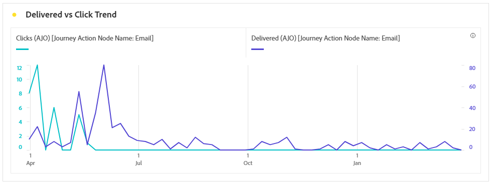
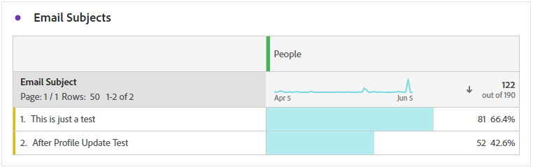

# Relatório de jornada por email {#journey-global-report}

>[!BEGINSHADEBOX]

Como a Apple apresentou novos recursos de proteção de privacidade para seu aplicativo de email nativo, incluindo a Proteção de privacidade de email, os remetentes não podem mais usar pixels de rastreamento para coletar dados em perfis que ativaram a Proteção de privacidade de email da Apple. Consequentemente, a capacidade do Adobe Journey Optimizer de rastrear aberturas de email usando pixels de rastreamento pode ser afetada. [Saiba mais](https://experienceleaguecommunities.adobe.com/t5/adobe-campaign-classic-blogs/the-impact-of-apple-ios-privacy-changes-on-email-marketing-and/ba-p/699780) sobre o impacto das alterações na privacidade do Apple iOS no marketing por email.

Recomendamos o foco em cliques e métricas de conversão, em vez de taxas abertas, para obter insights mais precisos.

>[!ENDSHADEBOX]

## Tendência de Entregas vs. Cliques {#delivered-click}

O gráfico de tendência **[!UICONTROL Entregues versus Cliques]** apresenta uma análise detalhada do envolvimento de seus perfis com seus emails, oferecendo insights valiosos sobre como vários domínios interagem com seu conteúdo.

+++ Saiba mais sobre métricas de tendência Entregue versus Clique

* **[!UICONTROL Entregues]**: número de emails enviados com êxito em relação ao número total de emails enviados.

* **[!UICONTROL Cliques]**: número de vezes que um conteúdo foi clicado em seus emails.

+++

## Status da entrega {#delivery-status}

O gráfico **[!UICONTROL Status da entrega]** permite que você veja rapidamente o desempenho de seus emails. Acompanhe as principais métricas, como entregas e devoluções, permitindo que você entenda rapidamente a eficiência da sua jornada de email.

+++ Saiba mais sobre Métricas de status de entrega

* **[!UICONTROL Entregues]**: número de emails enviados com êxito em relação ao número total de emails enviados.

* **[!UICONTROL Rejeições para canais de saída]**: Total de erros acumulados durante o processo de envio e o processamento automático de retorno em relação ao número total de mensagens enviadas.

* **[!UICONTROL Erros de saída]**: número total de erros ocorridos durante um processo de envio que impediram o envio para perfis.

* **[!UICONTROL Excluídos]**: número de perfis excluídos pelo Adobe Journey Optimizer.

+++

## Estatísticas de envio {#email-sending-statistics}

A tabela **[!UICONTROL Estatísticas de Envio]** fornece uma visão clara do desempenho de seus emails em suas jornadas. Ele rastreia métricas principais como taxas de entrega e interações, fornecendo insights valiosos para otimizar sua estratégia de email para obter melhor alcance e engajamento.

+++ Saiba mais sobre como enviar métricas de estatísticas

* **[!UICONTROL Pessoas]**: número de perfis de usuário qualificados como perfis de destino para suas mensagens.

* **[!UICONTROL Direcionado]**: número total de emails processados durante o processo de envio.

* **[!UICONTROL Envios]**: número total de envios para o seu email.

* **[!UICONTROL Entregues]**: número de emails enviados com êxito em relação ao número total de mensagens enviadas.

* **[!UICONTROL Rejeições]**: total de erros acumulados durante o processo de envio e o processamento de retorno automático em relação ao número total de mensagens enviadas.

* **[!UICONTROL Erros de Saída]**: Número total de erros ocorridos durante o processo de envio que impediram o envio para perfis.

* **[!UICONTROL Exclusões de saída]**: número de perfis excluídos pelo Adobe Journey Optimizer.

+++

## Email: estatísticas de rastreamento {#email-tracking}

A tabela **[!UICONTROL Email - Estatísticas de rastreamento]** oferece uma conta detalhada da atividade do perfil relacionada aos emails incluídos na sua jornada. Isso inclui métricas sobre aberturas, cliques e outros indicadores de engajamento relevantes, oferecendo uma visualização abrangente de como os perfis interagem com seu conteúdo de email.

+++ Saiba mais sobre métricas de estatísticas de rastreamento

* **[!UICONTROL Taxa de cliques (CTR)]**: porcentagem de usuários que interagiram com o email.

* **[!UICONTROL Taxa de abertura de click-through (CTOR)]**: número de vezes que o email foi aberto.

* **[!UICONTROL Cliques]**: número de vezes que um conteúdo foi clicado em seus emails.

* **[!UICONTROL Cliques únicos]**: número de perfis que clicaram em um conteúdo em um email.

* **[!UICONTROL Aberturas de email]**: Número de vezes que seus emails foram abertos em uma jornada.

* **[!UICONTROL Aberturas de email únicas]**: porcentagem de emails abertos.

* **[!UICONTROL Reclamações de spam]**: número de vezes que uma mensagem foi declarada como spam ou lixo eletrônico.

* **[!UICONTROL Cancelamentos de assinatura]**: Número de cliques no link de cancelamento de assinatura.

+++

## Domínios de email {#email-domains}

A tabela **[!UICONTROL Domínios de email]** oferece uma análise detalhada dos emails categorizados por domínio, fornecendo insights abrangentes sobre as métricas de desempenho das suas jornadas de email. Essa análise abrangente permite que você entenda o comportamento de domínios diferentes em resposta ao seu conteúdo de email.

+++ Saiba mais sobre métricas de domínios de email

* **[!UICONTROL Envios]**: número total de envios para o seu email.

* **[!UICONTROL Entregues]**: número de emails enviados com êxito em relação ao número total de emails enviados.

* **[!UICONTROL Aberturas de email]**: Número de vezes que seus emails foram abertos em uma jornada.

* **[!UICONTROL Cliques]**: número de vezes que um conteúdo foi clicado em seus emails.

* **[!UICONTROL Rejeições para canais de saída]**: Número total de erros acumulados durante o processo de envio e o processamento automático de retorno em relação ao número total de emails enviados.

* **[!UICONTROL Erros de Saída]**: Número total de erros ocorridos durante o processo de envio que impediram o envio para perfis.
+++

## Rótulos de link rastreado {#track-link-label}

A tabela **[!UICONTROL Rótulos de links rastreados]** oferece uma visão geral abrangente dos rótulos de links em seus emails, destacando aqueles que geram o maior tráfego de visitantes. Esse recurso permite identificar e priorizar os links mais populares.

+++ Saiba mais sobre métricas de rótulos de link rastreado

* **[!UICONTROL Cliques únicos]**: número de perfis que clicaram em um conteúdo em um email.

* **[!UICONTROL Cliques]**: número de vezes que um conteúdo foi clicado em seus emails.

+++

## URLs do link rastreado {#track-link-url}

A tabela **[!UICONTROL URLs de link rastreado]** fornece uma visão geral abrangente das URLs de seu email que atraem o maior tráfego de visitantes. Isso permite identificar e priorizar os links mais populares, melhorando sua compreensão do envolvimento do perfil com conteúdo específico em seus emails.

+++ Saiba mais sobre métricas de URLs de link rastreado

* **[!UICONTROL Cliques únicos]**: número de perfis que clicaram em um conteúdo em um email.

* **[!UICONTROL Cliques]**: número de vezes que um conteúdo foi clicado em seus emails.

* **[!UICONTROL Exibições]**: número de vezes que a mensagem foi aberta.

* **[!UICONTROL Exibições exclusivas]**: número de vezes que a mensagem foi aberta; várias interações de um perfil não são consideradas.

+++

## Assuntos de email {#email-subject}

A tabela **[!UICONTROL Assuntos de email]** apresenta uma visão geral completa dos assuntos de email que atraíram o maior tráfego de visitantes. Esse recurso oferece informações valiosas sobre a dinâmica do envolvimento do público-alvo.

+++ Saiba mais sobre métricas de assuntos de email

* **[!UICONTROL Pessoas]**: número de perfis de usuário qualificados como perfis de destino para seus emails.

+++

## Motivos de rejeição {#email-bounce-reasons}

A tabela **[!UICONTROL Motivos de rejeição]** compila os dados disponíveis relacionados às mensagens rejeitadas, fornecendo insights detalhados sobre os motivos específicos por trás das rejeições de email.

Para obter mais informações sobre rejeições, consulte a página [Lista de supressão](../reports/suppression-list.md).

## Motivos para exclusão {#email-excluded}

A tabela **[!UICONTROL Motivos excluídos]** apresenta uma exibição abrangente dos diferentes fatores que resultaram na exclusão de perfis de usuário do público-alvo direcionado, resultando no não recebimento da mensagem.

Consulte [esta página](exclusion-list.md) para obter uma lista abrangente dos motivos de exclusão.

## Motivos do erro {#email-errors}

A tabela **[!UICONTROL Motivos de Erro]** oferece visibilidade sobre os erros específicos ocorridos durante o processo de envio, fornecendo informações valiosas sobre a natureza e a ocorrência de erros.
