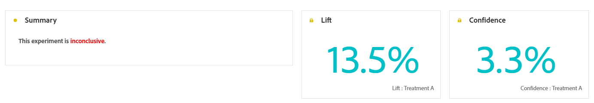

# Relatório de jornada de experimentação {#campaign-global-report-cja-experimentation}

Seu relatório de Jornada fornece uma visão completa do desempenho de seu experimento, juntamente com as métricas principais necessárias para entender seu impacto.

No Journey Optimizer, a experimentação do jornada é dividida em dois tipos:

* [Experimentos de conteúdo](../content-management/content-experiment.md)
* [Experimentos de caminho](../building-journeys/optimize.md)

## Experimento de caminho {#experimentation}

>[!NOTE]
>
> As tabelas e os KPIs detalhados para o experimento de Conteúdo são os mesmos de um experimento de Caminho. Consulte a documentação abaixo se tiver configurado um experimento de Conteúdo.

### KPIs de experimentação {#experimentation-kpis}

O **Resumo da experimentação** fornece informações importantes sobre o desempenho do seu experimento e identifica o mais bem-sucedido. Observe que a definição do melhor desempenho pode levar algum tempo. Se o experimento não for bem-sucedido, ele será definido como **Inconclusivo**.

Os **Indicadores-chave de desempenho (KPIs) de experimentação** funcionam como um painel abrangente, fornecendo uma análise das métricas essenciais associadas à sua experimentação.

+++ Saiba mais sobre métricas de KPIs de experimentação

* **[!UICONTROL Aumento]**: medida da melhora da porcentagem na taxa de conversão de um determinado tratamento em relação à linha de base.

* **[!UICONTROL Confiança]**: evidência de que um determinado tratamento é igual ao tratamento de linha de base. [Saiba mais](../content-management/experiment-calculations.md#understand-confidence)

+++

### Variante por métricas de sucesso {#variant-inbound}

A tabela **Variante por métricas de sucesso** mostra o desempenho de cada variante com base na métrica de sucesso selecionada ao configurar o experimento.
Para aprofundar esses resultados e como interpretá-los, consulte [esta página](../content-management/get-started-experiment.md#interpret-results).

+++ Saiba mais sobre a Variante por métrica de sucesso

* **[!UICONTROL Pessoas]**: número de perfis de usuário qualificados como perfis de destino para suas mensagens.

* **[!UICONTROL Cliques de entrada]**: valor total da métrica de Sucesso, selecionada anteriormente ao criar seus Experimentos.

* **[!UICONTROL Taxa de conversão]**: valor total da métrica de Sucesso, selecionada anteriormente ao criar seus Experimentos, dividido pelo número de perfis.

* **[!UICONTROL Aumento]**: medida da melhora da porcentagem na taxa de conversão de um determinado tratamento em relação à linha de base.

* **[!UICONTROL Limite inferior de confiança]**: valor estimado mais baixo da diferença da taxa de conversão entre o tratamento e a linha de base, dentro do intervalo de confiança escolhido.

* **[!UICONTROL Confiança]**: evidência de que um determinado tratamento é igual ao tratamento de linha de base. [Saiba mais](../content-management/experiment-calculations.md#understand-confidence)

* **[!UICONTROL Limite superior de confiança]**: valor estimado mais alto da diferença da taxa de conversão entre o tratamento e a linha de base, dentro do intervalo de confiança escolhido.

+++

### Taxa de conversão para a métrica de Sucesso {#conversion-rate}

O gráfico **[!UICONTROL Intervalo de confiança]** mostra o intervalo de melhorias possíveis, comparando a linha de base com o tratamento de melhor desempenho para a métrica de sucesso escolhida. [Saiba mais](../content-management/experiment-calculations.md#confidence-intervals).
