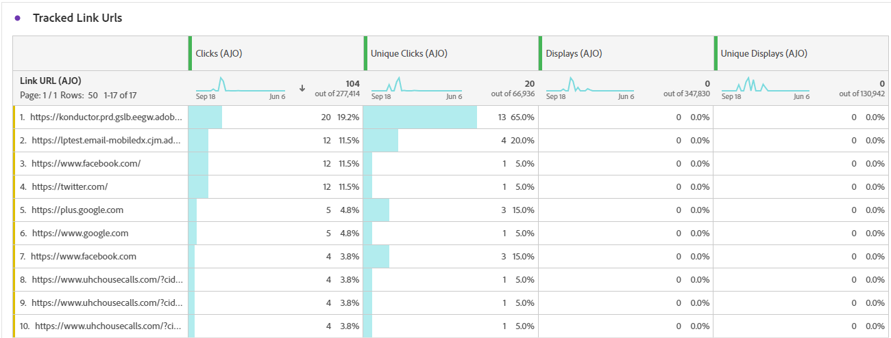

# Relatório de jornada no aplicativo {#journey-global-report}

>[!BEGINSHADEBOX]

**Nesta página:** Saiba como ler as métricas de mensagem no aplicativo no relatório de jornada, incluindo tendências de exibição e cliques, dados de rastreamento e rótulos de links rastreados para suas mensagens no aplicativo.

>[!ENDSHADEBOX]

>[!INFO]
>
>O relatório de jornada pode mostrar informações de várias jornadas simultaneamente, pois os usuários podem estar envolvidos em mais de uma jornada por vez. Como resultado, as comunicações de entrada (no aplicativo, na Web e baseadas em código) podem ser exibidas em várias jornadas se forem acionadas para um usuário que participa de jornadas ativas simultâneas, o que pode resultar na sobreposição de dados.

>[!BEGINSHADEBOX]

Você pode acessar o relatório de jornada no aplicativo clicando no botão **[!UICONTROL Relatórios]** na jornada. [Saiba mais](report-gs-cja.md)

>[!ENDSHADEBOX]

## Exibir tendência de &amp; cliques {#display-click-trend}

O gráfico de **[!UICONTROL Tendência de exibição e clique]** apresenta uma análise detalhada do envolvimento dos seus perfis com as mensagens no aplicativo, oferecendo informações valiosas sobre como os perfis interagem com o seu conteúdo.

+++ Saiba mais sobre Métricas de tendência de exibição e clique

* **[!UICONTROL Cliques]**: número de vezes que o usuário interagiu com as mensagens no aplicativo.

* **[!UICONTROL Exibições]**: número de vezes que a mensagem no aplicativo foi mostrada ao usuário.

+++

## Cliques {#clicks-inapp}

O gráfico **[!UICONTROL Cliques]** exibe métricas de cliques no aplicativo, ilustrando o número total de cliques no conteúdo e o número de perfis únicos que clicaram no conteúdo.

+++ Saiba mais sobre métricas de cliques

* **[!UICONTROL Cliques únicos]**: número de perfis que clicaram em um conteúdo em suas mensagens no aplicativo

* **[!UICONTROL Cliques]**: número de vezes que o usuário interagiu com as mensagens no aplicativo.

+++

## Exibir {#display-inapp}

O gráfico **[!UICONTROL Exibições]** ajuda você a entender o alcance geral da mensagem e o número de perfis únicos que estão se envolvendo com ela.

+++ Saiba mais sobre Métricas de exibição

* **[!UICONTROL Exibições]**: número de vezes que a mensagem no aplicativo foi mostrada ao usuário.

* **[!UICONTROL Exibições exclusivas]**: número de vezes que a mensagem foi aberta; várias interações de um perfil não são consideradas.

+++

## Dados de rastreamento {#tracking-data-inapp}

A tabela **[!UICONTROL Dados de rastreamento]** oferece um instantâneo detalhado da atividade do perfil vinculada às suas mensagens no aplicativo, fornecendo insights essenciais sobre a participação e a eficácia das mensagens no aplicativo.

+++ Saiba mais sobre Rastreamento de métricas de dados

* **[!UICONTROL Pessoas]**: número de perfis de usuário qualificados como perfis de destino para suas mensagens no aplicativo.

* **[!UICONTROL Taxa de cliques (CTR)]**: porcentagem de usuários que interagiram com as mensagens no aplicativo.

* **[!UICONTROL Taxa de abertura de cliques (CTOR)]**: Número de vezes que as mensagens no aplicativo foram abertas.

* **[!UICONTROL Cliques]**: número de vezes que o usuário interagiu com as mensagens no aplicativo.

* **[!UICONTROL Cliques únicos]**: número de perfis que clicaram em um conteúdo em suas mensagens no aplicativo.

* **[!UICONTROL Exibições]**: número de vezes que a mensagem no aplicativo foi mostrada ao usuário.

* **[!UICONTROL Exibições exclusivas]**: número de vezes que a mensagem foi aberta; várias interações de um perfil não são consideradas.

* **[!UICONTROL Envios]**: número total de envios para suas mensagens no aplicativo.

* **[!UICONTROL Entrada acionada]**: Número de vezes que uma mensagem no aplicativo foi acionada por uma interação do usuário ou evento predefinido.

* **[!UICONTROL Descartes de entrada]**: número de vezes que os usuários rejeitaram a mensagem no aplicativo sem interagir com ela.

+++

## Rótulos de link rastreado {#track-link-label-inapp}

A tabela **[!UICONTROL Rótulos de links rastreados]** oferece uma visão geral abrangente dos rótulos de links em suas mensagens no aplicativo, destacando aquelas que geram o maior tráfego de visitantes. Esse recurso permite identificar e priorizar os links mais populares.

+++ Saiba mais sobre Métricas de rótulos de link rastreado

* **[!UICONTROL Cliques únicos]**: número de perfis que clicaram em um conteúdo em suas mensagens no aplicativo.

* **[!UICONTROL Cliques]**: número de vezes que o usuário interagiu com as mensagens no aplicativo.

* **[!UICONTROL Exibições]**: número de vezes que a mensagem no aplicativo foi mostrada ao usuário.

* **[!UICONTROL Exibições exclusivas]**: número de vezes que a mensagem foi aberta; várias interações de um perfil não são consideradas.

+++

## URLs do link rastreado {#track-link-url-inapp}

A tabela **[!UICONTROL URLs de link rastreado]** fornece uma visão geral abrangente das URLs nas mensagens no aplicativo que atraem o maior tráfego de visitantes. Isso permite identificar e priorizar os links mais populares, melhorando sua compreensão da participação do perfil com conteúdo específico em suas mensagens no aplicativo.

+++ Saiba mais sobre Métricas de URLs de link rastreado

* **[!UICONTROL Cliques únicos]**: número de perfis que clicaram em um conteúdo em suas mensagens no aplicativo

* **[!UICONTROL Cliques]**: número de vezes que o usuário interagiu com as mensagens no aplicativo.

+++
