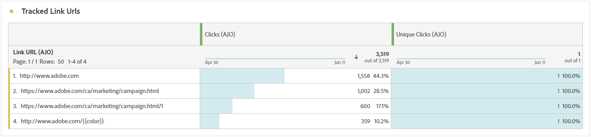

# Relatório de jornada de notificação por push {#journey-global-report}

>[!BEGINSHADEBOX]

Você pode acessar o relatório de jornadas por notificação por push clicando no botão **[!UICONTROL Exibir relatório]** na jornada. [Saiba mais](report-gs-cja.md)

>[!ENDSHADEBOX]

## Estatísticas de envio {#sending-statistics-push}

A tabela **[!UICONTROL Estatísticas de envio]** ajuda você a entender o desempenho das notificações por push. Ele inclui métricas principais, como taxa de entrega e tamanho do público-alvo, fornecendo informações valiosas sobre a eficácia e o alcance de suas jornadas.

+++ Saiba mais sobre como enviar métricas de estatísticas

* **[!UICONTROL Pessoas]**: número de perfis de usuário qualificados como perfis de destino para suas mensagens SMS.

* **[!UICONTROL Direcionado]**: número de perfis qualificados para o público-alvo antes da aplicação de exclusões, supressões ou remoções de consentimento. Em jornadas com reentrada ativada, um perfil pode ser direcionado várias vezes.

* **[!UICONTROL Envios]**: número total de envios para a notificação por push.

* **[!UICONTROL Entregue]**: número de notificações por push enviadas com êxito em relação ao número total de notificações por push enviadas.

* **[!UICONTROL Rejeições para canais de saída]**: total de erros acumulados durante o processo de envio e o processamento automático de retorno em relação ao número total de notificações por push.

* **[!UICONTROL Erros de saída]**: número total de erros que ocorreram, impedindo que fossem enviados a perfis.

* **[!UICONTROL Exclusões de saída]**: número de perfis excluídos pelo Adobe Journey Optimizer.

+++

## Estatísticas de rastreamento {#tracking-statistics-push}

A tabela **[!UICONTROL Estatísticas de rastreamento]** oferece um instantâneo detalhado da atividade do perfil vinculada às suas notificações por push, fornecendo insights essenciais sobre a eficácia do envolvimento e das notificações por push.

+++ Saiba mais sobre as métricas de estatísticas de rastreamento

* **[!UICONTROL Taxa de cliques (CTR)]**: porcentagem de usuários que interagiram com a notificação por push.

* **[!UICONTROL Taxa de abertura de click-through (CTOR)]**: número de vezes que a notificação por push foi aberta.

* **[!UICONTROL Cliques]**: número de vezes que um conteúdo foi clicado em sua notificação por push.

* **[!UICONTROL Cliques únicos]**: número de perfis que clicaram em um conteúdo em sua notificação por push.

* **[!UICONTROL Ações personalizadas por push]**: número de ações personalizadas executadas por perfis em resposta às notificações por push.
+++

## Rótulos de link rastreado {#track-link-label-push}

A tabela **[!UICONTROL Rótulos de links rastreados]** oferece uma visão geral abrangente dos rótulos de links em suas notificações por push, destacando aqueles que geram o maior tráfego de visitantes. Esse recurso permite identificar e priorizar os links mais populares.

+++ Saiba mais sobre Métricas de rótulos de link rastreado

* **[!UICONTROL Cliques únicos]**: número de perfis que clicaram em um conteúdo em suas notificações por push.

* **[!UICONTROL Cliques]**: número de vezes que um conteúdo foi clicado em suas notificações por push.

+++

## URLs do link rastreado {#track-link-url-push}

A tabela **[!UICONTROL URLs de links rastreados]** fornece uma visão geral abrangente das URLs nas suas notificações por push que atraem o maior tráfego de visitantes. Isso permite identificar e priorizar os links mais populares, melhorando sua compreensão do envolvimento do perfil com conteúdo específico em suas notificações por push.

+++ Saiba mais sobre Métricas de URLs de link rastreado

* **[!UICONTROL Cliques únicos]**: número de perfis que clicaram em um conteúdo em suas notificações por push.

* **[!UICONTROL Cliques]**: número de vezes que um conteúdo foi clicado em suas notificações por push.

+++

## Motivos de rejeição {#bounce-reasons-push}

A tabela **[!UICONTROL Motivos de rejeições]** fornece uma visão geral abrangente dos dados relacionados às notificações por push rejeitadas, fornecendo insights valiosos sobre os motivos específicos por trás das instâncias de rejeições de notificações por push.

## Motivos do erro {#error-reasons-push}

A tabela **[!UICONTROL Motivos de erro]** permite identificar os erros específicos que ocorreram durante o processo de envio de suas notificações por push, facilitando uma análise completa de todos os problemas encontrados.

## Motivos para exclusão {#exclude-reasons-push}

A tabela **[!UICONTROL Motivos da exclusão]** mostra visualmente os diversos fatores que levaram à exclusão de perfis de usuário do público-alvo, impedindo-o de receber suas notificações por push.

Consulte [esta página](exclusion-list.md) para obter uma lista abrangente dos motivos de exclusão.
