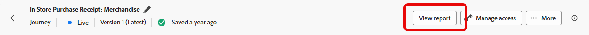

# Relatório de jornada na web {#journey-global-report}

>[!INFO]
>
>O relatório de jornada pode mostrar informações de várias jornadas simultaneamente, pois os usuários podem estar envolvidos em mais de uma jornada por vez. Como resultado, as comunicações de entrada (no aplicativo, na Web e baseadas em código) podem ser exibidas em várias jornadas se forem acionadas para um usuário que participa de jornadas ativas simultâneas, o que pode resultar na sobreposição de dados.

>[!BEGINSHADEBOX]

Você pode acessar seu relatório de jornada na Web clicando no botão **[!UICONTROL Exibir relatório]** em sua jornada. [Saiba mais](report-gs-cja.md)

>[!ENDSHADEBOX]

## Tendência de impressão e clique {#impressions-web}

O gráfico **[!UICONTROL Tendência de impressão e clique]** apresenta uma análise detalhada do envolvimento dos seus perfis com as suas páginas da Web, oferecendo insights valiosos sobre como os perfis interagem com o seu conteúdo.

+++ Saiba mais sobre métricas de tendência de Impressão e Clique

* **[!UICONTROL Cliques]**: número de vezes que um conteúdo foi clicado em suas páginas da Web.

* **[!UICONTROL Exibições]**: número de vezes que a mensagem foi aberta.

+++

## Cliques {#clicks-web}

O gráfico **[!UICONTROL Cliques]** exibe as métricas de clique da página da Web, ilustrando o número total de cliques no conteúdo e o número de perfis únicos que clicaram no conteúdo.

+++ Saiba mais sobre métricas de cliques

* **[!UICONTROL Cliques únicos]**: número de perfis que clicaram em um conteúdo em suas páginas da Web.

* **[!UICONTROL Cliques]**: número de vezes que um conteúdo foi clicado em suas páginas da Web.

+++

## Exibições {#displays-web}

O gráfico **[!UICONTROL Exibições]** ajuda você a entender o alcance geral da experiência baseada em código que foi aberta e o número de perfis únicos que estão se envolvendo com ela.

+++ Saiba mais sobre Métricas de exibição

* **[!UICONTROL Exibições]**: número de vezes que a experiência baseada em código foi aberta.

* **[!UICONTROL Exibições exclusivas]**: número de vezes que a experiência baseada em código foi aberta, várias interações de um perfil não são consideradas.

+++

## Dados de rastreamento {#track-data-web}

A tabela **[!UICONTROL Dados de rastreamento]** oferece um instantâneo detalhado da atividade do perfil vinculado às suas páginas da Web, fornecendo insights essenciais sobre participação e eficácia das páginas da Web.

+++ Saiba mais sobre Rastreamento de métricas de dados

* **[!UICONTROL Pessoas]**: número de perfis de usuário qualificados como perfis de destino para suas páginas da Web.

* **[!UICONTROL Taxa de cliques (CTR)]**: porcentagem de usuários que interagiram com as páginas da Web.

* **[!UICONTROL Cliques]**: número de vezes que um conteúdo foi clicado em suas páginas da Web.

* **[!UICONTROL Cliques únicos]**: número de perfis que clicaram em um conteúdo em suas páginas da Web.

* **[!UICONTROL Exibições]**: número de vezes que a página da Web foi aberta.

* **[!UICONTROL Exibições exclusivas]**: número de vezes que a página da Web foi aberta; várias interações de um perfil não são consideradas.

+++

## Rótulos de link rastreado {#track-link-web}

A tabela **[!UICONTROL Rótulos de links rastreados]** oferece uma visão geral abrangente dos rótulos de links em suas páginas da Web, destacando aqueles que geram o maior tráfego de visitantes. Esse recurso permite identificar e priorizar os links mais populares.

+++ Saiba mais sobre métricas de rótulos de link rastreado

* **[!UICONTROL Cliques únicos]**: número de perfis que clicaram em um conteúdo em suas páginas da Web.

* **[!UICONTROL Cliques]**: número de vezes que um conteúdo foi clicado em suas páginas da Web.

* **[!UICONTROL Exibições]**: número de vezes que a mensagem foi aberta.

* **[!UICONTROL Exibições exclusivas]**: número de vezes que a mensagem foi aberta; várias interações de um perfil não são consideradas.

+++

## URLs do link rastreado {#track-url-web}

A tabela **[!UICONTROL URLs de link rastreado]** fornece uma visão geral abrangente das URLs das páginas da Web que atraem o maior tráfego de visitantes. Isso permite identificar e priorizar os links mais populares, aprimorando sua compreensão do envolvimento do perfil com conteúdo específico em suas páginas da Web.

+++ Saiba mais sobre métricas de URLs de link rastreado

* **[!UICONTROL Cliques únicos]**: número de perfis que clicaram em um conteúdo em suas páginas da Web.

* **[!UICONTROL Cliques]**: número de vezes que um conteúdo foi clicado em suas páginas da Web.

* **[!UICONTROL Exibições]**: número de vezes que a mensagem foi aberta.

* **[!UICONTROL Exibições exclusivas]**: número de vezes que a mensagem foi aberta; várias interações de um perfil não são consideradas.

+++
