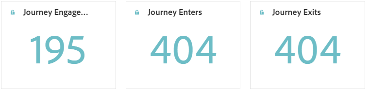
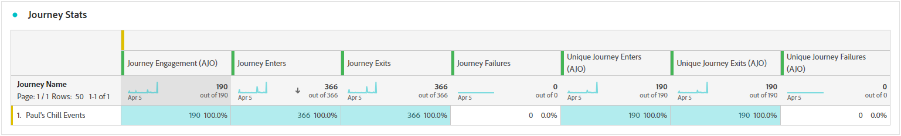
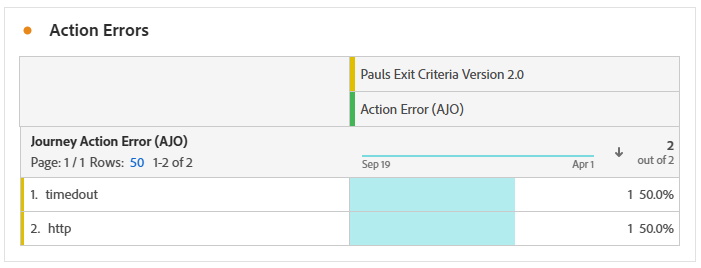
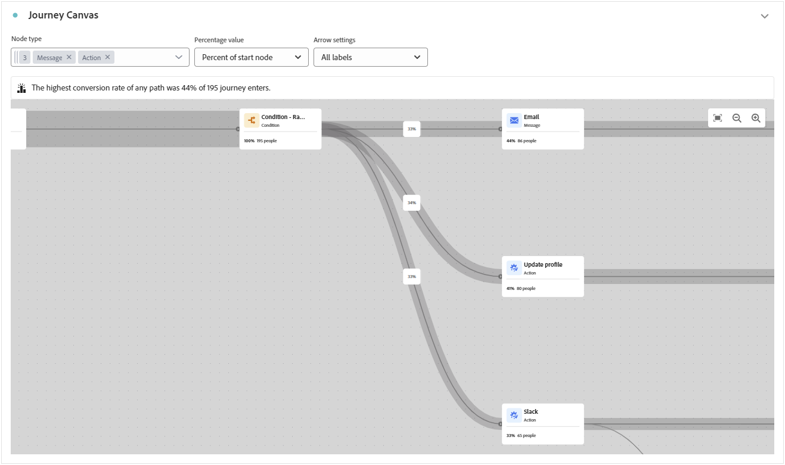
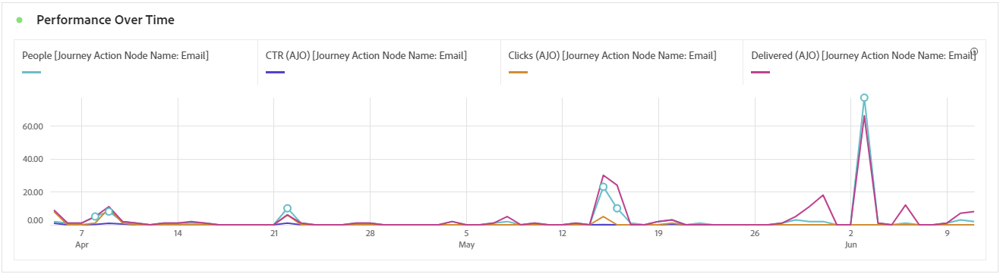
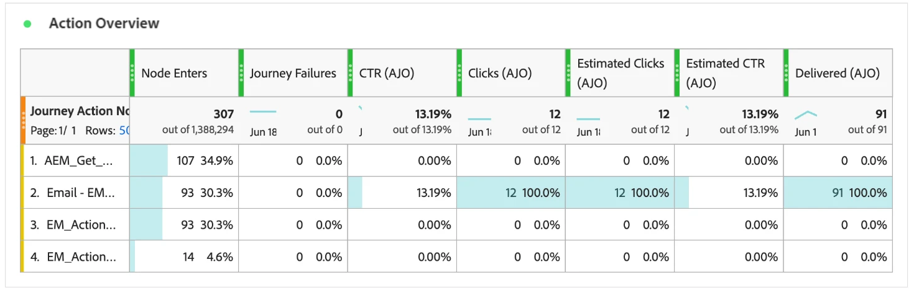
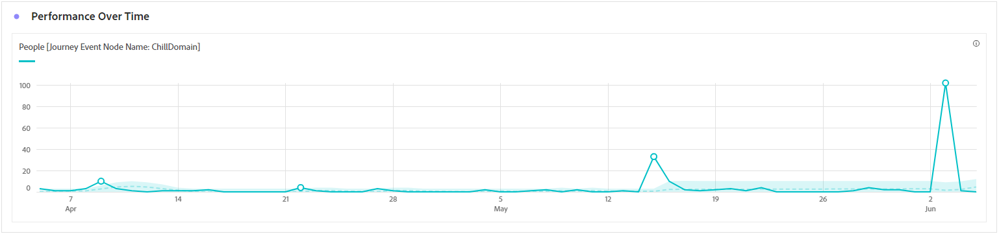
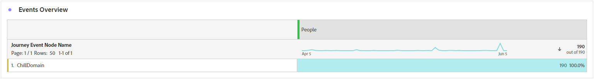

# Relatório de jornada {#journey-global-report}

O **relatório de Jornadas** funciona como um painel abrangente, fornecendo uma análise das métricas essenciais associadas à sua jornada. Isso inclui detalhes como a contagem de perfis inseridos e instâncias de jornadas individuais com falha, oferecendo uma insight abrangente sobre a eficácia e o nível de engajamento da jornada.

O **relatório de Jornadas** pode ser acessado diretamente da sua jornada com o botão **[!UICONTROL Exibir relatório]**.

Para saber mais sobre o Customer Journey Analytics Workspace e como filtrar e analisar dados, consulte [esta página](https://experienceleague.adobe.com/en/docs/analytics-platform/using/cja-workspace/home).

## Visão geral da jornada {#journey-global}

O relatório **[!UICONTROL Jornada]** fornece uma visão clara dos dados de rastreamento mais importantes sobre sua jornada.

### Jornada KPIs {#journey-perfomance}

Os Indicadores Principais de Desempenho (KPIs) da **[!UICONTROL Jornada]** funcionam como um painel abrangente, fornecendo uma análise das métricas essenciais associadas à sua jornada. Isso inclui detalhes como a contagem de perfis inseridos e instâncias de jornadas individuais com falha, oferecendo uma insight abrangente sobre a eficácia e o nível de engajamento da jornada.

+++ Saiba mais sobre as métricas de KPIs do Jornada

* **[!UICONTROL Envolvimento da Jornada]**: número total de indivíduos únicos que receberam mensagens enviadas por meio da jornada, representando perfis distintos que atingiram um ponto de ação designado na jornada.

* **[!UICONTROL Entradas de Jornada]**: número total de pessoas físicas que atingiram o evento de entrada da jornada.

* **[!UICONTROL Saídas da Jornada]**: número total de indivíduos que saíram da jornada.

+++

### Estatísticas da jornada {#journey-stats}

A tabela **[!UICONTROL Estatísticas de Jornada]** oferece um resumo detalhado de dados cruciais sobre suas jornadas. Ele inclui métricas principais como o número de falhas e entradas bem-sucedidas, fornecendo insights valiosos sobre o desempenho e o alcance de seus emails e jornadas.

+++ Saiba mais sobre as métricas de Estatísticas do Jornada

* **[!UICONTROL Exclusão de Jornada]**: número total de indivíduos que foram excluídos da jornada devido a critérios ou regras de supressão predefinidos.

* **[!UICONTROL Envolvimento da Jornada]**: número total de indivíduos únicos que receberam mensagens enviadas por meio da jornada, representando perfis distintos que atingiram um ponto de ação designado na jornada.

* **[!UICONTROL Entradas de Jornada]**: número total de pessoas físicas que atingiram o evento de entrada da jornada.

* **[!UICONTROL Saídas da Jornada]**: número total de indivíduos que saíram da jornada.

* **[!UICONTROL Falhas de Jornada]**: número total de jornadas individuais que não foram executadas com êxito.

* **[!UICONTROL Entradas de Jornada exclusivas]**: número total de pessoas físicas que atingiram o evento de entrada da jornada; várias interações de um perfil não são consideradas.

* **[!UICONTROL Saídas de Jornadas exclusivas]**: número total de indivíduos que saíram da jornada; várias interações de um perfil não são consideradas.

* **[!UICONTROL Falhas de Jornada exclusivas]**: número total de jornadas individuais que não foram executadas com êxito, várias interações de um perfil não são consideradas.

+++

## Exclusão de jornada {#journey-exclusion}

A tabela **[!UICONTROL exclusão de Jornada]** apresenta uma exibição abrangente dos diferentes fatores que resultaram na exclusão de perfis de usuário. Para investigar exclusões relacionadas a regras de negócios no nível Data Lake e identificar se os perfis foram excluídos devido a um limite ser atingido ou a uma prioridade mais baixa, use as consultas disponíveis em [esta seção](query-examples.md#business-rules-queries).

## Erro de ação {#action-error}

O widget **[!UICONTROL Erros de ação]** detalha os diferentes erros que ocorreram para as ações da sua jornada.

## Tela da jornada {#journey-canvas}

O widget **[!UICONTROL Tela de Jornada]** permite rastrear visualmente a trajetória dos perfis direcionados à medida que eles navegam pela jornada. [Saiba mais na documentação do Customer Journey Analytics](https://experienceleague.adobe.com/en/docs/analytics-platform/using/cja-workspace/visualizations/journey-canvas/journey-canvas)

Aprimore sua personalização da tela com as seguintes opções:

* Adicione ou remova o tipo de atividade desejado, como mensagens ou condições, do menu suspenso **[!UICONTROL Tipo de nó]**.
* Ajuste o **[!UICONTROL valor percentual]** para determinar a distribuição de fluxo entre caminhos de jornada diferentes.
* Personalize suas **[!UICONTROL Configurações de seta]** para incluir rótulos, condições ou optar por uma exibição limpa.
* Habilite a opção **[!UICONTROL Mostrar fallout]** para visualizar os perfis que saíram da sua jornada diretamente na tela.

As seguintes regras se aplicam ao usar a Filtragem **[!UICONTROL Tipo de Nó]**:

* Ao criar um segmento em um nó, ele ainda englobará nós de estágios anteriores da jornada, mesmo que esses nós tenham sido excluídos por meio do filtro **[!UICONTROL Tipo de nó]**.

* Não é possível criar segmentos formados por uma seta se os nós em estágios anteriores da jornada tiverem sido excluídos por meio do filtro **[!UICONTROL Tipo de nó]**. Nesse caso, a funcionalidade de clicar com o botão direito do mouse será desativada nessas setas.

## Desempenho da ação {#action-performance}

### Desempenho ao longo do tempo {#action-overtime}

O gráfico **[!UICONTROL Desempenho ao longo do tempo]** permite identificar e analisar o número de perfis que atendem aos critérios para serem considerados perfis de destino para suas ações. Essa visualização fornece insights valiosos sobre a eficácia de suas estratégias e ajuda a tomar decisões orientadas por dados para otimizar seu desempenho.

### Visão geral da ação {#action-overview}

A tabela **[!UICONTROL Visão geral das ações]** serve como um painel abrangente, que oferece uma análise das métricas principais relacionadas às ações da sua jornada. Isso inclui detalhes cruciais, como o número de interações e a taxa de cliques

+++ Saiba mais sobre Métricas de visão geral de ação

* **[!UICONTROL Entradas do nó]**: número total de indivíduos que entraram em um nó específico dentro da jornada.

* **[!UICONTROL Falha na Jornada]**: número total de jornadas individuais que não foram executadas com êxito.

* **[!UICONTROL Taxa de cliques]**: porcentagem de usuários que interagiram com a ação.

* **[!UICONTROL Cliques]**: número de vezes que um conteúdo foi clicado em suas ações.

* **[!UICONTROL Entregues]**: número de ações enviadas com êxito em relação ao número total de ações enviadas.

+++

## Desempenho de eventos {#events-performance}

### Desempenho ao longo do tempo {#event-overtime}

O gráfico **[!UICONTROL Desempenho ao longo do tempo]** permite identificar e analisar o número de perfis qualificados como perfis de destino para seus eventos. Essa poderosa ferramenta ajuda a rastrear tendências e padrões ao longo do tempo, fornecendo insights valiosos para otimizar suas estratégias de eventos.

### Visão geral do evento {#event-overview}

A tabela **[!UICONTROL Visão geral do evento]** mostra quantos perfis atendem aos seus critérios de evento ao longo do tempo. Essa ferramenta ajuda a identificar padrões nas taxas de qualificação para refinar sua estratégia de eventos.

+++ Saiba mais sobre as métricas de Estatísticas do Jornada

* **[!UICONTROL Pessoas]**: número de perfis de usuário qualificados como perfis de destino para seus eventos.

+++

## Visão geral de direcionamento {#targeting}

Se você configurar **[!UICONTROL Regras de direcionamento]** para o seu conteúdo, a tabela **[!UICONTROL Visão geral do direcionamento]** fornecerá uma exibição detalhada das principais métricas de engajamento, mostrando como os perfis direcionados para cada regra interagiram com seu conteúdo.

➡️ [Saiba mais sobre as regras de direcionamento](../content-management/optimization-targeting.md)

+++ Saiba mais sobre as métricas da visão geral de direcionamento

* **[!UICONTROL Pessoas]**: número de perfis de usuário qualificados como perfis de destino para seus eventos.

* **[!UICONTROL Cliques únicos]**: número de perfis que clicaram em um conteúdo em um email.

* **[!UICONTROL Taxa de cliques únicos]**: porcentagem de perfis segmentados que clicaram pelo menos uma vez.

+++
