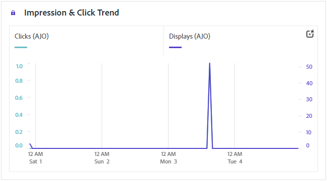

# Relatório de jornada {#journey-global-report}

A variável **Jornada relatório** O funciona como um painel abrangente, fornecendo uma análise das métricas essenciais associadas à sua jornada. Isso inclui detalhes como a contagem de perfis inseridos e instâncias de jornadas individuais com falha, oferecendo um insight abrangente sobre a eficácia e o nível de engajamento da jornada.

**Jornada relatório** pode ser acessado diretamente da sua jornada com o **[!UICONTROL Exibir relatório]** botão.

A variável **[!UICONTROL Jornada relatório]** será exibida com as seguintes guias, dependendo das atividades de mensagens na jornada:

* [Jornada](#journey-global)
* [Email](#email-global)
* [Push](#push-global)
* [SMS](#sms-global)
* [No aplicativo](#in-app-global)
* [Web](#web-cja)
* [Correspondência direta](#direct-mail-cja)

Para saber mais sobre o Customer Journey Analytics Workspace e como filtrar e analisar dados, consulte [esta página](https://experienceleague.adobe.com/en/docs/analytics-platform/using/cja-workspace/home).

## Visão geral da jornada {#journey-global}

A variável **[!UICONTROL Jornada]** O relatório fornece uma visão clara dos dados de rastreamento mais importantes sobre a jornada.

### Jornada KPIs {#journey-perfomance}

A variável **[!UICONTROL Jornada]** Os indicadores principais de desempenho (KPIs) funcionam como um painel abrangente, fornecendo uma análise das métricas essenciais associadas à sua jornada. Isso inclui detalhes como a contagem de perfis inseridos e instâncias de jornadas individuais com falha, oferecendo um insight abrangente sobre a eficácia e o nível de engajamento da jornada.

+++ Saiba mais sobre métricas de KPIs do Jornada

* **[!UICONTROL Jornada envolvimento]**: Número total de indivíduos que interagiram com as mensagens enviadas pela jornada

* **[!UICONTROL Entradas de jornada]**: Número total de indivíduos que atingiram o evento de entrada da jornada.

* **[!UICONTROL Jornada saídas]**: número total de indivíduos que saíram da jornada.

* **[!UICONTROL Falhas de jornada]**: Número total de jornadas individuais que não foram executadas com êxito.

+++

### Estatísticas da jornada {#journey-stats}

A variável **[!UICONTROL Jornada estatísticas]** A tabela oferece um resumo detalhado de dados cruciais sobre suas jornadas. Ele inclui métricas principais como o número de falhas e entradas bem-sucedidas, fornecendo insights valiosos sobre o desempenho e o alcance de seus emails e jornadas.

+++ Saiba mais sobre métricas de Estatísticas do Jornada

* **[!UICONTROL Jornada envolvimento]**: Número total de indivíduos que interagiram com as mensagens enviadas pela jornada.

* **[!UICONTROL Entradas de jornada]**: Número total de indivíduos que atingiram o evento de entrada da jornada.

* **[!UICONTROL Jornada saídas]**: número total de indivíduos que saíram da jornada.

* **[!UICONTROL Falhas de jornada]**: Número total de jornadas individuais que não foram executadas com êxito.

* **[!UICONTROL Entradas de Jornada únicas]**: Número total de indivíduos que atingiram o evento de entrada da jornada, várias interações de um perfil não são consideradas.

* **[!UICONTROL Saídas de Jornada únicas]**: Número total de indivíduos que saíram da jornada, várias interações de um perfil não são consideradas.

* **[!UICONTROL Falhas de Jornada únicas]**: Número total de jornadas individuais que não foram executadas com êxito. Várias interações de um perfil não são consideradas.

+++

## Jornada tela {#journey-canvas}

A variável **[!UICONTROL Tela de Jornada]** O widget permite rastrear visualmente a trajetória dos perfis direcionados à medida que eles navegam pela jornada.

Aprimore sua personalização da tela com as seguintes opções:

* Adicione ou remova o tipo de atividade desejado, como mensagens ou condições, da **[!UICONTROL Tipo de nó]** menu suspenso.
* Ajuste a variável **[!UICONTROL Valor percentual]** para determinar a distribuição do fluxo entre caminhos de jornada diferentes.
* Personalize seu **[!UICONTROL Configurações de seta]** para incluir rótulos, condições ou optar por uma exibição limpa.
* Ativar o **[!UICONTROL Mostrar fallout]** opção para visualizar perfis que saíram da jornada diretamente na tela.

## Desempenho da ação {#action-performance}

### Desempenho ao longo do tempo {#action-overtime}

A variável **[!UICONTROL Desempenho ao longo do tempo]** O gráfico permite identificar e analisar o número de perfis que atendem aos critérios para serem considerados perfis de destino para suas ações. Essa visualização fornece insights valiosos sobre a eficácia de suas estratégias e ajuda a tomar decisões orientadas por dados para otimizar seu desempenho.

### Visão geral da ação {#action-overview}

A variável **[!UICONTROL Visão geral da ação]** A tabela do serve como um painel abrangente, oferecendo uma análise das métricas principais relacionadas às ações na sua jornada. Isso inclui detalhes cruciais, como o número de interações e a taxa de cliques

+++ Saiba mais sobre Métricas de visão geral de ação

* **[!UICONTROL Pessoas]**: Número de perfis de usuário que se qualificam como perfis de destino para suas ações.

* **[!UICONTROL Taxa de cliques]**: Porcentagem de usuários que interagiram com a ação.

* **[!UICONTROL Cliques]**: Número de vezes que um conteúdo foi clicado em suas ações.

* **[!UICONTROL Entregue]**: Número de ações enviadas com êxito em relação ao número total de ações enviadas.

+++

## Desempenho de eventos {#events-performance}

### Desempenho ao longo do tempo {#event-overtime}

A variável **[!UICONTROL Desempenho ao longo do tempo]** O gráfico permite identificar e analisar o número de perfis qualificados como perfis de público alvo para seus eventos. Essa poderosa ferramenta ajuda a rastrear tendências e padrões ao longo do tempo, fornecendo insights valiosos para otimizar suas estratégias de eventos.

### Visão geral do evento {#event-overview}

A variável **[!UICONTROL Visão geral do evento]** A tabela mostra quantos perfis atendem aos seus critérios de evento ao longo do tempo. Essa ferramenta ajuda a identificar padrões nas taxas de qualificação para refinar sua estratégia de eventos.

+++ Saiba mais sobre métricas de Estatísticas do Jornada

* **[!UICONTROL Pessoas]**: Número de perfis de usuário que se qualificam como perfis de público-alvo para seus eventos.

+++

## Detalhes do email {#email-global}

A partir do relatório de jornada, a variável **[!UICONTROL E-mail]** A guia detalha as principais informações relacionadas aos emails enviados na jornada.

### Tendência de Entregas vs. Cliques {#delivered-click}

A variável **[!UICONTROL Tendência de Entregas vs. Cliques]** O gráfico apresenta uma análise detalhada do envolvimento dos perfis com seus emails, oferecendo insights valiosos sobre como vários domínios interagem com seu conteúdo.

+++ Saiba mais sobre métricas de tendência Entregue versus Clique

* **[!UICONTROL Entregue]**: Número de emails enviados com êxito, em relação ao número total de emails enviados.

* **[!UICONTROL Cliques]**: Número de vezes que um conteúdo foi clicado em seus emails.

+++

### Status da entrega {#delivery-status}

A variável **[!UICONTROL Status da entrega]** O gráfico permite ver rapidamente o desempenho dos emails. Acompanhe as principais métricas, como entregas e devoluções, permitindo que você entenda rapidamente a eficiência da sua jornada de email.

+++ Saiba mais sobre Métricas de status de entrega

* **[!UICONTROL Entregue]**: Número de emails enviados com êxito, em relação ao número total de emails enviados.

* **[!UICONTROL Rejeições para canais de saída]**: Total de erros acumulados durante o processo de envio e o processamento de retorno automático em relação ao número total de mensagens enviadas.

* **[!UICONTROL Erros de saída]**: Número total de erros que ocorreram durante um processo de envio, impedindo que ele fosse enviado para perfis.

* **[!UICONTROL Excluído]**: Número de perfis excluídos pelo Adobe Journey Optimizer.

+++

### Estatísticas de envio {#email-sending-statistics}

A variável **[!UICONTROL Estatísticas de envio]** A tabela fornece uma visão clara do desempenho de seus emails no jornada. Ele rastreia métricas principais como taxas de entrega e interações, fornecendo insights valiosos para otimizar sua estratégia de email para obter melhor alcance e engajamento.

+++ Saiba mais sobre como enviar métricas de estatísticas

* **[!UICONTROL Pessoas]**: Número de perfis de usuário que se qualificam como perfis de público-alvo para suas mensagens.

* **[!UICONTROL Direcionado]**: número total de emails processados durante o processo de envio.

* **[!UICONTROL Envios]**: Número total de envios para o seu email.

* **[!UICONTROL Entregue]**: Número de emails enviados com êxito, em relação ao número total de mensagens enviadas.

* **[!UICONTROL Rejeições]**: Total de erros acumulados durante o processo de envio e o processamento de retorno automático em relação ao número total de mensagens enviadas.

* **[!UICONTROL Erros de saída]**: Número total de erros que ocorreram durante o processo de envio, impedindo que ele fosse enviado para perfis.

* **[!UICONTROL Exclusões de saída]**: Número de perfis excluídos pelo Adobe Journey Optimizer.

+++

### Email: estatísticas de rastreamento {#email-tracking}

A variável **[!UICONTROL Email - Estatísticas de rastreamento]** A tabela oferece uma conta detalhada da atividade do perfil relacionada aos emails incluídos na jornada. Isso inclui métricas sobre aberturas, cliques e outros indicadores de engajamento relevantes, oferecendo uma visualização abrangente de como os perfis interagem com seu conteúdo de email.

+++ Saiba mais sobre métricas de estatísticas de rastreamento

* **[!UICONTROL Taxa de cliques (CTR)]**: porcentagem de usuários que interagiram com o email.

* **[!UICONTROL Índice de abertura de click-through (CTOR)]**: Número de vezes que o email foi aberto.

* **[!UICONTROL Cliques]**: Número de vezes que um conteúdo foi clicado em seus emails.

* **[!UICONTROL Cliques únicos]**: Número de perfis que clicaram em um conteúdo em um email.

* **[!UICONTROL Aberturas de email]**: Número de vezes que seus emails foram abertos em uma jornada.

* **[!UICONTROL Aberturas de email únicas]**: porcentagem de emails abertos.

* **[!UICONTROL Reclamações de spam]**: Número de vezes que uma mensagem foi declarada como spam ou lixo eletrônico.

* **[!UICONTROL Cancelamentos de assinatura]**: Número de cliques no link unsubscription.

+++

### Domínios de email {#email-domains}

A variável **[!UICONTROL Domínios de email]** A tabela oferece um detalhamento detalhado de emails categorizados por domínio, fornecendo insights abrangentes sobre as métricas de desempenho de suas jornadas de email. Essa análise abrangente permite que você entenda o comportamento de domínios diferentes em resposta ao seu conteúdo de email.

+++ Saiba mais sobre métricas de domínios de email

* **[!UICONTROL Envios]**: Número total de envios para o seu email.

* **[!UICONTROL Entregue]**: Número de emails enviados com êxito, em relação ao número total de emails enviados.

* **[!UICONTROL Aberturas de email]**: Número de vezes que seus emails foram abertos em uma jornada.

* **[!UICONTROL Cliques]**: Número de vezes que um conteúdo foi clicado em seus emails.

* **[!UICONTROL Rejeições para canais de saída]**: Número total de erros acumulados durante o processo de envio e o processamento automático de retorno em relação ao número total de emails enviados.

* **[!UICONTROL Erros de saída]**: Número total de erros que ocorreram durante o processo de envio, impedindo que ele fosse enviado para perfis.
+++

### Rótulos de link rastreado {#track-link-label}

A variável **[!UICONTROL Rótulos de link rastreado]** A tabela oferece uma visão geral abrangente dos rótulos de link em seus emails, destacando aqueles que geram o maior tráfego de visitantes. Esse recurso permite identificar e priorizar os links mais populares.

+++ Saiba mais sobre métricas de rótulos de link rastreado

* **[!UICONTROL Cliques únicos]**: Número de perfis que clicaram em um conteúdo em um email.

* **[!UICONTROL Cliques]**: Número de vezes que um conteúdo foi clicado em seus emails.

+++

### URLs do link rastreado {#track-link-url}

A variável **[!UICONTROL URLs de link rastreado]** A tabela fornece uma visão geral abrangente dos URLs em seu email que atraem o maior tráfego de visitantes. Isso permite identificar e priorizar os links mais populares, melhorando sua compreensão do envolvimento do perfil com conteúdo específico em seus emails.

+++ Saiba mais sobre métricas de URLs de link rastreado

* **[!UICONTROL Cliques únicos]**: Número de perfis que clicaram em um conteúdo em um email.

* **[!UICONTROL Cliques]**: Número de vezes que um conteúdo foi clicado em seus emails.

* **[!UICONTROL Exibições]**: Número de vezes que a mensagem foi aberta.

* **[!UICONTROL Exibições únicas]**: Número de vezes que a mensagem foi aberta, várias interações de um perfil não são consideradas.

+++

### Assuntos de email {#email-subject}

A variável **[!UICONTROL Assuntos de email]**  a tabela apresenta uma visão geral completa de assuntos de email que atraíram o maior tráfego de visitantes. Esse recurso oferece informações valiosas sobre a dinâmica do envolvimento do público-alvo.

+++ Saiba mais sobre métricas de assuntos de email

* **[!UICONTROL Pessoas]**: Número de perfis de usuário que se qualificam como perfis de público-alvo para seus emails.

+++

### Motivos de rejeição {#email-bounce-reasons}

A variável **[!UICONTROL Motivos de rejeição]** A tabela compila os dados disponíveis relacionados às mensagens rejeitadas, fornecendo insights detalhados sobre os motivos específicos por trás das rejeições de email.

Para obter mais informações sobre rejeições, consulte o [Lista de supressão](../reports/suppression-list.md) página.

### Motivos para exclusão {#email-excluded}

A variável **[!UICONTROL Motivos excluídos]** a tabela apresenta uma visualização abrangente dos diferentes fatores que resultaram na exclusão de perfis de usuário do público-alvo, resultando no não recebimento da mensagem.

Consulte [esta página](exclusion-list.md) para obter a lista abrangente dos motivos de exclusão.

### Motivos do erro {#email-errors}

A variável **[!UICONTROL Motivos de erro]** A tabela oferece visibilidade dos erros específicos que ocorreram durante o processo de envio, fornecendo informações valiosas sobre a natureza e a ocorrência de erros.

## Guia Notificação por push {#push-global}

A partir do relatório de jornada, a variável **[!UICONTROL Notificação por push]** A guia detalha as informações principais relativas às notificações por push enviadas em sua jornada.

## Notificações por push {#push-notification}

### Estatísticas de envio {#sending-statistics-push}

A variável **[!UICONTROL Estatísticas de envio]** A tabela ajuda você a entender o desempenho das notificações por push. Ele inclui métricas principais, como taxa de entrega e tamanho do público-alvo, fornecendo informações valiosas sobre a eficácia e o alcance de suas jornadas.

+++ Saiba mais sobre como enviar métricas de estatísticas

* **[!UICONTROL Pessoas]**: Número de perfis de usuário que se qualificam como perfis de destino para suas mensagens SMS.

* **[!UICONTROL Direcionado]**: número total de notificações por push processadas durante a análise.

* **[!UICONTROL Envios]**: número total de envios para a notificação por push.

* **[!UICONTROL Entregue]**: número de notificações por push enviadas com êxito em relação ao número total de notificações por push enviadas.

* **[!UICONTROL Rejeições para canais de saída]**: Total de erros acumulados durante o processo de envio e o processamento de retorno automático em relação ao número total de notificações por push.

* **[!UICONTROL Erros de saída]**: Número total de erros que ocorreram que impediram o envio para perfis.

* **[!UICONTROL Exclusões de saída]**: Número de perfis excluídos pelo Adobe Journey Optimizer.

+++

### Estatísticas de rastreamento {#tracking-statistics-push}

A variável **[!UICONTROL Estatísticas de rastreamento]** A tabela oferece um instantâneo detalhado da atividade do perfil vinculada às suas notificações por push, fornecendo insights essenciais sobre a eficácia das notificações por push e de engajamento.

+++ Saiba mais sobre métricas de estatísticas de rastreamento

* **[!UICONTROL Taxa de cliques (CTR)]**: porcentagem de usuários que interagiram com a notificação por push.

* **[!UICONTROL Taxa de abertura de cliques (CTOR)]**: Número de vezes que a notificação por push foi aberta.

* **[!UICONTROL Cliques]**: Número de vezes que um conteúdo foi clicado em sua notificação por push.

* **[!UICONTROL Cliques únicos]**: Número de perfis que clicaram em um conteúdo na notificação por push.

<!--
* **[!UICONTROL Push custom actions]**: 
-->
+++

### Rótulos de link rastreado {#track-link-label-push}

A variável **[!UICONTROL Rótulos de link rastreado]** A tabela oferece uma visão geral abrangente dos rótulos de links em suas notificações por push, destacando aquelas que geram o maior tráfego de visitantes. Esse recurso permite identificar e priorizar os links mais populares.

+++ Saiba mais sobre métricas de rótulos de link rastreado

* **[!UICONTROL Cliques únicos]**: Número de perfis que clicaram em um conteúdo nas notificações por push.

* **[!UICONTROL Cliques]**: Número de vezes que um conteúdo foi clicado em suas notificações por push.

+++

### URLs do link rastreado {#track-link-url-push}

A variável **[!UICONTROL URLs de link rastreado]** A tabela fornece uma visão geral abrangente dos URLs em suas notificações por push que atraem o maior tráfego de visitantes. Isso permite identificar e priorizar os links mais populares, melhorando sua compreensão do envolvimento do perfil com conteúdo específico em suas notificações por push.

+++ Saiba mais sobre métricas de URLs de link rastreado

* **[!UICONTROL Cliques únicos]**: Número de perfis que clicaram em um conteúdo nas notificações por push.

* **[!UICONTROL Cliques]**: Número de vezes que um conteúdo foi clicado em suas notificações por push.

+++

### Motivos de rejeição {#bounce-reasons-push}

A variável **[!UICONTROL Motivos de rejeições]** A tabela fornece uma visão geral abrangente dos dados relacionados às notificações por push rejeitadas, fornecendo insights valiosos sobre os motivos específicos por trás das instâncias de rejeições de notificações por push.

### Motivos do erro {#error-reasons-push}

A variável **[!UICONTROL Motivos de erro]** A tabela permite identificar os erros específicos que ocorreram durante o processo de envio de suas notificações por push, facilitando uma análise completa de todos os problemas encontrados.

### Motivos para exclusão {#exclude-reasons-push}

A variável **[!UICONTROL Excluir motivos]** A tabela representa visualmente os diversos fatores que levaram à exclusão de perfis de usuário do público-alvo direcionado, impedindo-o de receber suas notificações por push.

Consulte [esta página](exclusion-list.md) para obter a lista abrangente dos motivos de exclusão.

## SMS {#sms}

### Tendência de Entregas vs. Cliques {#delivered-click-sms}

A variável **[!UICONTROL Tendência de Entregas vs. Cliques]** O gráfico apresenta uma análise detalhada do envolvimento de seus perfis com suas mensagens SMS, oferecendo insights valiosos sobre como vários domínios interagem com seu conteúdo.

+++ Saiba mais sobre métricas de tendência Entregue versus Clique

* **[!UICONTROL Entregue]**: Número de mensagens SMS enviadas com êxito, em relação ao número total de mensagens SMS.

* **[!UICONTROL Cliques]**: Número de vezes que um conteúdo foi clicado em suas mensagens SMS.

+++

### Status da entrega {#delivery-status-sms}

A variável **[!UICONTROL Status da entrega]** A tabela oferece uma conta detalhada da atividade do perfil relacionada às suas mensagens SMS. Isso inclui métricas sobre entregas, cliques e outros indicadores de envolvimento relevantes, oferecendo uma visualização abrangente de como os perfis interagem com seu conteúdo de SMS.

+++ Saiba mais sobre Métricas de status de entrega

* **[!UICONTROL Entregue]**: Número de mensagens SMS enviadas com êxito, em relação ao número total de mensagens SMS.

* **[!UICONTROL Rejeições para canais de saída]**: Total de erros acumulados durante o processo de envio e o processamento de retorno automático em relação ao número total de mensagens SMS enviadas.

* **[!UICONTROL Erros de saída]**: Número total de erros que ocorreram que impediram o envio para perfis.

* **[!UICONTROL Exclusões de saída]**: Número de perfis excluídos pelo Adobe Journey Optimizer.

+++

### Rótulos de link rastreado {#track-link-label-sms}

A variável **[!UICONTROL Rótulos de link rastreado]** A tabela oferece uma visão geral abrangente dos rótulos de links em suas mensagens SMS, destacando aquelas que geram o maior tráfego de visitantes. Esse recurso permite identificar e priorizar os links mais populares.

+++ Saiba mais sobre métricas de rótulos de link rastreado

* **[!UICONTROL Cliques únicos]**: Número de perfis que clicaram em um conteúdo em sua mensagem SMS.

* **[!UICONTROL Cliques]**: Número de vezes que um conteúdo foi clicado em suas mensagens SMS.

+++

### URLs do link rastreado {#track-link-url-sms}

A variável **[!UICONTROL URLs de link rastreado]** A tabela fornece uma visão geral abrangente dos URLs em suas mensagens SMS que atraem o maior tráfego de visitantes. Isso permite identificar e priorizar os links mais populares, melhorando sua compreensão da participação do perfil com conteúdo específico em suas mensagens SMS.

+++ Saiba mais sobre métricas de URLs de link rastreado

* **[!UICONTROL Cliques únicos]**: Número de perfis que clicaram em um conteúdo em sua mensagem SMS.

* **[!UICONTROL Cliques]**: Número de vezes que um conteúdo foi clicado em suas mensagens SMS.

* **[!UICONTROL Exibições]**: Número de vezes que a mensagem foi aberta.

* **[!UICONTROL Exibições únicas]**: Número de vezes que a mensagem foi aberta, várias interações de um perfil não são consideradas.

+++

### Mensagem por SMS de entrada {#sms-inbound}

A variável **[!UICONTROL Mensagem de entrada de SMS]** A tabela apresenta uma visão geral completa de quais mensagens SMS atraíram o maior tráfego de visitantes. Esse recurso oferece informações valiosas sobre a dinâmica do envolvimento do público-alvo.

+++ Saiba mais sobre métricas de mensagem de entrada SMS

* **[!UICONTROL Pessoas]**: Número de perfis de usuário que se qualificam como perfis de destino para suas mensagens SMS.

+++

### Tipo de mensagem SMS {#sms-message-type}

A variável **[!UICONTROL Tipo de mensagem SMS]** A tabela apresenta uma visão geral completa de qual tipo de mensagem SMS atraiu o maior tráfego de visitantes. Esse recurso oferece informações valiosas sobre a dinâmica do envolvimento do público-alvo.

+++ Saiba mais sobre métricas do tipo de mensagem SMS

* **[!UICONTROL Pessoas]**: Número de perfis de usuário que se qualificam como perfis de destino para suas mensagens SMS.

+++

### Provedores de SMS {#sms-providers}

A variável **[!UICONTROL Provedores de SMS]** A tabela apresenta uma visão geral completa de quais provedores de SMS atraíram o maior tráfego de visitantes. Esse recurso oferece informações valiosas sobre a dinâmica do envolvimento do público-alvo.

+++ Saiba mais sobre métricas de provedores SMS

* **[!UICONTROL Pessoas]**: Número de perfis de usuário que se qualificam como perfis de destino para suas mensagens SMS.

+++

### Motivos de rejeição {#bounce-reasons-sms}

A variável **[!UICONTROL Motivos de rejeições]** A tabela fornece uma visão geral abrangente dos dados relacionados às mensagens SMS rejeitadas, fornecendo insights valiosos sobre os motivos específicos por trás das instâncias de rejeições de mensagens SMS.

### Motivos do erro {#error-reasons-sms}

A variável **[!UICONTROL Motivos de erro]** A tabela permite identificar os erros específicos que ocorreram durante o processo de envio de suas mensagens SMS, facilitando uma análise completa de todos os problemas encontrados.

### Motivos para exclusão {#excluded-reasons-sms}

A variável **[!UICONTROL Excluir motivos]** A tabela representa visualmente os diversos fatores que levaram à exclusão de perfis de usuário do público-alvo direcionado, impedindo-o de receber suas mensagens SMS.

Consulte [esta página](exclusion-list.md) para obter a lista abrangente dos motivos de exclusão.

## No aplicativo

### Tendência de impressão e clique {#impression-click-trend}

A variável **[!UICONTROL Tendência de impressão e clique]** O gráfico apresenta uma análise detalhada do envolvimento dos perfis com as mensagens no aplicativo, oferecendo insights valiosos sobre como os perfis interagem com o seu conteúdo.

+++ Saiba mais sobre métricas de tendência de Impressão e Clique

* **[!UICONTROL Cliques]**: Número de vezes que um conteúdo foi clicado nas mensagens no aplicativo.

* **[!UICONTROL Exibições]**: Número de vezes que a mensagem foi aberta.

+++

### Cliques {#clicks-inapp}

A variável **[!UICONTROL Cliques]** O gráfico exibe métricas de cliques no aplicativo, ilustrando o número total de cliques no conteúdo e o número de perfis únicos que clicaram no conteúdo.

+++ Saiba mais sobre métricas de cliques

* **[!UICONTROL Cliques únicos]**: Número de perfis que clicaram em um conteúdo nas mensagens no aplicativo

* **[!UICONTROL Cliques]**: Número de vezes que um conteúdo foi clicado nas mensagens no aplicativo.

+++

### Exibir {#display-inapp}

A variável **[!UICONTROL Exibições]** O gráfico ajuda você a entender o alcance geral da mensagem e o número de perfis únicos que se envolvem com ela.

+++ Saiba mais sobre Métricas de exibição

* **[!UICONTROL Exibições]**: Número de vezes que a mensagem foi aberta.

* **[!UICONTROL Exibições únicas]**: Número de vezes que a mensagem foi aberta, várias interações de um perfil não são consideradas.

+++

### Dados de rastreamento {#tracking-data-inapp}

A variável **[!UICONTROL Dados de rastreamento]** A tabela oferece um instantâneo detalhado da atividade do perfil vinculada às mensagens no aplicativo, fornecendo insights essenciais sobre a participação e a eficácia das mensagens no aplicativo.

+++ Saiba mais sobre Rastreamento de métricas de dados

* **[!UICONTROL Pessoas]**: Número de perfis de usuário que se qualificam como perfis de destino para suas mensagens no aplicativo.

* **[!UICONTROL Taxa de cliques (CTR)]**: porcentagem de usuários que interagiram com as mensagens no aplicativo.

* **[!UICONTROL Taxa de abertura de cliques (CTOR)]**: Número de vezes que as mensagens no aplicativo foram abertas.

* **[!UICONTROL Cliques]**: Número de vezes que um conteúdo foi clicado nas mensagens no aplicativo.

* **[!UICONTROL Cliques únicos]**: Número de perfis que clicaram em um conteúdo nas mensagens no aplicativo.

* **[!UICONTROL Exibições]**: Número de vezes que a mensagem foi aberta.

* **[!UICONTROL Exibições únicas]**: Número de vezes que a mensagem foi aberta, várias interações de um perfil não são consideradas.

* **[!UICONTROL Envios]**: Número total de envios para suas mensagens no aplicativo.

<!--
* **[!UICONTROL Inbound triggered]**: 

* **[!UICONTROL Inbound dismisses]**: 
-->
+++

### Rótulos de link rastreado {#track-link-label-inapp}

A variável **[!UICONTROL Rótulos de link rastreado]** A tabela oferece uma visão geral abrangente dos rótulos de link em suas mensagens no aplicativo, destacando aquelas que geram o maior tráfego de visitantes. Esse recurso permite identificar e priorizar os links mais populares.

+++ Saiba mais sobre métricas de rótulos de link rastreado

* **[!UICONTROL Cliques únicos]**: Número de perfis que clicaram em um conteúdo nas mensagens no aplicativo.

* **[!UICONTROL Cliques]**: Número de vezes que um conteúdo foi clicado nas mensagens no aplicativo.

* **[!UICONTROL Exibições]**: Número de vezes que a mensagem foi aberta.

* **[!UICONTROL Exibições únicas]**: Número de vezes que a mensagem foi aberta, várias interações de um perfil não são consideradas.

+++

### URLs do link rastreado {#track-link-url-inapp}

A variável **[!UICONTROL URLs de link rastreado]** Essa tabela fornece uma visão geral abrangente dos URLs nas mensagens no aplicativo que atraem o maior tráfego de visitantes. Isso permite identificar e priorizar os links mais populares, melhorando sua compreensão da participação do perfil com conteúdo específico em suas mensagens no aplicativo.

+++ Saiba mais sobre métricas de URLs de link rastreado

* **[!UICONTROL Cliques únicos]**: Número de perfis que clicaram em um conteúdo nas mensagens no aplicativo

* **[!UICONTROL Cliques]**: Número de vezes que um conteúdo foi clicado nas mensagens no aplicativo.

+++

## Web {#web-cja}

### Tendência de impressão e clique {#impressions-web}

A variável **[!UICONTROL Tendência de impressão e clique]** O gráfico apresenta uma análise detalhada do envolvimento dos perfis com as páginas da Web, oferecendo insights valiosos sobre como os perfis interagem com o seu conteúdo.

+++ Saiba mais sobre métricas de tendência de Impressão e Clique

* **[!UICONTROL Cliques]**: Número de vezes que um conteúdo foi clicado nas páginas da Web.

* **[!UICONTROL Exibições]**: Número de vezes que a mensagem foi aberta.

+++

### Cliques {#clicks-web}

A variável **[!UICONTROL Cliques]** O gráfico exibe as métricas de clique na página da Web, ilustrando o número total de cliques no conteúdo e o número de perfis únicos que clicaram no conteúdo.

+++ Saiba mais sobre métricas de cliques

* **[!UICONTROL Cliques únicos]**: Número de perfis que clicaram em um conteúdo nas suas páginas da Web.

* **[!UICONTROL Cliques]**: Número de vezes que um conteúdo foi clicado nas páginas da Web.

+++

### Exibições {#displays-web}

A variável **[!UICONTROL Exibições]** O gráfico ajuda você a entender o alcance geral da mensagem e o número de perfis únicos que se envolvem com ela.

+++ Saiba mais sobre Métricas de exibição

* **[!UICONTROL Exibições]**: Número de vezes que a mensagem foi aberta.

* **[!UICONTROL Exibições únicas]**: Número de vezes que a mensagem foi aberta, várias interações de um perfil não são consideradas.

+++

### Dados de rastreamento {#track-data-web}

A variável **[!UICONTROL Dados de rastreamento]** A tabela oferece um instantâneo detalhado da atividade do perfil vinculada às suas páginas da Web, fornecendo insights essenciais sobre o engajamento e a eficácia das páginas da Web.

+++ Saiba mais sobre Rastreamento de métricas de dados

* **[!UICONTROL Pessoas]**: Número de perfis de usuário que se qualificam como perfis de público-alvo para suas páginas da Web.

* **[!UICONTROL Taxa de cliques (CTR)]**: porcentagem de usuários que interagiram com as páginas da Web.

* **[!UICONTROL Cliques]**: Número de vezes que um conteúdo foi clicado nas páginas da Web.

* **[!UICONTROL Cliques únicos]**: Número de perfis que clicaram em um conteúdo nas suas páginas da Web.

* **[!UICONTROL Exibições]**: Número de vezes que a página da Web foi aberta.

* **[!UICONTROL Exibições únicas]**: Número de vezes que a página da Web foi aberta, várias interações de um perfil não são consideradas.

+++

### Rótulos de link rastreado {#track-link-web}

A variável **[!UICONTROL Rótulos de link rastreado]** A tabela oferece uma visão geral abrangente dos rótulos de link em suas páginas da Web, destacando aquelas que geram o maior tráfego de visitante. Esse recurso permite identificar e priorizar os links mais populares.

+++ Saiba mais sobre métricas de rótulos de link rastreado

* **[!UICONTROL Cliques únicos]**: Número de perfis que clicaram em um conteúdo nas suas páginas da Web.

* **[!UICONTROL Cliques]**: Número de vezes que um conteúdo foi clicado nas páginas da Web.

* **[!UICONTROL Exibições]**: Número de vezes que a mensagem foi aberta.

* **[!UICONTROL Exibições únicas]**: Número de vezes que a mensagem foi aberta, várias interações de um perfil não são consideradas.

+++

### URLs do link rastreado {#track-url-web}

A variável **[!UICONTROL URLs de link rastreado]** A tabela fornece uma visão geral abrangente dos URLs nas páginas da Web que atraem o maior tráfego de visitantes. Isso permite identificar e priorizar os links mais populares, aprimorando sua compreensão do envolvimento do perfil com conteúdo específico em suas páginas da Web.

+++ Saiba mais sobre métricas de URLs de link rastreado

* **[!UICONTROL Cliques únicos]**: Número de perfis que clicaram em um conteúdo nas suas páginas da Web.

* **[!UICONTROL Cliques]**: Número de vezes que um conteúdo foi clicado nas páginas da Web.

* **[!UICONTROL Exibições]**: Número de vezes que a mensagem foi aberta.

* **[!UICONTROL Exibições únicas]**: Número de vezes que a mensagem foi aberta, várias interações de um perfil não são consideradas.

+++

## Correspondência direta {#direct-mail-cja}

### Estatísticas de envio {#sending-statistics-directmail}

A variável **[!UICONTROL Estatísticas de envio]** A tabela fornece um insight sobre o desempenho da jornada de correspondência direta. Veja as métricas principais, como o número de recipients alvos e as peças entregues com êxito, ajudando você a medir o alcance e a eficácia de suas correspondências.

+++ Saiba mais sobre como enviar métricas de estatísticas

* **[!UICONTROL Pessoas]**: Número de perfis de usuário que se qualificam como perfis de público-alvo para suas mensagens.

* **[!UICONTROL Direcionado]**: Número total de mensagens de correspondência direta processadas durante o processo de envio.

* **[!UICONTROL Envios]**: Número total de envios para suas mensagens de correspondência direta.

* **[!UICONTROL Entregue]**: Número de mensagens de correspondência direta enviadas com êxito em relação ao número total de mensagens enviadas.

* **[!UICONTROL Erros de saída]**: Número total de erros que ocorreram durante o processo de envio, impedindo que ele fosse enviado para perfis.

* **[!UICONTROL Exclusões de saída]**: Número de perfis excluídos pelo Adobe Journey Optimizer.

+++

### Status da entrega {#delivery-status-directmail}

A variável **[!UICONTROL Status da entrega]** O gráfico fornece uma visualização abrangente dos dados relacionados às mensagens de correspondência direta enviadas na jornada, oferecendo insights sobre as métricas principais, como entregas e erros. Isso permite uma análise detalhada do processo de envio de mensagens de correspondência direta, fornecendo informações valiosas sobre a eficiência e o desempenho de suas jornadas.

+++ Saiba mais sobre Métricas de status de entrega

* **[!UICONTROL Entregue]**: Número de mensagens de correspondência direta enviadas com êxito em relação ao número total de mensagens de correspondência direta enviadas.

* **[!UICONTROL Erros de saída]**: Número total de erros que ocorreram durante um processo de envio, impedindo que suas mensagens de correspondência direta fossem enviadas para perfis.

* **[!UICONTROL Exclusões de saída]**: Número de perfis excluídos pelo Adobe Journey Optimizer.

+++

### Motivos do erro {#error-reasons-directmail}

A variável **[!UICONTROL Motivos de erro]** A tabela permite identificar os erros específicos que ocorreram durante o processo de envio de suas mensagens de correspondência direta, facilitando uma análise completa de todos os problemas encontrados.

### Motivos para exclusão {#exclude-reasons-directmail}

A variável **[!UICONTROL Excluir motivos]** A tabela representa visualmente os diversos fatores que levaram à exclusão de perfis de usuário do público-alvo direcionado, impedindo-o de receber suas mensagens de correspondência direta.

Consulte [esta página](exclusion-list.md) para obter a lista abrangente dos motivos de exclusão.
