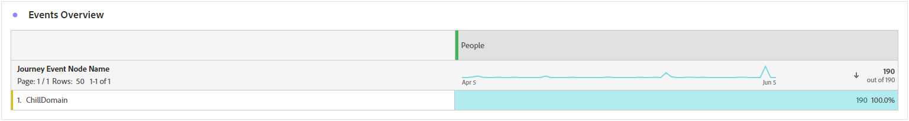
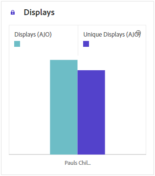

# Relatório de jornada {#journey-global-report}

O **relatório de Jornadas** funciona como um painel abrangente, fornecendo uma análise das métricas essenciais associadas à sua jornada. Isso inclui detalhes como a contagem de perfis inseridos e instâncias de jornadas individuais com falha, oferecendo um insight abrangente sobre a eficácia e o nível de engajamento da jornada.

O **relatório de Jornadas** pode ser acessado diretamente da sua jornada com o botão **[!UICONTROL Exibir relatório]**.

A página **[!UICONTROL Relatório de Jornadas]** será exibida com as seguintes guias, dependendo das atividades de mensagens em sua jornada:

* [Jornada](#journey-global)
* [Email](#email-global)
* [Push](#push-global)
* [SMS](#sms-global)
* [No aplicativo](#in-app-global)
* [Web](#web-cja)
* [Correspondência direta](#direct-mail-cja)

Para saber mais sobre o Customer Journey Analytics Workspace e como filtrar e analisar dados, consulte [esta página](https://experienceleague.adobe.com/en/docs/analytics-platform/using/cja-workspace/home).

## Visão geral da jornada {#journey-global}

O relatório **[!UICONTROL Jornada]** fornece uma visão clara dos dados de rastreamento mais importantes sobre sua jornada.

### Jornada KPIs {#journey-perfomance}

Os Indicadores Principais de Desempenho (KPIs) da **[!UICONTROL Jornada]** funcionam como um painel abrangente, fornecendo uma análise das métricas essenciais associadas à sua jornada. Isso inclui detalhes como a contagem de perfis inseridos e instâncias de jornadas individuais com falha, oferecendo um insight abrangente sobre a eficácia e o nível de engajamento da jornada.

+++ Saiba mais sobre métricas de KPIs do Jornada

* **[!UICONTROL Participação na Jornada]**: número total de pessoas que interagiram com as mensagens enviadas pela jornada

* **[!UICONTROL Entradas de Jornada]**: número total de pessoas físicas que atingiram o evento de entrada da jornada.

* **[!UICONTROL Saídas da Jornada]**: número total de indivíduos que saíram da jornada.

* **[!UICONTROL Falhas de Jornada]**: número total de jornadas individuais que não foram executadas com êxito.

+++

### Estatísticas da jornada {#journey-stats}

A tabela **[!UICONTROL Estatísticas de Jornada]** oferece um resumo detalhado de dados cruciais sobre suas jornadas. Ele inclui métricas principais como o número de falhas e entradas bem-sucedidas, fornecendo insights valiosos sobre o desempenho e o alcance de seus emails e jornadas.

+++ Saiba mais sobre métricas de Estatísticas do Jornada

* **[!UICONTROL Engajamento na Jornada]**: número total de pessoas que interagiram com as mensagens enviadas pela jornada.

* **[!UICONTROL Entradas de Jornada]**: número total de pessoas físicas que atingiram o evento de entrada da jornada.

* **[!UICONTROL Saídas da Jornada]**: número total de indivíduos que saíram da jornada.

* **[!UICONTROL Falhas de Jornada]**: número total de jornadas individuais que não foram executadas com êxito.

* **[!UICONTROL Entradas de Jornada exclusivas]**: número total de pessoas físicas que atingiram o evento de entrada da jornada; várias interações de um perfil não são consideradas.

* **[!UICONTROL Saídas de Jornadas exclusivas]**: número total de indivíduos que saíram da jornada; várias interações de um perfil não são consideradas.

* **[!UICONTROL Falhas de Jornada exclusivas]**: número total de jornadas individuais que não foram executadas com êxito, várias interações de um perfil não são consideradas.

+++

## Jornada tela {#journey-canvas}

O widget **[!UICONTROL Tela de Jornada]** permite rastrear visualmente a trajetória dos perfis direcionados à medida que eles navegam pela jornada. [Saiba mais na documentação do Customer Journey Analytics](https://experienceleague.adobe.com/en/docs/analytics-platform/using/cja-workspace/visualizations/journey-canvas/journey-canvas)

Aprimore sua personalização da tela com as seguintes opções:

* Adicione ou remova o tipo de atividade desejado, como mensagens ou condições, do menu suspenso **[!UICONTROL Tipo de nó]**.
* Ajuste o **[!UICONTROL valor percentual]** para determinar a distribuição de fluxo entre caminhos de jornada diferentes.
* Personalize suas **[!UICONTROL Configurações de seta]** para incluir rótulos, condições ou optar por uma exibição limpa.
* Habilite a opção **[!UICONTROL Mostrar fallout]** para visualizar os perfis que saíram da sua jornada diretamente na tela.

## Desempenho da ação {#action-performance}

### Desempenho ao longo do tempo {#action-overtime}

O gráfico **[!UICONTROL Desempenho ao longo do tempo]** permite identificar e analisar o número de perfis que atendem aos critérios para serem considerados perfis de destino para suas ações. Essa visualização fornece insights valiosos sobre a eficácia de suas estratégias e ajuda a tomar decisões orientadas por dados para otimizar seu desempenho.

### Visão geral da ação {#action-overview}

A tabela **[!UICONTROL Visão geral das ações]** serve como um painel abrangente, que oferece uma análise das métricas principais relacionadas às ações da sua jornada. Isso inclui detalhes cruciais, como o número de interações e a taxa de cliques

+++ Saiba mais sobre Métricas de visão geral de ação

* **[!UICONTROL Pessoas]**: número de perfis de usuário qualificados como perfis de destino para suas ações.

* **[!UICONTROL Taxa de transferência de cliques]**: porcentagem de usuários que interagiram com a ação.

* **[!UICONTROL Cliques]**: número de vezes que um conteúdo foi clicado em suas ações.

* **[!UICONTROL Entregues]**: número de ações enviadas com êxito em relação ao número total de ações enviadas.

+++

## Desempenho de eventos {#events-performance}

### Desempenho ao longo do tempo {#event-overtime}

O gráfico **[!UICONTROL Desempenho ao longo do tempo]** permite identificar e analisar o número de perfis qualificados como perfis de destino para seus eventos. Essa poderosa ferramenta ajuda a rastrear tendências e padrões ao longo do tempo, fornecendo insights valiosos para otimizar suas estratégias de eventos.

### Visão geral do evento {#event-overview}

A tabela **[!UICONTROL Visão geral do evento]** mostra quantos perfis atendem aos seus critérios de evento ao longo do tempo. Essa ferramenta ajuda a identificar padrões nas taxas de qualificação para refinar sua estratégia de eventos.

+++ Saiba mais sobre métricas de Estatísticas do Jornada

* **[!UICONTROL Pessoas]**: número de perfis de usuário qualificados como perfis de destino para seus eventos.

+++

## Detalhes do email {#email-global}

No relatório de jornada, a guia **[!UICONTROL Email]** detalha as informações principais relativas aos emails enviados em sua jornada.

### Tendência de Entregas vs. Cliques {#delivered-click}

O gráfico de tendência **[!UICONTROL Entregues versus Cliques]** apresenta uma análise detalhada do envolvimento de seus perfis com seus emails, oferecendo insights valiosos sobre como vários domínios interagem com seu conteúdo.

+++ Saiba mais sobre métricas de tendência Entregue versus Clique

* **[!UICONTROL Entregues]**: número de emails enviados com êxito em relação ao número total de emails enviados.

* **[!UICONTROL Cliques]**: número de vezes que um conteúdo foi clicado em seus emails.

+++

### Status da entrega {#delivery-status}

O gráfico **[!UICONTROL Status da entrega]** permite que você veja rapidamente o desempenho de seus emails. Acompanhe as principais métricas, como entregas e devoluções, permitindo que você entenda rapidamente a eficiência da sua jornada de email.

+++ Saiba mais sobre Métricas de status de entrega

* **[!UICONTROL Entregues]**: número de emails enviados com êxito em relação ao número total de emails enviados.

* **[!UICONTROL Rejeições para canais de saída]**: Total de erros acumulados durante o processo de envio e o processamento automático de retorno em relação ao número total de mensagens enviadas.

* **[!UICONTROL Erros de saída]**: número total de erros ocorridos durante um processo de envio que impediram o envio para perfis.

* **[!UICONTROL Excluídos]**: número de perfis excluídos pelo Adobe Journey Optimizer.

+++

### Estatísticas de envio {#email-sending-statistics}

A tabela **[!UICONTROL Estatísticas de Envio]** fornece uma visão clara do desempenho de seus emails em suas jornadas. Ele rastreia métricas principais como taxas de entrega e interações, fornecendo insights valiosos para otimizar sua estratégia de email para obter melhor alcance e engajamento.

+++ Saiba mais sobre como enviar métricas de estatísticas

* **[!UICONTROL Pessoas]**: número de perfis de usuário qualificados como perfis de destino para suas mensagens.

* **[!UICONTROL Direcionado]**: número total de emails processados durante o processo de envio.

* **[!UICONTROL Envios]**: número total de envios para o seu email.

* **[!UICONTROL Entregues]**: número de emails enviados com êxito em relação ao número total de mensagens enviadas.

* **[!UICONTROL Rejeições]**: total de erros acumulados durante o processo de envio e o processamento de retorno automático em relação ao número total de mensagens enviadas.

* **[!UICONTROL Erros de Saída]**: Número total de erros ocorridos durante o processo de envio que impediram o envio para perfis.

* **[!UICONTROL Exclusões de saída]**: número de perfis excluídos pelo Adobe Journey Optimizer.

+++

### Email: estatísticas de rastreamento {#email-tracking}

A tabela **[!UICONTROL Email - Estatísticas de rastreamento]** oferece uma conta detalhada da atividade do perfil relacionada aos emails incluídos na sua jornada. Isso inclui métricas sobre aberturas, cliques e outros indicadores de engajamento relevantes, oferecendo uma visualização abrangente de como os perfis interagem com seu conteúdo de email.

+++ Saiba mais sobre métricas de estatísticas de rastreamento

* **[!UICONTROL Taxa de cliques (CTR)]**: porcentagem de usuários que interagiram com o email.

* **[!UICONTROL Taxa de abertura de click-through (CTOR)]**: número de vezes que o email foi aberto.

* **[!UICONTROL Cliques]**: número de vezes que um conteúdo foi clicado em seus emails.

* **[!UICONTROL Cliques únicos]**: número de perfis que clicaram em um conteúdo em um email.

* **[!UICONTROL Aberturas de email]**: Número de vezes que seus emails foram abertos em uma jornada.

* **[!UICONTROL Aberturas de email únicas]**: porcentagem de emails abertos.

* **[!UICONTROL Reclamações de spam]**: número de vezes que uma mensagem foi declarada como spam ou lixo eletrônico.

* **[!UICONTROL Cancelamentos de assinatura]**: Número de cliques no link de cancelamento de assinatura.

+++

### Domínios de email {#email-domains}

A tabela **[!UICONTROL Domínios de email]** oferece uma análise detalhada dos emails categorizados por domínio, fornecendo insights abrangentes sobre as métricas de desempenho das suas jornadas de email. Essa análise abrangente permite que você entenda o comportamento de domínios diferentes em resposta ao seu conteúdo de email.

+++ Saiba mais sobre métricas de domínios de email

* **[!UICONTROL Envios]**: número total de envios para o seu email.

* **[!UICONTROL Entregues]**: número de emails enviados com êxito em relação ao número total de emails enviados.

* **[!UICONTROL Aberturas de email]**: Número de vezes que seus emails foram abertos em uma jornada.

* **[!UICONTROL Cliques]**: número de vezes que um conteúdo foi clicado em seus emails.

* **[!UICONTROL Rejeições para canais de saída]**: Número total de erros acumulados durante o processo de envio e o processamento automático de retorno em relação ao número total de emails enviados.

* **[!UICONTROL Erros de Saída]**: Número total de erros ocorridos durante o processo de envio que impediram o envio para perfis.
+++

### Rótulos de link rastreado {#track-link-label}

A tabela **[!UICONTROL Rótulos de links rastreados]** oferece uma visão geral abrangente dos rótulos de links em seus emails, destacando aqueles que geram o maior tráfego de visitantes. Esse recurso permite identificar e priorizar os links mais populares.

+++ Saiba mais sobre métricas de rótulos de link rastreado

* **[!UICONTROL Cliques únicos]**: número de perfis que clicaram em um conteúdo em um email.

* **[!UICONTROL Cliques]**: número de vezes que um conteúdo foi clicado em seus emails.

+++

### URLs do link rastreado {#track-link-url}

A tabela **[!UICONTROL URLs de link rastreado]** fornece uma visão geral abrangente das URLs de seu email que atraem o maior tráfego de visitantes. Isso permite identificar e priorizar os links mais populares, melhorando sua compreensão do envolvimento do perfil com conteúdo específico em seus emails.

+++ Saiba mais sobre métricas de URLs de link rastreado

* **[!UICONTROL Cliques únicos]**: número de perfis que clicaram em um conteúdo em um email.

* **[!UICONTROL Cliques]**: número de vezes que um conteúdo foi clicado em seus emails.

* **[!UICONTROL Exibições]**: número de vezes que a mensagem foi aberta.

* **[!UICONTROL Exibições exclusivas]**: número de vezes que a mensagem foi aberta; várias interações de um perfil não são consideradas.

+++

### Assuntos de email {#email-subject}

A tabela **[!UICONTROL Assuntos de email]** apresenta uma visão geral completa dos assuntos de email que atraíram o maior tráfego de visitantes. Esse recurso oferece informações valiosas sobre a dinâmica do envolvimento do público-alvo.

+++ Saiba mais sobre métricas de assuntos de email

* **[!UICONTROL Pessoas]**: número de perfis de usuário qualificados como perfis de destino para seus emails.

+++

### Motivos de rejeição {#email-bounce-reasons}

A tabela **[!UICONTROL Motivos de rejeição]** compila os dados disponíveis relacionados às mensagens rejeitadas, fornecendo insights detalhados sobre os motivos específicos por trás das rejeições de email.

Para obter mais informações sobre rejeições, consulte a página [Lista de supressão](../reports/suppression-list.md).

### Motivos para exclusão {#email-excluded}

A tabela **[!UICONTROL Motivos excluídos]** apresenta uma exibição abrangente dos diferentes fatores que resultaram na exclusão de perfis de usuário do público-alvo direcionado, resultando no não recebimento da mensagem.

Consulte [esta página](exclusion-list.md) para obter uma lista abrangente dos motivos de exclusão.

### Motivos do erro {#email-errors}

A tabela **[!UICONTROL Motivos de Erro]** oferece visibilidade sobre os erros específicos ocorridos durante o processo de envio, fornecendo informações valiosas sobre a natureza e a ocorrência de erros.

## Guia Notificação por push {#push-global}

No seu relatório de jornadas, a guia **[!UICONTROL Notificação por push]** detalha as informações principais relativas às notificações por push enviadas na sua jornada.

## Notificações por push {#push-notification}

### Estatísticas de envio {#sending-statistics-push}

A tabela **[!UICONTROL Estatísticas de envio]** ajuda você a entender o desempenho das notificações por push. Ele inclui métricas principais, como taxa de entrega e tamanho do público-alvo, fornecendo informações valiosas sobre a eficácia e o alcance de suas jornadas.

+++ Saiba mais sobre como enviar métricas de estatísticas

* **[!UICONTROL Pessoas]**: número de perfis de usuário qualificados como perfis de destino para suas mensagens SMS.

* **[!UICONTROL Direcionado]**: número total de notificações por push processadas durante a análise.

* **[!UICONTROL Envios]**: número total de envios para a notificação por push.

* **[!UICONTROL Entregue]**: número de notificações por push enviadas com êxito em relação ao número total de notificações por push enviadas.

* **[!UICONTROL Rejeições para canais de saída]**: total de erros acumulados durante o processo de envio e o processamento automático de retorno em relação ao número total de notificações por push.

* **[!UICONTROL Erros de saída]**: número total de erros que ocorreram, impedindo que fossem enviados a perfis.

* **[!UICONTROL Exclusões de saída]**: número de perfis excluídos pelo Adobe Journey Optimizer.

+++

### Estatísticas de rastreamento {#tracking-statistics-push}

A tabela **[!UICONTROL Estatísticas de rastreamento]** oferece um instantâneo detalhado da atividade do perfil vinculada às suas notificações por push, fornecendo insights essenciais sobre a eficácia do envolvimento e das notificações por push.

+++ Saiba mais sobre métricas de estatísticas de rastreamento

* **[!UICONTROL Taxa de cliques (CTR)]**: porcentagem de usuários que interagiram com a notificação por push.

* **[!UICONTROL Taxa de abertura de click-through (CTOR)]**: número de vezes que a notificação por push foi aberta.

* **[!UICONTROL Cliques]**: número de vezes que um conteúdo foi clicado em sua notificação por push.

* **[!UICONTROL Cliques únicos]**: número de perfis que clicaram em um conteúdo em sua notificação por push.

<!--
* **[!UICONTROL Push custom actions]**: 
-->
+++

### Rótulos de link rastreado {#track-link-label-push}

A tabela **[!UICONTROL Rótulos de links rastreados]** oferece uma visão geral abrangente dos rótulos de links em suas notificações por push, destacando aqueles que geram o maior tráfego de visitantes. Esse recurso permite identificar e priorizar os links mais populares.

+++ Saiba mais sobre métricas de rótulos de link rastreado

* **[!UICONTROL Cliques únicos]**: número de perfis que clicaram em um conteúdo em suas notificações por push.

* **[!UICONTROL Cliques]**: número de vezes que um conteúdo foi clicado em suas notificações por push.

+++

### URLs do link rastreado {#track-link-url-push}

A tabela **[!UICONTROL URLs de links rastreados]** fornece uma visão geral abrangente das URLs nas suas notificações por push que atraem o maior tráfego de visitantes. Isso permite identificar e priorizar os links mais populares, melhorando sua compreensão do envolvimento do perfil com conteúdo específico em suas notificações por push.

+++ Saiba mais sobre métricas de URLs de link rastreado

* **[!UICONTROL Cliques únicos]**: número de perfis que clicaram em um conteúdo em suas notificações por push.

* **[!UICONTROL Cliques]**: número de vezes que um conteúdo foi clicado em suas notificações por push.

+++

### Motivos de rejeição {#bounce-reasons-push}

A tabela **[!UICONTROL Motivos de rejeições]** fornece uma visão geral abrangente dos dados relacionados às notificações por push rejeitadas, fornecendo insights valiosos sobre os motivos específicos por trás das instâncias de rejeições de notificações por push.

### Motivos do erro {#error-reasons-push}

A tabela **[!UICONTROL Motivos de erro]** permite identificar os erros específicos que ocorreram durante o processo de envio de suas notificações por push, facilitando uma análise completa de todos os problemas encontrados.

### Motivos para exclusão {#exclude-reasons-push}

A tabela **[!UICONTROL Motivos da exclusão]** mostra visualmente os diversos fatores que levaram à exclusão de perfis de usuário do público-alvo, impedindo-o de receber suas notificações por push.

Consulte [esta página](exclusion-list.md) para obter uma lista abrangente dos motivos de exclusão.

## SMS {#sms}

### Tendência de Entregas vs. Cliques {#delivered-click-sms}

O gráfico de tendência **[!UICONTROL Entregues versus Cliques]** apresenta uma análise detalhada do envolvimento de seus perfis com suas mensagens SMS, oferecendo informações valiosas sobre como vários domínios interagem com seu conteúdo.

+++ Saiba mais sobre métricas de tendência Entregue versus Clique

* **[!UICONTROL Entregues]**: número de mensagens SMS enviadas com êxito em relação ao número total de mensagens SMS.

* **[!UICONTROL Cliques]**: número de vezes que um conteúdo foi clicado em suas mensagens SMS.

+++

### Status da entrega {#delivery-status-sms}

A tabela **[!UICONTROL Status de entrega]** oferece uma conta detalhada da atividade de perfil relacionada às suas mensagens SMS. Isso inclui métricas sobre entregas, cliques e outros indicadores de envolvimento relevantes, oferecendo uma visualização abrangente de como os perfis interagem com seu conteúdo de SMS.

+++ Saiba mais sobre Métricas de status de entrega

* **[!UICONTROL Entregues]**: número de mensagens SMS enviadas com êxito em relação ao número total de mensagens SMS.

* **[!UICONTROL Rejeições para canais de saída]**: Total de erros acumulados durante o processo de envio e o processamento automático de retorno em relação ao número total de mensagens SMS enviadas.

* **[!UICONTROL Erros de saída]**: número total de erros que ocorreram, impedindo que fossem enviados a perfis.

* **[!UICONTROL Exclusões de saída]**: número de perfis excluídos pelo Adobe Journey Optimizer.

+++

### Rótulos de link rastreado {#track-link-label-sms}

A tabela **[!UICONTROL Rótulos de links rastreados]** oferece uma visão geral abrangente dos rótulos de links em suas mensagens SMS, destacando aqueles que geram o maior tráfego de visitantes. Esse recurso permite identificar e priorizar os links mais populares.

+++ Saiba mais sobre métricas de rótulos de link rastreado

* **[!UICONTROL Cliques únicos]**: número de perfis que clicaram em um conteúdo em sua mensagem SMS.

* **[!UICONTROL Cliques]**: número de vezes que um conteúdo foi clicado em suas mensagens SMS.

+++

### URLs do link rastreado {#track-link-url-sms}

A tabela **[!UICONTROL URLs de links rastreados]** fornece uma visão geral abrangente das URLs em suas mensagens SMS que atraem o maior tráfego de visitantes. Isso permite identificar e priorizar os links mais populares, melhorando sua compreensão da participação do perfil com conteúdo específico em suas mensagens SMS.

+++ Saiba mais sobre métricas de URLs de link rastreado

* **[!UICONTROL Cliques únicos]**: número de perfis que clicaram em um conteúdo em sua mensagem SMS.

* **[!UICONTROL Cliques]**: número de vezes que um conteúdo foi clicado em suas mensagens SMS.

* **[!UICONTROL Exibições]**: número de vezes que a mensagem foi aberta.

* **[!UICONTROL Exibições exclusivas]**: número de vezes que a mensagem foi aberta; várias interações de um perfil não são consideradas.

+++

### Mensagem por SMS de entrada {#sms-inbound}

A tabela **[!UICONTROL Mensagem de entrada de SMS]** apresenta uma visão geral de quais mensagens SMS atraíram o maior tráfego de visitantes. Esse recurso oferece informações valiosas sobre a dinâmica do envolvimento do público-alvo.

+++ Saiba mais sobre métricas de mensagem de entrada SMS

* **[!UICONTROL Pessoas]**: número de perfis de usuário qualificados como perfis de destino para suas mensagens SMS.

+++

### Tipo de mensagem SMS {#sms-message-type}

A tabela **[!UICONTROL Tipo de mensagem SMS]** apresenta uma visão geral completa de qual tipo de mensagem SMS atraiu o maior tráfego de visitantes. Esse recurso oferece informações valiosas sobre a dinâmica do envolvimento do público-alvo.

+++ Saiba mais sobre métricas do tipo de mensagem SMS

* **[!UICONTROL Pessoas]**: número de perfis de usuário qualificados como perfis de destino para suas mensagens SMS.

+++

### Provedores de SMS {#sms-providers}

A tabela **[!UICONTROL Provedores de SMS]** apresenta uma visão geral completa de quais provedores de SMS atraíram o maior tráfego de visitantes. Esse recurso oferece informações valiosas sobre a dinâmica do envolvimento do público-alvo.

+++ Saiba mais sobre métricas de provedores SMS

* **[!UICONTROL Pessoas]**: número de perfis de usuário qualificados como perfis de destino para suas mensagens SMS.

+++

### Motivos de rejeição {#bounce-reasons-sms}

A tabela **[!UICONTROL Motivos de rejeições]** fornece uma visão geral abrangente dos dados relacionados às mensagens SMS rejeitadas, fornecendo insights valiosos sobre os motivos específicos por trás das instâncias de rejeições de mensagens SMS.

### Motivos do erro {#error-reasons-sms}

A tabela **[!UICONTROL Motivos de Erro]** permite identificar os erros específicos que ocorreram durante o processo de envio de suas mensagens SMS, facilitando uma análise completa de todos os problemas encontrados.

### Motivos para exclusão {#excluded-reasons-sms}

A tabela **[!UICONTROL Motivos da exclusão]** representa visualmente os diversos fatores que levaram à exclusão de perfis de usuário do público-alvo direcionado, impedindo-o de receber suas mensagens SMS.

Consulte [esta página](exclusion-list.md) para obter uma lista abrangente dos motivos de exclusão.

## No aplicativo

### Tendência de impressão e clique {#impression-click-trend}

O gráfico **[!UICONTROL Tendência de impressão e clique]** apresenta uma análise detalhada do envolvimento dos seus perfis com as mensagens no aplicativo, oferecendo informações valiosas sobre como os perfis interagem com o seu conteúdo.

+++ Saiba mais sobre métricas de tendência de Impressão e Clique

* **[!UICONTROL Cliques]**: número de vezes que um conteúdo foi clicado em suas mensagens no aplicativo.

* **[!UICONTROL Exibições]**: número de vezes que a mensagem foi aberta.

+++

### Cliques {#clicks-inapp}

O gráfico **[!UICONTROL Cliques]** exibe métricas de cliques no aplicativo, ilustrando o número total de cliques no conteúdo e o número de perfis únicos que clicaram no conteúdo.

+++ Saiba mais sobre métricas de cliques

* **[!UICONTROL Cliques únicos]**: número de perfis que clicaram em um conteúdo em suas mensagens no aplicativo

* **[!UICONTROL Cliques]**: número de vezes que um conteúdo foi clicado em suas mensagens no aplicativo.

+++

### Exibir {#display-inapp}

O gráfico **[!UICONTROL Exibições]** ajuda você a entender o alcance geral da mensagem e o número de perfis únicos que estão se envolvendo com ela.

+++ Saiba mais sobre Métricas de exibição

* **[!UICONTROL Exibições]**: número de vezes que a mensagem foi aberta.

* **[!UICONTROL Exibições exclusivas]**: número de vezes que a mensagem foi aberta; várias interações de um perfil não são consideradas.

+++

### Dados de rastreamento {#tracking-data-inapp}

A tabela **[!UICONTROL Dados de rastreamento]** oferece um instantâneo detalhado da atividade do perfil vinculada às suas mensagens no aplicativo, fornecendo insights essenciais sobre a participação e a eficácia das mensagens no aplicativo.

+++ Saiba mais sobre Rastreamento de métricas de dados

* **[!UICONTROL Pessoas]**: número de perfis de usuário qualificados como perfis de destino para suas mensagens no aplicativo.

* **[!UICONTROL Taxa de cliques (CTR)]**: porcentagem de usuários que interagiram com as mensagens no aplicativo.

* **[!UICONTROL Taxa de abertura de cliques (CTOR)]**: Número de vezes que as mensagens no aplicativo foram abertas.

* **[!UICONTROL Cliques]**: número de vezes que um conteúdo foi clicado em suas mensagens no aplicativo.

* **[!UICONTROL Cliques únicos]**: número de perfis que clicaram em um conteúdo em suas mensagens no aplicativo.

* **[!UICONTROL Exibições]**: número de vezes que a mensagem foi aberta.

* **[!UICONTROL Exibições exclusivas]**: número de vezes que a mensagem foi aberta; várias interações de um perfil não são consideradas.

* **[!UICONTROL Envios]**: número total de envios para suas mensagens no aplicativo.

<!--
* **[!UICONTROL Inbound triggered]**: 

* **[!UICONTROL Inbound dismisses]**: 
-->
+++

### Rótulos de link rastreado {#track-link-label-inapp}

A tabela **[!UICONTROL Rótulos de links rastreados]** oferece uma visão geral abrangente dos rótulos de links em suas mensagens no aplicativo, destacando aquelas que geram o maior tráfego de visitantes. Esse recurso permite identificar e priorizar os links mais populares.

+++ Saiba mais sobre métricas de rótulos de link rastreado

* **[!UICONTROL Cliques únicos]**: número de perfis que clicaram em um conteúdo em suas mensagens no aplicativo.

* **[!UICONTROL Cliques]**: número de vezes que um conteúdo foi clicado em suas mensagens no aplicativo.

* **[!UICONTROL Exibições]**: número de vezes que a mensagem foi aberta.

* **[!UICONTROL Exibições exclusivas]**: número de vezes que a mensagem foi aberta; várias interações de um perfil não são consideradas.

+++

### URLs do link rastreado {#track-link-url-inapp}

A tabela **[!UICONTROL URLs de link rastreado]** fornece uma visão geral abrangente das URLs nas mensagens no aplicativo que atraem o maior tráfego de visitantes. Isso permite identificar e priorizar os links mais populares, melhorando sua compreensão da participação do perfil com conteúdo específico em suas mensagens no aplicativo.

+++ Saiba mais sobre métricas de URLs de link rastreado

* **[!UICONTROL Cliques únicos]**: número de perfis que clicaram em um conteúdo em suas mensagens no aplicativo

* **[!UICONTROL Cliques]**: número de vezes que um conteúdo foi clicado em suas mensagens no aplicativo.

+++

## Web {#web-cja}

### Tendência de impressão e clique {#impressions-web}

O gráfico **[!UICONTROL Tendência de impressão e clique]** apresenta uma análise detalhada do envolvimento dos seus perfis com as suas páginas da Web, oferecendo insights valiosos sobre como os perfis interagem com o seu conteúdo.

+++ Saiba mais sobre métricas de tendência de Impressão e Clique

* **[!UICONTROL Cliques]**: número de vezes que um conteúdo foi clicado em suas páginas da Web.

* **[!UICONTROL Exibições]**: número de vezes que a mensagem foi aberta.

+++

### Cliques {#clicks-web}

O gráfico **[!UICONTROL Cliques]** exibe as métricas de clique da página da Web, ilustrando o número total de cliques no conteúdo e o número de perfis únicos que clicaram no conteúdo.

+++ Saiba mais sobre métricas de cliques

* **[!UICONTROL Cliques únicos]**: número de perfis que clicaram em um conteúdo em suas páginas da Web.

* **[!UICONTROL Cliques]**: número de vezes que um conteúdo foi clicado em suas páginas da Web.

+++

### Exibições {#displays-web}

O gráfico **[!UICONTROL Exibições]** ajuda você a entender o alcance geral da mensagem e o número de perfis únicos que estão se envolvendo com ela.

+++ Saiba mais sobre Métricas de exibição

* **[!UICONTROL Exibições]**: número de vezes que a mensagem foi aberta.

* **[!UICONTROL Exibições exclusivas]**: número de vezes que a mensagem foi aberta; várias interações de um perfil não são consideradas.

+++

### Dados de rastreamento {#track-data-web}

A tabela **[!UICONTROL Dados de rastreamento]** oferece um instantâneo detalhado da atividade do perfil vinculado às suas páginas da Web, fornecendo insights essenciais sobre participação e eficácia das páginas da Web.

+++ Saiba mais sobre Rastreamento de métricas de dados

* **[!UICONTROL Pessoas]**: número de perfis de usuário qualificados como perfis de destino para suas páginas da Web.

* **[!UICONTROL Taxa de cliques (CTR)]**: porcentagem de usuários que interagiram com as páginas da Web.

* **[!UICONTROL Cliques]**: número de vezes que um conteúdo foi clicado em suas páginas da Web.

* **[!UICONTROL Cliques únicos]**: número de perfis que clicaram em um conteúdo em suas páginas da Web.

* **[!UICONTROL Exibições]**: número de vezes que a página da Web foi aberta.

* **[!UICONTROL Exibições exclusivas]**: número de vezes que a página da Web foi aberta; várias interações de um perfil não são consideradas.

+++

### Rótulos de link rastreado {#track-link-web}

A tabela **[!UICONTROL Rótulos de links rastreados]** oferece uma visão geral abrangente dos rótulos de links em suas páginas da Web, destacando aqueles que geram o maior tráfego de visitantes. Esse recurso permite identificar e priorizar os links mais populares.

+++ Saiba mais sobre métricas de rótulos de link rastreado

* **[!UICONTROL Cliques únicos]**: número de perfis que clicaram em um conteúdo em suas páginas da Web.

* **[!UICONTROL Cliques]**: número de vezes que um conteúdo foi clicado em suas páginas da Web.

* **[!UICONTROL Exibições]**: número de vezes que a mensagem foi aberta.

* **[!UICONTROL Exibições exclusivas]**: número de vezes que a mensagem foi aberta; várias interações de um perfil não são consideradas.

+++

### URLs do link rastreado {#track-url-web}

A tabela **[!UICONTROL URLs de link rastreado]** fornece uma visão geral abrangente das URLs das páginas da Web que atraem o maior tráfego de visitantes. Isso permite identificar e priorizar os links mais populares, aprimorando sua compreensão do envolvimento do perfil com conteúdo específico em suas páginas da Web.

+++ Saiba mais sobre métricas de URLs de link rastreado

* **[!UICONTROL Cliques únicos]**: número de perfis que clicaram em um conteúdo em suas páginas da Web.

* **[!UICONTROL Cliques]**: número de vezes que um conteúdo foi clicado em suas páginas da Web.

* **[!UICONTROL Exibições]**: número de vezes que a mensagem foi aberta.

* **[!UICONTROL Exibições exclusivas]**: número de vezes que a mensagem foi aberta; várias interações de um perfil não são consideradas.

+++

## Correspondência direta {#direct-mail-cja}

### Estatísticas de envio {#sending-statistics-directmail}

A tabela **[!UICONTROL Estatísticas de Envio]** fornece informações sobre o desempenho das jornadas de correspondência direta. Veja as métricas principais, como o número de recipients alvos e as peças entregues com êxito, ajudando você a medir o alcance e a eficácia de suas correspondências.

+++ Saiba mais sobre como enviar métricas de estatísticas

* **[!UICONTROL Pessoas]**: número de perfis de usuário qualificados como perfis de destino para suas mensagens.

* **[!UICONTROL Direcionado]**: número total de mensagens de correspondência direta processadas durante o processo de envio.

* **[!UICONTROL Envios]**: número total de envios para suas mensagens de correspondência direta.

* **[!UICONTROL Entregues]**: número de mensagens de correspondência direta enviadas com êxito em relação ao número total de mensagens enviadas.

* **[!UICONTROL Erros de Saída]**: Número total de erros ocorridos durante o processo de envio que impediram o envio para perfis.

* **[!UICONTROL Exclusões de saída]**: número de perfis excluídos pelo Adobe Journey Optimizer.

+++

### Status da entrega {#delivery-status-directmail}

O gráfico **[!UICONTROL Status da entrega]** fornece uma exibição abrangente dos dados relacionados às mensagens de correspondência direta enviadas em sua jornada, oferecendo insights sobre as métricas principais, como entregas e erros. Isso permite uma análise detalhada do processo de envio de mensagens de correspondência direta, fornecendo informações valiosas sobre a eficiência e o desempenho de suas jornadas.

+++ Saiba mais sobre Métricas de status de entrega

* **[!UICONTROL Entregues]**: número de mensagens de correspondência direta enviadas com êxito em relação ao número total de mensagens de correspondência direta enviadas.

* **[!UICONTROL Erros de saída]**: número total de erros que ocorreram durante um processo de envio, impedindo que suas mensagens de correspondência direta fossem enviadas para perfis.

* **[!UICONTROL Exclusões de saída]**: número de perfis excluídos pelo Adobe Journey Optimizer.

+++

### Motivos do erro {#error-reasons-directmail}

A tabela **[!UICONTROL Motivos de Erro]** permite identificar os erros específicos que ocorreram durante o processo de envio de suas mensagens de correspondência direta, facilitando uma análise completa de todos os problemas encontrados.

### Motivos para exclusão {#exclude-reasons-directmail}

A tabela **[!UICONTROL Motivos da exclusão]** mostra visualmente os diversos fatores que levaram à exclusão de perfis de usuário do público-alvo direcionado, impedindo-o de receber suas mensagens de correspondência direta.

Consulte [esta página](exclusion-list.md) para obter uma lista abrangente dos motivos de exclusão.
