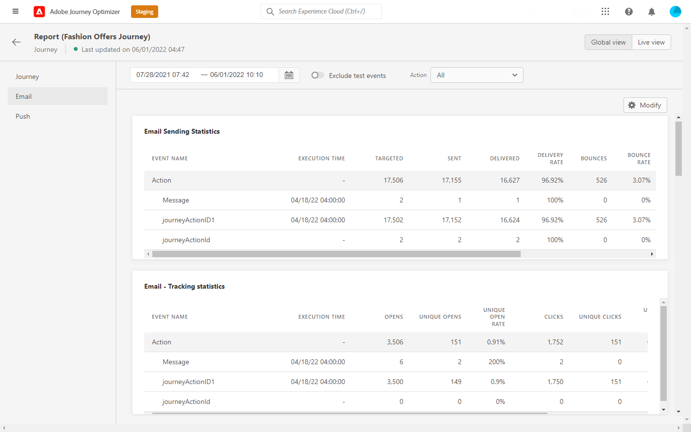
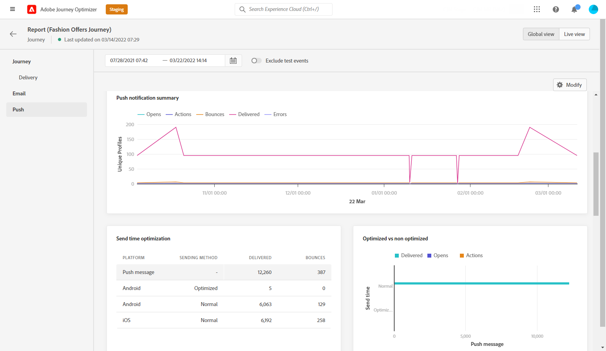

# Relatório global da jornada {#journey-global-report}

O relatório global do Jornada pode ser acessado diretamente da sua jornada com o **[!UICONTROL Global report]** botão.

A jornada **[!UICONTROL Global report]** será exibida com as seguintes guias:

* [Jornada](#journey-global)
* [Email](#email-global)
* [Push](#push-global)

A jornada **[!UICONTROL Global report]** O é dividido em diferentes widgets detalhando o sucesso e os erros da jornada. Cada widget pode ser redimensionado e excluído, se necessário. Para obter mais informações sobre isso, consulte esta seção [seção](global-report.md#modify-dashboard).

## Guia Jornada {#journey-global}

Da sua jornada **[!UICONTROL Global report]**, o **[!UICONTROL Journey]** A guia fornece uma visualização clara dos dados de rastreamento mais importantes sobre a jornada.

O **[!UICONTROL Journey Performance]** O widget permite ver o caminho dos perfis segmentados passo a passo por meio da jornada.

O **[!UICONTROL Journey Statistics]** O widget exibe os seguintes KPIs:

* **[!UICONTROL Entered profiles]**: Número total de indivíduos que chegaram ao evento de entrada da jornada.

* **[!UICONTROL Exited profiles]**: Número total de indivíduos que saíram da jornada.

* **[!UICONTROL Failed individual journey]**: Número total de jornadas individuais que não foram executadas com êxito.

O **[!UICONTROL Events received by event]**, **[!UICONTROL Events by origin]** e **[!UICONTROL Top events]** os widgets permitem ver qual de seus **[!UICONTROL Events]** foi executado com êxito por meio de gráficos e tabelas.

**[!UICONTROL Action Performance]**, **[!UICONTROL Action Error Reasons]** e **[!UICONTROL Top Actions]** os widgets representam a ação e os erros mais bem-sucedidos que ocorreram quando seu **[!UICONTROL Actions]** foram acionados.

O **[!UICONTROL Top Actions]** contém os dados disponíveis para **[!UICONTROL Actions]**, como:

* **[!UICONTROL Actions successfully executed]**: Número total de **[!UICONTROL Actions]** executado com êxito para uma jornada.

* **[!UICONTROL Error in action]**: Número total de erros que ocorreram **[!UICONTROL Actions]**.

## Guia Email {#email-global}

Da sua jornada **[!UICONTROL Global report]**, o **[!UICONTROL Email]** detalha as informações principais relativas aos deliveries de email enviados na jornada.

Para obter um relatório detalhado sobre um delivery de email específico, consulte a [Relatório global de email](#email-global-report) seção.

O **[!UICONTROL Email Sending Statistics]** gráfico detalha o sucesso do seu delivery:

* **[!UICONTROL Sent]**: Número total de envios para o delivery.

* **[!UICONTROL Delivered]**: Número de mensagens enviadas com êxito em relação ao número total de mensagens enviadas.

* **[!UICONTROL Delivery Rate]**: Porcentagem de mensagens enviadas com êxito.

* **[!UICONTROL Bounces]**: Total de erros acumulados durante o delivery e o processamento automático de retorno em relação ao número total de mensagens enviadas.

* **[!UICONTROL Bounce Rate]**: Porcentagem de emails que retornaram em comparação aos emails enviados.

* **[!UICONTROL Errors]**: Número total de erros que ocorreram durante um delivery, impedindo que ele fosse enviado a perfis.

* **[!UICONTROL Error Rate]**: Porcentagem de erros que ocorreram durante um delivery e impediram seu envio em comparação aos emails enviados.

O **[!UICONTROL Email - Tracking statistics]** contém os dados disponíveis para a atividade do recipient para o delivery:

* **[!UICONTROL Opens]**: Número de vezes que o delivery foi aberto em um delivery.

* **[!UICONTROL Unique Opens]**: Porcentagem de deliveries abertos.

* **[!UICONTROL Open Rate]**: Número total de emails abertos em comparação ao número de emails entregues.

* **[!UICONTROL Clicks]**: Número de vezes que um conteúdo foi clicado em um email.

* **[!UICONTROL Unique Clicks]**: Número de recipients que clicaram em um conteúdo em um email.

* **[!UICONTROL Click through rate]**: Porcentagem de usuários que interagiram com a jornada.

* **[!UICONTROL Unsubscribe]**: Número de cliques no link unsubscription.

* **[!UICONTROL Spam complaints]**: Número de vezes que uma mensagem foi declarada como spam ou lixo eletrônico.

O **[!UICONTROL Sending Statistics]** O gráfico contém os dados disponíveis para emails enviados, como:

* **[!UICONTROL Delivered]**: Número de mensagens enviadas com êxito em relação ao número total de mensagens enviadas.

* **[!UICONTROL Bounces]**: Total de erros acumulados durante o delivery e o processamento automático de retorno em relação ao número total de mensagens enviadas.

* **[!UICONTROL Errors]**: Número total de erros que ocorreram durante um delivery, impedindo que ele fosse enviado a perfis.

O **[!UICONTROL Bounce Reasons]** e **[!UICONTROL Bounce categories]** os widgets contêm os dados disponíveis relacionados às mensagens devolvidas, como:

* **[!UICONTROL Hard bounce]**: O número total de erros permanentes, como um endereço de email incorreto. Isso envolve uma mensagem de erro que declara explicitamente que o endereço é inválido, como Unknown user.

* **[!UICONTROL Soft bounce]**: O número total de erros temporários, como uma caixa de entrada cheia.

* **[!UICONTROL Ignored]**: O número total de temporários, como Ausência temporária, ou um erro técnico, por exemplo, se o tipo de remetente for postmaster.

Para obter mais informações sobre devoluções, consulte [Lista de supressão](../reports/suppression-list.md) página.

O **[!UICONTROL Error Reasons]** gráfico e tabela permitem ver qual erro ocorreu durante o delivery.

O **[!UICONTROL Excluded reasons]** gráfico e tabela exibem os diferentes motivos que impediam os perfis de usuário, excluídos dos perfis segmentados, de receber a mensagem.

O **[!UICONTROL Email - Top Url]** gráfico e tabela detalham quais URLs do seu delivery são os mais visitados.

O **[!UICONTROL Email - Top recipient domain]** gráfico e tabela detalham quais domínios são os mais usados pelos recipients para abrir o email.

>[!NOTE]
>
>O **[!UICONTROL Optimized vs non optimized]** e **[!UICONTROL Send time optimization]**  os widgets só estarão disponíveis se a opção Send-Time Otimization estiver ativada para o seu delivery. Para obter mais informações sobre Otimização de tempo de envio, consulte esta seção [página](../building-journeys/journeys-message.md#send-time-optimization).

O **[!UICONTROL Optimized vs non optimized]** O gráfico detalha as informações principais relativas à sua mensagem, sejam elas otimizadas ou não:

* **[!UICONTROL Sent]**: Número total de envios para o delivery.
* **[!UICONTROL Opens]**: Número de vezes que o delivery foi aberto em um delivery.
* **[!UICONTROL Clicks]**: Número de vezes que um conteúdo foi clicado em um email.

O **[!UICONTROL Send time optimization]** detalha o sucesso do delivery, dependendo do método de envio: otimizado ou normal.

* **[!UICONTROL Delivered]**: Número de mensagens enviadas com êxito em relação ao número total de mensagens enviadas.
* **[!UICONTROL Bounces]**: Total de erros acumulados durante o delivery e o processamento automático de retorno em relação ao número total de mensagens enviadas.

<!--

>[!NOTE]
>
>The Offers widgets and metrics are only available if a decision was inserted in an email. For more information on Decision Management, refer to this [page](../offers/get-started/starting-offer-decisioning.md).

The **[!UICONTROL Offers statistic]** and **[!UICONTROL Offers statistics]** over time widgets measure your offer's success and impact on your targeted audience. It detail the main information relative to your message with KPIs:

* **[!UICONTROL Offer sent]**: Total number of sends for the offer.

* **[!UICONTROL Offer impression]**: Number of times the offer was opened in a delivery.

* **[!UICONTROL Offer clicks]**: Number of times an offer was clicked on in a delivery.

The **[!UICONTROL Offers detailed statistic]** table contains the available data for recipient activity with your offer:

* **[!UICONTROL Placement name]**: Name of your placement used to display your offer. For more information on placement, refer to this [page](../offers/offer-library/creating-placements.md).

* **[!UICONTROL Offer name]**: Name of the offer added in the delivery. For more information on placement, refer to this [page](../offers/offer-library/creating-personalized-offers.md).

* **[!UICONTROL Offer sent]**: Total number of sends for the offer.

* **[!UICONTROL Offer impression rate]**: Percentage of opened offers compared to the number of sent offers.

* **[!UICONTROL Offer click rate]**: Percentage of users who interacted with the offer.
-->

## Guia Empurrar {#push-global}

Da sua jornada **[!UICONTROL Global report]**, o **[!UICONTROL Push]** detalha as informações principais relativas aos deliveries por push enviados na jornada.

Para obter um relatório detalhado sobre um delivery de push específico, consulte [Enviar relatório global](#push-global-report).

O **[!UICONTROL Push notification - Sending statistics]** A tabela detalha as principais informações relativas às suas notificações por push com gráficos e KPIs:

* **[!UICONTROL Sent]**: Número total de envios para o delivery.

* **[!UICONTROL Delivered]**: Número de mensagens enviadas com êxito em relação ao número total de mensagens enviadas.

* **[!UICONTROL Delivery Rate]**: Porcentagem de mensagens enviadas com êxito.

* **[!UICONTROL Bounces]**: Total de erros acumulados durante o delivery e o processamento automático de retorno em relação ao número total de mensagens enviadas.

* **[!UICONTROL Bounce Rate]**: Porcentagem de notificações por push que rejeição em comparação às notificações por push enviadas.

* **[!UICONTROL Errors]**: Número total de erros que ocorreram durante um delivery, impedindo que ele fosse enviado a perfis.

* **[!UICONTROL Error Rate]**: Porcentagem de erros que ocorreram durante um delivery e impediram seu envio em comparação ao envio de notificações por push.

O **[!UICONTROL Push - Tracking statistics]** contém os dados disponíveis para a atividade do recipient para o delivery:

* **[!UICONTROL Opens]**: Número de vezes que uma mensagem foi aberta em um delivery.

* **[!UICONTROL Open Rate]**: Porcentagem de notificações por push abertas.

* **[!UICONTROL Actions]**: Número total de ações na notificação por push entregue, por exemplo, clique no botão ou descarta.

* **[!UICONTROL Engagements]**: Número total de aberturas e ações para essa notificação por push, ou seja, se o perfil abriu o push ou se um botão foi clicado.

* **[!UICONTROL Engagement Rate]**: Porcentagem de aberturas e ações para essa notificação por push, ou seja, se o perfil abriu o push ou se um botão foi clicado.

O **[!UICONTROL Push notification summary]** O gráfico contém os dados disponíveis para notificações por push enviadas, como:

* **[!UICONTROL Opens]**: Número de vezes que uma mensagem foi aberta em um delivery.

* **[!UICONTROL Actions]**: Número total de ações na notificação por push entregue, por exemplo, clique no botão ou descarta.

* **[!UICONTROL Bounces]**: Total de erros acumulados durante o delivery e o processamento automático de retorno em relação ao número total de mensagens enviadas.

* **[!UICONTROL Delivered]**: Número de mensagens enviadas com êxito em relação ao número total de mensagens enviadas.

* **[!UICONTROL Errors]**: Número total de erros que ocorreram durante um delivery, impedindo que ele fosse enviado a perfis.

>[!NOTE]
>
>O **[!UICONTROL Optimized vs non optimized]** e **[!UICONTROL Send time optimization]**  os widgets só estarão disponíveis se a opção Send-Time Otimization estiver ativada para o seu delivery. Para obter mais informações sobre Otimização de tempo de envio, consulte esta seção [página](../building-journeys/journeys-message.md#send-time-optimization).

O **[!UICONTROL Optimized vs non optimized]** O gráfico detalha as informações principais relativas à sua mensagem, sejam elas otimizadas ou não:

* **[!UICONTROL Delivered]**: Número de mensagens enviadas com êxito em relação ao número total de mensagens enviadas.
* **[!UICONTROL Opens]**: Número de vezes que o delivery foi aberto em um delivery.
* **[!UICONTROL Actions]**: Número total de ações na notificação por push entregue, por exemplo, clique no botão ou descarta.

O **[!UICONTROL Send time optimization]** detalha o sucesso do delivery, dependendo do método de envio: otimizado ou normal.

* **[!UICONTROL Delivered]**: Número de mensagens enviadas com êxito em relação ao número total de mensagens enviadas.
* **[!UICONTROL Bounces]**: Total de erros acumulados durante o delivery e o processamento automático de retorno em relação ao número total de mensagens enviadas.

O **[!UICONTROL Error Reasons]** gráfico e tabela permitem ver qual erro ocorreu durante o delivery.

O **[!UICONTROL Excluded reasons]** gráfico e tabela exibem os diferentes motivos que impediam os perfis de usuário, excluídos dos perfis segmentados, de receber a mensagem.

O **[!UICONTROL Tracking by platform]**, **[!UICONTROL Sending by platform]** e **[!UICONTROL Breakdown by platform]** os gráficos e tabelas detalham o sucesso da notificação por push, dependendo do sistema operacional do recipient.
