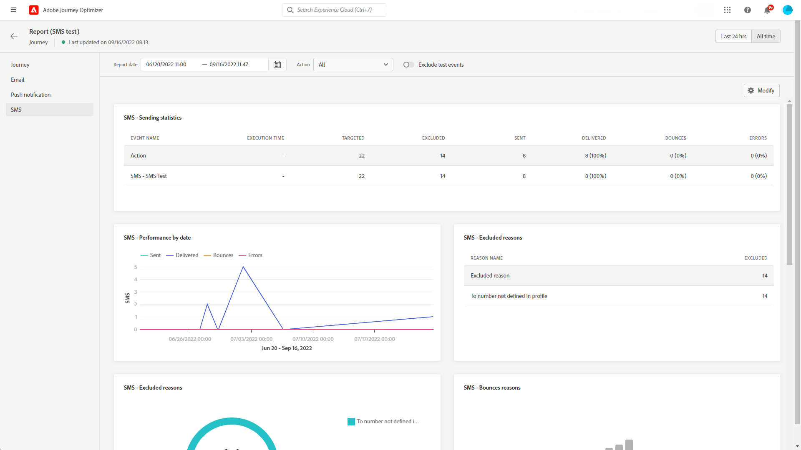

# Relatório global da jornada {#journey-global-report}

O relatório global do Jornada pode ser acessado diretamente da sua jornada com o **[!UICONTROL Exibir relatório]** botão.

A jornada **[!UICONTROL Relatório global]** será exibida com as seguintes guias:

* [Jornada](#journey-global)
* [Email](#email-global)
* [Push](#push-global)
* [SMS](#sms-global)

A jornada **[!UICONTROL Relatório global]** O é dividido em diferentes widgets detalhando o sucesso e os erros da jornada. Cada widget pode ser redimensionado e excluído, se necessário. Para obter mais informações sobre isso, consulte esta seção [seção](global-report.md#modify-dashboard).

Para obter uma lista detalhada de todas as métricas disponíveis no Adobe Journey Optimizer, consulte [esta página](global-report.md#list-of-components-global).

## Guia Jornada {#journey-global}

Da sua jornada **[!UICONTROL Relatório global]**, o **[!UICONTROL Jornada]** A guia fornece uma visualização clara dos dados de rastreamento mais importantes sobre a jornada.

+++Saiba mais sobre as diferentes métricas e widgets disponíveis para o relatório de Jornada.

O **[!UICONTROL Desempenho da jornada]** O widget permite ver o caminho dos perfis segmentados passo a passo por meio da jornada.

O **[!UICONTROL Estatísticas de jornada]** O widget exibe os seguintes KPIs:

* **[!UICONTROL Perfis inseridos]**: Número total de indivíduos que chegaram ao evento de entrada da jornada.

* **[!UICONTROL Perfis exportados]**: Número total de indivíduos que saíram da jornada.

* **[!UICONTROL Falha na jornada individual]**: Número total de jornadas individuais que não foram executadas com êxito.

O **[!UICONTROL Eventos recebidos por evento]**, **[!UICONTROL Eventos por origem]** e **[!UICONTROL Principais eventos]** os widgets permitem ver qual de seus **[!UICONTROL Eventos]** foi executado com êxito por meio de gráficos e tabelas.

**[!UICONTROL Desempenho da ação]**, **[!UICONTROL Motivos de erro de ação]** e **[!UICONTROL Principais ações]** os widgets representam a ação e os erros mais bem-sucedidos que ocorreram quando seu **[!UICONTROL Ações]** foram acionados.

O **[!UICONTROL Principais ações]** contém os dados disponíveis para **[!UICONTROL Ações]**, como:

* **[!UICONTROL Ações executadas com êxito]**: Número total de **[!UICONTROL Ações]** executado com êxito para uma jornada.

* **[!UICONTROL Erro em ação]**: Número total de erros que ocorreram **[!UICONTROL Ações]**.

O **[!UICONTROL Políticas de consentimento]** tabela e gráfico exibem o número de perfis excluídos de cada política em suas ações personalizadas.
Para obter mais informações sobre ações personalizadas, consulte [documentação detalhada](../action/about-custom-action-configuration.md).

Observe que para que esses widgets apareçam em seus relatórios de Jornadas, será necessário redefinir seus painéis. Para fazer isso, clique em **[!UICONTROL Modificar]** then **[!UICONTROL Redefinir]** na parte superior do relatório.
+++

## Guia Email {#email-global}

Da sua jornada **[!UICONTROL Relatório global]**, o **[!UICONTROL Email]** detalha as informações principais relativas aos deliveries de email enviados na jornada.

+++Saiba mais sobre as diferentes métricas e widgets disponíveis para o relatório de email.

O **[!UICONTROL Email Sending Statistics]** gráfico detalha o sucesso do seu delivery:

* **[!UICONTROL Direcionado]**: Número de perfis segmentados pelo Adobe Journey Orchestration para qualquer ação, como enviar email ou SMS.

* **[!UICONTROL Enviado]**: Número total de envios para o delivery.

* **[!UICONTROL Entregue]**: Número de mensagens enviadas com êxito em relação ao número total de mensagens enviadas.

* **[!UICONTROL Taxa de entrega]**: Porcentagem de mensagens enviadas com êxito.

* **[!UICONTROL Rejeições]**: Total de erros acumulados durante o delivery e o processamento automático de retorno em relação ao número total de mensagens enviadas.

* **[!UICONTROL Taxa de rejeição]**: Porcentagem de emails que retornaram em comparação aos emails enviados.

* **[!UICONTROL Erros]**: Número total de erros que ocorreram durante um delivery, impedindo que ele fosse enviado a perfis.

* **[!UICONTROL Taxa de erro]**: Porcentagem de erros que ocorreram durante um delivery e impediram seu envio em comparação aos emails enviados.

O **[!UICONTROL Email - Estatísticas de rastreamento]** contém os dados disponíveis para a atividade do recipient para o delivery:

* **[!UICONTROL Abre]**: Número de vezes que o delivery foi aberto em um delivery.

* **[!UICONTROL Aberturas únicas]**: Porcentagem de deliveries abertos.

* **[!UICONTROL Taxa de Abertura Única]**: Número total de emails abertos em comparação ao número de emails entregues.

* **[!UICONTROL Cliques]**: Número de vezes que um conteúdo foi clicado em um email.

* **[!UICONTROL Cliques únicos]**: Número de recipients que clicaram em um conteúdo em um email.

* **[!UICONTROL Índice de click-through]**: Porcentagem de usuários que interagiram com a jornada.

* **[!UICONTROL Cancelar inscrição]**: Número de cliques no link unsubscription.

* **[!UICONTROL Reclamações de spam]**: Número de vezes que uma mensagem foi declarada como spam ou lixo eletrônico.

O **[!UICONTROL Envio de estatísticas]** O gráfico contém os dados disponíveis para emails enviados, como:

* **[!UICONTROL Entregue]**: Número de mensagens enviadas com êxito em relação ao número total de mensagens enviadas.

* **[!UICONTROL Rejeições]**: Total de erros acumulados durante o delivery e o processamento automático de retorno em relação ao número total de mensagens enviadas.

* **[!UICONTROL Erros]**: Número total de erros que ocorreram durante um delivery, impedindo que ele fosse enviado a perfis.

O **[!UICONTROL Motivos da rejeição]** e **[!UICONTROL Categorias de rejeição]** os widgets contêm os dados disponíveis relacionados às mensagens devolvidas, como:

* **[!UICONTROL Rejeição permanente]**: O número total de erros permanentes, como um endereço de email incorreto. Isso envolve uma mensagem de erro que declara explicitamente que o endereço é inválido, como Unknown user.

* **[!UICONTROL Rejeição suave]**: O número total de erros temporários, como uma caixa de entrada cheia.

* **[!UICONTROL Ignorado]**: O número total de temporários, como Ausência temporária, ou um erro técnico, por exemplo, se o tipo de remetente for postmaster.

Para obter mais informações sobre devoluções, consulte [Lista de supressão](../reports/suppression-list.md) página.

O **[!UICONTROL Motivos do erro]** gráfico e tabela permitem ver qual erro ocorreu durante o delivery.

O **[!UICONTROL Motivos excluídos]** gráfico e tabela exibem os diferentes motivos que impediam os perfis de usuário, excluídos dos perfis segmentados, de receber a mensagem.

O **[!UICONTROL Email - Url Superior]** gráfico e tabela detalham quais URLs do seu delivery são os mais visitados.

O **[!UICONTROL Email - Domínio do recipient principal]** gráfico e tabela detalham quais domínios são os mais usados pelos recipients para abrir o email.

>[!NOTE]
>
>O **[!UICONTROL Otimizado vs não otimizado]** e **[!UICONTROL Enviar otimização de tempo]**  os widgets só estarão disponíveis se a opção Send-Time Otimization estiver ativada para o seu delivery. Para obter mais informações sobre Otimização de tempo de envio, consulte [esta página](../messages/send-time-optimization.md).

O **[!UICONTROL Otimizado vs não otimizado]** O gráfico detalha as informações principais relativas à sua mensagem, sejam elas otimizadas ou não:

* **[!UICONTROL Enviado]**: Número total de envios para o delivery.
* **[!UICONTROL Abre]**: Número de vezes que o delivery foi aberto em um delivery.
* **[!UICONTROL Cliques]**: Número de vezes que um conteúdo foi clicado em um email.

O **[!UICONTROL Enviar otimização de tempo]** detalha o sucesso do delivery, dependendo do método de envio: otimizado ou normal.

* **[!UICONTROL Entregue]**: Número de mensagens enviadas com êxito em relação ao número total de mensagens enviadas.
* **[!UICONTROL Rejeições]**: Total de erros acumulados durante o delivery e o processamento automático de retorno em relação ao número total de mensagens enviadas.

>[!NOTE]
>
>Os widgets e métricas de Ofertas só estarão disponíveis se uma decisão tiver sido inserida em um email. Para obter mais informações sobre o Gerenciamento de decisões, consulte esta seção [página](../offers/get-started/starting-offer-decisioning.md).

O **[!UICONTROL Estatística de ofertas]** e **[!UICONTROL Estatísticas de ofertas]** com o passar do tempo, os widgets avaliam o sucesso e o impacto da oferta no público-alvo. Ela detalha as informações principais relativas à sua mensagem com KPIs:

* **[!UICONTROL Oferta enviada]**: Número total de envios para a oferta.

* **[!UICONTROL Impressão da oferta]**: Número de vezes que a oferta foi aberta em um delivery.

* **[!UICONTROL Cliques na oferta]**: Número de vezes que uma oferta foi clicada em um delivery.

O **[!UICONTROL Estatística detalhada de ofertas]** A tabela contém os dados disponíveis para a atividade do recipient com a oferta:

* **[!UICONTROL Nome da disposição]**: Nome da disposição usada para exibir sua oferta. Para obter mais informações sobre posicionamento, consulte esta seção [página](../offers/offer-library/creating-placements.md).

* **[!UICONTROL Nome da oferta]**: Nome da oferta adicionada ao delivery. Para obter mais informações sobre posicionamento, consulte esta seção [página](../offers/offer-library/creating-personalized-offers.md).

* **[!UICONTROL Oferta enviada]**: Número total de envios para a oferta.

* **[!UICONTROL Taxa de impressões da oferta]**: Porcentagem de ofertas abertas em comparação ao número de ofertas enviadas.

* **[!UICONTROL Taxa de cliques da oferta]**: Porcentagem de usuários que interagiram com a oferta.
+++

## Guia Notificação por push {#push-global}

Da sua jornada **[!UICONTROL Relatório global]**, o **[!UICONTROL Notificação por push]** detalha as informações principais relativas aos deliveries por push enviados na jornada.

+++Saiba mais sobre as diferentes métricas e widgets disponíveis para o relatório de push.

O **[!UICONTROL Notificação por push - Envio de estatísticas]** A tabela detalha as principais informações relativas às suas notificações por push com gráficos e KPIs:

* **[!UICONTROL Direcionado]**: Número de perfis segmentados pelo Adobe Journey Orchestration para qualquer ação, como enviar email ou SMS.

* **[!UICONTROL Enviado]**: Número total de envios para o delivery.

* **[!UICONTROL Entregue]**: Número de mensagens enviadas com êxito em relação ao número total de mensagens enviadas.

* **[!UICONTROL Taxa de entrega]**: Porcentagem de mensagens enviadas com êxito.

* **[!UICONTROL Rejeições]**: Total de erros acumulados durante o delivery e o processamento automático de retorno em relação ao número total de mensagens enviadas.

* **[!UICONTROL Taxa de rejeição]**: Porcentagem de notificações por push que rejeição em comparação às notificações por push enviadas.

* **[!UICONTROL Erros]**: Número total de erros que ocorreram durante um delivery, impedindo que ele fosse enviado a perfis.

* **[!UICONTROL Taxa de erro]**: Porcentagem de erros que ocorreram durante um delivery e impediram seu envio em comparação ao envio de notificações por push.

O **[!UICONTROL Push - Estatísticas de rastreamento]** contém os dados disponíveis para a atividade do recipient para o delivery:

* **[!UICONTROL Abre]**: Número de vezes que uma mensagem foi aberta em um delivery.

* **[!UICONTROL Taxa de abertura]**: Porcentagem de notificações por push abertas.

* **[!UICONTROL Ações]**: Número total de ações na notificação por push entregue, por exemplo, clique no botão ou descarta.

* **[!UICONTROL Envolvimentos]**: Número total de aberturas e ações para essa notificação por push, ou seja, se o perfil abriu o push ou se um botão foi clicado.

* **[!UICONTROL Taxa de participação]**: Porcentagem de aberturas e ações para essa notificação por push, ou seja, se o perfil abriu o push ou se um botão foi clicado.

O **[!UICONTROL Resumo da notificação por push]** O gráfico contém os dados disponíveis para notificações por push enviadas, como:

* **[!UICONTROL Abre]**: Número de vezes que uma mensagem foi aberta em um delivery.

* **[!UICONTROL Ações]**: Número total de ações na notificação por push entregue, por exemplo, clique no botão ou descarta.

* **[!UICONTROL Rejeições]**: Total de erros acumulados durante o delivery e o processamento automático de retorno em relação ao número total de mensagens enviadas.

* **[!UICONTROL Entregue]**: Número de mensagens enviadas com êxito em relação ao número total de mensagens enviadas.

* **[!UICONTROL Erros]**: Número total de erros que ocorreram durante um delivery, impedindo que ele fosse enviado a perfis.

>[!NOTE]
>
>O **[!UICONTROL Otimizado vs não otimizado]** e **[!UICONTROL Enviar otimização de tempo]**  os widgets só estarão disponíveis se a opção Send-Time Otimization estiver ativada para o seu delivery. Para obter mais informações sobre Otimização de tempo de envio, consulte [esta página](../messages/send-time-optimization.md).

O **[!UICONTROL Otimizado vs não otimizado]** O gráfico detalha as informações principais relativas à sua mensagem, sejam elas otimizadas ou não:

* **[!UICONTROL Entregue]**: Número de mensagens enviadas com êxito em relação ao número total de mensagens enviadas.
* **[!UICONTROL Abre]**: Número de vezes que o delivery foi aberto em um delivery.
* **[!UICONTROL Ações]**: Número total de ações na notificação por push entregue, por exemplo, clique no botão ou descarta.

O **[!UICONTROL Enviar otimização de tempo]** detalha o sucesso do delivery, dependendo do método de envio: otimizado ou normal.

* **[!UICONTROL Entregue]**: Número de mensagens enviadas com êxito em relação ao número total de mensagens enviadas.
* **[!UICONTROL Rejeições]**: Total de erros acumulados durante o delivery e o processamento automático de retorno em relação ao número total de mensagens enviadas.

O **[!UICONTROL Motivos do erro]** gráfico e tabela permitem ver qual erro ocorreu durante o delivery.

O **[!UICONTROL Motivos excluídos]** gráfico e tabela exibem os diferentes motivos que impediam os perfis de usuário, excluídos dos perfis segmentados, de receber a mensagem.

O **[!UICONTROL Rastreamento por plataforma]**, **[!UICONTROL Envio por plataforma]** e **[!UICONTROL Detalhamento por plataforma]** os gráficos e tabelas detalham o sucesso da notificação por push, dependendo do sistema operacional do recipient.

O SMS **[!UICONTROL Relatório global]** O é dividido em diferentes widgets detalhando o sucesso e os erros do delivery. Cada widget pode ser redimensionado e excluído, se necessário. Para obter mais informações, consulte [seção](global-report.md#modify-dashboard).
+++

## Guia SMS {#sms-global}

+++Saiba mais sobre as diferentes métricas e widgets disponíveis para o relatório de SMS.

O **[!UICONTROL SMS - Envio de estatísticas]** tabela detalha o sucesso do delivery:

* **[!UICONTROL Direcionado]**: Número de perfis de usuário que se qualificaram como perfis de público-alvo para este delivery.

* **[!UICONTROL Excluído]**: Número de perfis de usuário, excluídos dos perfis segmentados, que não receberam a mensagem.

* **[!UICONTROL Enviado]**: Número total de envios para o delivery.

* **[!UICONTROL Entregue]**: Número de mensagens enviadas com êxito em relação ao número total de mensagens enviadas.

* **[!UICONTROL Rejeições]**: Total de erros acumulados durante o delivery e o processamento automático de retorno em relação ao número total de mensagens enviadas.

* **[!UICONTROL Erros]**: Número total de erros que ocorreram durante um delivery, impedindo que ele fosse enviado a perfis.

O **[!UICONTROL Resumo do SMS]** o widget detalha as informações principais relativas à sua mensagem com um gráfico:

* **[!UICONTROL Enviado]**: Número total de envios para o delivery.

* **[!UICONTROL Entregue]**: Número de mensagens enviadas com êxito em relação ao número total de mensagens enviadas.

* **[!UICONTROL Rejeições]**: Total de erros acumulados durante o delivery e o processamento automático de retorno em relação ao número total de mensagens enviadas.

* **[!UICONTROL Erros]**: Número total de erros que ocorreram durante um delivery, impedindo que ele fosse enviado a perfis.

O **[!UICONTROL Excluir motivos]** gráficos e tabelas permitem ver quais erros e exclusões ocorreram durante o delivery.
+++
