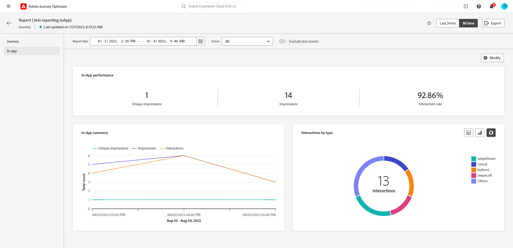

# Relatório global da jornada {#journey-global-report}

>[!CONTEXTUALHELP]
>id="ajo_journey_global_report"
>title="Relatório global da jornada"
>abstract="O Relatório global da jornada permite medir o impacto das jornadas em um período selecionado. O relatório é dividido em diferentes widgets detalhando o sucesso e os erros da jornada. Cada painel de relatórios pode ser modificado redimensionando ou removendo widgets."

Os relatórios globais, acessíveis na guia Todos os tempos, exibem eventos que ocorreram pelo menos duas horas atrás e abordam eventos em um período selecionado. Em comparação, os Relatórios em tempo real focalizam eventos que ocorreram nas últimas 24 horas, com um intervalo mínimo de dois minutos a partir da ocorrência do evento.

O relatório global de Jornada pode ser acessado diretamente da sua jornada com o **[!UICONTROL Exibir relatório]** botão.

A JORNADA **[!UICONTROL Relatório global]** será exibida com as seguintes guias:

* [Jornada](#journey-global)
* [Email](#email-global)
* [Push](#push-global)
* [SMS](#sms-global)
* [No aplicativo](#in-app-global)

A JORNADA **[!UICONTROL Relatório global]** O é dividido em diferentes widgets detalhando o sucesso e os erros da sua jornada. Cada widget pode ser redimensionado e excluído, se necessário. Para obter mais informações, consulte esta [seção](global-report.md#modify-dashboard).

Para obter uma lista detalhada de cada métrica disponível no Adobe Journey Optimizer, consulte [esta página](global-report.md#list-of-components-global).

## Guia Jornada {#journey-global}

Da sua jornada **[!UICONTROL Relatório global]**, o **[!UICONTROL Jornada]** A guia fornece uma visualização clara dos dados de rastreamento mais importantes sobre a jornada.

+++Saiba mais sobre as diferentes métricas e widgets disponíveis para o relatório de Jornada.

A variável **[!UICONTROL Desempenho da jornada]** O widget permite ver o caminho dos perfis direcionados passo a passo na jornada.

A variável **[!UICONTROL Jornada estatísticas]** exibe os seguintes KPIs:

* **[!UICONTROL Perfis inseridos]**: Número total de indivíduos que atingiram o evento de entrada da jornada.

* **[!UICONTROL Perfis encerrados]**: número total de indivíduos que saíram da jornada.

* **[!UICONTROL Falha na jornada individual]**: Número total de jornadas individuais que não foram executadas com êxito.

A variável **[!UICONTROL Eventos recebidos por evento]**, **[!UICONTROL Eventos por origem]** e **[!UICONTROL Principais eventos]** Os widgets permitem ver qual dos seus **[!UICONTROL Eventos]** foi executado com sucesso por meio de gráficos e tabelas.

**[!UICONTROL Desempenho da ação]**, **[!UICONTROL Motivos de erro de ação]** e **[!UICONTROL Principais ações]** widgets representam a ação e os erros mais bem-sucedidos que ocorreram quando seu **[!UICONTROL Ações]** foram acionados.

A variável **[!UICONTROL Principais ações]** A tabela contém os dados disponíveis para **[!UICONTROL Ações]**, como:

* **[!UICONTROL Ações executadas com sucesso]**: Número total de **[!UICONTROL Ações]** executado com sucesso para uma jornada.

* **[!UICONTROL Erro na ação]**: Número total de erros que ocorreram para **[!UICONTROL Ações]**.

A variável **[!UICONTROL Políticas de consentimento]** A tabela e o gráfico exibem o número de perfis excluídos de cada política em suas ações personalizadas.
Para obter mais informações sobre ações personalizadas, consulte [a documentação detalhada](../action/about-custom-action-configuration.md).

Observe que para que esses widgets apareçam nos relatórios do Jornada, será necessário redefinir seus painéis. Para fazer isso, clique em **[!UICONTROL Modificar]** depois **[!UICONTROL Redefinir]** na parte superior do relatório.
+++

## Guia E-mail {#email-global}

Da sua jornada **[!UICONTROL Relatório global]**, o **[!UICONTROL E-mail]** A guia detalha as principais informações relativas aos deliveries de email enviados no jornada.

+++Saiba mais sobre as diferentes métricas e widgets disponíveis para o Relatório de email.

A variável **[!UICONTROL Estatísticas de envio de email]** O gráfico detalha o sucesso do seu delivery:

* **[!UICONTROL Direcionado]**: Número de perfis direcionados para qualquer ação, como enviar email ou SMS.

* **[!UICONTROL Enviado]**: Número total de envios para o delivery.

* **[!UICONTROL Entregue]**: Número de mensagens enviadas com êxito em relação ao número total de mensagens enviadas.

* **[!UICONTROL Taxa de entrega]**: Porcentagem de mensagens enviadas com êxito.

* **[!UICONTROL Rejeições]**: Total de erros acumulados durante o processamento de delivery e retorno automático em relação ao número total de mensagens enviadas.

* **[!UICONTROL Taxa de rejeição]**: porcentagem de emails que foram rejeitados em comparação aos emails enviados.

* **[!UICONTROL Erros]**: Número total de erros que ocorreram durante um delivery impedindo que ele fosse enviado a perfis.

* **[!UICONTROL Taxa de erro]**: Porcentagem de erros que ocorreram durante um delivery, impedindo que ele seja enviado, em comparação aos emails enviados.

A variável **[!UICONTROL Email - Estatísticas de rastreamento]** contém os dados disponíveis para a atividade de recipient para seu delivery:

* **[!UICONTROL Aberturas]**: Número de vezes que o delivery foi aberto em um delivery.

* **[!UICONTROL Aberturas únicas]**: Porcentagem de deliveries abertos.

* **[!UICONTROL Taxa de abertura única]**: número total de emails abertos em comparação ao número de emails entregues.

* **[!UICONTROL Cliques]**: Número de vezes que um conteúdo foi clicado em um email.

* **[!UICONTROL Cliques únicos]**: Número de recipients que clicaram em um conteúdo em um email.

* **[!UICONTROL Taxa de cliques]**: porcentagem de usuários que interagiram com a jornada.

* **[!UICONTROL Cancelar inscrição]**: Número de cliques no link unsubscription.

* **[!UICONTROL Reclamações de spam]**: Número de vezes que uma mensagem foi declarada como spam ou lixo eletrônico.

A variável **[!UICONTROL Estatísticas de envio]** O gráfico contém os dados disponíveis para emails enviados, como:

* **[!UICONTROL Entregue]**: Número de mensagens enviadas com êxito em relação ao número total de mensagens enviadas.

* **[!UICONTROL Rejeições]**: Total de erros acumulados durante o processamento de delivery e retorno automático em relação ao número total de mensagens enviadas.

* **[!UICONTROL Erros]**: Número total de erros que ocorreram durante um delivery impedindo que ele fosse enviado a perfis.

A variável **[!UICONTROL Motivos de rejeição]** e **[!UICONTROL Categorias de rejeição]** os widgets contêm os dados disponíveis relacionados às mensagens rejeitadas, como:

* **[!UICONTROL Rejeição permanente]**: o número total de erros permanentes, como um endereço de email incorreto. Isso envolve uma mensagem de erro que declara explicitamente que o endereço é inválido, como Usuário desconhecido.

* **[!UICONTROL Rejeição leve]**: o número total de erros temporários, como uma caixa de entrada cheia.

* **[!UICONTROL Ignorado]**: o número total de temporários, como Ausência temporária, ou um erro técnico, por exemplo, se o tipo de remetente for postmaster.

Para obter mais informações sobre rejeições, consulte o [Lista de supressão](../reports/suppression-list.md) página.

A variável **[!UICONTROL Motivos de erro]** O gráfico e a tabela permitem ver qual erro ocorreu durante o delivery.

A variável **[!UICONTROL Motivos excluídos]** o gráfico e a tabela exibem os diferentes motivos que impediram os perfis de usuário, excluídos dos perfis direcionados, de receber a mensagem.

A variável **[!UICONTROL Email - URL superior]** gráfico e tabela detalha quais URLs do seu delivery são os mais visitados.

A variável **[!UICONTROL Email - Principal domínio de destinatário]** O gráfico e a tabela detalham quais domínios são os mais usados pelos recipients para abrir o email.

>[!NOTE]
>
>A variável **[!UICONTROL Otimizado vs. não otimizado]** e **[!UICONTROL Otimização da hora de envio]**  Os widgets do só estarão disponíveis se a opção Send-Time Otimization estiver ativada para o seu delivery. Para obter mais informações sobre a Otimização de tempo de envio, consulte [esta página](../building-journeys/journeys-message.md#send-time-optimization).

A variável **[!UICONTROL Otimizado vs. não otimizado]** o gráfico detalha as principais informações relativas à mensagem, sejam elas otimizadas ou não:

* **[!UICONTROL Enviado]**: Número total de envios para o delivery.
* **[!UICONTROL Aberturas]**: Número de vezes que o delivery foi aberto em um delivery.
* **[!UICONTROL Cliques]**: Número de vezes que um conteúdo foi clicado em um email.

A variável **[!UICONTROL Otimização da hora de envio]** detalha o sucesso do delivery dependendo do método de envio: otimizado ou normal.

* **[!UICONTROL Entregue]**: Número de mensagens enviadas com êxito em relação ao número total de mensagens enviadas.
* **[!UICONTROL Rejeições]**: Total de erros acumulados durante o processamento de delivery e retorno automático em relação ao número total de mensagens enviadas.

>[!NOTE]
>
>Os widgets e as métricas de Ofertas só estarão disponíveis se uma decisão tiver sido inserida em um email. Para obter mais informações sobre o Gerenciamento de decisões, consulte esta [página](../offers/get-started/starting-offer-decisioning.md).

A variável **[!UICONTROL Estatísticas de ofertas]** e **[!UICONTROL Estatísticas de ofertas]** ao longo do tempo, os widgets medem o sucesso e o impacto da sua oferta no público-alvo direcionado. Ele detalha as principais informações relacionadas à sua mensagem com KPIs:

* **[!UICONTROL Oferta enviada]**: número total de envios para a oferta.

* **[!UICONTROL Impressão da oferta]**: Número de vezes que a oferta foi aberta em um delivery.

* **[!UICONTROL Cliques de oferta]**: Número de vezes que uma oferta foi clicada em um delivery.

A variável **[!UICONTROL Estatísticas detalhadas da oferta]** A tabela contém os dados disponíveis para a atividade do recipient com sua oferta:

* **[!UICONTROL Nome do posicionamento]**: nome do posicionamento usado para exibir a oferta. Para obter mais informações sobre posicionamento, consulte esta [página](../offers/offer-library/creating-placements.md).

* **[!UICONTROL Nome da oferta]**: Nome da oferta adicionada no delivery. Para obter mais informações sobre posicionamento, consulte esta [página](../offers/offer-library/creating-personalized-offers.md).

* **[!UICONTROL Oferta enviada]**: número total de envios para a oferta.

* **[!UICONTROL Taxa de impressões da oferta]**: Porcentagem de ofertas abertas em comparação ao número de ofertas enviadas.

* **[!UICONTROL Taxa de cliques da oferta]**: Porcentagem de usuários que interagiram com a oferta.
+++

## Guia Notificação por push {#push-global}

Da sua jornada **[!UICONTROL Relatório global]**, o **[!UICONTROL Notificação por push]** A guia detalha as informações principais relativas aos deliveries por push enviados no jornada.

+++Saiba mais sobre as diferentes métricas e widgets disponíveis para o relatório Push.

A variável **[!UICONTROL Notificação por push - Estatísticas de envio]** A tabela detalha as principais informações relativas às notificações por push com gráfico e KPIs:

* **[!UICONTROL Direcionado]**: Número de perfis direcionados para qualquer ação, como enviar email ou SMS.

* **[!UICONTROL Enviado]**: Número total de envios para o delivery.

* **[!UICONTROL Entregue]**: Número de mensagens enviadas com êxito em relação ao número total de mensagens enviadas.

* **[!UICONTROL Taxa de entrega]**: Porcentagem de mensagens enviadas com êxito.

* **[!UICONTROL Rejeições]**: Total de erros acumulados durante o processamento de delivery e retorno automático em relação ao número total de mensagens enviadas.

* **[!UICONTROL Taxa de rejeição]**: Porcentagem de notificações por push que foram rejeitadas em comparação às notificações por push enviadas.

* **[!UICONTROL Erros]**: Número total de erros que ocorreram durante um delivery impedindo que ele fosse enviado a perfis.

* **[!UICONTROL Taxa de erro]**: Porcentagem de erros que ocorreram durante um delivery, impedindo que ele fosse enviado, em comparação ao envio de notificações por push.

A variável **[!UICONTROL Push - Estatísticas de rastreamento]** contém os dados disponíveis para a atividade de recipient para seu delivery:

* **[!UICONTROL Aberturas]**: Número de vezes que uma mensagem foi aberta em um delivery.

* **[!UICONTROL Taxa de abertura]**: porcentagem de notificações por push abertas.

* **[!UICONTROL Ações]**: Número total de ações na notificação por push entregue, por exemplo, clique ou descarte de botões.

* **[!UICONTROL Envolvimentos]**: Número total de aberturas e ações para esta notificação por push, ou seja, se o perfil abriu o push ou se um botão foi clicado.

* **[!UICONTROL Taxa de participação]**: Porcentagem de aberturas e ações para essa notificação por push, ou seja, se o perfil abriu o push ou se um botão foi clicado.

A variável **[!UICONTROL Resumo da notificação por push]** O gráfico contém os dados disponíveis para notificações por push enviadas, como:

* **[!UICONTROL Aberturas]**: Número de vezes que uma mensagem foi aberta em um delivery.

* **[!UICONTROL Ações]**: Número total de ações na notificação por push entregue, por exemplo, clique ou descarte de botões.

* **[!UICONTROL Rejeições]**: Total de erros acumulados durante o processamento de delivery e retorno automático em relação ao número total de mensagens enviadas.

* **[!UICONTROL Entregue]**: Número de mensagens enviadas com êxito em relação ao número total de mensagens enviadas.

* **[!UICONTROL Erros]**: Número total de erros que ocorreram durante um delivery impedindo que ele fosse enviado a perfis.

>[!NOTE]
>
>A variável **[!UICONTROL Otimizado vs. não otimizado]** e **[!UICONTROL Otimização da hora de envio]**  Os widgets do só estarão disponíveis se a opção Send-Time Otimization estiver ativada para o seu delivery. Para obter mais informações sobre a Otimização de tempo de envio, consulte [esta página](../building-journeys/journeys-message.md#send-time-optimization).

A variável **[!UICONTROL Otimizado vs. não otimizado]** o gráfico detalha as principais informações relativas à mensagem, sejam elas otimizadas ou não:

* **[!UICONTROL Entregue]**: Número de mensagens enviadas com êxito em relação ao número total de mensagens enviadas.
* **[!UICONTROL Aberturas]**: Número de vezes que o delivery foi aberto em um delivery.
* **[!UICONTROL Ações]**: Número total de ações na notificação por push entregue, por exemplo, clique ou descarte de botões.

A variável **[!UICONTROL Otimização da hora de envio]** detalha o sucesso do delivery dependendo do método de envio: otimizado ou normal.

* **[!UICONTROL Entregue]**: Número de mensagens enviadas com êxito em relação ao número total de mensagens enviadas.
* **[!UICONTROL Rejeições]**: Total de erros acumulados durante o processamento de delivery e retorno automático em relação ao número total de mensagens enviadas.

A variável **[!UICONTROL Motivos de erro]** O gráfico e a tabela permitem ver qual erro ocorreu durante o delivery.

A variável **[!UICONTROL Motivos excluídos]** o gráfico e a tabela exibem os diferentes motivos que impediram os perfis de usuário, excluídos dos perfis direcionados, de receber a mensagem.

A variável **[!UICONTROL Rastreamento por plataforma]**, **[!UICONTROL Envio por plataforma]** e **[!UICONTROL Detalhamento por plataforma]** gráficos e tabelas detalham o sucesso da sua notificação por push, dependendo do sistema operacional do recipient.

O SMS **[!UICONTROL Relatório global]** O é dividido em widgets diferentes detalhando o sucesso e os erros do delivery. Cada widget pode ser redimensionado e excluído, se necessário. Para obter mais informações, consulte este [seção](global-report.md#modify-dashboard).
+++

## Guia SMS {#sms-global}

+++Saiba mais sobre as diferentes métricas e widgets disponíveis para o relatório de SMS.

A variável **[!UICONTROL SMS - Estatísticas de envio]** a tabela detalha o sucesso do seu delivery:

* **[!UICONTROL Direcionado]**: Número de perfis de usuário que se qualificam como perfis de público-alvo para este delivery.

* **[!UICONTROL Excluído]**: Número de perfis de usuário, excluídos dos perfis direcionados, que não receberam a mensagem.

* **[!UICONTROL Enviado]**: Número total de envios para o delivery.

* **[!UICONTROL Rejeições]**: Total de erros acumulados durante o processamento de delivery e retorno automático em relação ao número total de mensagens enviadas.

* **[!UICONTROL Erros]**: Número total de erros que ocorreram durante um delivery impedindo que ele fosse enviado a perfis.

A variável **[!UICONTROL Resumo do SMS]** o widget detalha as principais informações relacionadas à sua mensagem com um gráfico:

* **[!UICONTROL Enviado]**: Número total de envios para o delivery.

* **[!UICONTROL Rejeições]**: Total de erros acumulados durante o processamento de delivery e retorno automático em relação ao número total de mensagens enviadas.

* **[!UICONTROL Erros]**: Número total de erros que ocorreram durante um delivery impedindo que ele fosse enviado a perfis.

A variável **[!UICONTROL Excluir motivos]** gráficos e tabelas permitem ver quais erros e exclusões ocorreram durante o delivery.

A variável **[!UICONTROL SMS - Cliques por links]** e **[!UICONTROL SMS - Estatísticas de rastreamento]** os widgets detalham as principais informações relativas ao engajamento dos visitantes com seus URLs.

+++

## Guia No aplicativo {#in-app-global}

Da sua Jornada **[!UICONTROL Relatório global]**, o **[!UICONTROL No aplicativo]** A guia detalha as principais informações relacionadas aos deliveries no aplicativo enviados em suas jornadas.

+++Saiba mais sobre as diferentes métricas e widgets disponíveis para o relatório No aplicativo.

A variável **[!UICONTROL Desempenho no aplicativo]** Os KPIs detalham as principais informações relativas ao envolvimento dos visitantes com as mensagens no aplicativo, como:

* **[!UICONTROL Impressões exclusivas]**: número de usuários únicos para os quais a mensagem no aplicativo foi exibida.

* **[!UICONTROL Impressões]**: número total de mensagens no aplicativo exibidas para todos os usuários.

  >[!NOTE]
  >
  >Para garantir que uma Impressão seja contada, o usuário deve atender a dois critérios:
  >* Qualificação dentro da experiência no aplicativo, obtida ao atingir a atividade específica no aplicativo em sua jornada.
  >* Cumprimento das condições especificadas nas regras de acionador.
  > 
  >Devido ao segundo critério, pode haver variações notáveis entre o número de perfis segmentados e a contagem de impressões únicas.

* **[!UICONTROL Interação]**: número de envolvimentos com a mensagem no aplicativo. Isso inclui qualquer ação realizada pelos usuários, como cliques, rejeições ou quaisquer outras interações.

A variável **[!UICONTROL Resumo no aplicativo]** O gráfico mostra a evolução de suas impressões e interações no aplicativo para o período relacionado.

A variável **[!UICONTROL Interações por tipo]** os gráficos e tabelas detalham como os usuários interagiram com a mensagem no aplicativo rastreando qualquer clique, descarte ou interação.
+++
