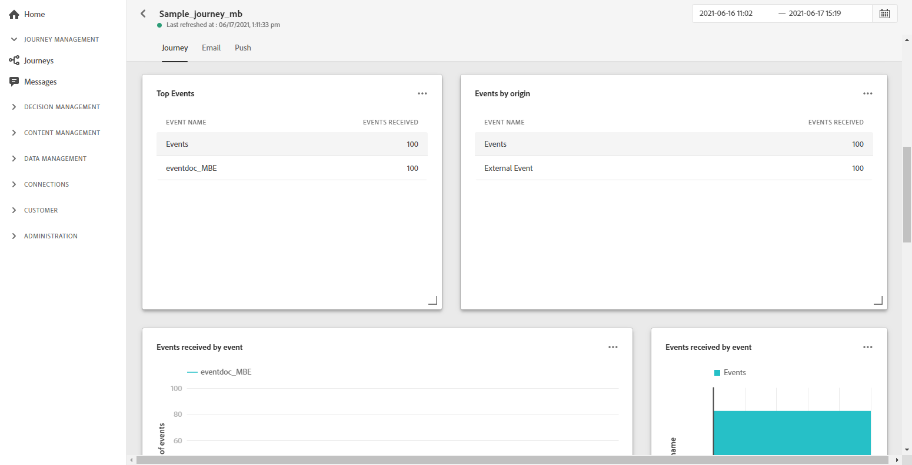
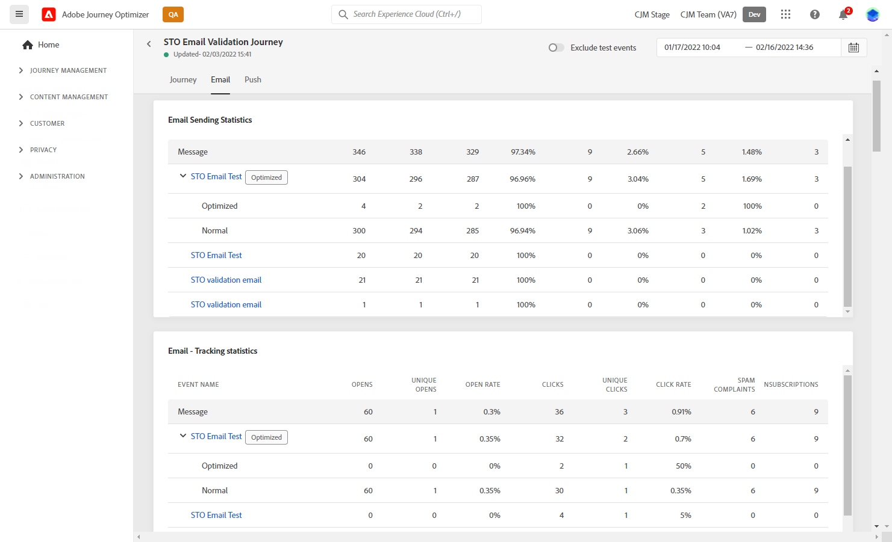

# Relatório global da jornada {#journey-global-report}

O relatório global do Jornada pode ser acessado diretamente da sua jornada com o botão **[!UICONTROL Global report]**.

A página de jornada **[!UICONTROL Global report]** será exibida com as seguintes guias:

* [Jornada](#journey-global)
* [Email](#email-global)
* [Push](#push-global)

A jornada **[!UICONTROL Global report]** é dividida em diferentes widgets detalhando o sucesso e os erros da jornada. Cada widget pode ser redimensionado e excluído, se necessário. Para obter mais informações, consulte esta [seção](global-report.md#modify-dashboard).

## Guia Jornada {#journey-global}

Na jornada **[!UICONTROL Global report]**, a guia **[!UICONTROL Journey]** fornece uma exibição clara dos dados de rastreamento mais importantes sobre a jornada.

O widget **[!UICONTROL Journey Performance]** permite visualizar o caminho dos perfis segmentados passo a passo pela jornada.

O widget **[!UICONTROL Journey Statistics]** exibe os seguintes KPIs:

* **[!UICONTROL Entered profiles]**: Número total de indivíduos que chegaram ao evento de entrada da jornada.

* **[!UICONTROL Exited profiles]**: Número total de indivíduos que saíram da jornada.

* **[!UICONTROL Failed individual journey]**: Número total de jornadas individuais que não foram executadas com êxito.

Os widgets **[!UICONTROL Events received by event]**, **[!UICONTROL Events by origin]** e **[!UICONTROL Top events]** permitem que você veja qual de seus **[!UICONTROL Events]** foi executado com êxito por meio de gráficos e tabelas.

**[!UICONTROL Action Performance]**,  **[!UICONTROL Action Error Reasons]** e  **[!UICONTROL Top Actions]** os widgets representam a ação e os erros mais bem-sucedidos que ocorreram quando  **[!UICONTROL Actions]** foram acionados.

A tabela **[!UICONTROL Top Actions]** contém os dados disponíveis para **[!UICONTROL Actions]**, como:

* **[!UICONTROL Actions successfully executed]**: Número total de jornadas executadas  **[!UICONTROL Actions]** com êxito.

* **[!UICONTROL Error in action]**: Número total de erros que ocorreram no  **[!UICONTROL Actions]**.

## Guia Email {#email-global}

Na jornada **[!UICONTROL Global report]**, a guia **[!UICONTROL Email]** detalha as informações principais relativas aos deliveries do email enviados na jornada.

Para obter um relatório detalhado sobre um delivery de email específico, consulte a seção [Email global report](#email-global-report) .

O gráfico **[!UICONTROL Email Sending Statistics]** detalha o sucesso do delivery:

* **[!UICONTROL Sent]**: Número total de envios para o delivery.

* **[!UICONTROL Delivered]**: Número de mensagens enviadas com êxito em relação ao número total de mensagens enviadas.

* **[!UICONTROL Delivery Rate]**: Porcentagem de mensagens enviadas com êxito.

* **[!UICONTROL Bounces]**: Total de erros acumulados durante o delivery e o processamento automático de retorno em relação ao número total de mensagens enviadas.

* **[!UICONTROL Bounce Rate]**: Porcentagem de emails que retornaram em comparação aos emails enviados.

* **[!UICONTROL Errors]**: Número total de erros que ocorreram durante um delivery, impedindo que ele fosse enviado a perfis.

* **[!UICONTROL Error Rate]**: Porcentagem de erros que ocorreram durante um delivery e impediram seu envio em comparação aos emails enviados.

O **[!UICONTROL Email - Tracking statistics]** contém os dados disponíveis para a atividade do recipient para o seu delivery:

* **[!UICONTROL Opens]**: Número de vezes que o delivery foi aberto em um delivery.

* **[!UICONTROL Unique Opens]**: Porcentagem de deliveries abertos.

* **[!UICONTROL Open Rate]**: Número total de emails abertos em comparação ao número de emails entregues.

* **[!UICONTROL Clicks]**: Número de vezes que um conteúdo foi clicado em um email.

* **[!UICONTROL Unique Clicks]**: Número de recipients que clicaram em um conteúdo em um email.

* **[!UICONTROL Click through rate]**: Porcentagem de usuários que interagiram com a jornada.

* **[!UICONTROL Unsubscribe]**: Número de cliques no link unsubscription.

* **[!UICONTROL Spam complaints]**: Número de vezes que uma mensagem foi declarada como spam ou lixo eletrônico.

O gráfico **[!UICONTROL Sending Statistics]** contém os dados disponíveis para emails enviados, como:

* **[!UICONTROL Delivered]**: Número de mensagens enviadas com êxito em relação ao número total de mensagens enviadas.

* **[!UICONTROL Bounces]**: Total de erros acumulados durante o delivery e o processamento automático de retorno em relação ao número total de mensagens enviadas.

* **[!UICONTROL Errors]**: Número total de erros que ocorreram durante um delivery, impedindo que ele fosse enviado a perfis.

Os widgets **[!UICONTROL Bounce Reasons]** e **[!UICONTROL Bounce categories]** contêm os dados disponíveis relacionados às mensagens devolvidas, como:

* **[!UICONTROL Hard bounce]**: O número total de erros permanentes, como um endereço de email incorreto. Isso envolve uma mensagem de erro que declara explicitamente que o endereço é inválido, como Unknown user.

* **[!UICONTROL Soft bounce]**: O número total de erros temporários, como uma caixa de entrada cheia.

* **[!UICONTROL Ignored]**: O número total de temporários, como Ausência temporária, ou um erro técnico, por exemplo, se o tipo de remetente for postmaster.

Para obter mais informações sobre devoluções, consulte a página [Supressão list](../suppression-list.md).

O gráfico e a tabela **[!UICONTROL Email - Top Url]** detalham quais URLs do delivery são os mais visitados.

O gráfico e a tabela **[!UICONTROL Email - Top recipient domain]** detalham quais domínios são os mais usados pelos recipients para abrir o email.

## Guia Empurrar {#push-global}

Na jornada **[!UICONTROL Global report]**, a guia **[!UICONTROL Push]** detalha as informações principais relativas aos deliveries por push enviados na jornada.

Para obter um relatório detalhado sobre um delivery de push específico, consulte esse relatório no [Relatório de push global](#push-global-report).

A tabela **[!UICONTROL Push notification - Sending statistics]** detalha as principais informações relativas às suas notificações por push com gráficos e KPIs:

* **[!UICONTROL Sent]**: Número total de envios para o delivery.

* **[!UICONTROL Delivered]**: Número de mensagens enviadas com êxito em relação ao número total de mensagens enviadas.

* **[!UICONTROL Delivery Rate]**: Porcentagem de mensagens enviadas com êxito.

* **[!UICONTROL Bounces]**: Total de erros acumulados durante o delivery e o processamento automático de retorno em relação ao número total de mensagens enviadas.

* **[!UICONTROL Bounce Rate]**: Porcentagem de notificações por push que rejeição em comparação às notificações por push enviadas.

* **[!UICONTROL Errors]**: Número total de erros que ocorreram durante um delivery, impedindo que ele fosse enviado a perfis.

* **[!UICONTROL Error Rate]**: Porcentagem de erros que ocorreram durante um delivery e impediram seu envio em comparação ao envio de notificações por push.

O **[!UICONTROL Push - Tracking statistics]** contém os dados disponíveis para a atividade do recipient para o seu delivery:

* **[!UICONTROL Opens]**: Número de vezes que uma mensagem foi aberta em um delivery.

* **[!UICONTROL Open Rate]**: Porcentagem de notificações por push abertas.

* **[!UICONTROL Actions]**: Número total de ações na notificação por push entregue, por exemplo, clique no botão ou descarta.

* **[!UICONTROL Engagements]**: Número total de aberturas e ações para essa notificação por push, ou seja, se o perfil abriu o push ou se um botão foi clicado.

* **[!UICONTROL Engagement Rate]**: Porcentagem de aberturas e ações para essa notificação por push, ou seja, se o perfil abriu o push ou se um botão foi clicado.

O gráfico **[!UICONTROL Push notification summary]** contém os dados disponíveis para notificações por push enviadas, como:

* **[!UICONTROL Opens]**: Número de vezes que uma mensagem foi aberta em um delivery.

* **[!UICONTROL Actions]**: Número total de ações na notificação por push entregue, por exemplo, clique no botão ou descarta.

* **[!UICONTROL Bounces]**: Total de erros acumulados durante o delivery e o processamento automático de retorno em relação ao número total de mensagens enviadas.

* **[!UICONTROL Delivered]**: Número de mensagens enviadas com êxito em relação ao número total de mensagens enviadas.

* **[!UICONTROL Errors]**: Número total de erros que ocorreram durante um delivery, impedindo que ele fosse enviado a perfis.

O gráfico e a tabela **[!UICONTROL Error Reasons]** permitem ver qual erro ocorreu durante o delivery.

Os gráficos **[!UICONTROL Tracking by platform]**, **[!UICONTROL Sending by platform]** e **[!UICONTROL Breakdown by platform]** detalham o sucesso da notificação por push, dependendo do sistema operacional do recipient.
