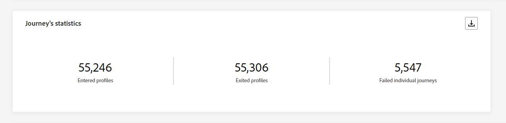
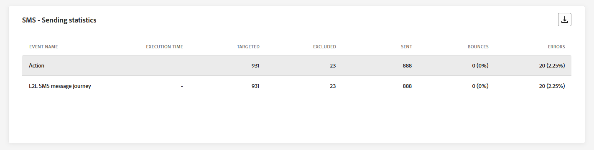
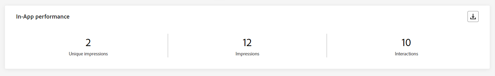
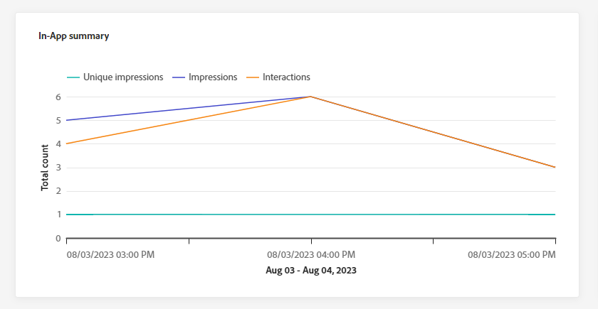

# Relatório global da jornada {#journey-global-report}

>[!CONTEXTUALHELP]
>id="ajo_journey_global_report"
>title="Relatório global da jornada"
>abstract="O Relatório global da jornada permite medir o impacto das jornadas em um período selecionado. O relatório é dividido em diferentes widgets detalhando o sucesso e os erros da jornada. Cada painel de relatórios pode ser modificado redimensionando ou removendo widgets."

Os relatórios globais, acessíveis na guia Todos os tempos, exibem eventos que ocorreram pelo menos duas horas atrás e abordam eventos em um período selecionado. Em comparação, os Relatórios em tempo real focalizam eventos que ocorreram nas últimas 24 horas, com um intervalo mínimo de dois minutos a partir da ocorrência do evento.

O relatório global de Jornada pode ser acessado diretamente da sua jornada com o botão **[!UICONTROL Exibir relatório]**.

A página do **[!UICONTROL Relatório global]** da jornada será exibida com as seguintes guias:

* [Jornada](#journey-global)
* [Email](#email-global)
* [Push](#push-global)
* [SMS](#sms-global)
* [No aplicativo](#in-app-global)

O **[!UICONTROL Relatório global]** da jornada é dividido em diferentes widgets detalhando o sucesso e os erros da sua jornada. Cada widget pode ser redimensionado e excluído, se necessário. Para obter mais informações, consulte esta [seção](global-report.md#modify-dashboard).

Para obter uma lista detalhada de cada métrica disponível no Adobe Journey Optimizer, consulte [esta página](global-report.md#list-of-components-global).

## Guia Jornada {#journey-global}

Do seu **[!UICONTROL Relatório global]** da jornada, a guia **[!UICONTROL Jornada]** fornece uma exibição clara dos dados de rastreamento mais importantes sobre sua jornada.

### Desempenho da jornada {#journey-perfomance}

>[!CONTEXTUALHELP]
>id="ajo_journey_performance"
>title="Desempenho da jornada"
>abstract="O dispositivo “Desempenho da jornada” permite rastrear visualmente o caminho dos perfis direcionados à medida que eles avançam pela jornada."

O widget **[!UICONTROL Desempenho da Jornada]** permite rastrear visualmente a trajetória dos perfis direcionados à medida que eles navegam pela jornada.

Observe que a contagem de perfis de um nó só é atualizada depois que o perfil conclui o nó, não ao inseri-la. Por exemplo, um perfil em um nó **Wait** só é contado depois que a data especificada é atingida e o perfil sai do nó.

### Estatísticas da jornada {#journey-statistics}

>[!CONTEXTUALHELP]
>id="ajo_journey_statistics"
>title="Estatísticas da jornada"
>abstract="Os KPIs (Indicadores-chave de desempenho) das estatísticas da jornada atuam como um painel abrangente, fornecendo uma análise detalhada de métricas essenciais relacionadas à sua jornada."

Os **[!UICONTROL Indicadores-chave de desempenho (KPIs) das Estatísticas de Jornada]** funcionam como um painel abrangente, fornecendo uma análise das métricas essenciais associadas à sua jornada. Isso inclui detalhes como a contagem de perfis inseridos e instâncias de jornadas individuais com falha, oferecendo um insight abrangente sobre a eficácia e o nível de engajamento da jornada.

+++ Saiba mais sobre métricas de Estatísticas do Jornada

* **[!UICONTROL Perfis inseridos]**: número total de pessoas físicas que atingiram o evento de entrada da jornada.

* **[!UICONTROL Perfis encerrados]**: número total de indivíduos que saíram da jornada.

* **[!UICONTROL jornada individual com falha]**: número total de jornadas individuais que não foram executadas com êxito.

+++

### Desempenho da ação {#action-performance}

>[!CONTEXTUALHELP]
>id="ajo_journey_action_performance"
>title="Desempenho da ação"
>abstract="O dispositivo “Desempenho da ação” ilustra as ações mais bem-sucedidas que ocorreram quando suas ações foram iniciadas."

O widget **[!UICONTROL Desempenho da ação]** representa as ações mais bem-sucedidas que ocorreram quando suas **[!UICONTROL ações]** foram acionadas.

### Principais ações {#top-actions}

>[!CONTEXTUALHELP]
>id="ajo_journey_top_actions"
>title="Principais ações"
>abstract="A tabela “Principais ações” consolida informações essenciais sobre suas ações, oferecendo observações concisas sobre a frequência e a eficiência de cada ação."

A tabela **[!UICONTROL Principais Ações]** compila os dados essenciais sobre suas **[!UICONTROL Ações]**. Fornece informações sucintas sobre a frequência e o desempenho de cada ação.

+++ Saiba mais sobre as principais métricas de ações

* **[!UICONTROL Ações executadas com êxito]**: Número total de **[!UICONTROL Ações]** executadas com êxito para uma jornada.

* **[!UICONTROL Erro na ação]**: Número total de erros que ocorreram para **[!UICONTROL Ações]**.

+++

### Motivos de erro de ações {#action-error}

>[!CONTEXTUALHELP]
>id="ajo_journey_actions_error_reasons"
>title="Motivos de erro de ações"
>abstract="A tabela e o gráfico “Motivos de erro de ações” fornecem um resumo completo dos erros encontrados durante a execução de suas ações, oferecendo uma visão geral abrangente dos problemas que podem ter ocorrido."

A tabela e o gráfico **[!UICONTROL Motivos de Erro de Ação]** oferecem uma visão geral abrangente dos erros ocorridos durante a execução de suas **[!UICONTROL Ações]**.

### Eventos por origem {#events-origin}

>[!CONTEXTUALHELP]
>id="ajo_journey_events_origin"
>title="Eventos por origem"
>abstract="A tabela e os gráficos “Eventos por origem” oferecem uma visualização da recepção bem-sucedida dos eventos. Essas representações visuais permitem identificar com precisão os eventos que foram recebidos efetivamente, fornecendo insights valiosos sobre o desempenho e o impacto de cada evento na jornada."

A tabela e os gráficos de **[!UICONTROL Eventos por origem]** fornecem uma perspectiva detalhada sobre a recepção bem-sucedida dos **[!UICONTROL eventos]**. Por meio dessas representações visuais, você pode discernir precisamente quais dos seus **[!UICONTROL eventos]** foram recebidos com eficiência, oferecendo insights valiosos sobre o desempenho e o impacto de eventos individuais dentro da sua jornada.

### Eventos recebidos por evento {#events-received}

>[!CONTEXTUALHELP]
>id="ajo_journey_events_received"
>title="Eventos recebidos por evento"
>abstract="O gráfico “Eventos recebidos por evento” permite identificar e analisar os eventos específicos na jornada que foram executados com eficiência, fornecendo insights valiosos sobre o desempenho e as taxas de sucesso de eventos individuais."

O gráfico **[!UICONTROL Eventos recebidos por evento]** permite identificar e analisar qual **[!UICONTROL evento]** específico da sua jornada foi executado com eficácia, fornecendo informações valiosas sobre o desempenho e as taxas de sucesso de eventos individuais.

### Principais eventos {#top-events}

>[!CONTEXTUALHELP]
>id="ajo_journey_top_events"
>title="Principais eventos"
>abstract="A tabela “Principais eventos” consolida dados essenciais sobre seus eventos, oferecendo observações concisas sobre a frequência e o desempenho de cada evento individual."

A tabela **[!UICONTROL Principais eventos]** compila os dados essenciais sobre seus **[!UICONTROL Eventos]**. Ele fornece insights sucintos sobre a frequência e o desempenho de cada **[!UICONTROL Evento]**.

### Políticas de consentimento {#consent-policies}

>[!CONTEXTUALHELP]
>id="ajo_journey_consent_policies"
>title="Políticas de consentimento"
>abstract="A tabela e o gráfico “Políticas de consentimento” exibem a quantidade de perfis excluídos de cada política em suas ações personalizadas. Esta apresentação oferece um insight claro sobre a influência de cada política de consentimento nas exclusões de perfis."

A tabela e o gráfico **[!UICONTROL Políticas de consentimento]** mostram o número de perfis excluídos de cada política em suas ações personalizadas. Isso fornece um insight claro sobre o impacto de cada política de consentimento nas exclusões de perfil.

Para obter mais informações sobre ações personalizadas, consulte [a documentação detalhada](../action/about-custom-action-configuration.md).

Observe que para que esses widgets apareçam nos relatórios do Jornada, será necessário redefinir seus painéis. Para fazer isso, clique em **[!UICONTROL Modificar]** e em **[!UICONTROL Redefinir]** na parte superior do relatório.

## Guia Email {#email-global}

No seu **[!UICONTROL Relatório global]** do jornada, a guia **[!UICONTROL Email]** detalha as principais informações relativas aos emails enviados na sua jornada.

### Email: estatísticas de envio {#email-sending-statistics}

>[!CONTEXTUALHELP]
>id="ajo_journey_email_sending_statistics"
>title="Email: estatísticas de envio"
>abstract="A tabela “Email: estatísticas de envio” resume dados essenciais sobre o email, como se ele foi direcionado ou entregue."

A tabela **[!UICONTROL Estatísticas de envio de email]** fornece um resumo abrangente dos dados essenciais sobre emails em suas jornadas. Ele detalha as principais métricas, como o tamanho do público-alvo e o número de emails entregues com êxito, oferecendo insights valiosos sobre a eficácia e o alcance de seus emails e jornadas.

+++ Saiba mais sobre métricas de Estatísticas de envio de email

* **[!UICONTROL Tempo de execução]**: hora de início de cada execução de jornada em caso de jornadas recorrentes. Para direcionar apenas uma ou várias recorrências, selecione-a no menu suspenso **[!UICONTROL Tempo de execução]**.

* **[!UICONTROL Direcionado]**: número de perfis direcionados para qualquer ação, como enviar email ou SMS.

* **[!UICONTROL Enviado]**: número total de emails enviados para a jornada.

* **[!UICONTROL Entregues]**: número de emails enviados com êxito em relação ao número total de emails enviados.

* **[!UICONTROL Taxa de entrega]**: porcentagem de emails enviados com êxito.

* **[!UICONTROL Rejeições]**: total de erros acumulados durante o processo de envio e o processamento automático de retorno em relação ao número total de emails enviados.

* **[!UICONTROL Taxa de rejeição]**: porcentagem de emails rejeitados em comparação aos emails enviados.

* **[!UICONTROL Erros]**: Número total de erros que ocorreram durante o processo de envio, impedindo que ele fosse enviado a perfis.

* **[!UICONTROL Taxa de Erro]**: Porcentagem de erros ocorridos durante o processo de envio que impediram o envio, em comparação aos emails enviados.

* **[!UICONTROL Tentativas]**: número de emails na fila para tentativas.

* **[!UICONTROL Excluídos]**: número de perfis excluídos pelo Adobe Journey Optimizer.

+++

### Email: estatísticas de rastreamento {#email-tracking}

>[!CONTEXTUALHELP]
>id="ajo_journey_email_tracking_statistics"
>title="Email: estatísticas de rastreamento"
>abstract="A tabela “Email: estatísticas de rastreamento” fornece dados sobre atividades de perfil do email."

A tabela **[!UICONTROL Email - Estatísticas de rastreamento]** oferece uma conta detalhada da atividade do perfil relacionada aos emails incluídos na sua jornada. Isso inclui métricas sobre aberturas, cliques e outros indicadores de engajamento relevantes, oferecendo uma visualização abrangente de como os perfis interagem com seu conteúdo de email.

+++ Saiba mais sobre Email - Métricas de estatísticas de rastreamento

* **[!UICONTROL Tempo de execução]**: hora de início de cada execução do email recorrente na jornada. Para direcionar apenas um ou vários emails recorrentes, selecione-o no menu suspenso **[!UICONTROL Tempo de execução]**.

* **[!UICONTROL Aberturas]**: número de vezes que seus emails foram abertos em uma jornada.

* **[!UICONTROL Aberturas Exclusivas]**: Porcentagem de emails abertos.

* **[!UICONTROL Taxa de Abertura Exclusiva]**: número total de emails abertos em comparação ao número de emails entregues.

* **[!UICONTROL Cliques]**: número de vezes que um conteúdo foi clicado em seus emails.

* **[!UICONTROL Cliques únicos]**:Número de destinatários que clicaram em um conteúdo em seus emails.

* **[!UICONTROL Taxa de cliques]**: porcentagem de usuários que interagiram com a jornada.

* **[!UICONTROL Cancelar assinaturas]**: Número de cliques no link de cancelamento de assinatura.

* **[!UICONTROL Reclamações de spam]**: Número de vezes que seus emails foram declarados como spam ou lixo eletrônico.

+++

### Email: desempenho de envio {#email-performance}

>[!CONTEXTUALHELP]
>id="ajo_journey_email_sending_performance"
>title="Email: desempenho de envio"
>abstract="O gráfico “Email: desempenho de envio” apresenta dados abrangentes sobre emails enviados, oferecendo insights acerca de métricas principais, como entregas e rejeições, o que permite uma análise detalhada do processo de entrega de email."

O gráfico de **[!UICONTROL Desempenho de email - envio]** fornece uma exibição abrangente dos dados relacionados aos emails enviados em sua jornada, oferecendo insights sobre as métricas principais, como entregas e rejeições. Isso permite uma análise detalhada do processo de envio de email, fornecendo informações valiosas sobre a eficiência e o desempenho de suas jornadas.

+++ Saiba mais sobre Email - Envio de métricas de desempenho

* **[!UICONTROL Entregues]**: número de emails enviados com êxito em relação ao número total de emails enviados.

* **[!UICONTROL Rejeições]**: total de erros acumulados durante o processo de envio e o processamento de retorno automático em relação ao número total de mensagens enviadas.

* **[!UICONTROL Tentativas]**: número de emails na fila para tentativas.

* **[!UICONTROL Erros]**: Número total de erros que ocorreram durante um processo de envio, impedindo que ele fosse enviado a perfis.

+++

### Email: categorias e motivos de rejeição {#email-bounce-categories}

>[!CONTEXTUALHELP]
>id="ajo_journey_email_bounces"
>title="Email: categorias e motivos de rejeição"
>abstract="Os dispositivos “Email: categorias e motivos de rejeição” agregam os dados relativos às mensagens rejeitadas, oferecendo insights detalhados sobre os motivos e categorias específicos que contribuem para as rejeições de email"

Os widgets **[!UICONTROL Motivos da rejeição]** e **[!UICONTROL Categorias de rejeição]** compilam os dados disponíveis relacionados às mensagens rejeitadas, fornecendo insights detalhados sobre os motivos e categorias específicos por trás das rejeições de email.

Para obter mais informações sobre rejeições, consulte a página [Lista de supressão](../reports/suppression-list.md).

+++ Saiba mais sobre Email - Métricas de categorias de rejeição

* **[!UICONTROL Rejeição permanente]**: o número total de erros permanentes, como um endereço de email incorreto. Isso envolve uma mensagem de erro que declara explicitamente que o endereço é inválido, como Usuário desconhecido.

* **[!UICONTROL Rejeição temporária]**: o número total de erros temporários, como uma caixa de entrada cheia.

* **[!UICONTROL Ignorado]**: o número total de erros temporários, como Ausência Temporária, ou um erro técnico, por exemplo, se o tipo de remetente for postmaster.

+++

### Email: motivos de erro {#email-errors}

>[!CONTEXTUALHELP]
>id="ajo_journey_email_error_reasons"
>title="Email: motivos de erro"
>abstract="A tabela “Email: motivos de erro” e seus gráficos permitem identificar os erros específicos que ocorreram durante o processo de envio."

Os gráficos e a tabela **[!UICONTROL Motivos do Erro]** oferecem visibilidade sobre os erros específicos ocorridos durante o processo de envio, fornecendo informações valiosas sobre a natureza e a ocorrência de erros.

### Email: motivos de exclusão {#email-excluded}

>[!CONTEXTUALHELP]
>id="ajo_journey_email_excluded_reasons"
>title="Email: motivos de exclusão"
>abstract="A tabela “Motivos de exclusão” e seus gráficos ilustram os vários fatores que levaram perfis de usuário excluídos do público-alvo a não receberem a mensagem."

Os gráficos e a tabela **[!UICONTROL Motivos excluídos]** apresentam uma visão abrangente dos diferentes fatores que resultaram na exclusão de perfis de usuário do público-alvo direcionado, resultando no não recebimento da mensagem.

Consulte [esta página](exclusion-list.md) para obter uma lista abrangente dos motivos de exclusão.

### Enviados e entregues por domínios {#sent-domains}

>[!CONTEXTUALHELP]
>id="ajo_journey_email_sent_delivered_domains"
>title="Enviados e entregues por domínios"
>abstract="A tabela e o gráfico “Enviados e entregues por domínios” fornecem um detalhamento dos emails categorizados por domínios, apresentando insights detalhados sobre o desempenho geral das suas comunicações por email."

A tabela e o gráfico **[!UICONTROL Enviados e entregues por domínios]** fornecem um detalhamento dos emails em nível de domínio, oferecendo insights abrangentes sobre o desempenho dos seus emails.

+++ Saiba mais sobre métricas Enviado e entregue por domínios

* **[!UICONTROL Enviado]**: número total de envios para seus emails.

* **[!UICONTROL Entregues]**: número de emails enviados com êxito em relação ao número total de emails enviados.

+++

### Aberturas e cliques por domínios {#open-domains}

>[!CONTEXTUALHELP]
>id="ajo_journey_email_open_clicks_domains"
>title="Aberturas e cliques por domínios"
>abstract="O gráfico e a tabela “Abertura e cliques por domínios” oferecem um detalhamento no nível do domínio, apresentando uma visão abrangente de como seu público-alvo interage com seus emails."

O gráfico e a tabela **[!UICONTROL Abrir e clicar por domínios]** mostram um detalhamento em nível de domínio do envolvimento dos seus perfis com o seu email, fornecendo informações valiosas sobre como domínios diferentes interagem com o seu conteúdo.

+++ Saiba mais sobre métricas de Abertura e cliques por domínios

* **[!UICONTROL Aberturas]**: número de vezes que o email foi aberto.

* **[!UICONTROL Cliques]**: número de vezes que um conteúdo foi clicado em um email.

+++

### Rejeições e erros por domínios {#bounces-domains}

>[!CONTEXTUALHELP]
>id="ajo_journey_email_bounces_errors_domains"
>title="Rejeições e erros por domínios"
>abstract="O gráfico e a tabela “Rejeições e erros por domínios” fornecem um detalhamento granular no nível de domínio, oferecendo insights sobre erros específicos encontrados durante o processo de envio de email."

O gráfico e a tabela **[!UICONTROL Rejeições e erros por domínios]** oferecem um detalhamento em nível de domínio de erros específicos encontrados durante o processo de envio, fornecendo uma análise detalhada dos problemas ocorridos.

+++ Saiba mais sobre métricas de Rejeições e erros por domínios

* **[!UICONTROL Rejeições]**: total de erros acumulados durante o processo de envio e o processamento automático de retorno em relação ao número total de emails enviados.

* **[!UICONTROL Erros]**: Número total de erros que ocorreram durante o processo de envio, impedindo que ele fosse enviado a perfis.

+++

### Motivos de rejeição por domínio {#bounce-reasons-domains}

>[!CONTEXTUALHELP]
>id="ajo_journey_email_bounces_reasons_domains"
>title="Motivos de rejeição por domínios"
>abstract="O gráfico e a tabela “Motivos de rejeição por domínio” fornecem um detalhamento no nível do domínio, oferecendo insights abrangentes sobre erros temporários e permanentes. Essa análise detalhada fornece informações valiosas sobre os motivos específicos por trás das mensagens rejeitadas."

O gráfico e a tabela **[!UICONTROL Motivos da rejeição por domínio]** oferecem um detalhamento de dados em nível de domínio sobre erros temporários e permanentes, fornecendo insights detalhados sobre os motivos por trás das mensagens rejeitadas.

### Email: URL principal {#email-top}

>[!CONTEXTUALHELP]
>id="ajo_journey_email_top_url"
>title="Email: URL principal"
>abstract="A tabela “Email: URL principal” e seu gráfico oferecem uma visão geral abrangente dos URLs do email que recebem o maior tráfego de visitantes, permitindo identificar os links mais populares."

O gráfico e tabela **[!UICONTROL Email - URL superior]** fornece uma visão geral abrangente das URLs de seu email que atraem o maior tráfego de visitantes. Isso permite identificar e priorizar os links mais populares, melhorando sua compreensão do envolvimento do perfil com conteúdo específico em seus emails.

### Email: otimização {#email-sto}

>[!CONTEXTUALHELP]
>id="ajo_journey_email_optimization"
>title="Email: otimização"
>abstract="Os dispositivos “Otimização de tempo de envio” e “Otimizado vs. não otimizado” fornecem informações detalhadas sobre suas mensagens, destacando se foram otimizadas ou não."

>[!NOTE]
>
>Os widgets **[!UICONTROL Otimização de tempo de envio]** e **[!UICONTROL Otimizado vs. não otimizado]** só estarão disponíveis se a opção Otimização de tempo de envio estiver ativada para a sua entrega. Para obter mais informações sobre Otimização de Tempo de Envio, consulte [esta página](../building-journeys/journeys-message.md#send-time-optimization).

Os widgets **[!UICONTROL Otimização de tempo de envio]** e **[!UICONTROL Otimizado vs. não otimizado]** detalham o sucesso dos seus emails dependendo do método de envio: otimizado ou normal.

+++ Saiba mais sobre Otimização de tempo de envio e Métricas otimizadas versus não otimizadas

* **[!UICONTROL Entregues]**: número de mensagens enviadas com êxito em relação ao número total de mensagens enviadas.
* **[!UICONTROL Rejeições]**: total de erros acumulados durante o processo de envio e o processamento de retorno automático em relação ao número total de mensagens enviadas.

* **[!UICONTROL Enviado]**: número total de emails enviados para a jornada.

* **[!UICONTROL Aberturas]**: número de vezes que seus emails foram abertos na jornada.

* **[!UICONTROL Cliques]**: número de vezes que um conteúdo foi clicado em seus emails.

+++

### Email: ofertas {#email-offers}

>[!CONTEXTUALHELP]
>id="ajo_journey_email_offers"
>title="Email: ofertas"
>abstract="Os dispositivos “Estatística de ofertas” e “Estatística detalhada de ofertas” fornecem insights abrangentes sobre o desempenho de suas ofertas, oferecendo uma análise detalhada de seu impacto ao longo do tempo e apresentando estatísticas detalhadas para uma compreensão mais aprofundada."

>[!NOTE]
>
>Os widgets e as métricas de Ofertas só estarão disponíveis se uma decisão tiver sido inserida em um email. Para obter mais informações sobre o Gerenciamento de decisões, consulte esta [página](../offers/get-started/starting-offer-decisioning.md).

As **[!UICONTROL Estatísticas de ofertas]** e **[!UICONTROL Estatísticas detalhadas de ofertas]** ao longo do tempo os widgets medem o sucesso e o impacto da sua oferta no público-alvo direcionado. Ele detalha as principais informações relacionadas à sua mensagem com KPIs.

+++ Saiba mais sobre Email - Métricas de ofertas

* **[!UICONTROL Oferta enviada]**: número total de envios para a oferta.

* **[!UICONTROL Impressão da oferta]**: número de vezes que a oferta foi aberta em seus emails.

* **[!UICONTROL Cliques de oferta]**: número de vezes que uma oferta foi clicada em seus emails.

* **[!UICONTROL Nome do posicionamento]**: o nome do seu posicionamento usado para exibir sua oferta. Para obter mais informações sobre posicionamento, consulte esta [página](../offers/offer-library/creating-placements.md).

* **[!UICONTROL Nome da oferta]**: nome da oferta adicionada aos seus emails. Para obter mais informações sobre posicionamento, consulte esta [página](../offers/offer-library/creating-personalized-offers.md).

* **[!UICONTROL Oferta enviada]**: número total de envios para a oferta.

* **[!UICONTROL Taxa de impressão da oferta]**: porcentagem de ofertas abertas em comparação ao número de ofertas enviadas.

* **[!UICONTROL Taxa de cliques da oferta]**: porcentagem de usuários que interagiram com a oferta.

+++

## Guia Notificação por push {#push-global}

No seu **[!UICONTROL Relatório global]** da jornada, a guia **[!UICONTROL Notificação por push]** detalha as principais informações relativas às notificações por push enviadas na jornada.

### Notificação por push: estatísticas de envio {#push-sending-stat}

>[!CONTEXTUALHELP]
>id="ajo_journey_push_sending_statistics"
>title="Notificação por push: estatísticas de envio"
>abstract="A tabela “Notificações por push: estatísticas de envio” resume dados essenciais sobre notificações por push, como mensagens direcionadas ou entregues."

A tabela **[!UICONTROL Notificação por push - Estatísticas de envio]** fornece um resumo conciso dos dados essenciais relacionados às suas notificações por push, incluindo as métricas principais, como o número de mensagens direcionadas e o número de mensagens entregues com êxito.

+++ Saiba mais sobre Notificação por push - Envio de métricas de estatísticas

* **[!UICONTROL Tempo de execução]**: hora de início de cada execução de jornada em caso de jornadas recorrentes. Para direcionar apenas uma ou várias recorrências, selecione-a no menu suspenso **[!UICONTROL Tempo de execução]**.

* **[!UICONTROL Direcionado]**: número de perfis direcionados para qualquer ação, como enviar email ou SMS.

* **[!UICONTROL Enviado]**: número total de notificações por push enviadas.

* **[!UICONTROL Entregue]**: número de notificações por push enviadas com êxito em relação ao número total de notificações por push enviadas.

* **[!UICONTROL Taxa de entrega]**: porcentagem de notificações por push enviadas com êxito.

* **[!UICONTROL Rejeições]**: total de erros acumulados durante o processo de envio e o processamento automático de retorno em relação ao número total de notificações por push enviadas.

* **[!UICONTROL Taxa de rejeição]**: porcentagem de notificações por push que foram rejeitadas em comparação às notificações por push enviadas.

* **[!UICONTROL Erros]**: Número total de erros que ocorreram durante o processo de envio, impedindo que ele fosse enviado a perfis.

* **[!UICONTROL Taxa de Erro]**: porcentagem de erros ocorridos durante o processo de envio que impediram seu envio em comparação com as notificações por push enviadas.

* **[!UICONTROL Excluídos]**: número de perfis excluídos pelo Adobe Journey Optimizer.

+++

### Notificações por push: estatísticas de rastreamento {#push-tracking-stat}

>[!CONTEXTUALHELP]
>id="ajo_journey_push_tracking_statistics"
>title="Notificações por push: estatísticas de rastreamento"
>abstract="As “Estatísticas de rastreamento de push” fornecem dados sobre as atividades de perfil das notificações por push."

O widget **[!UICONTROL Estatísticas de push - Rastreamento]** oferece um instantâneo detalhado da atividade do perfil vinculada às suas notificações por push, fornecendo insights essenciais sobre a eficácia das notificações por push e de engajamento.

+++ Saiba mais sobre Notificação por push - Rastreamento de métricas de estatísticas

* **[!UICONTROL Tempo de execução]**: hora de início de cada execução de jornada em caso de jornadas recorrentes. Para direcionar apenas uma ou várias recorrências, selecione-a no menu suspenso **[!UICONTROL Tempo de execução]**.

* **[!UICONTROL Aberturas]**: número de vezes que suas notificações por push foram abertas na jornada.

* **[!UICONTROL Ações]**: número total de ações na notificação por push entregue, por exemplo, clique em botões ou descarte.

+++

### Notificação por push: resumo de envio {#push-summary}

>[!CONTEXTUALHELP]
>id="ajo_journey_push_sending_summary"
>title="Notificação por push: resumo de envio"
>abstract="O gráfico “Notificações por push: resumo de envio” exibe os dados disponíveis para notificações por push enviadas."

O gráfico **[!UICONTROL Notificação por push - Envio de resumo]** oferece uma representação dinâmica, exibindo uma análise da sua atividade de notificações por push. Esta representação gráfica fornece um detalhamento abrangente das notificações por push enviadas.

+++ Saiba mais sobre Notificação por push - Envio de métricas de resumo

* **[!UICONTROL Aberturas]**: número de vezes que suas notificações por push foram abertas na jornada.

* **[!UICONTROL Ações]**: número total de ações na notificação por push entregue, por exemplo, clique em botões ou descarte.

* **[!UICONTROL Rejeições]**: total de erros acumulados durante o processo de envio e o processamento automático de retorno em relação ao número total de notificações por push enviadas.

* **[!UICONTROL Entregue]**: número de notificações por push enviadas com êxito em relação ao número total de notificações por push enviadas.

* **[!UICONTROL Erros]**: Número total de erros que ocorreram durante o processo de envio, impedindo que ele fosse enviado a perfis.

+++

### Notificação por push: motivos de erro {#push-error-reasons}

>[!CONTEXTUALHELP]
>id="ajo_journey_push_error_reasons"
>title="Notificação por push: motivos de erro"
>abstract="Os gráficos e a tabela “Motivos de erro” permitem identificar os erros específicos que ocorreram durante o processo de envio"

A tabela e os gráficos **[!UICONTROL Motivos do erro]** fornecem a capacidade de identificar os erros específicos que ocorreram durante o processo de envio de suas notificações por push, oferecendo insights detalhados sobre quaisquer problemas encontrados ao longo do caminho.

### Notificação por push: motivos de exclusão {#push-excluded}

>[!CONTEXTUALHELP]
>id="ajo_journey_push_excluded_reasons"
>title="Notificação por push: motivos de exclusão"
>abstract="Os gráficos e a tabela “Motivos de exclusão” ilustram os diversos fatores que impediram que perfis de usuários, excluídos do público-alvo, recebessem a mensagem."

Os gráficos e a tabela **[!UICONTROL Motivos excluídos]** exibem os diferentes motivos que impediram os perfis de usuário, excluídos dos perfis direcionados, de receber suas notificações por push.

Consulte [esta página](exclusion-list.md) para obter uma lista abrangente dos motivos de exclusão.

### Notificação por push: detalhamento por plataforma {#push-breakdown}

>[!CONTEXTUALHELP]
>id="ajo_journey_push_breakdown_platform"
>title="Notificação por push: detalhamento por plataforma"
>abstract="Os gráficos e a tabela “Notificação por push: detalhamento por plataforma” fornecem um detalhamento do sucesso de suas notificações por push com base no sistema operacional do perfil."

O gráfico e a tabela **[!UICONTROL Detalhamento por plataforma]** fornecem uma análise detalhada do sucesso das suas notificações por push, oferecendo insights com base no sistema operacional do seu perfil. Esse detalhamento melhora a sua compreensão do desempenho das notificações por push em diferentes plataformas.

### Notificação por push - Otimização {#push-sto}

>[!NOTE]
>
>Os widgets **[!UICONTROL Otimizado vs. não otimizado]** e **[!UICONTROL Otimização de tempo de envio]** só estarão disponíveis se a opção Otimização de tempo de envio estiver ativada para a sua entrega. Para obter mais informações sobre Otimização de Tempo de Envio, consulte [esta página](../building-journeys/journeys-message.md#send-time-optimization).

Os widgets **[!UICONTROL Otimizado vs. não otimizado]** e **[!UICONTROL Otimização de tempo de envio]** detalham as principais informações relativas à sua mensagem, estejam elas otimizadas ou não.

+++ Saiba mais sobre Notificação por push - Métricas de otimização

* **[!UICONTROL Entregues]**: número de mensagens enviadas com êxito em relação ao número total de mensagens enviadas.

* **[!UICONTROL Aberturas]**: número de vezes que suas notificações por push foram abertas na jornada.

* **[!UICONTROL Ações]**: número total de ações na notificação por push entregue, por exemplo, clique em botões ou descarte.

* **[!UICONTROL Entregues]**: número de mensagens enviadas com êxito em relação ao número total de mensagens enviadas.

* **[!UICONTROL Rejeições]**: total de erros acumulados durante o processo de envio e o processamento de retorno automático em relação ao número total de mensagens enviadas.

+++

## Guia SMS {#sms-global}

### SMS: estatísticas de envio {#sms-sending-stat}

>[!CONTEXTUALHELP]
>id="ajo_journey_sms_sending_statistics"
>title="SMS: estatísticas de envio"
>abstract="A tabela “SMS: estatísticas de envio” resume dados essenciais sobre suas mensagens de SMS, como mensagens direcionadas ou entregues."

A tabela **[!UICONTROL SMS - Estatísticas de envio]** fornece um resumo conciso dos dados essenciais relacionados às suas mensagens SMS, englobando as métricas principais, como o número de mensagens direcionadas e a contagem de mensagens entregues com êxito.

+++ Saiba mais sobre SMS - Envio de métricas de estatísticas

* **[!UICONTROL Tempo de execução]**: hora de início de cada execução de jornada em caso de jornadas recorrentes. Para direcionar apenas uma ou várias recorrências, selecione-a no menu suspenso **[!UICONTROL Tempo de execução]**.

* **[!UICONTROL Direcionado]**: número de perfis de usuário qualificados como perfis de destino para suas mensagens SMS.

* **[!UICONTROL Excluídos]**: número de perfis de usuário, excluídos dos perfis direcionados, que não receberam suas mensagens SMS.

* **[!UICONTROL Enviado]**: número total de mensagens SMS enviadas para a jornada.

* **[!UICONTROL Rejeições]**: total de erros acumulados durante o processo de envio e o processamento automático de retorno em relação ao número total de mensagens SMS enviadas.

* **[!UICONTROL Erros]**: Número total de erros que ocorreram durante o processo de envio, impedindo que ele fosse enviado a perfis.

+++

### SMS: estatísticas de rastreamento {#sms-tracking-stat}

>[!CONTEXTUALHELP]
>id="ajo_journey_sms_tracking_statistics"
>title="SMS: estatísticas de rastreamento"
>abstract="O dispositivo “SMS: estatísticas de rastreamento” fornece uma visão geral abrangente de informações essenciais relacionadas à interação de visitantes com o seu URL."

O widget **[!UICONTROL SMS - Estatísticas de rastreamento]** fornece uma visão geral detalhada das principais informações relacionadas ao engajamento dos visitantes com suas URLs, oferecendo insights sobre a eficácia das mensagens SMS.

* **[!UICONTROL Tempo de execução]**: a hora de início de cada execução do SMS recorrente. Para direcionar apenas um ou vários SMS recorrentes, selecione-o no menu suspenso **[!UICONTROL Tempo de execução]**.

* **[!UICONTROL Cliques]**: número de vezes que um conteúdo foi clicado em suas mensagens SMS.

### SMS: desempenho por data {#sms-performance-date}

>[!CONTEXTUALHELP]
>id="ajo_journey_sms_perfomance_date"
>title="SMS: desempenho por data"
>abstract="O dispositivo “SMS: desempenho por data” fornece informações importantes sobre suas mensagens por meio de uma representação gráfica."

O widget **[!UICONTROL SMS - Desempenho por data]** oferece uma visão geral detalhada das principais informações relacionadas às suas mensagens, apresentadas por meio de um gráfico, fornecendo insights sobre as tendências de desempenho em períodos específicos.

+++ Saiba mais sobre SMS - Desempenho por métricas de data

* **[!UICONTROL Enviado]**: Número total de mensagens SMS enviadas para a jornada

* **[!UICONTROL Rejeições]**: total de erros acumulados durante o processo de envio e o processamento automático de retorno em relação ao número total de mensagens SMS enviadas.

* **[!UICONTROL Erros]**: Número total de erros que ocorreram durante o processo de envio, impedindo que ele fosse enviado a perfis.

+++

### SMS: motivos de rejeições {#sms-bounce}

>[!CONTEXTUALHELP]
>id="ajo_journey_sms_bounces_reasons"
>title="SMS: motivos de rejeições"
>abstract="A tabela “Motivos de rejeições” e seus gráficos contêm dados relacionados às mensagens rejeitadas."

Os gráficos e a tabela **[!UICONTROL Motivos de rejeições]** fornecem uma visão geral abrangente dos dados relacionados às mensagens SMS rejeitadas, fornecendo insights valiosos sobre os motivos específicos por trás das instâncias de rejeições de mensagens SMS.

### SMS: motivos de erro {#sms-error}

>[!CONTEXTUALHELP]
>id="ajo_journey_sms_error_reasons"
>title="SMS: motivos de erro"
>abstract="A tabela “SMS: motivos de erro” e seus gráficos permitem identificar os erros específicos que ocorreram durante o processo de envio."

Os gráficos e a tabela **[!UICONTROL Motivos do erro]** permitem identificar os erros específicos que ocorreram durante o processo de envio de suas mensagens SMS, facilitando uma análise completa de todos os problemas encontrados.

### SMS: motivos de exclusão {#sms-excluded}

>[!CONTEXTUALHELP]
>id="ajo_journey_sms_excluded_reasons"
>title="SMS: motivos de exclusão"
>abstract="A tabela “Motivos de exclusão” e seus gráficos ilustram os vários fatores que levaram perfis de usuário excluídos do público-alvo a não receberem a mensagem."

Os gráficos e a tabela **[!UICONTROL Motivos excluídos]** representam visualmente os diversos fatores que levaram à exclusão de perfis de usuário do público-alvo direcionado, impedindo-o de receber suas mensagens SMS.

Consulte [esta página](exclusion-list.md) para obter uma lista abrangente dos motivos de exclusão.

### SMS: cliques por link {#sms-clicks}

>[!CONTEXTUALHELP]
>id="ajo_journey_sms_clicks"
>title="SMS: cliques por link"
>abstract="O dispositivo “SMS: cliques por links” fornece insights essenciais sobre o engajamento dos visitantes com os URLs em suas mensagens."

O widget **[!UICONTROL SMS - Cliques por links]** oferece informações essenciais sobre o engajamento de seus visitantes com as URLs incluídas em suas mensagens, fornecendo informações valiosas sobre quais links atraem mais interação.

## Guia No aplicativo {#in-app-global}

No seu **[!UICONTROL Relatório global]** do Jornada, a guia **[!UICONTROL No aplicativo]** detalha as principais informações relativas às mensagens no aplicativo enviadas em suas jornadas.

### Desempenho in-app {#inapp-performance}

>[!CONTEXTUALHELP]
>id="ajo_journey_inapp_performance"
>title="Desempenho in-app"
>abstract="Os KPIs de desempenho no aplicativo fornecem insights essenciais sobre o engajamento de visitantes com as mensagens no aplicativo."

Os KPIs do **[!UICONTROL Desempenho no aplicativo]** fornecem informações essenciais sobre o envolvimento dos seus perfis com as mensagens no aplicativo, fornecendo métricas essenciais para avaliar a eficácia e o impacto das mensagens no aplicativo incluídas na sua jornada.

+++ Saiba mais sobre as métricas no aplicativo - Desempenho por data

* **[!UICONTROL Impressões exclusivas]**: número de usuários exclusivos para os quais a mensagem no aplicativo foi exibida.

* **[!UICONTROL Impressões]**: número total de mensagens no aplicativo exibidas para todos os usuários.

  >[!NOTE]
  >
  >Para garantir que uma Impressão seja contada, o usuário deve atender a dois critérios:
  >* Qualificação dentro da experiência no aplicativo, obtida ao atingir a atividade específica no aplicativo em sua jornada.
  >* Cumprimento das condições especificadas nas regras de acionador.
  > 
  >Devido ao segundo critério, pode haver variações notáveis entre o número de perfis segmentados e a contagem de impressões únicas.

* **[!UICONTROL Interação]**: número de interações com sua mensagem no aplicativo. Isso inclui qualquer ação realizada pelos usuários, como cliques, rejeições ou quaisquer outras interações.
+++

### Resumo in-app {#inapp-summary}

>[!CONTEXTUALHELP]
>id="ajo_journey_inapp_summary"
>title="Resumo in-app"
>abstract="O gráfico “Resumo no aplicativo” ilustra a progressão das impressões e interações no aplicativo durante o período especificado."

O gráfico **[!UICONTROL Resumo no aplicativo]** ilustra a progressão das impressões e interações no aplicativo durante o período especificado, fornecendo uma visão geral abrangente do desempenho das mensagens no aplicativo.

### Interações por tipo {#interactions-type}

>[!CONTEXTUALHELP]
>id="ajo_journey_inapp_interactions"
>title="Interações por tipo"
>abstract="A tabela “Interações por tipo” e seus gráficos detalham como usuários interagiram com a mensagem no aplicativo por meio do rastreamento de cliques, mensagens ignoradas ou interações."

Os gráficos e a tabela **[!UICONTROL Interações por tipo]** fornecem uma conta detalhada de como os perfis interagiram com a mensagem no aplicativo, rastreando ações como cliques, rejeições ou qualquer outra forma de envolvimento.
