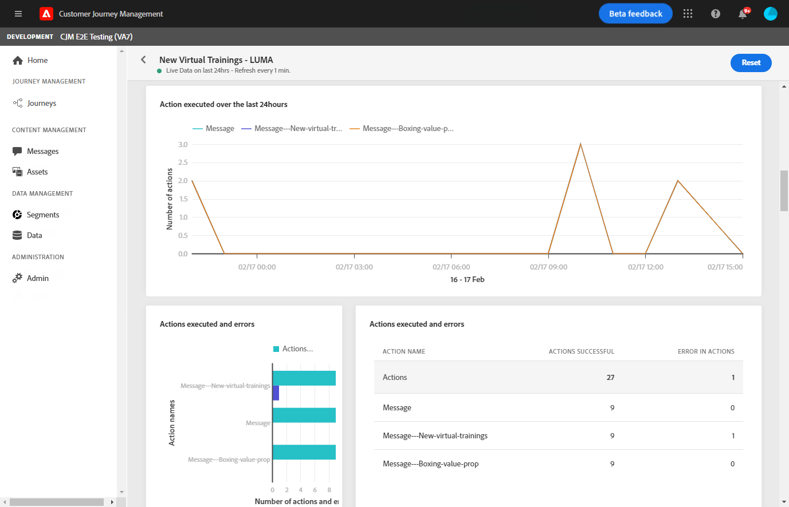
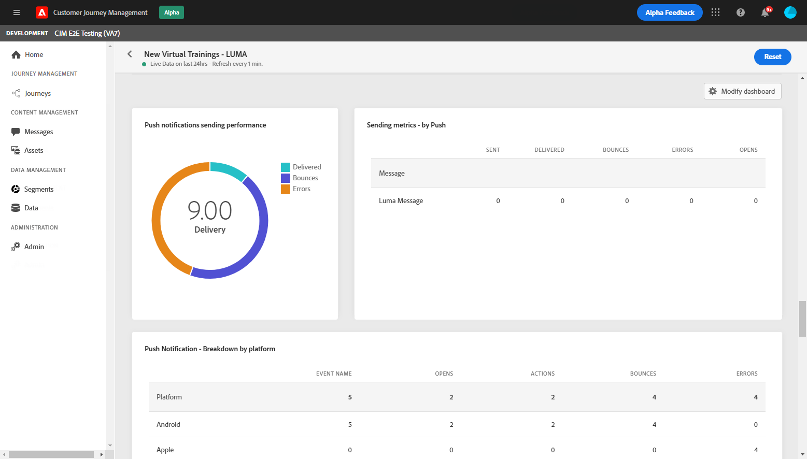
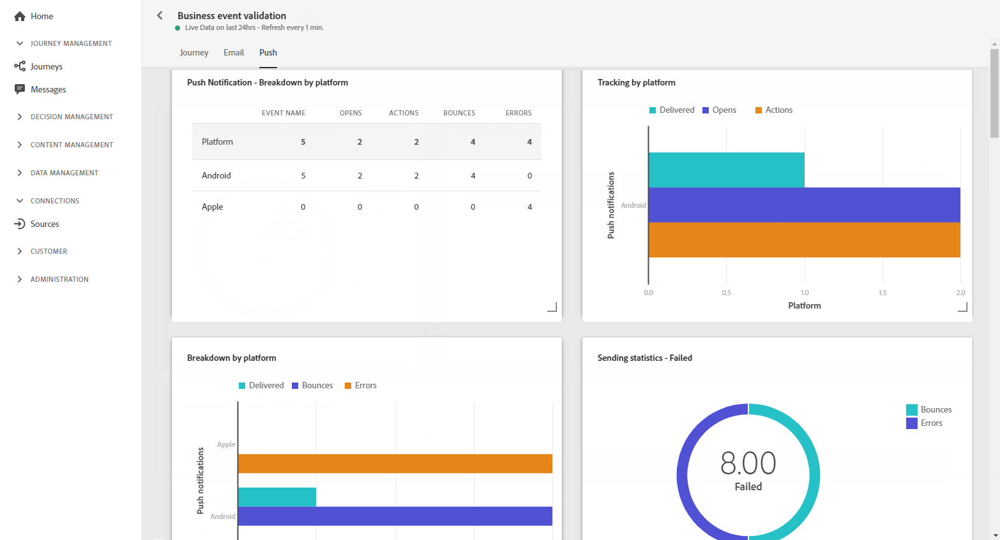

# Relatório ao vivo da jornada {#journey-live-report}

O relatório Jornada ao vivo pode ser acessado diretamente da sua jornada com o botão **[!UICONTROL Live report]**.

A página de jornada **[!UICONTROL Live report]** será exibida com as seguintes guias:

* [Jornada](#journey-live)
* [Email](#email-live)
* [Push](#push-live)

A jornada **[!UICONTROL Live report]** é dividida em diferentes widgets detalhando o sucesso e os erros da jornada. Cada widget pode ser redimensionado e excluído, se necessário. Para obter mais informações, consulte esta [seção](live-report.md#modify-dashboard).

## Guia Jornada {#journey-live}

Na jornada **[!UICONTROL Live report]**, a guia **[!UICONTROL Journey]** fornece uma exibição clara dos dados de rastreamento mais importantes sobre a jornada.

**[!UICONTROL Journey`s performance]** O permite ver o caminho dos perfis segmentados passo a passo pela jornada.

O widget **[!UICONTROL Journey`s statistics]** exibe os seguintes KPIs:

* **[!UICONTROL Entered profiles]**: Número total de indivíduos que chegaram ao evento de entrada da jornada.

* **[!UICONTROL Exited profiles]**: Número total de indivíduos que saíram da jornada.

* **[!UICONTROL Failed individual journey]**: Número total de jornadas individuais que não foram executadas com êxito.

Os widgets **[!UICONTROL Event executed over the last 24 hours]**, **[!UICONTROL Events executed]** e **[!UICONTROL Events]** permitem visualizar qual dos seus eventos foi executado com êxito por meio do número do resumo, gráfico e tabela.

**[!UICONTROL Action executed over the last 24 hours]** Os  **[!UICONTROL Actions executed and errors]** widgets e representam a ação e os erros mais bem-sucedidos que ocorreram quando suas ações foram acionadas. O gráfico de Ação, a tabela e os números de resumo contêm os dados disponíveis para ações, como:

* **[!UICONTROL Actions successfully executed]**: Número total de ações executadas com êxito para uma jornada.

* **[!UICONTROL Error in action]**: Número total de erros que ocorreram para ações.

## Guia Email {#email-live}

Na jornada **[!UICONTROL Live report]**, a guia **[!UICONTROL Email]** detalha as informações principais relativas aos deliveries do email enviados na jornada.

Para obter um relatório detalhado sobre um delivery de email específico, consulte a seção [Relatório ao vivo de email](email-live-report.md) .

O widget **[!UICONTROL Email Sending Statistics]** detalha as principais informações relativas à sua mensagem:

* **[!UICONTROL Delivered]**: Número de mensagens enviadas com êxito em relação ao número total de mensagens enviadas.

* **[!UICONTROL Bounces]**: Total de erros acumulados durante o delivery e o processamento automático de retorno em relação ao número total de mensagens enviadas.

* **[!UICONTROL Errors]**: Número total de erros que ocorreram durante um delivery, impedindo que ele fosse enviado a perfis.

A tabela **[!UICONTROL Sending metrics by Email]** e o gráfico **[!UICONTROL Email Summary]** detalham o sucesso do delivery:

* **[!UICONTROL Sent]**: Número total de envios para o delivery.

* **[!UICONTROL Delivered]**: Número de mensagens enviadas com êxito em relação ao número total de mensagens enviadas.

* **[!UICONTROL Bounces]**: Total de erros acumulados durante o delivery e o processamento automático de retorno em relação ao número total de mensagens enviadas.

* **[!UICONTROL Errors]**: Número total de erros que ocorreram durante um delivery, impedindo que ele fosse enviado a perfis.

* **[!UICONTROL Opens]**: Número de vezes que uma mensagem foi aberta em um delivery.

* **[!UICONTROL Clicks]**: Número de vezes que um conteúdo foi clicado em um delivery.

* **[!UICONTROL Unsubscribe]**: Número de cliques no link unsubscription.

* **[!UICONTROL Spam complaints]**: Número de vezes que uma mensagem foi declarada como spam ou lixo eletrônico.

Os widgets **[!UICONTROL Bounce Reasons]**, **[!UICONTROL Bounce categories]** e **[!UICONTROL Hard and bounce - by Email]** contêm os dados disponíveis relacionados às mensagens devolvidas, como:

* **[!UICONTROL Hard bounce]**: O número total de erros permanentes, como um endereço de email incorreto. Isso envolve uma mensagem de erro que declara explicitamente que o endereço é inválido, como Unknown user.

* **[!UICONTROL Soft bounce]**: O número total de erros temporários, como uma caixa de entrada cheia.

* **[!UICONTROL Ignored]**: O número total de temporários, como Ausência temporária, ou um erro técnico, por exemplo, se o tipo de remetente for postmaster.

O gráfico e a tabela **[!UICONTROL Error Reasons]** permitem ver qual erro ocorreu durante o delivery.

## Guia Empurrar {#push-live}

Na jornada **[!UICONTROL Live report]**, a guia **[!UICONTROL Push]** detalha as informações principais relativas aos deliveries por push enviados na jornada.

Para obter um relatório detalhado sobre um delivery de push específico, consulte a seção [Enviar relatório ao vivo](push-live-report.md) .

**[!UICONTROL Push notification sending performance]**,  **[!UICONTROL Push notification summary]** e  **[!UICONTROL Sending metrics - by Push]** widgets detalham as principais informações relativas à sua mensagem:

* **[!UICONTROL Sent]**: Número total de envios para o delivery.

* **[!UICONTROL Delivered]**: Número de mensagens enviadas com êxito em relação ao número total de mensagens enviadas.

* **[!UICONTROL Bounces]**: Total de erros acumulados durante o delivery e o processamento automático de retorno em relação ao número total de mensagens enviadas.

* **[!UICONTROL Errors]**: Número total de erros que ocorreram durante um delivery, impedindo que ele fosse enviado a perfis.

* **[!UICONTROL Opens]**: Número de vezes que uma mensagem foi aberta em um delivery.

* **[!UICONTROL Actions]**: Número total de ações na notificação por push entregue, por exemplo, clique no botão ou descarta.

* **[!UICONTROL Engagements]**: Número total de aberturas e ações para essa notificação por push, ou seja, se o perfil abriu o push ou se um botão foi clicado.

O gráfico e a tabela **[!UICONTROL Error Reasons]** permitem ver qual erro ocorreu durante o delivery.

Os gráficos **[!UICONTROL Tracking by platform]**, **[!UICONTROL Sending by platform]** e **[!UICONTROL Breakdown by platform]** detalham o sucesso da notificação por push, dependendo do sistema operacional.

O widget **[!UICONTROL Sending statistics - Failed]** permite visualizar quantos erros e rejeições ocorreram.
