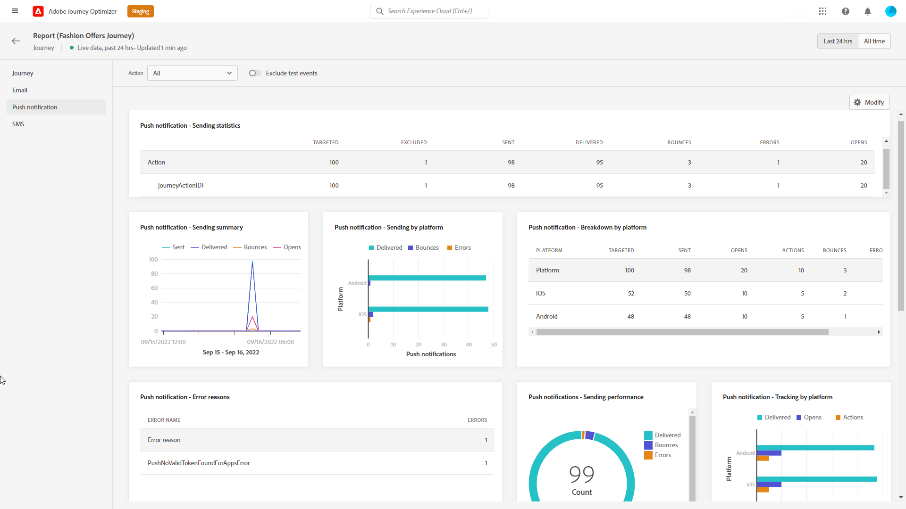

# Relatório ao vivo da jornada {#journey-live-report}

O relatório ao vivo do Jornada pode ser acessado diretamente da sua jornada com o **[!UICONTROL Exibir relatório]** botão.

A jornada **[!UICONTROL Relatório ao vivo]** será exibida com as seguintes guias:

* [Jornada](#journey-live)
* [Email](#email-live)
* [Push](#push-live)
* [SMS](#sms-live)

A jornada **[!UICONTROL Relatório ao vivo]** O é dividido em diferentes widgets detalhando o sucesso e os erros da jornada. Cada widget pode ser redimensionado e excluído, se necessário. Para obter mais informações sobre isso, consulte esta seção [seção](live-report.md#modify-dashboard).

Para obter uma lista detalhada de todas as métricas disponíveis no Adobe Journey Optimizer, consulte [esta página](live-report.md#list-of-components-live).

## Guia Jornada {#journey-live}

Da sua jornada **[!UICONTROL Relatório ao vivo]**, o **[!UICONTROL Jornada]** A guia fornece uma visualização clara dos dados de rastreamento mais importantes sobre a jornada.

+++Saiba mais sobre as diferentes métricas e widgets disponíveis para o relatório de Jornada.

**[!UICONTROL Desempenho da jornada]** O permite ver o caminho dos perfis segmentados passo a passo pela jornada.

O **[!UICONTROL Estatísticas de jornada]** O widget exibe os seguintes KPIs:

* **[!UICONTROL Perfis inseridos]**: Número total de indivíduos que chegaram ao evento de entrada da jornada.

* **[!UICONTROL Perfis exportados]**: Número total de indivíduos que saíram da jornada.

* **[!UICONTROL Jornadas individuais com falha]**: Número total de jornadas individuais que não foram executadas com êxito.

O **[!UICONTROL Evento executado nas últimas 24 horas]** e **[!UICONTROL Eventos]** os widgets permitem ver qual dos seus eventos foi executado com êxito por meio do número do resumo, gráfico e tabela.

O **[!UICONTROL Ação executada nas últimas 24 horas]** e **[!UICONTROL Ações executadas e erros]** os widgets representam a ação e os erros mais bem-sucedidos que ocorreram quando suas ações foram acionadas. O gráfico de Ação, a tabela e os números de resumo contêm os dados disponíveis para ações, como:

* **[!UICONTROL Ações executadas]**: Número total de ações executadas com êxito para uma jornada.

* **[!UICONTROL Erro nas ações]**: Número total de erros que ocorreram para ações.
+++

## Guia Email {#email-live}

Da sua jornada **[!UICONTROL Relatório ao vivo]**, o **[!UICONTROL Email]** detalha as informações principais relativas aos deliveries de email enviados na jornada.

+++Saiba mais sobre as diferentes métricas e widgets disponíveis para o relatório de email.

O **[!UICONTROL Email Sending Statistics]** o widget detalha as informações principais relativas à sua mensagem:

* **[!UICONTROL Entregue]**: Número de mensagens enviadas com êxito.

* **[!UICONTROL Rejeições]**: Total de erros acumulados durante o delivery e o processamento automático de retorno.

* **[!UICONTROL Erros]**: Número total de erros que ocorreram durante um delivery, impedindo que ele fosse enviado a perfis.

O **[!UICONTROL Envio de métricas por email]** tabela e **[!UICONTROL Resumo do email]** gráfico detalha o sucesso do seu delivery:

* **[!UICONTROL Enviado]**: Número total de envios para o delivery.

* **[!UICONTROL Entregue]**: Número de mensagens enviadas com êxito.

* **[!UICONTROL Rejeições]**: Total de erros acumulados durante o delivery e o processamento automático de retorno.

* **[!UICONTROL Erros]**: Número total de erros que ocorreram durante um delivery, impedindo que ele fosse enviado a perfis.

* **[!UICONTROL Abre]**: Número de vezes que uma mensagem foi aberta em um delivery.

* **[!UICONTROL Cliques]**: Número de vezes que um conteúdo foi clicado em um delivery.

* **[!UICONTROL Cancelar inscrição]**: Número de cliques no link unsubscription.

* **[!UICONTROL Reclamações de spam]**: Número de vezes que uma mensagem foi declarada como spam ou lixo eletrônico.

O **[!UICONTROL Motivos da rejeição]**, **[!UICONTROL Categorias de rejeição]** e **[!UICONTROL Resíduo e devolução - por email]** os widgets contêm os dados disponíveis relacionados às mensagens devolvidas, como:

* **[!UICONTROL Rejeição permanente]**: O número total de erros permanentes, como um endereço de email incorreto. Isso envolve uma mensagem de erro que declara explicitamente que o endereço é inválido, como Unknown user.

* **[!UICONTROL Rejeição suave]**: O número total de erros temporários, como uma caixa de entrada cheia.

* **[!UICONTROL Ignorado]**: O número total de temporários, como Ausência temporária, ou um erro técnico, por exemplo, se o tipo de remetente for postmaster.

O **[!UICONTROL Motivos do erro]** e **[!UICONTROL Excluir motivos]** gráficos e tabelas permitem ver quais erros e exclusões ocorreram durante o delivery.

O **[!UICONTROL Email - Domínio do recipient principal]** gráfico e tabela detalham quais domínios são os mais usados pelos recipients para abrir o email.

>[!NOTE]
>
>Os widgets e métricas de Ofertas só estarão disponíveis se uma decisão tiver sido inserida em um email. Para obter mais informações sobre o Gerenciamento de decisões, consulte esta seção [página](../offers/get-started/starting-offer-decisioning.md).

O **[!UICONTROL Estatística de ofertas]** e **[!UICONTROL Estatísticas de ofertas]** com o passar do tempo, os widgets avaliam o sucesso e o impacto da oferta no público-alvo. Ela detalha as informações principais relativas à sua mensagem com KPIs:

* **[!UICONTROL Oferta enviada]**: Número total de envios para a oferta.

* **[!UICONTROL Impressão da oferta]**: Número de vezes que a oferta foi aberta em um delivery.

* **[!UICONTROL Cliques na oferta]**: Número de vezes que uma oferta foi clicada em um delivery.
+++

## Guia Notificação por push {#push-live}

Da sua jornada **[!UICONTROL Relatório ao vivo]**, o **[!UICONTROL Notificação por push]** detalha as informações principais relativas aos deliveries por push enviados na jornada.

+++Saiba mais sobre as diferentes métricas e widgets disponíveis para o relatório de push.

**[!UICONTROL Desempenho de envio de notificação por push]**, **[!UICONTROL Resumo da notificação por push]** e **[!UICONTROL Enviar métricas - por push]** os widgets detalham as informações principais relativas à sua mensagem:

* **[!UICONTROL Enviado]**: Número total de envios para o delivery.

* **[!UICONTROL Entregue]**: Número de mensagens enviadas com êxito.

* **[!UICONTROL Rejeições]**: Total de erros acumulados durante o delivery e o processamento automático de retorno.

* **[!UICONTROL Erros]**: Número total de erros que ocorreram durante um delivery, impedindo que ele fosse enviado a perfis.

* **[!UICONTROL Abre]**: Número de vezes que uma mensagem foi aberta em um delivery.

* **[!UICONTROL Ações]**: Número total de ações na notificação por push entregue, por exemplo, clique no botão ou descarta.

* **[!UICONTROL Envolvimentos]**: Número total de aberturas e ações para essa notificação por push, ou seja, se o perfil abriu o push ou se um botão foi clicado.

O **[!UICONTROL Motivos do erro]** e **[!UICONTROL Excluir motivos]** gráficos e tabelas permitem ver quais erros e exclusões ocorreram durante o delivery.

O **[!UICONTROL Envio de estatísticas - Falha]** permite ver quantos erros e rejeições ocorreram.

O **[!UICONTROL Rastreamento por plataforma]**, **[!UICONTROL Envio por plataforma]** e **[!UICONTROL Detalhamento por plataforma]** gráficos e tabelas detalham o sucesso da sua notificação por push, dependendo do sistema operacional.
+++

## Guia SMS {#sms-live}

+++Saiba mais sobre as diferentes métricas e widgets disponíveis para o relatório de SMS.

O **[!UICONTROL SMS - Envio de estatísticas]** tabela detalha o sucesso do delivery:

* **[!UICONTROL Direcionado]**: Número de perfis de usuário que se qualificaram como perfis de público-alvo para este delivery.

* **[!UICONTROL Excluído]**: Número de perfis de usuário, excluídos dos perfis segmentados, que não receberam a mensagem.

* **[!UICONTROL Enviado]**: Número total de envios para o delivery.

* **[!UICONTROL Entregue]**: Número de mensagens enviadas com êxito.

* **[!UICONTROL Abre]**: Número de vezes que uma mensagem foi aberta em um delivery.

* **[!UICONTROL Cliques]**: Número de vezes que um conteúdo foi clicado em um delivery.

* **[!UICONTROL Rejeições]**: Total de erros acumulados durante o delivery e o processamento automático de retorno.

* **[!UICONTROL Erros]**: Número total de erros que ocorreram durante um delivery, impedindo que ele fosse enviado a perfis.

O **[!UICONTROL Resumo do SMS]** gráfico detalha o sucesso do seu delivery:

* **[!UICONTROL Entregue]**: Número de mensagens enviadas com êxito.

* **[!UICONTROL Rejeições]**: Total de erros acumulados durante o delivery e o processamento automático de retorno.

* **[!UICONTROL Erros]**: Número total de erros que ocorreram durante um delivery, impedindo que ele fosse enviado a perfis.

O **[!UICONTROL Excluir motivos]** gráficos e tabelas permitem ver quais erros e exclusões ocorreram durante o delivery.
+++
