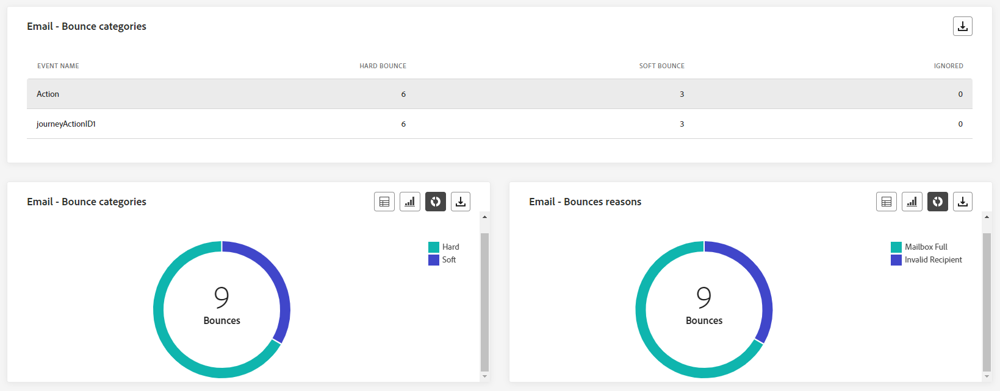
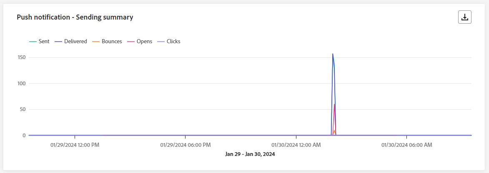
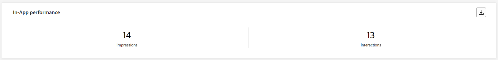

# Relatório ao vivo da jornada {#journey-live-report}

>[!CONTEXTUALHELP]
>id="ajo_journey_live_report"
>title="Relatório ao vivo da jornada"
>abstract="O relatório em tempo real da jornada permite medir e visualizar em tempo real o impacto e o desempenho de suas jornadas somente nas últimas 24 horas. O relatório é dividido em diferentes widgets detalhando o sucesso e os erros da jornada. Cada painel de relatórios pode ser modificado redimensionando ou removendo widgets."

Os relatórios em tempo real, acessíveis a partir da guia Últimas 24 horas, exibem eventos que ocorreram nas últimas 24 horas, com um intervalo mínimo de dois minutos a partir da ocorrência do evento. Em comparação, os Relatórios globais se concentram em eventos que ocorreram há pelo menos duas horas e abrangem eventos durante um período selecionado.

O relatório de Jornada em tempo real pode ser acessado diretamente da sua jornada com o **[!UICONTROL Exibir relatório]** botão.

A JORNADA **[!UICONTROL Relatório ao vivo]** será exibida com as seguintes guias:

* [Jornada](#journey-live)
* [Email](#email-live)
* [Push](#push-live)
* [SMS](#sms-live)
* [No aplicativo](#in-app-live)

A JORNADA **[!UICONTROL Relatório ao vivo]** O é dividido em diferentes widgets detalhando o sucesso e os erros da sua jornada. Cada widget pode ser redimensionado e excluído, se necessário. Para obter mais informações, consulte esta [seção](live-report.md#modify-dashboard).

Para obter uma lista detalhada de cada métrica disponível no Adobe Journey Optimizer, consulte [esta página](live-report.md#list-of-components-live).

## Guia Jornada {#journey-live}

Da sua jornada **[!UICONTROL Relatório ao vivo]**, o **[!UICONTROL Jornada]** A guia fornece uma visualização clara dos dados de rastreamento mais importantes sobre a jornada.

### Desempenho da jornada {#journey-performance}

>[!CONTEXTUALHELP]
>id="ajo_journey_performance_live"
>title="Desempenho da jornada"
>abstract="O dispositivo “Desempenho da jornada” permite rastrear visualmente o caminho dos perfis direcionados conforme eles avançam pela jornada nas últimas 24 horas."

**[!UICONTROL Desempenho da jornada]** permite que você veja o caminho dos perfis direcionados passo a passo na jornada.

Observe que a contagem de perfis de um nó só é atualizada depois que o perfil conclui o nó, não ao inseri-la. Por exemplo, um perfil em um **Aguardar** O nó só é contado depois que a data especificada é atingida e o perfil sai do nó.

### Estatísticas da jornada {#journey-statistics}

>[!CONTEXTUALHELP]
>id="ajo_journey_statistics_live"
>title="Estatísticas da jornada"
>abstract="Os KPIs (Indicadores-chave de desempenho) “Estatísticas da jornada” atuam como um painel abrangente, fornecendo uma análise detalhada das métricas essenciais das últimas 24 horas relacionadas à sua jornada."

A variável **[!UICONTROL Jornada estatísticas]** Os indicadores principais de desempenho (KPIs) funcionam como um painel abrangente, fornecendo uma análise das métricas essenciais associadas à sua jornada nas últimas 24 horas. Isso inclui detalhes como a contagem de perfis inseridos e instâncias de jornadas individuais com falha, oferecendo um insight abrangente sobre a eficácia e o nível de engajamento da jornada.

+++ Saiba mais sobre as métricas de estatísticas da Jornada

* **[!UICONTROL Perfis inseridos]**: Número total de indivíduos que atingiram o evento de entrada da jornada.

* **[!UICONTROL Perfis encerrados]**: número total de indivíduos que saíram da jornada.

* **[!UICONTROL Jornadas individuais com falha]**: Número total de jornadas individuais que não foram executadas com êxito.
+++

### Ação executada nas últimas 24 horas {#action-executed}

>[!CONTEXTUALHELP]
>id="ajo_journey_actions_executed_live"
>title="Ação executada nas últimas 24 horas"
>abstract="O dispositivo “Ação executada nas últimas 24 horas” fornece um instantâneo do desempenho recente, mostrando a eficiência das ações executadas nas últimas 24 horas."

A variável **[!UICONTROL Ação executada nas últimas 24 horas]** O widget representa a ação mais bem-sucedida que ocorreu quando suas ações foram acionadas.

+++ Saiba mais sobre Ação executada nas últimas 24 horas métricas

* **[!UICONTROL Ações executadas]**: Número total de ações executadas com êxito para uma jornada.

* **[!UICONTROL Erro nas ações]**: Número total de erros que ocorreram para ações.

+++

### Ações executadas e erros {#actions-errors}

>[!CONTEXTUALHELP]
>id="ajo_journey_actions_executed__errors_live"
>title="Ações executadas e erros"
>abstract="O dispositivo “Ações executadas e erros” mostra as ações mais bem-sucedidas e os erros que ocorreram durante o acionamento das ações nas últimas 24 horas. Esse dispositivo oferece uma visão geral abrangente das execuções bem-sucedidas e dos erros encontrados, fornecendo insights valiosos sobre o desempenho recente de suas ações."

A variável **[!UICONTROL Ações executadas e erros]** O widget representa a ação e os erros mais bem-sucedidos que ocorreram quando suas ações foram acionadas nas últimas 24 horas.

+++ Saiba mais sobre Ações executadas e métricas de erros

* **[!UICONTROL Ações executadas]**: Número total de ações executadas com êxito para uma jornada.

* **[!UICONTROL Erro nas ações]**: Número total de erros que ocorreram para ações.

+++

### Motivos de erro de ações {#actions-error-reasons}

>[!CONTEXTUALHELP]
>id="ajo_journey_actions_errors_live"
>title="Motivos de erro de ações"
>abstract="A tabela e o gráfico “Motivos de erro de ações” fornecem um resumo completo dos erros encontrados durante a execução das ações, oferecendo uma visão geral abrangente dos problemas que podem ter ocorrido nas últimas 24 horas."

A variável **[!UICONTROL Motivos de erro de ação]** A tabela e o gráfico oferecem uma visão geral abrangente dos erros que ocorreram durante a execução de suas ações nas últimas 24 horas.

### Tipo de erro por ações {#error-type-actions}

>[!CONTEXTUALHELP]
>id="ajo_journey_actions_error_type_live"
>title="Tipo de erro por ações"
>abstract="O gráfico e a tabela “Tipo de erro por ações” fornecem uma visão geral completa dos erros que ocorreram durante cada execução de suas ações nas últimas 24 horas."

A variável **[!UICONTROL Tipo de erro por ações]** A tabela e o gráfico oferecem uma visão geral abrangente dos erros que ocorreram para cada execução de suas ações nas últimas 24 horas.

### Evento executado nas últimas 24 horas {#event-executed-24hours}

>[!CONTEXTUALHELP]
>id="ajo_journey_event_24hours_live"
>title="Evento executado nas últimas 24 horas"
>abstract="O dispositivo “Evento executado nas últimas 24 horas” permite identificar quais dos seus eventos tiveram sucesso na execução nas últimas 24 horas. "

A variável **[!UICONTROL Evento executado nas últimas 24 horas]** permite identificar qual dos seus eventos foi executado com êxito nas últimas 24 horas.

### Eventos {#events}

>[!CONTEXTUALHELP]
>id="ajo_journey_events_live"
>title="Eventos"
>abstract="O dispositivo “Eventos” fornece uma visualização abrangente de quais eventos tiveram sucesso na execução, oferecendo um número de resumo, gráfico e tabela para obter insights detalhados das últimas 24 horas."

A variável **[!UICONTROL Eventos]** O widget permite ver qual dos seus eventos foi executado com êxito por meio do número de resumo, gráfico e tabela.

### Eventos por origem {#events-origin}

>[!CONTEXTUALHELP]
>id="ajo_journey_events_origin_live"
>title="Eventos por origem"
>abstract="A tabela e os gráficos “Eventos por origem” oferecem uma visualização da recepção bem-sucedida dos eventos nas últimas 24 horas. Essas representações visuais permitem identificar com precisão os eventos que foram recebidos efetivamente, fornecendo insights valiosos sobre o desempenho e o impacto de cada evento na jornada."

A variável **[!UICONTROL Eventos por origem]** A tabela e os gráficos fornecem uma perspectiva detalhada sobre a recepção bem-sucedida dos eventos nas últimas 24 horas. Através dessas representações visuais, você pode discernir precisamente quais de seus eventos foram efetivamente recebidos, oferecendo insights valiosos sobre o desempenho e o impacto de eventos individuais dentro de sua jornada.

## Guia Email {#email-live}

Da sua jornada **[!UICONTROL Relatório ao vivo]**, o **[!UICONTROL E-mail]** A guia detalha as principais informações relacionadas aos emails enviados na jornada.

### Email: desempenho de envio {#email-sending-performance}

>[!CONTEXTUALHELP]
>id="ajo_journey_email_sending_performance_live"
>title="Email: desempenho de envio"
>abstract="O gráfico “Email: estatísticas de envio” resume dados essenciais sobre o email, como se ele foi direcionado ou entregue nas últimas 24 horas."

A variável **[!UICONTROL Email - Desempenho de envio]** O gráfico fornece uma visualização abrangente dos dados relacionados aos emails enviados em sua jornada, oferecendo insights sobre as métricas principais, como entregas e devoluções, que ocorreram nas últimas 24 horas. Isso permite uma análise detalhada do processo de envio de email, fornecendo informações valiosas sobre a eficiência e o desempenho de suas jornadas.

+++ Saiba mais sobre Email - Envio de métricas de desempenho

* **[!UICONTROL Entregue]**: número de emails enviados com êxito.

* **[!UICONTROL Rejeições]**: Total de erros acumulados durante o processo de envio e o processamento automático de retorno.

* **[!UICONTROL Erros]**: Número total de erros que ocorreram durante o processo de envio, impedindo que ele fosse enviado para perfis.

* **[!UICONTROL Tentativas]**: Número de emails na fila para tentativas.

+++

### Email: estatísticas {#email-stat}

>[!CONTEXTUALHELP]
>id="ajo_journey_email_statistics_live"
>title="Email: estatísticas"
>abstract="A tabela “Email: estatísticas” fornece dados sobre a atividade de perfil do email nas últimas 24 horas."

A variável **[!UICONTROL Email - Estatísticas]** A tabela fornece um resumo abrangente dos dados essenciais sobre emails em suas jornadas nas últimas 24 horas. Ele detalha as principais métricas, como o tamanho do público-alvo e o número de emails entregues com êxito, oferecendo insights valiosos sobre a eficácia e o alcance de seus emails e jornadas.

+++ Saiba mais sobre métricas de Estatísticas de envio de email

* **[!UICONTROL Direcionado]**: Número total de mensagens processadas durante o processo de envio.

* **[!UICONTROL Excluído]**: Número de perfis excluídos pelo Adobe Journey Optimizer.

* **[!UICONTROL Enviado]**: número total de emails enviados.

* **[!UICONTROL Entregue]**: Número de emails enviados com êxito, em relação ao número total de mensagens enviadas.

* **[!UICONTROL Rejeições]**: Total de erros acumulados durante o processo de envio e o processamento de retorno automático em relação ao número total de mensagens enviadas.

* **[!UICONTROL Erros]**: Número total de erros que ocorreram durante o processo de envio, impedindo que ele fosse enviado para perfis.

* **[!UICONTROL Aberturas]**: Número de vezes que seus emails foram abertos.

* **[!UICONTROL Cliques]**: Número de vezes que um conteúdo foi clicado em seus emails.

* **[!UICONTROL Cancelar inscrição]**: Número de cliques no link unsubscription.

* **[!UICONTROL Reclamações de spam]**: Número de vezes que uma mensagem foi declarada como spam ou lixo eletrônico.

* **[!UICONTROL Tentativas]**: Número de emails na fila para tentativas.

+++

### Email: desempenho por data {#email-perf-date}

>[!CONTEXTUALHELP]
>id="ajo_journey_email_performance_bydate_live"
>title="Email: desempenho por data"
>abstract="O gráfico “E-mail: desempenho por data” apresenta dados abrangentes das últimas 24 horas sobre emails enviados, oferecendo insights sobre métricas principais, como entregas e devoluções, permitindo uma análise detalhada do processo de envio de email."

A variável **[!UICONTROL Email - Desempenho por data]** O widget oferece uma visão geral detalhada das principais informações relacionadas aos seus emails, apresentadas por meio de um gráfico, fornecendo insights sobre as tendências de desempenho nas últimas 24 horas.

+++ Saiba mais sobre Email - Desempenho por métricas de data

* **[!UICONTROL Enviado]**: número total de emails enviados.

* **[!UICONTROL Entregue]**: número de emails enviados com êxito.

* **[!UICONTROL Rejeições]**: Total de erros acumulados durante o processo de envio e o processamento automático de retorno.

* **[!UICONTROL Erros]**: Número total de erros que ocorreram durante o processo de envio, impedindo que ele fosse enviado para perfis.

* **[!UICONTROL Aberturas]**: Número de vezes que seus emails foram abertos.

* **[!UICONTROL Cliques]**: Número de vezes que um conteúdo foi clicado em seus emails.

* **[!UICONTROL Cancelar inscrição]**: Número de cliques no link unsubscription.

* **[!UICONTROL Reclamações de spam]**: Número de vezes que uma mensagem foi declarada como spam ou lixo eletrônico.

+++

### Email: categorias e motivos de rejeição {#email-bounce-categories}

>[!CONTEXTUALHELP]
>id="ajo_journey_email_bounces_live"
>title="Email: categorias e motivos de rejeição"
>abstract="XX"

A variável **[!UICONTROL Motivos de rejeição]** e **[!UICONTROL Categorias de rejeição]** os widgets compilam os dados disponíveis relacionados às mensagens rejeitadas, fornecendo insights detalhados sobre os motivos e categorias específicos por trás das rejeições de email nas últimas 24 horas.

Para obter mais informações sobre rejeições, consulte o [Lista de supressão](../reports/suppression-list.md) página.

+++ Saiba mais sobre Email - Categorias de rejeição e métricas de motivos

* **[!UICONTROL Rejeição permanente]**: o número total de erros permanentes, como um endereço de email incorreto. Isso envolve uma mensagem de erro que declara explicitamente que o endereço é inválido, como Usuário desconhecido.

* **[!UICONTROL Rejeição leve]**: o número total de erros temporários, como uma caixa de entrada cheia.

* **[!UICONTROL Ignorado]**: o número total de temporários, como Ausência temporária, ou um erro técnico, por exemplo, se o tipo de remetente for postmaster.

+++

### Email: motivos de erro {#email-error-reasons}

>[!CONTEXTUALHELP]
>id="ajo_journey_email_errors_live"
>title="Email: motivos de erro"
>abstract="A tabela “Email: motivos de erro” e seus gráficos permitem identificar os erros específicos que ocorreram durante o processo de envio nas últimas 24 horas."

A variável **[!UICONTROL Motivos de erro]** os gráficos e as tabelas oferecem visibilidade dos erros específicos ocorridos durante o processo de envio das últimas 24 horas, fornecendo informações valiosas sobre a natureza e a ocorrência de erros.

### Email: motivos de exclusão {#email-excluded}

>[!CONTEXTUALHELP]
>id="ajo_journey_email_excluded_live"
>title="Email: motivos de exclusão"
>abstract="A tabela “Motivos de exclusão” e seus gráficos ilustram os vários fatores que levaram perfis de usuário excluídos do público-alvo a não receberem a mensagem nas últimas 24 horas."

A variável **[!UICONTROL Motivos excluídos]** os gráficos e a tabela apresentam uma visão abrangente dos diferentes fatores que resultaram na exclusão de perfis de usuário do público-alvo direcionado, fazendo com que a mensagem não seja recebida nas últimas 24 horas.

Consulte [esta página](exclusion-list.md) para obter a lista abrangente dos motivos de exclusão.

### Email: melhor domínio do destinatário {#email-best-recipient}

>[!CONTEXTUALHELP]
>id="ajo_journey_email_best_recipient_live"
>title="Email: melhor domínio do destinatário"
>abstract="A tabela “Email: Melhor domínio do destinatário” e seu gráfico fornecem um detalhamento dos domínios que os destinatários usam com mais frequência para abrir o email, oferecendo insights valiosos sobre o comportamento do destinatário nas últimas 24 horas."

A variável **[!UICONTROL Email - Melhor domínio de destinatário]** O gráfico e a tabela oferecem um detalhamento dos domínios que os perfis usam com mais frequência para abrir seus emails nas últimas 24 horas. Isso fornece insights valiosos sobre o comportamento do perfil, ajudando você a entender as plataformas preferenciais.

### Email: ofertas {#email-offers}

>[!CONTEXTUALHELP]
>id="ajo_journey_email_offers_live"
>title="Email: ofertas"
>abstract="Os dispositivos “Estatística de ofertas” e “Estatística detalhada de ofertas” fornecem insights abrangentes sobre o desempenho de suas ofertas nas últimas 24 horas, oferecendo uma análise detalhada de seu impacto ao longo do tempo e apresentando estatísticas detalhadas para uma compreensão mais aprofundada."

>[!NOTE]
>
>Os widgets e as métricas de Ofertas só estarão disponíveis se uma decisão tiver sido inserida em um email. Para obter mais informações sobre o Gerenciamento de decisões, consulte esta [página](../offers/get-started/starting-offer-decisioning.md).

A variável **[!UICONTROL Estatísticas de ofertas]** e **[!UICONTROL Estatísticas de ofertas ao longo do tempo]** os widgets medem o sucesso e o impacto da sua oferta no público-alvo direcionado. Ele detalha as principais informações relacionadas à sua mensagem com KPIs.

+++ Saiba mais sobre Email - Métricas de ofertas

* **[!UICONTROL Oferta enviada]**: número total de envios para a oferta.

* **[!UICONTROL Impressão da oferta]**: Número de vezes que a oferta foi aberta em seus emails.

* **[!UICONTROL Cliques de oferta]**: Número de vezes que uma oferta foi clicada em seus emails.

+++

### Email: otimização {#email-sto}

>[!CONTEXTUALHELP]
>id="ajo_journey_email_optimization_live"
>title="Email: otimização"
>abstract="Os dispositivos “Otimização de tempo de envio” e “Otimizado vs. não otimizado” fornecem informações detalhadas das últimas 24 horas relacionadas às suas mensagens, destacando se foram otimizadas ou não."

>[!NOTE]
>
>A variável **[!UICONTROL Otimização da hora de envio]** e **[!UICONTROL Otimizado vs. não otimizado]** Os widgets do só estarão disponíveis se a opção Send-Time Otimization estiver ativada para o seu delivery. Para obter mais informações sobre a Otimização de tempo de envio, consulte [esta página](../building-journeys/journeys-message.md#send-time-optimization).

A variável **[!UICONTROL Otimização da hora de envio]** e **[!UICONTROL Otimizado vs. não otimizado]** os widgets detalham o sucesso de seus emails dependendo do método de envio: otimizado ou normal.

+++ Saiba mais sobre Otimização de tempo de envio e Métricas otimizadas versus não otimizadas

* **[!UICONTROL Entregue]**: Número de mensagens enviadas com êxito em relação ao número total de mensagens enviadas.
* **[!UICONTROL Rejeições]**: Total de erros acumulados durante o processo de envio e o processamento de retorno automático em relação ao número total de mensagens enviadas.

* **[!UICONTROL Enviado]**: número total de emails enviados para a jornada.

* **[!UICONTROL Aberturas]**: Número de vezes que seus emails foram abertos na jornada.

* **[!UICONTROL Cliques]**: Número de vezes que um conteúdo foi clicado em seus emails.

+++

## Guia Notificação por push {#push-live}

Da sua jornada **[!UICONTROL Relatório ao vivo]**, o **[!UICONTROL Notificação por push]** A guia detalha as informações principais relativas à notificação por push enviada em sua jornada.

### Notificação por push: desempenho de envio {#push-sending-performance}

>[!CONTEXTUALHELP]
>id="ajo_journey_push_sending_performance_live"
>title="Notificação por push: desempenho de envio"
>abstract="O gráfico “Notificações por push: desempenho do envio” resume dados essenciais sobre notificações por push, como erros ou mensagens entregues nas últimas 24 horas."

A variável **[!UICONTROL Desempenho de envio de notificação por push]** o gráfico oferece uma visão geral completa dos dados relacionados às notificações por push enviadas nas últimas 24 horas. Ele fornece insights sobre métricas essenciais, como entregas e devoluções, permitindo um exame detalhado do processo de envio de notificações por push.

+++ Saiba mais sobre Notificação por push - Envio de métricas de desempenho

* **[!UICONTROL Entregue]**: Número de mensagens enviadas com êxito.

* **[!UICONTROL Rejeições]**: Total de erros acumulados durante o processo de envio e o processamento automático de retorno.

* **[!UICONTROL Erros]**: Número total de erros que ocorreram durante o processo de envio, impedindo que ele fosse enviado para perfis.

+++

### Notificação por push: estatísticas {#push-statistics}

>[!CONTEXTUALHELP]
>id="ajo_journey_push_statistics_live"
>title="Notificação por push: estatísticas"
>abstract="A tabela “Estatísticas de push” fornece dados sobre a atividade de destinatários relacionada a notificações por push nas últimas 24 horas."

**[!UICONTROL Notificação por push - Estatísticas]** A tabela fornece um resumo de dados essenciais relacionados às suas notificações por push, incluindo métricas principais, como o número de mensagens direcionadas e o número de mensagens entregues com êxito nas últimas 24 horas.

+++ Saiba mais sobre Notificação por push - Métricas de estatística

* **[!UICONTROL Direcionado]**: Número de perfis direcionados para qualquer ação, como enviar email ou SMS.

* **[!UICONTROL Excluído]**: Número de perfis excluídos pelo Adobe Journey Optimizer.

* **[!UICONTROL Enviado]**: Número total de notificações por push enviadas.

* **[!UICONTROL Entregue]**: Número de notificações por push enviadas com êxito.

* **[!UICONTROL Rejeições]**: Total de erros acumulados durante o processo de envio e o processamento automático de retorno.

* **[!UICONTROL Erros]**: Número total de erros que ocorreram durante o processo de envio, impedindo que ele fosse enviado para perfis.

* **[!UICONTROL Aberturas]**: Número de vezes que sua notificação por push foi aberta.
+++

### Notificação por push: detalhamento por plataforma {#push-breakdown}

>[!CONTEXTUALHELP]
>id="ajo_journey_push_breakdown_live"
>title="Notificação por push: detalhamento por plataforma"
>abstract="A tabela “Detalhamento por plataforma” e seus gráficos fornecem uma análise do sucesso das notificações por push nas últimas 24 horas baseada no sistema operacional do destinatário."

A variável **[!UICONTROL Notificação por push - Detalhamento por plataforma]** O gráfico e a tabela fornecem uma análise detalhada do sucesso de suas notificações por push, oferecendo insights com base no sistema operacional do seu perfil. Esse detalhamento melhora a sua compreensão do desempenho das notificações por push em diferentes plataformas.

### Notificação por push: resumo de envio {#push-sending-summary}

>[!CONTEXTUALHELP]
>id="ajo_journey_push_sending_summary_live"
>title="Notificação por push: resumo de envio"
>abstract="O gráfico “Notificações por push: resumo do envio” exibe os dados disponíveis para notificações por push enviadas nas últimas 24 horas."

A variável **[!UICONTROL Resumo da notificação por push]** O gráfico oferece uma representação dinâmica, exibindo uma análise da atividade de notificações por push nas últimas 24 horas. Esta representação gráfica fornece um detalhamento abrangente das notificações por push enviadas.

+++ Saiba mais sobre Notificação por push - Envio de métricas de resumo

* **[!UICONTROL Enviado]**: Número total de notificações por push enviadas.

* **[!UICONTROL Entregue]**: Número de notificações por push enviadas com êxito.

* **[!UICONTROL Rejeições]**: Total de erros acumulados durante o processo de envio e o processamento automático de retorno.

* **[!UICONTROL Erros]**: Número total de erros que ocorreram durante o processo de envio, impedindo que ele fosse enviado para perfis.

* **[!UICONTROL Aberturas]**: Número de vezes que suas notificações por push foram abertas.

* **[!UICONTROL Cliques]**: Número de vezes que um conteúdo foi clicado em suas notificações por push.

+++

### Notificação por push: motivos de erro {#push-error}

>[!CONTEXTUALHELP]
>id="ajo_journey_push_error_reasons_live"
>title="Notificação por push: motivos de erro"
>abstract="A tabela “Motivos de erro” e seus gráficos permitem identificar os erros específicos que ocorreram nas últimas 24 horas durante o processo de envio."

A variável **[!UICONTROL Motivos de erro]** A tabela e os gráficos fornecem a capacidade de identificar os erros específicos que ocorreram durante o processo de envio de suas notificações por push, oferecendo insights detalhados sobre quaisquer problemas encontrados nas últimas 24 horas.

### Notificação por push: motivos de exclusão {#push-excluded}

>[!CONTEXTUALHELP]
>id="ajo_journey_push_excluded_reasons_live"
>title="Notificação por push: motivos de exclusão"
>abstract="A tabela “Motivos de exclusão” e seus gráficos ilustram os vários fatores que levaram perfis de usuário excluídos do público-alvo a não receberem a mensagem nas últimas 24 horas."

A variável **[!UICONTROL Motivos excluídos]** os gráficos e a tabela exibem os diferentes motivos que impediram os perfis de usuário, excluídos dos perfis direcionados, de receber suas notificações por push nas últimas 24 horas.

Consulte [esta página](exclusion-list.md) para obter a lista abrangente dos motivos de exclusão.

## Guia SMS {#sms-live}

### SMS: estatísticas {#sms-statistics}

>[!CONTEXTUALHELP]
>id="ajo_journey_sms_statistics_live"
>title="SMS: estatísticas"
>abstract="A tabela “Estatísticas de envio de SMS” resume dados essenciais sobre as mensagens SMS, como mensagens direcionadas ou entregues nas últimas 24 horas."

A variável **[!UICONTROL SMS - Estatísticas]** A tabela fornece um resumo conciso dos dados essenciais relacionados às suas mensagens SMS, englobando métricas principais, como o número de mensagens direcionadas e a contagem de mensagens entregues com êxito nas últimas 24 horas.

+++ Saiba mais sobre SMS - Métricas de estatística

* **[!UICONTROL Direcionado]**: Número de perfis de usuário qualificados como perfis de público-alvo.

* **[!UICONTROL Excluído]**: Número de perfis de usuário, excluídos dos perfis direcionados, que não receberam a mensagem.

* **[!UICONTROL Enviado]**: Número total de mensagens SMS enviadas.

* **[!UICONTROL Cliques]**: Número de vezes que um conteúdo foi clicado em suas mensagens SMS.

* **[!UICONTROL Rejeições]**: Total de erros acumulados durante o processo de envio, o processo de envio e o processamento de retorno automático.

* **[!UICONTROL Erros]**: Número total de erros que ocorreram durante o processo de envio, impedindo que ele fosse enviado para perfis.

+++

### SMS: desempenho por data {#sms-performance}

>[!CONTEXTUALHELP]
>id="ajo_journey_sms_performance_live"
>title="SMS: desempenho por data"
>abstract="O dispositivo “SMS: desempenho por data” fornece informações importantes sobre mensagens nas últimas 24 horas por meio de uma representação gráfica."

A variável **[!UICONTROL SMS - Desempenho por data]** O widget oferece uma visão geral detalhada das principais informações relacionadas às suas mensagens, apresentadas por meio de um gráfico, fornecendo insights sobre as tendências de desempenho nas últimas 24 horas.

+++ Saiba mais sobre SMS - Desempenho por métricas de data

* **[!UICONTROL Enviado]**: Número total de mensagens SMS enviadas.

* **[!UICONTROL Rejeições]**: Total de erros acumulados durante o processo de envio e o processamento automático de retorno.

* **[!UICONTROL Erros]**: Número total de erros que ocorreram durante o processo de envio, impedindo que ele fosse enviado para perfis.

+++

### SMS: motivos de rejeições {#sms-bounces}

>[!CONTEXTUALHELP]
>id="ajo_journey_sms_bounces_live"
>title="SMS: motivos de rejeições"
>abstract="A tabela “Motivos de rejeições” e seus gráficos contêm dados relacionados a mensagens rejeitadas nas últimas 24 horas."

A variável **[!UICONTROL SMS - Motivos de rejeições]** Os gráficos e a tabela fornecem uma visão geral abrangente dos dados relacionados às mensagens SMS devolvidas, fornecendo insights valiosos sobre os motivos específicos por trás das instâncias de devoluções de mensagens SMS nas últimas 24 horas.

### SMS: motivos de erro {#sms-error}

>[!CONTEXTUALHELP]
>id="ajo_journey_sms_error_live"
>title="SMS: motivos de erro"
>abstract="A tabela “SMS: motivos de erro” e seus gráficos permitem identificar os erros específicos que ocorreram nas últimas 24 horas durante o processo de envio."

A variável **[!UICONTROL SMS - Motivos de erro]** Os gráficos e as tabelas permitem identificar os erros específicos que ocorreram durante o processo de envio de suas mensagens SMS, facilitando uma análise completa de quaisquer problemas encontrados nas últimas 24 horas.

### SMS: motivos de exclusão {#sms-excluded}

>[!CONTEXTUALHELP]
>id="ajo_journey_sms_excluded_live"
>title="SMS: motivos de exclusão"
>abstract="A tabela “Motivos de exclusão” e seus gráficos ilustram os vários fatores que levaram perfis de usuário excluídos do público-alvo a não receberem a mensagem nas últimas 24 horas."

A variável **[!UICONTROL SMS - Motivos excluídos]** Os gráficos e as tabelas representam visualmente os diversos fatores que levaram à exclusão de perfis de usuário do público-alvo direcionado, impedindo-o de receber suas mensagens SMS.

Consulte [esta página](exclusion-list.md) para obter a lista abrangente dos motivos de exclusão.

<!--
### SMS - Clicks by links {#sms-clicks}

The **[!UICONTROL SMS - Clicks by links]** widget offers essential insights into your visitors' engagement with the URLs included in your messages, providing valuable information about which links attract the most interaction within the last 24 hours.
-->

## Guia No aplicativo {#in-app-live}

### Desempenho in-app {#inapp-performance}

>[!CONTEXTUALHELP]
>id="ajo_journey_inapp_performance_live"
>title="Desempenho in-app"
>abstract="Os KPIs de desempenho in-app fornecem insights essenciais sobre o engajamento de visitantes com mensagens in-app nas últimas 24 horas.&#39;"

A variável **[!UICONTROL Desempenho no aplicativo]** Os KPIs fornecem insights essenciais sobre o envolvimento de seus perfis com mensagens no aplicativo nas últimas 24 horas, fornecendo métricas essenciais para avaliar a eficácia e o impacto das mensagens no aplicativo incluídas em sua jornada.

+++ Saiba mais em No aplicativo - Métricas de desempenho

* **[!UICONTROL Impressões]**: número total de mensagens no aplicativo entregues a todos os usuários.

  >[!NOTE]
  >
  >Para garantir que uma Impressão seja contada, o usuário deve atender a dois critérios:
  >* Qualificação dentro da experiência no aplicativo, obtida ao atingir a atividade específica no aplicativo em sua jornada.
  >* Cumprimento das condições especificadas nas regras de acionador.
  > 
  >Devido ao segundo critério, pode haver variações notáveis entre o número de perfis segmentados e a contagem de impressões únicas.

* **[!UICONTROL Interações]**: número total de envolvimentos com a mensagem no aplicativo. Isso inclui qualquer ação realizada pelos usuários, como cliques, rejeições ou quaisquer outras interações.

+++

### Resumo in-app {#inapp-summary}

>[!CONTEXTUALHELP]
>id="ajo_journey_inapp_summary_live"
>title="Resumo in-app"
>abstract="O gráfico “Resumo no aplicativo” ilustra o progresso das impressões e interações no aplicativo nas últimas 24 horas."

A variável **[!UICONTROL Resumo no aplicativo]** O gráfico ilustra a progressão de suas impressões e interações no aplicativo nas últimas 24 horas, fornecendo uma visão geral abrangente do desempenho das mensagens no aplicativo.

+++ Saiba mais sobre Métricas de resumo no aplicativo

* **[!UICONTROL Impressões]**: número total de mensagens no aplicativo entregues a todos os usuários.

  >[!NOTE]
  >
  >Para garantir que uma Impressão seja contada, o usuário deve atender a dois critérios:
  >* Qualificação dentro da experiência no aplicativo, obtida ao atingir a atividade específica no aplicativo em sua jornada.
  >* Cumprimento das condições especificadas nas regras de acionador.
  > 
  >Devido ao segundo critério, pode haver variações notáveis entre o número de perfis segmentados e a contagem de impressões únicas.

* **[!UICONTROL Interações]**: número total de envolvimentos com a mensagem no aplicativo. Isso inclui qualquer ação realizada pelos usuários, como cliques, rejeições ou quaisquer outras interações.

+++

### Interações por tipo {#interactions-type}

>[!CONTEXTUALHELP]
>id="ajo_journey_inapp_interactions_live"
>title="Interações por tipo"
>abstract="A tabela “Interações por tipo” e seus gráficos detalham como usuários interagiram com a mensagem no aplicativo por meio do rastreamento de cliques, mensagens ignoradas ou interações nas últimas 24 horas."

A variável **[!UICONTROL Interações por tipo]** Os gráficos e tabelas detalham como os usuários interagiram com a mensagem no aplicativo rastreando qualquer clique, descarte ou interação.
