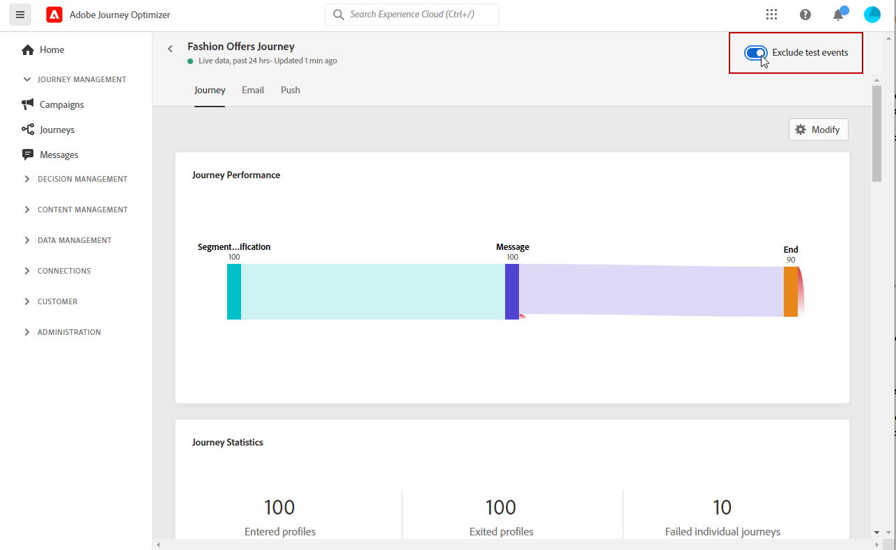

# Introdução ao Relatório ao vivo {#live-report}

Use o **[!UICONTROL Live report]** para medir e visualizar em tempo real o impacto e o desempenho de suas jornadas e suas mensagens em um painel integrado.
Os dados estão disponíveis na variável **[!UICONTROL Live report]** assim que seu delivery for enviado ou sua jornada for executada.

* Se desejar direcionar uma jornada ou deliveries no contexto de uma jornada, da **[!UICONTROL Journeys]** acesse a jornada e clique no menu **[!UICONTROL Live report]** ícone . Em seguida, você pode encontrar os relatórios Jornada, Email e Enviar ao vivo.

   

* Se quiser direcionar um delivery específico, da variável **[!UICONTROL Live view]** do **[!UICONTROL Executions]** das suas mensagens, selecione **[!UICONTROL Live Report]** no menu avançado do delivery selecionado.

   

* Se você quiser mudar do **[!UICONTROL Live report]** para **[!UICONTROL Global report]** para o delivery, clique em **[!UICONTROL Global view]** no alternador de guias.

   

## Personalizar painel {#modify-dashboard}

Cada painel de relatórios pode ser modificado redimensionando ou removendo widgets. Alterar os widgets só afeta o painel do usuário atual. Outros usuários verão seus próprios painéis ou os definidos por padrão.

1. Escolha se deseja excluir eventos de teste de seus relatórios com a barra de alternância. Para obter mais informações sobre eventos de teste, consulte [esta página](../building-journeys/testing-the-journey.md).

   Observe que a variável **[!UICONTROL Exclude test events]** só está disponível para relatórios de Jornada.

   

1. Para redimensionar ou remover widgets, clique em **[!UICONTROL Modify]**.

   

1. Ajuste o tamanho dos widgets arrastando o canto inferior direito.

   

1. Clique em **[!UICONTROL Remove]** para remover qualquer widget que você não precise.

   

1. Quando estiver satisfeito com a ordem de exibição e o tamanho dos widgets, clique em **[!UICONTROL Save]**.

Seu painel agora é salvo. Suas diferentes alterações serão reaplicadas para um uso posterior dos seus relatórios ao vivo. Se necessário, use a **[!UICONTROL Reset]** para restaurar a ordem dos widgets e widgets padrão.
