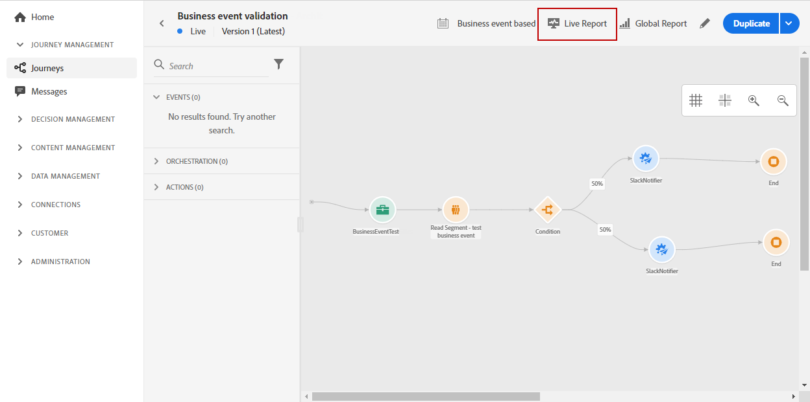
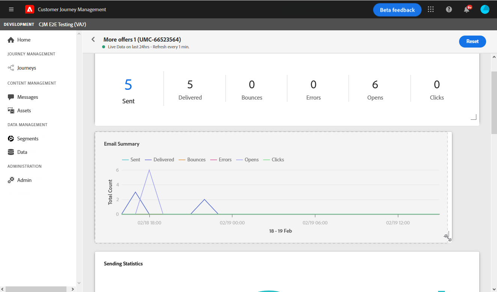

# Relatório ao vivo {#live-report}

O **[!UICONTROL Live report]** permite medir e visualizar em tempo real a eficácia das jornadas e o desempenho das mensagens com um painel integrado.
Os dados dos deliveries estarão disponíveis no **[!UICONTROL Live report]** assim que o delivery ou a jornada for executada.

* Se desejar direcionar uma jornada ou deliveries em uma jornada, no menu **[!UICONTROL Journeys]**, acesse a jornada e clique no ícone **[!UICONTROL Live report]**. Em seguida, você pode encontrar os relatórios Jornada, Email e Enviar ao vivo.

   

* Se desejar direcionar um delivery específico, no **[!UICONTROL Live view]** da guia **[!UICONTROL Executions]** das mensagens, selecione **[!UICONTROL Live Report]** no menu avançado do delivery selecionado.

   

## Modificar painel {#modify-dashboard}

Cada painel de relatórios pode ser modificado redimensionando ou removendo widgets. Alterar os widgets só afeta o painel do usuário atual. Outros usuários verão seus próprios painéis ou os definidos por padrão.

1. No seu relatório ao vivo, clique em **[!UICONTROL Modify dashboard]**.

   

1. Ajuste o tamanho dos widgets arrastando o canto inferior direito.

   

1. Clique em **[!UICONTROL Remove]** para remover outros widgets que você não precisa rastrear rejeições.

   

1. Quando estiver satisfeito com a ordem de exibição e o tamanho dos widgets, clique em **[!UICONTROL Save]**.

Seu painel agora é salvo. Suas diferentes alterações serão reaplicadas para um uso posterior dos seus relatórios ao vivo. Se necessário, use a opção **[!UICONTROL Reset]** para restaurar a ordem dos widgets e widgets padrão.
