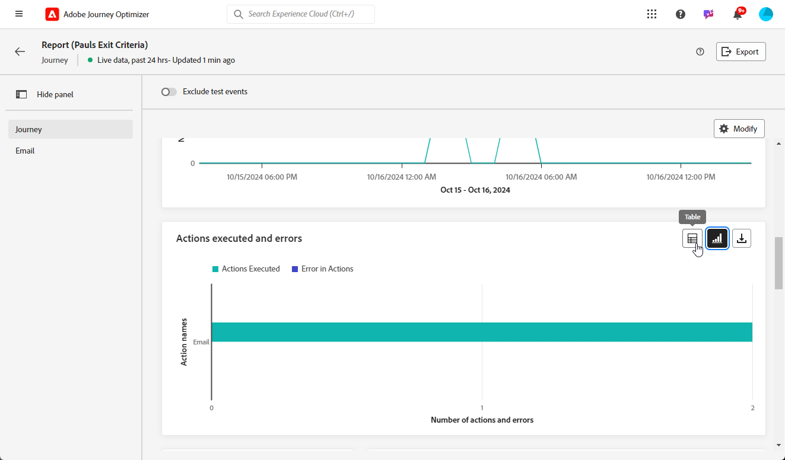

# Introdução aos relatórios em tempo real {#live-report}

Use o **[!UICONTROL Relatório ao vivo]** para medir e visualizar em tempo real o impacto e o desempenho de suas jornadas e mensagens em um painel integrado.
Os dados estão disponíveis no **[!UICONTROL Relatório ao vivo]** assim que o delivery for enviado ou a jornada for executada no **[!UICONTROL Últimas 24 horas]** guia.

* Se quiser direcionar uma jornada no contexto de uma jornada, na **[!UICONTROL Jornadas]** , acesse sua jornada e clique no botão **[!UICONTROL Exibir relatório]** botão.

  

* Se quiser direcionar uma campanha, no **[!UICONTROL Campanhas]** , acesse sua campanha e clique no link **[!UICONTROL Relatórios]** botão.

  

* Se você deseja alternar do **[!UICONTROL Relatório global]** para o **[!UICONTROL Relatório ao vivo]** para o seu delivery, clique em **[!UICONTROL Últimas 24 horas]** no alternador de guias.

  

Para obter uma lista detalhada de cada métrica disponível no Adobe Journey Optimizer, consulte [esta página](#list-of-components-live).

## Personalizar painel {#modify-dashboard}

Cada painel de relatórios pode ser modificado redimensionando ou removendo widgets. Alterar os widgets afeta apenas o painel do usuário atual. Outros usuários verão seus próprios painéis ou os definidos por padrão.

1. No **[!UICONTROL Ações]** escolha se deseja criar relatórios sobre uma ação específica de suas jornadas.

1. Escolha se deseja excluir eventos de teste de seus relatórios com a barra de alternância. Para obter mais informações sobre eventos de teste, consulte [esta página](../building-journeys/testing-the-journey.md).

   Observe que **[!UICONTROL Excluir eventos de teste]** A opção só está disponível para relatórios de Jornada.

   

1. Para redimensionar ou remover widgets, clique em **[!UICONTROL Modificar]**.

   

1. Ajuste o tamanho dos widgets arrastando o canto inferior direito.

   

1. Clique em **[!UICONTROL Remover]** para remover qualquer widget desnecessário.

   

1. Quando estiver satisfeito com a ordem de exibição e o tamanho dos widgets, clique em **[!UICONTROL Salvar]**.

1. Para personalizar a forma como seus dados são exibidos, você pode alternar entre diferentes opções de visualização, como gráficos, tabelas e gráficos de rosca.

   

O painel foi salvo. Suas diferentes alterações serão reaplicadas para um uso posterior de seus relatórios ao vivo. Se necessário, use o **[!UICONTROL Redefinir]** opção para restaurar os widgets padrão e a ordem dos widgets.

## Exportar seus relatórios {#export-reports}

É possível exportar facilmente seus diferentes relatórios para formatos PDF ou CSV, o que permite compartilhá-los ou imprimi-los.

>[!BEGINTABS]

>[!TAB Exportar seu relatório como um arquivo PDF]

1. No seu relatório, clique em **[!UICONTROL Exportar]** e selecione **[!UICONTROL arquivo PDF]**.

   

1. Na janela Imprimir, configure o documento conforme necessário. Observe que as opções podem variar dependendo do navegador.

1. Escolha imprimir ou salvar seu relatório como PDF.

1. Localize a pasta onde deseja salvar o arquivo, renomeie-a se necessário e clique em Salvar.

Seu relatório agora está disponível para visualização ou compartilhamento em um arquivo pdf.

>[!TAB Exportar seu relatório como um arquivo CSV]

1. No seu relatório, clique em **[!UICONTROL Exportar]** e selecione **[!UICONTROL Arquivo CSV]** para gerar um arquivo CSV no nível geral do relatório.

   

1. Você também pode optar por exportar dados de um widget específico. Clique em **[!UICONTROL Exportar dados do widget para CSV]** ao lado do widget selecionado.

   

1. O arquivo é baixado automaticamente e pode ser localizado em seus arquivos locais.

   Se você gerou o arquivo no nível do relatório, ele contém informações detalhadas para cada widget, incluindo seu título e dados.

   Se você gerou o arquivo no nível do widget, ele fornece especificamente os dados para o widget selecionado.

>[!ENDTABS]
