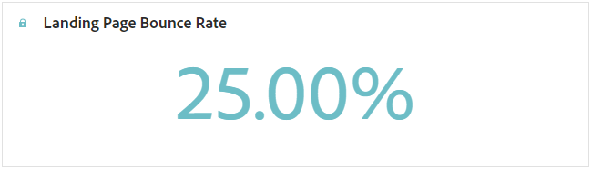

# Relatório de páginas de destino {#lp-report-global-cja}

A variável **Landing Page** O relatório do oferece insights valiosos sobre o comportamento do usuário, padrões de engajamento, taxas de conversão e outras métricas principais, permitindo que você tome decisões informadas e otimize o desempenho da sua página de aterrissagem de maneira eficaz.

Para acessar seus relatórios, selecione **[!UICONTROL Relatório]** no menu avançado da landing page selecionada.

Para saber mais sobre o espaço de trabalho do Customer Journey Analytics e como filtrar e analisar dados, consulte [esta página](https://experienceleague.adobe.com/en/docs/analytics-platform/using/cja-workspace/home).

## Taxa de conversão da landing page {#lp-conversion}

A variável **[!UICONTROL Taxa de conversão da landing page]** O KPI permite avaliar a eficácia da página de aterrissagem com base no número de visitas e interações.

* **[!UICONTROL Taxa de conversão da landing page]**: Número de pessoas que interagiram com a landing page, por exemplo, inscritas em um formulário, em relação ao número total de visitas.

## Taxa de rejeição da página de destino {#lp-bounce-rate}

A variável **[!UICONTROL Taxa de rejeição da página de destino]** O KPI fornece informações sobre perfis que visualizaram sua página de aterrissagem sem interagir ou clicar em elementos.

* **[!UICONTROL Taxa de rejeição da página de destino]**: Número de pessoas que não interagiram com a landing page e não concluíram a ação de assinatura em relação ao número total de visitas.

## Exibições da página de aterrissagem {#lp-views}

A variável **[!UICONTROL Exibições da página de aterrissagem]** O KPI permite ver o impacto da página de aterrissagem.

* **[!UICONTROL Exibições da página de aterrissagem]**: Número total de visitas à página de aterrissagem provenientes de jornadas e fontes externas, incluindo várias visitas de um perfil.

## Visualizações únicas da página de aterrissagem {#lp-unique-views}

A variável **[!UICONTROL Visualizações únicas da página de aterrissagem]** O KPI permite medir o impacto da página de aterrissagem excluindo várias exibições do mesmo perfil.

* **[!UICONTROL Visualizações únicas da página de aterrissagem]**: Número de pessoas que visitaram sua landing page, várias visitas de um perfil não são consideradas.

## Desempenho da página de aterrissagem ao longo do tempo {#lp-performance-overtime}

A variável **[!UICONTROL Desempenho da página de aterrissagem ao longo do tempo]** O gráfico mede o sucesso das landing pages e o impacto no público-alvo direcionado.

* **[!UICONTROL Exibições da página de aterrissagem]**: Número total de visitas à página de aterrissagem provenientes de jornadas e fontes externas, incluindo várias visitas de um perfil.

* **[!UICONTROL Taxa de conversão da landing page]**: Número de pessoas que interagiram com a landing page, por exemplo, inscritas em um formulário, em relação ao número total de visitas.

## Desempenho da página de aterrissagem {#lp-performance}

A variável **[!UICONTROL Desempenho da landing page]** Essa tabela serve como um painel abrangente, oferecendo um detalhamento das principais métricas relacionadas à sua página de aterrissagem.

* **[!UICONTROL Taxa de conversão da landing page]**: Número de pessoas que interagiram com a landing page, por exemplo, inscritas em um formulário, em relação ao número total de visitas.

* **[!UICONTROL Taxa de rejeição da página de destino]**: Número de pessoas que não interagiram com a landing page e não concluíram a ação de assinatura em relação ao número total de visitas.

* **[!UICONTROL Visualizações únicas da página de aterrissagem]**: Número de pessoas que visitaram sua landing page, várias visitas de um perfil não são consideradas.

* **[!UICONTROL Taxa de conversão da página de aterrissagem exclusiva]**: Número de pessoas que interagiram com a landing page, várias interações de um perfil não são consideradas.

* **[!UICONTROL Exibições da página de aterrissagem]**: Número total de visitas à página de aterrissagem provenientes de jornadas e fontes externas, incluindo várias visitas de um perfil.

* **[!UICONTROL Conversão da página de aterrissagem]**: Número de pessoas que interagiram com a página de aterrissagem, por exemplo, inscritas em um formulário.

## Jornadas {#lp-journeys}

A variável **[!UICONTROL Jornada]** A tabela fornece uma visão geral abrangente, detalhando a frequência das visitas à página de aterrissagem no contexto da jornada de um usuário. Essa representação reveladora oferece dados valiosos sobre as interações do usuário, permitindo que você entenda como os visitantes navegam pelo seu site e se envolvem com o conteúdo.

* **[!UICONTROL Exibições da página de aterrissagem]**: Número total de visitas à página de aterrissagem provenientes de jornadas e fontes externas, incluindo várias visitas de um perfil.

* **[!UICONTROL Conversão da página de aterrissagem]**: Número de pessoas que interagiram com a página de aterrissagem, por exemplo, inscritas em um formulário.

## Campanhas {#lp-campaigns}

A variável **[!UICONTROL Campanhas]** A tabela fornece informações sobre o número de visitas direcionadas à página de aterrissagem como resultado de campanhas específicas, oferecendo uma visão abrangente da eficácia da campanha e do envolvimento com o conteúdo da página de aterrissagem.

* **[!UICONTROL Exibições da página de aterrissagem]**: Número total de visitas à página de aterrissagem provenientes de jornadas e fontes externas, incluindo várias visitas de um perfil.

* **[!UICONTROL Conversão da página de aterrissagem]**: Número de pessoas que interagiram com a página de aterrissagem, por exemplo, inscritas em um formulário.

## Canal {#lp-channels}

A variável **[!UICONTROL Canal]** A tabela exibe o número de visitas à página de aterrissagem categorizadas por canal.

* **[!UICONTROL Exibições da página de aterrissagem]**: Número total de visitas à página de aterrissagem provenientes de jornadas e fontes externas, incluindo várias visitas de um perfil.

* **[!UICONTROL Conversão da página de aterrissagem]**: Número de pessoas que interagiram com a página de aterrissagem, por exemplo, inscritas em um formulário.

## Links mais clicados {#lp-top-clicked}

A variável **[!UICONTROL Links mais clicados]** A tabela fornece insights sobre como os visitantes interagem com o delivery, destacando quais links recebem mais engajamento e atenção do seu público-alvo.

* **[!UICONTROL Cliques na landing page]**: Número de vezes que um conteúdo foi clicado na landing page.
