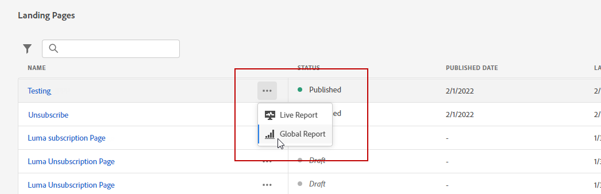

# Relatório global da página de aterrissagem {#lp-report-global}

A landing page **[!UICONTROL Global report]** O relatório exibe detalhes sobre o impacto das landing pages em um período selecionado. Para medir os dados da landing page somente nas últimas 24 horas, consulte o [Relatório ao vivo da página de aterrissagem](lp-report-live.md).

Para acessar os relatórios, selecione **[!UICONTROL Global report]** no menu avançado da landing page selecionada.

A landing page **[!UICONTROL Global report]** é dividido em diferentes widgets detalhando o sucesso e os erros do delivery. Cada widget pode ser redimensionado e excluído, se necessário. Para obter mais informações, consulte [seção](global-report.md).

O **[!UICONTROL Number of visits]** e **[!UICONTROL Number of visits over time]** os widgets permitem ver o impacto da página de aterrissagem durante o período de tempo selecionado em um gráfico e KPIs com as seguintes métricas:

* **[!UICONTROL Total visits]**: Número total de visitas à sua página inicial provenientes de jornadas e fontes externas, incluindo várias visitas de um recipient.

* **[!UICONTROL Unique visitors]**: Número de pessoas que visitaram sua landing page, várias visitas de um recipient não são consideradas.

O **[!UICONTROL Landing page performance]** o widget detalha as informações principais relativas à sua mensagem por meio de KPIs:

* **[!UICONTROL Conversion rate]**: Número de pessoas que interagiram com a landing page, por exemplo, assinaram um formulário em relação ao número total de visitas.

* **[!UICONTROL Bounce rate]**: Número de pessoas que não interagiram com a landing page e não concluíram a ação de assinatura em relação ao número total de visitas.

O **[!UICONTROL Visit sources]** O widget representa como os visitantes estão acessando sua página de aterrissagem:

* **[!UICONTROL Journey(s)]**: Número de visitas à sua página de aterrissagem provenientes de uma jornada.

* **[!UICONTROL Other sources]**: Número de visitas à sua página inicial provenientes de uma fonte externa em vez de uma jornada.

O **[!UICONTROL Top clicked links]** identifica a interação dos visitantes com o delivery:

* **[!UICONTROL Clicks]**: Número de vezes que um conteúdo foi clicado na página de aterrissagem.

* **[!UICONTROL Click rate]**: Porcentagem de cliques na página de aterrissagem.

O **[!UICONTROL Journey(s)]** O widget representa o número de visitas à página de aterrissagem de uma jornada:

* **[!UICONTROL Visits]**: Número de visitas à sua página inicial, incluindo várias visitas de um recipient.

O **[!UICONTROL Other sources]** O widget representa o número de visitas à página de aterrissagem de uma fonte externa em vez de uma jornada.

O **[!UICONTROL Visits by messages]** / **[!UICONTROL Conversions by messages]** Os gráficos representam o número total de visitas e pessoas que interagiram com êxito com sua landing page do período relacionado, dependendo das mensagens enviadas.

O **[!UICONTROL Visits by channels]** / **[!UICONTROL Conversions by channels]** Os gráficos representam o número total de visitas e pessoas que interagiram com êxito com sua landing page do período relacionado, dependendo dos canais.
