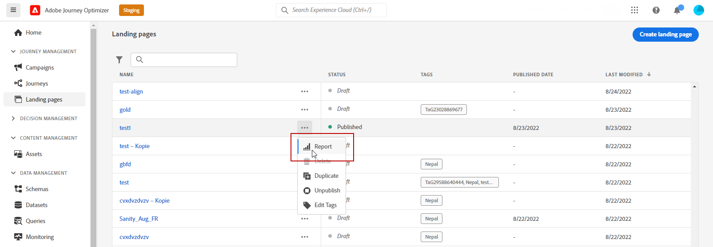

# Relatório ao vivo da página de aterrissagem {#lp-report-live}

A landing page **[!UICONTROL Relatório ao vivo]** O relatório exibe detalhes sobre o impacto de suas landing pages somente nas últimas 24 horas. Para medir os dados da landing page em um período selecionado, consulte [Relatório global da página de aterrissagem](lp-report-global.md).

Para acessar os relatórios, selecione **[!UICONTROL Relatório]** no menu avançado da landing page selecionada.

A landing page **[!UICONTROL Relatório ao vivo]** é dividido em diferentes widgets detalhando o sucesso e os erros do delivery. Cada widget pode ser redimensionado e excluído, se necessário. Para obter mais informações, consulte [seção](live-report.md).

+++Saiba mais sobre as diferentes métricas e widgets disponíveis para o relatório ao vivo da página de aterrissagem.

O **[!UICONTROL Desempenho da página de aterrissagem]** o widget detalha as informações principais relativas à sua mensagem nas últimas 24 horas por meio dos KPIs:

* **[!UICONTROL Total de visitas]**: Número total de visitas à sua página inicial a partir de uma jornada ou de outras fontes, incluindo várias visitas de um recipient.

* **[!UICONTROL Conversões]**: Número de pessoas que interagiram com a landing page, por exemplo, assinaram um formulário.

* **[!UICONTROL Rejeições]**: Número de pessoas que não interagiram com a landing page e não concluíram a ação de assinatura.

O **[!UICONTROL Fontes de visita]** O widget representa como os visitantes estão acessando sua página de aterrissagem:

* **[!UICONTROL Jornada(s)]**: Número de visitas à sua página de aterrissagem provenientes de uma jornada.

* **[!UICONTROL Outras fontes]**: Número de visitas à sua página inicial provenientes de uma fonte externa em vez de uma jornada.

O **[!UICONTROL Principais links clicados]** identifica a interação dos visitantes com a landing page:

* **[!UICONTROL Cliques]**: Número de vezes que um conteúdo foi clicado na página de aterrissagem.

O **[!UICONTROL Jornada(s)]** widget representa o número de visitas à página de aterrissagem de uma jornada.

O **[!UICONTROL Outras fontes]** O widget representa o número de visitas à página de aterrissagem de uma fonte externa em vez de uma jornada.

O **[!UICONTROL Visitas por mensagens]** / **[!UICONTROL Conversões por mensagens]** Os gráficos representam o número total de visitas e pessoas que interagiram com êxito com sua landing page nas últimas 24 horas, dependendo das mensagens enviadas.

O **[!UICONTROL Visitas por canais]** / **[!UICONTROL Conversões por canais]** Os gráficos representam o número total de visitas e pessoas que interagiram com êxito com sua landing page nas últimas 24 horas, dependendo dos canais.
+++

Para obter uma lista detalhada de todas as métricas disponíveis no Adobe Journey Optimizer, consulte [esta página](live-report.md#list-of-components-live).
